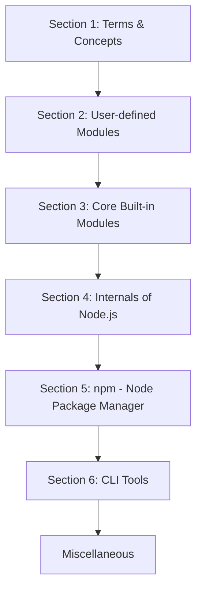

##  مقدمة في Node.js

### 1. المفهوم الأساسي: ما هو Node.js؟

**التعريف:** وفقاً للموقع الرسمي، يُعرّف **Node.js** بأنه بيئة تشغيل جافاسكريبت مفتوحة المصدر ومتعددة المنصات (**Open Source, Cross-platform JavaScript Runtime Environment**).

**الفكرة الأساسية وتفصيل المكونات:** لتبسيط هذا التعريف ، قام المحاضر بتقسيمه إلى ثلاثة أجزاء رئيسية:

1. **مفتوح المصدر (Open Source):** الكود المصدري (Source code) الخاص بتقنية Node.js متاح للعامة، مما يسمح للمطورين بمشاركته والتعديل عليه بحرية.
2. **متعدد المنصات (Cross-platform):** التقنية غير مقتصرة على نظام تشغيل واحد، بل هي متاحة وتعمل بكفاءة على أنظمة: Mac، Windows، و Linux.
3. **بيئة تشغيل جافاسكريبت (JavaScript Runtime Environment):** هذا هو المفهوم الجوهري الذي يقوم عليه Node.js، ونظراً لعمقه الأكاديمي وحاجته لخلفية تقنية، سيتم تخصيص القسم الأول من الدورة بالكامل لشرح معناه وكيفية عمله.

---

### 2. لماذا نستخدم ونتعلم Node.js؟ (الأهمية والمميزات)

هناك خمسة أسباب جوهرية تجعل من Node.js خياراً استراتيجياً للمطورين:

1. **بناء تطبيقات متكاملة (End-to-End JavaScript Applications):**
    - **السبب:** يسمح لك بتعلم لغة برمجة واحدة (JavaScript) واستخدامها لتطوير كل من الواجهات الأمامية (Front-end) والواجهات الخلفية (Back-end) لتطبيقاتك.
2. **اعتمادية الشركات التقنية الكبرى:**
    - **السبب:** العديد من الشركات الضخمة مثل LinkedIn، Netflix، و PayPal قامت بالانتقال (Migration) من تقنيات Back-end أخرى إلى Node.js، مما يثبت كفاءته وقدرته على التعامل مع الأنظمة المعقدة.
3. **الطلب العالي في سوق العمل:**
    - **السبب:** مهارات التطوير الشامل (Full Stack Development) هي من أكثر المهارات المطلوبة حالياً في الشركات.
    - **الفائدة:** إذا كنت مطور واجهات أمامية (Front-end Dev)، فإن تعلمك لـ Node.js سيقربك خطوة كبيرة نحو الحصول على الوظيفة التي تحلم بها.
4. **الدعم المجتمعي الضخم (Huge Community Support):**
    - **السبب:** يمتلك مجتمعاً كبيراً ونشطاً من المطورين، مما يسهل إيجاد حلول للمشاكل وتوفر المكتبات الجاهزة.
5. **استمرارية التكنولوجيا:**
    - **السبب:** تقنية Node.js مستقرة ولن تختفي في أي وقت قريب، مما يجعل الوقت الحالي دائماً وقتاً مناسباً لتعلمها.

---

### 3. خريطة مسار التعلم (Course Structure)

صمم المحاضر هذه الدورة التدريبية بهيكلية أكاديمية متدرجة للانتقال بالطالب من الأساسيات إلى المفاهيم المتقدمة:

**تفصيل خطوات ومراحل التعلم:**

- `‏` **Step 1: القسم الأول (المفاهيم والمصطلحات):** فهم المصطلحات الأساسية الضرورية لاستيعاب ماهية "بيئة تشغيل جافاسكريبت" (JavaScript Runtime Environment).
- `‏` **Step 2: القسم الثاني (الوحدات المعرفة - User-defined Modules):** تعلم كيفية إنشاء واستخدام الوحدات (Modules) الخاصة بك لترتيب وبناء التطبيق.
- `‏` **Step 3: القسم الثالث (الوحدات المدمجة - Core Built-in Modules):** التعمق في دراسة الوحدات الأساسية التي تأتي مدمجة مع Node.js (أكواد جاهزة للاستخدام المباشر في تطبيقك).
- `‏` **Step 4: القسم الرابع (البنية الداخلية - Internals of Node.js):** دراسة تفاصيل البنية الداخلية وكيف يعمل Node.js من الداخل. (موضوع متقدم ولكنه ضروري لكتابة كود ذو جودة عالية).
- `‏` **Step 5: القسم الخامس (مدير الحزم - npm):**
    - **التعريف:** اختصار لـ **Node Package Manager**، وهو مكتبة ضخمة تحتوي على وحدات برمجية من أطراف ثالثة (Third-party modules).
    - **لماذا نستخدمه؟:** لتلبية متطلبات برمجية متنوعة دون كتابة الكود من الصفر.
    - **متى نستخدمه؟:** يُعتبر أداة أساسية (Essential) عند بناء أي تطبيق بحجم متوسط إلى كبير باستخدام Node.js.
-  `‏` **Step 6: القسم السادس (أدوات سطر الأوامر - CLI Tools):**
    - **التعريف:** بناء أدوات **Command Line Interface**.
    - **الملاحظة المهمة:** تقنية Node.js لا تقتصر فقط على بناء خوادم الويب (Web Servers)، بل تُستخدم بكفاءة في بناء أدوات سطر الأوامر (CLI Tools).
- `‏` **Step 7: القسم الختامي (Miscellaneous):** تغطية مواضيع متفرقة هامة لا تندرج تحت تصنيف الأقسام السابقة.

---

### 4. ما بعد أساسيات Node.js (الخطوة التالية)

المفاهيم التي سيتم دراستها في هذا المرجع هي الأساس، ولكن في بيئة العمل الحقيقية، ستحتاج إلى بناء تطبيقات ويب متكاملة (Web Applications) تتضمن:

- تعريف مسارات برمجة واجهات التطبيقات (API Endpoints).
- الاتصال بقواعد البيانات (Databases).
- إضافة أنظمة المصادقة (Authentication).

لتحقيق ذلك، يتم استخدام إطارات عمل للويب (Web Frameworks) مثل **Express.js**.

>`‏`  **Important Note** يؤكد المحاضر بشدة: لا يمكنك القفز لتعلم **Express.js** مباشرة. لفهم وبناء تطبيقات الويب باستخدام Express.js، **يجب عليك أولاً** أن تمتلك فهماً صلباً لمفاهيم Node.js الأساسية التي تغطيها هذه الدورة. نظراً لضخامة محتوى Express.js، سيتم تخصيص سلسلة منفصلة له لاحقاً.

---

### 5. المتطلبات الأساسية للبدء (Prerequisites)

لكي تتمكن من الاستفادة من هذا المرجع والمضي قدماً في الدورة، يوجد متطلب واحد فقط وهو:

- **إجادة لغة جافاسكريبت الحديثة (Modern JavaScript):** ويشمل ذلك فهم الأساسيات، المواضيع المتقدمة، والمفاهيم المهمة التي تم تقديمها في إصدار **ES2015** (والذي يُعرف أيضاً بـ ES6) والإصدارات الأحدث.

---

