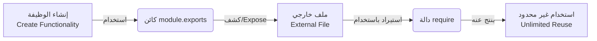

## تصدير الوحدات في Node.js (Module Exports)

### 1. المفهوم الأساسي: الطريقة الصحيحة لاستخدام الوحدات

في الدرس السابق، تعلمنا أن استخدام دالة **`require`** يقوم بتوجيه محرك **V8** لتنفيذ الكود الموجود داخل الوحدة (Module) المستدعاة. على الرغم من أن هذه الطريقة تعمل تقنياً، إلا أنها ليست الممارسة المثلى في البرمجة.

**الفكرة الأساسية (The Right Way):** الطريقة الصحيحة والاحترافية لإنشاء وإعادة استخدام كتل الأكواد (Blocks of code) هي "كشف أو تصدير" (Expose) وظائف معينة من الوحدة، بحيث يمكن استهلاكها واستخدامها بواسطة ملفات أو تطبيقات خارجية وقتما نشاء، بدلاً من تنفيذها فوراً عند الاستدعاء.

---

### 2. كائن التصدير (module.exports Object)

- **التعريف:** هو كائن (Object) خاص ومدمج بشكل مسبق (Readily available) في بيئة Node.js، يُستخدم لتحديد ما سيتم تصديره من الوحدة الحالية ليكون متاحاً للوحدات الأخرى.
- **الفكرة الأساسية:** يعمل هذا الكائن كبوابة العبور؛ أي شيء تقوم بإسناده (Assign) إلى `module.exports` سيتم كشفه للعالم الخارجي (الملفات الأخرى).
- **لماذا نستخدمه؟:** لتحقيق مبدأ "إعادة الاستخدام" (Reusability). بدلاً من تشغيل الكود مباشرة داخل ملفه الأصلي، نقوم بتصديره لنتمكن من استدعائه وتنفيذه مرات لا حصر لها في أماكن مختلفة من التطبيق.
- **كيف يعمل مع دالة `require`؟:** القيمة التي يحملها كائن `module.exports` في ملف ما، هي **نفسها القيمة التي تُرجعها (Returns)** دالة `require` عند استدعاء ذلك الملف.

---

### 3. حالة عملية: تصدير واستخدام دالة رياضية

لتوضيح المفهوم، سنقوم بتعديل التجربة السابقة الخاصة بدالة الجمع (`add`).

#### الخطوات العملية (Step-by-Step Execution)

**Step 1: التصدير من ملف الوحدة (`add.js`)** بدلاً من استدعاء الدالة وطباعة نتيجتها داخل هذا الملف، سنقوم بتصديرها.

```javascript
// ملف add.js
const add = (a, b) => {
    return a + b; // إرجاع حاصل جمع الرقمين
};

// هنا يكمن السحر: نقوم بإسناد الدالة add إلى كائن التصدير
module.exports = add;
```

شرح الكود:

- السطر 1-3: قمنا بتعريف الدالة `add` التي تستقبل 2 parameter وتُرجع مجموعهما.
- السطر 6: استخدمنا الكائن الخاص `module.exports` وجعلنا قيمته تساوي الدالة `add`. الآن أصبحت هذه الدالة مكشوفة وقابلة للاستيراد.

**Step 2: الاستيراد والاستخدام في الملف الرئيسي (`index.js`)** الآن سنقوم باستيراد الدالة وتخزينها في متغير لاستخدامها.

```javascript
// ملف index.js
const add = require('./add'); // التقاط القيمة المُصدرة وتخزينها في ثابت

const sum = add(1, 2); // الاستخدام الأول للدالة
console.log(sum); // سيطبع: 3

const sum2 = add(2, 3); // الاستخدام الثاني للدالة (إعادة الاستخدام)
console.log(sum2); // سيطبع: 5
```

_شرح الكود:_

- السطر 2: دالة `require` تذهب إلى ملف `add.js`، وتجلب ما تم تخزينه في `module.exports`، وتضعه في الثابت `add`.
- الأسطر 4-8: بما أن الثابت `add` أصبح الآن يمثل الدالة ذاتها، يمكننا استدعاؤه أي عدد من المرات وتمرير معاملات مختلفة في كل مرة، وهذا هو الجوهر الحقيقي لإعادة استخدام الكود (Reusable block of code).

---

### 4. التصدير الافتراضي (Default Export) وقواعد التسمية

> `‏` **Important Note** **ملاحظة هامة جداً :** عندما نقوم بالتقاط (Capture) القيمة المُرجعة من كائن `module.exports` باستخدام دالة `require`، **فإن اسم الثابت (Constant name) الذي نختاره في ملف الاستقبال يمكن أن يكون أي اسم نريده**. لا يشترط أبداً أن يكون مطابقاً لاسم المتغير أو الدالة في الملف الأصلي.

**مثال تطبيقي على الملاحظة:** يمكننا في ملف `index.js` كتابة الكود التالي وسيعمل بشكل مثالي:

```javascript
// أسمينا الثابت هنا addFunction بدلاً من add
const addFunction = require('./add');

const sum = addFunction(1, 2);
console.log(sum); // النتيجة ستظل 3
```

- **المصطلح الأكاديمي:** يُطلق على هذا النمط اسم **التصدير الافتراضي (Default Export)**.
- **الفكرة:** أنت تقوم بتصدير كيان واحد رئيسي من الملف، وفي الملف المستقبل، يحق لك الإشارة إلى هذه القيمة المُرجعة (Returned value) بأي اسم تراه مناسباً لسياق عملك.

---

### 5. رسم توضيحي: دورة حياة الوحدة (Module Lifecycle)

يوضح الرسم التالي دورة الحياة الكاملة لإنشاء واستهلاك الوحدات في Node.js بناءً على معيار CommonJS:



---

### 6. الخلاصة: معيار CommonJS

الفكرة العامة وراء الوحدات (Modules) في Node.js تتلخص في ثلاث قواعد أساسية:

1. **الإنشاء (Create):** إنشاء وظيفة جديدة (مثل دالة `add`).
2. **التصدير (Expose):** كشف هذه الوظيفة باستخدام الكائن الخاص `module.exports`.
3. **الاستيراد (Import):** جلبها في ملف آخر باستخدام دالة `require`.

**المصطلح العلمي:** هذا النمط الدقيق من التصدير والاستيراد هو ما يُعرف بـ تنسيق **CommonJS** (CommonJS Format)، وهو المعيار القياسي الذي تلتزم به بيئة Node.js (Adheres to) في هيكلة وحداتها.

**الخطوة القادمة:** رغم أن هذا هو المبدأ الأساسي الذي ستحتاجه للمضي قدماً، إلا أن هناك مفاهيم أعمق تتعلق بالوحدات سيتم مناقشتها في الدروس القادمة لبناء فهم شامل ودقيق لآلية عملها الداخلي.