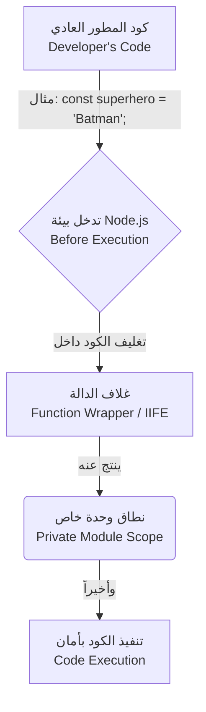

##  نطاق الوحدة في Node.js (Module Scope)

### 1. المفهوم الأساسي: نطاق الوحدة (Module Scope)

**التعريف:** نطاق الوحدة (**Module Scope**) هو مبدأ أساسي في بيئة Node.js يعني أن كل وحدة (Module) أو ملف جافاسكريبت يمتلك نطاقاً خاصاً ومستقلاً به (Own private scope).

**الفكرة الأساسية ولماذا نستخدمها؟** في لغات البرمجة والبيئات التي لا تدعم النطاق المعزول، إذا قمت بتعريف متغير يحمل نفس الاسم في ملفين مختلفين وتم استدعاؤهما معاً، سيحدث تعارض (Conflict) أو خطأ برمجي (Error). في Node.js، يحمي **Module Scope** الأكواد من التداخل؛ فالمتغيرات والدوال المعرفة داخل ملف معين لا تتسرب إلى الملفات الأخرى، مما يضمن التغليف المناسب (**Proper Encapsulation**) ويسهل إعادة الاستخدام (**Reusability**) دون القلق من تضارب الأسماء.

---

### 2. حالة عملية وتجربة: التحقق من استقلالية النطاق

لفهم هذا المفهوم، سنقوم  بإجراء تجربة برمجية لاختبار ما سيحدث عند استخدام نفس اسم المتغير في وحدتين مختلفتين.

**الخطوات (Step-by-Step Execution):**

`‏`**Step 1: إنشاء الوحدة الأولى (`batman.js`)** تم إنشاء ملف وتعريف ثابت باسم `superhero` داخله.

```javascript
// ملف batman.js
const superhero = "Batman";
console.log(superhero);
```

`‏`**Step 2: إنشاء الوحدة الثانية (`superman.js`)** تم إنشاء ملف آخر، والمفارقة هنا هي **استخدام نفس اسم الثابت** `superhero`.

```javascript
// ملف superman.js
const superhero = "Superman";
console.log(superhero);
```

`‏`**Step 3: استدعاء الوحدتين في الملف الرئيسي (`index.js`)**

```javascript
// ملف index.js
require('./batman');
require('./superman');
```

**نتيجة التجربة والتفسير الأكاديمي:** عند تشغيل الأمر `node index` في التيرمينال، كانت المخرجات:

```javascript
Batman
Superman
```

- **الملاحظة:** تم طباعة الاسمين بنجاح **ولم يحدث أي تعارض أو خطأ (No conflict or error)**.
- **السبب:** هذا يثبت أن كل ملف يمتلك "نطاق وحدة" (Module Scope) خاص به، فالثابت `superhero` في الملف الأول معزول تماماً عن الثابت `superhero` في الملف الثاني.

---

### 3. كيف تحقق Node.js هذه العزلة؟ (نمط IIFE)

لتحقيق هذه العزلة، تعتمد Node.js تحت الغطاء (Under the hood) على نمط تصميم شهير في جافاسكريبت يُسمى **IIFE**.

- **التعريف والمصطلح الكامل:** **IIFE** هو اختصار لـ **Immediately Invoked Function Expression** (تعبير الدالة المستدعاة فوراً).
- **الفكرة الأساسية:** في لغة جافاسكريبت، كل دالة (Function) تمتلك النطاق الخاص بها (Private scope). نمط IIFE هو عبارة عن كتابة دالة وتغليفها ثم استدعائها وتنفيذها في نفس اللحظة التي يتم تعريفها فيها.
- **لماذا نستخدمها؟** لإنشاء نطاق خاص (Private scope) للمتغيرات والدوال بداخلها، بحيث لا يمكن الوصول إليها من خارج هذا النطاق، مما يمنع تلوث النطاق العام (Global scope).

---

### 4. مثال برمجي: بناء وتطبيق نمط IIFE

سنوضح  كيفية عمل هذا النمط برمجياً من خلال إنشاء ملف `iife.js`.

```javascript
// التعبير الأول (IIFE 1)
(function () {
    const superhero = "Batman";
    console.log(superhero);
})();

// التعبير الثاني (IIFE 2)
(function () {
    const superhero = "Superman";
    console.log(superhero);
})();
```

**شرح تركيبة الكود (كيف تعمل؟):**

1. `‏``function () { ... }`: نقوم بكتابة دالة عادية.
2. `‏` `(function () { ... })`: نقوم بتغليف الدالة بالكامل داخل أقواس دائرية `()`. هذا الإجراء يُحوّل الدالة من "تصريح دالة" (Function Declaration) إلى "تعبير دالة" (**Function Expression**).
3. `()` في النهاية: نضيف زوجاً آخر من الأقواس في نهاية التعبير لـ "استدعاء وتنفيذ" الدالة فوراً (**Immediately Invoke it**).

**النتيجة:** عند تشغيل هذا الملف، سيُطبع `Batman` ثم `Superman`. المتغير `superhero` داخل التعبير الأول يمتلك نطاقاً خاصاً به (Private scope)، وكذلك المتغير في التعبير الثاني، مما يمنع أي تعارض.

---

### 5. ما الذي يحدث خلف الكواليس؟ (Under the Hood)

كيف تُطبق بيئة Node.js مفهوم الـ IIFE على ملفاتنا العادية؟

**آلية العمل الداخلية:** قبل أن تقوم بيئة Node.js بتنفيذ الكود المكتوب داخل أي وحدة (Module)، فإنها لا تقوم بتشغيله كما هو، بل تتدخل أولاً وتقوم بـ **تغليف الكود (Wrap it)** داخل ما يُسمى بـ "غلاف الدالة" (**Function Wrapper**). هذا الغلاف هو في جوهره دالة تعمل كـ IIFE، مما يوفر للكود المكتوب "نطاق الوحدة" (Module Scope) بشكل تلقائي دون تدخل من المطور.

---

### 6. رسم توضيحي: آلية عمل غلاف الدالة (Function Wrapper)

يوضح الرسم البياني التالي كيف تقوم Node.js بتحويل الكود العادي إلى كود معزول النطاق خلف الكواليس:



---

### 7. مميزات وفوائد نظام النطاق في Node.js

 هذه الآلية هي **"بالضبط ما تريده من أي نظام وحدات (Module System)"**، وتتلخص فوائدها في التالي:

1. **التغليف المناسب (Proper Encapsulation):** حماية البيانات ومنع تسرب المتغيرات إلى ملفات أخرى.
2. **منع التعارض (No Conflicts):** توفر علينا عناء القلق المستمر بشأن استخدام أسماء متغيرات أو دوال مكررة في ملفات مختلفة (Conflicting variables or functions).
3. **الحفاظ على قابلية إعادة الاستخدام (Reusability is unaffected):** يظل بإمكاننا تصدير واستيراد ما نحتاجه فقط بكفاءة عالية.

---

> `‏` **Important Note** **الخلاصة الجوهرية (Summary):** كل وحدة يتم تحميلها (Loaded module) في Node.js يتم تغليفها بـ نمط **IIFE** الذي يوفر نطاقاً خاصاً للكود (Private scoping of code). هذا النطاق هو ما يسمح لك بتكرار أسماء المتغيرات والدوال عبر الملفات المختلفة دون حدوث أي تعارضات (Without any conflicts).