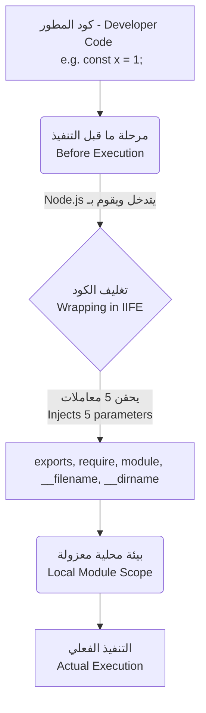

## غلاف الوحدة في Node.js (Module Wrapper)

### 1. التمهيد: تمرير المعاملات في نمط IIFE

في الدرس السابق، تعلمنا أن بيئة Node.js تعتمد على نمط **IIFE** (تعبير الدالة المستدعاة فوراً) لتغليف كل وحدة (Module) وتوفير نطاق خاص بها (Module Scope)، مما يمنع تداخل المتغيرات مع الكائن العام (Global Object).

قبل التعمق في كيفية استخدام Node.js لهذا النمط، سنجرى تجربة بسيطة لتوضيح كيفية عمل المعاملات (Parameters) والوسائط (Arguments) مع دوال الـ IIFE في لغة جافاسكريبت.

**التجربة العملية (ملف `iife.js`):** تم تعديل الكود السابق لإضافة معامل يُسمى `message` وتمرير وسيط مختلف لكل دالة.

```javascript
// التعبير الأول
(function (message) {
    const superhero = "Batman";
    console.log(message, superhero);
})("Hello"); // passing the Arguments "Hello"

// التعبير الثاني
(function (message) {
    const superhero = "Superman";
    console.log(message, superhero);
})("Hey"); // passing the Arguments "Hey"
```

**شرح الكود:**

- قمنا بتعريف معامل (Parameter) باسم `message` داخل أقواس الدالة.
- عند استدعاء الدالة في السطر الأخير `("Hello")` و `("Hey")`، قمنا بتمرير هذه القيم ك (Arguments).
- **النتيجة:** عند تشغيل الكود باستخدام `node iife`، ستكون المخرجات: `Hello Batman` `Hey Superman`

---

### 2. المفهوم الأساسي: غلاف الوحدة (The Module Wrapper)

**التعريف:** غلاف الوحدة (**Module Wrapper**) هو عبارة عن دالة IIFE مخفية تقوم بيئة Node.js تلقائياً بتغليف كود أي وحدة (Module) بداخلها قبل البدء في تنفيذه. هذه الدالة لا توفر نطاقاً معزولاً فحسب، بل يتم حقنها بـ **خمسة معاملات (Parameters)** أساسية جداً لعمل الوحدة.

**كيف يعمل الغلاف برمجياً؟** إذا كان كود المطور الأصلي هو:

```javascript
const superhero = "Batman";
console.log(superhero);
```

فإن بيئة Node.js تقوم خلف الكواليس بتحويله إلى الشكل النهائي التالي (الغلاف الفعلي):

```javascript
(function (exports, require, module, __filename, __dirname) {
    const superhero = "Batman";
    console.log(superhero);
})();
```

> `‏` **Important Note** **حقيقة المتغيرات "العامة" (Not Magical Global Variables):** يظن الكثيرون أن دوال مثل `require` أو الكائن `module.exports` هي متغيرات عامة (Global variables) سحرية متاحة في كل مكان. **هذا مفهوم خاطئ تماماً**. هذه العناصر هي في الحقيقة مجرد **معاملات محلية (Local Parameters)** خاصة بالوحدة نفسها، يتم حقنها (Injected) أثناء التنفيذ بواسطة Node.js عبر غلاف الوحدة.

---

### 3. تفصيل المعاملات الخمسة (The 5 Parameters)

يوضح الجدول التالي شرحاً للمعاملات الخمسة التي يتم حقنها في كل وحدة:

| المعامل (Parameter) | الوصف الأكاديمي (Description)                                                                                               |
| :------------------ | :-------------------------------------------------------------------------------------------------------------------------- |
| **`__dirname`**     | متغير يمثل مسار المجلد (Directory/Folder path) الحالي الذي تتواجد فيه الوحدة. وهو عبارة عن قيمة نصية (String).              |
| **`__filename`**    | متغير يمثل مسار الملف (File path) الحالي للوحدة بالكامل (بما في ذلك اسم الملف ذاته). وهو أيضاً عبارة عن قيمة نصية (String). |
| **`require`**       | دالة تُستخدم لاستيراد وحدات أخرى (Import a module) عن طريق تمرير مسار الوحدة إليها.                                         |
| **`module`**        | كائن (Object) يمثل مرجعاً (Reference) للوحدة الحالية. يحتوي على خصائص متعددة من أهمها خاصية `exports`.                      |
| **`exports`**       | معامل يرتبط بخاصية التصدير في كائن الوحدة. (سيتم تخصيص درس لاحق لشرحه بالتفصيل).                                            |

(ملاحظة: يعتبر كل من `__dirname` و `__filename` متغيرات تيسيرية (Convenience variables) متاحة للاستخدام المباشر داخل الوحدة).

---

### 4. تجربة عملية: وضع التصحيح (Debugging Mode)

لإثبات وجود هذه المعاملات وكيفية تغيرها، استخدم المحاضر ميزة التصحيح (Debug) في محرر VS Code.

**الخطوات العملية للDebugging :**

-`‏` **Step 1: وضع نقطة توقف (Breakpoint)** تم وضع نقطة توقف في السطر الأول من ملف `index.js`.
-`‏` **Step 2: بدء الDebugging** من الشريط الجانبي (Sidebar) في VS Code، تم تشغيل خيار **Run and Debug**
-`‏` **Step 3: فحص المتغيرات المحلية (Local Variables)** عند توقف التنفيذ، ظهرت لوحة التصحيح (Debug panel) والتي أظهرت قسم المتغيرات المحلية. كانت المتغيرات الموجودة هي بالضبط المعاملات الخمسة: (`exports`, `require`, `module`, `__filename`, `__dirname`) بالإضافة إلى الكلمة المحجوزة `this` (والتي تتوفر بشكل افتراضي داخل أي دالة).
-`‏` **Step 4: استكشاف كائن `module`** عند توسيع (Expand) كائن `module` في لوحة التصحيح، لوحظ أن خاصية `filename` بداخله تشير إلى ملف `index.js`.
- `‏`**Step 5: الدخول إلى وحدة أخرى (Step Into)** عند استخدام زر (Step into) للدخول إلى ملف `batman.js`:
    - ظل المتغير `__dirname` كما هو (لأن كلا الملفين في نفس المجلد).
    - تغير المتغير `__filename` ليشير إلى `batman.js`. وعند الدخول إلى `superman.js`، تتحدث هذه المتغيرات مرة أخرى لتعكس مسار الملف الجديد.


![[Pasted image 20260712123528.png]]

---

### 5. رسم توضيحي: آلية حقن غلاف الوحدة (Module Wrapper Injection)

يوضح الرسم البياني التالي دورة حياة الوحدة من كتابة الكود وحتى بدء تنفيذه:



---

### 6. الخلاصة النهائية للمحاضرة

يجب أن تحفر في ذاكرتك هذه القاعدة: قبل أن تقوم Node.js بتنفيذ الكود الخاص بأي وحدة (Module)، فإنها تقوم أولاً بتغليفه (Wrap it) بدالة (IIFE) تحتوي على خمسة معاملات رئيسية: `exports`, `require`, `module`, `__filename`, و `__dirname`. هذه الآلية هي التي توفر لكل وحدة نطاقها الخاص وتمنحها القدرة على التصدير والاستيراد ومعرفة مسارها في نظام التشغيل.