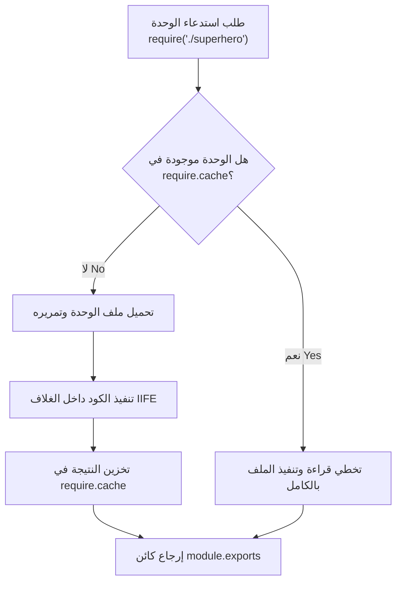

## التخزين المؤقت للوحدات في Node.js (Module Caching)

### 1. المفهوم الأساسي: التخزين المؤقت للوحدات (Module Caching)

**التعريف:** التخزين المؤقت للوحدات (**Module Caching**) هو آلية مدمجة في بيئة Node.js، تقوم بحفظ (تذكر) الوحدة (Module) في الذاكرة بعد تحميلها للمرة الأولى، بحيث يتم إعادة استخدام هذه النسخة المحفوظة عند استدعاء نفس الوحدة مرة أخرى في أي مكان آخر داخل التطبيق.

**الفكرة الأساسية (كيف تعمل؟):**  "Cached" هي ببساطة مصطلح تقني يعني "تم تذكره" (Remembered). عندما تستخدم دالة `require` لتحميل وحدة معينة، يقوم Node.js بتحميلها وتنفيذ كودها ثم تخزينها في كائن خاص يُسمى `require.cache`. إذا تم استدعاء نفس الوحدة لاحقاً، يفكر Node.js قائلاً: "أنا أتذكر هذه الوحدة، لقد تم تحميلها مسبقاً، دعني أعيد استخدامها بدلاً من القيام بجهد إضافي لتحميلها من الصفر".

**لماذا نستخدمها؟ (المميزات):**

- **تحسين الأداء (Performance):** في التطبيقات الحقيقية (Real-world applications)، يتم استيراد نفس الوحدة في عدة ملفات مختلفة. التخزين المؤقت يمنع إعادة قراءة ومعالجة نفس الملف مراراً وتكراراً، مما يسرع من أداء التطبيق بشكل ملحوظ.

---

### 2. حالة عملية (التجربة والمشكلة)

لفهم أثر هذه الآلية، سنقوم  ببناء تجربة برمجية تُظهر سلوكاً قد يبدو غريباً للمبرمج المبتدئ.

`‏`**Step 1: إنشاء ملف الوحدة (`superhero.js`) وتصدير "نسخة" (Instance)** قمنا بإنشاء فئة (Class) وتصدير كائن (Object) تم إنشاؤه من هذه الفئة، وليس الفئة نفسها.

```javascript
// ملف superhero.js
class Superhero {
    constructor(name) {
        this.name = name; // تهيئة اسم البطل
    }
    getName() {
        return this.name; // إرجاع الاسم
    }
    setName(name) {
        this.name = name; // تعديل الاسم
    }
}

// تصدير "نسخة / Instance" من الفئة وليس الفئة ذاتها
module.exports = new Superhero("Batman");
```

`‏`**Step 2: استيراد وتعديل الوحدة في الملف الرئيسي (`index.js`)**

```javascript
// ملف index.js
const superhero = require('./superhero'); // الاستدعاء الأول
console.log(superhero.getName()); // سيطبع: Batman

superhero.setName("Superman"); // تعديل الخاصية داخل الكائن
console.log(superhero.getName()); // سيطبع: Superman

// محاولة إنشاء نسخة جديدة باستدعاء الوحدة مرة أخرى
const newSuperhero = require('./superhero'); // الاستدعاء الثاني
console.log(newSuperhero.getName()); // ماذا سيطبع؟
```

**المشكلة المتوقعة مقابل النتيجة الفعلية:**

- **المنطق الظاهري:** قد تتوقع أن المتغير `newSuperhero` سيقوم بتحميل الوحدة من جديد، وبالتالي سيطبع القيمة الافتراضية `Batman`.
- **النتيجة الفعلية:** ستتفاجأ بأن الكود سيطبع `Superman`!.

**التفسير  (لماذا حدث ذلك؟):** السبب هو **Module Caching**. في الاستدعاء الأول (السطر الأول)، تم تحميل الوحدة وتخزين الكائن (الذي يحمل اسم Batman) في الذاكرة المخبئية (Cache). بما أن الكائنات في جافاسكريبت يتم تمريرها "بالمرجع" (**Pass by reference**)، فعندما قمنا بتعديل الاسم إلى `Superman`، تم تعديل الكائن الأصلي المخزن في الـ Cache. عند الاستدعاء الثاني، لم يقم Node.js بتنفيذ ملف `superhero.js` مرة أخرى، بل قام ببساطة بإرجاع "نفس الكائن" (Same object) الموجود في الـ Cache، والذي أصبح اسمه الآن `Superman`.

---

### 3. ماذا يحدث خلف الكواليس؟ (وضع التصحيح - Debugging)

لتأكيد هذه الآلية، استخدم المحاضر وضع التصحيح (Debug) وتتبع مسار التنفيذ (Execution Flow):

1. **عند الاستدعاء الأول (`require` الأولى):**
    - ينتقل مسار التحكم إلى ملف `superhero.js`.
    - يتم تنفيذ الكود، وإنشاء الكائن، وإضافته إلى كائن التصدير `module.exports`.
    - **يتم إنشاء سجل جديد** داخل كائن `require.cache` يحمل مسار ملف `superhero.js`.
2. **عند تعديل الكائن:**
    - يتم تعديل الخاصية `name` لتصبح `Superman`. ينعكس هذا التعديل على الكائن الموجود داخل الـ Cache.
3. **عند الاستدعاء الثاني (`require` الثانية):**
    - عندما نطلب الوحدة مرة أخرى ونحاول الدخول إليها (Step into)، **لا ينتقل مسار التحكم إلى ملف `superhero.js` إطلاقاً**.
    - يتخطى Node.js الملف بالكامل لأنه يجد الوحدة جاهزة ومخزنة في `require.cache`، فيقوم بإرجاع نفس الكائن المعدل.

---

### 4. الحل: كيف ننشئ نسخاً منفصلة؟ (Separate Instances)

إذا كان التخزين المؤقت (Caching) هو السلوك الافتراضي الذي لا يمكن إيقافه، فكيف يمكننا إنشاء كائنات مستقلة لا تؤثر على بعضها البعض؟

**الفكرة الأساسية للحل:** بدلاً من تصدير "نسخة" (Instance / Object) تم تهيئتها بالفعل، يجب علينا تصدير "الفئة نفسها" (**The Class itself**). هذا يسمح للملف المستقبل بإنشاء العدد الذي يريده من النسخ المستقلة باستخدام الكلمة المفتاحية `new`.

#### تطبيق الحل (The Right Pattern)

**تعديل ملف `superhero.js`:**

```javascript
class Superhero {
    // ... نفس الكود السابق ...
}

// تصدير الفئة (Class) بدلاً من النسخة
module.exports = Superhero;
```

**تعديل ملف `index.js`:**

```javascript
const Superhero = require('./superhero'); // استيراد الفئة

// إنشاء النسخة الأولى (بطل مستقل)
const batman = new Superhero("Batman");
console.log(batman.getName()); // سيطبع: Batman
batman.setName("Bruce Wayne");
console.log(batman.getName()); // سيطبع: Bruce Wayne

// إنشاء النسخة الثانية (بطل مستقل آخر)
const superman = new Superhero("Superman");
console.log(superman.getName()); // سيطبع: Superman
```

**النتيجة:** بهذه الطريقة، أصبح لدينا كائنان منفصلان تماماً، وتعديل أحدهما لا يؤثر على الآخر، وتعمل الأكواد كما هو متوقع.

---

### 5. رسم توضيحي: آلية عمل التخزين المؤقت للوحدات

يوضح الرسم التالي كيف يتعامل محرك Node.js مع طلبات `require` المتكررة لنفس الوحدة:




---

### 6. الأخطاء الشائعة والتحذيرات

> `‏` **Important Note** **تحذير هام من المحاضر:** الفشل في فهم آلية **Module Caching** وكيفية تمرير الكائنات بالمرجع (Pass by reference) قد يؤدي إلى **"أخطاء برمجية غير متوقعة" (Unexpected Bugs)** في تطبيقك.

> **قاعدة في التطبيق العملي:**

> - إذا كنت تريد مشاركة نفس الحالة (Shared State) عبر جميع ملفات التطبيق (مثل اتصال بقاعدة بيانات)، قم بتصدير **Instance**.
> - إذا كنت تريد حالة مستقلة (Isolated State) لكل ملف (مثل مستخدمين مختلفين)، قم بتصدير **Class** أو **Function**، وقم بإنشاء النسخة (Instantiate) داخل الملف المستقبل.