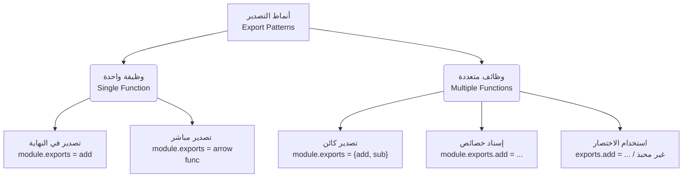

## أنماط الاستيراد والتصدير في (Import Export Patterns) في Node.js

### 1. المفهوم الأساسي: أنماط التصدير والاستيراد (Export/Import Patterns)

**التعريف:** أنماط الاستيراد والتصدير هي الطرق والأساليب البرمجية المختلفة (Valid Patterns) التي يوفرها نظام الوحدات في Node.js لكشف الوظائف ( الدوال، المتغيرات، الكائنات) من ملف (Module) واستخدامها في ملف آخر.

**لماذا ندرس جميع هذه الأنماط؟** عندما تعمل في بيئة عمل حقيقية أو تقرأ أكواداً برمجية (Code bases) لمشاريع أخرى، ستصادف طرقاً متعددة لكتابة التصدير والاستيراد. فهمك لجميع هذه الأنماط يجعلك قادراً على قراءة أي كود وفهمه بسهولة، واختيار النمط الأنسب لاحتياجات مشروعك.

---

### 2. النمط الأول: التصدير الفردي في نهاية الملف (Single Export)

**الفكرة الأساسية:** هو النمط الكلاسيكي الذي يتم فيه تعريف الدالة أو المتغير بشكل طبيعي، ثم يتم تعيينه بالكامل إلى كائن `module.exports` في نهاية الملف.

**متى نستخدمه؟** عندما يكون الغرض من الوحدة (Module) هو أداء وظيفة واحدة فقط (دالة واحدة أو فئة واحدة).

**الخطوات العملية:**

`‏`**Step 1: التصدير في ملف `math.js`**

```javascript
// تعريف دالة الجمع
const add = (a, b) => {
    return a + b;
};

// التصدير: إسناد الدالة مباشرة إلى الكائن
module.exports = add;
```

`‏`**Step 2: الاستيراد في ملف `index.js`**

```javascript
const add = require('./math'); // استيراد الدالة

console.log(add(2, 3)); // طباعة النتيجة. المخرجات المتوقعة: 5
```

---

### 3. النمط الثاني: التصدير المباشر (Direct Export)

**الفكرة الأساسية:** بدلاً من تعريف الدالة في متغير ثم تصديرها في سطر منفصل، نقوم بإسناد الدالة (مجهولة الاسم أو سهمية) مباشرة إلى `module.exports` في نفس سطر الإنشاء.

**مميزاته:** يقلل من عدد أسطر الكود ويجعل عملية التصدير أسرع ومباشرة.

**الخطوات العملية:**

`‏`**Step 1: التصدير في ملف `math.js`**

```javascript
// التصدير المباشر في سطر واحد
module.exports = (a, b) => {
    return a + b;
};
```

`‏`**Step 2: الاستيراد في ملف `index.js`** _(تبقى طريقة الاستيراد مطابقة تماماً للنمط الأول ولا تتغير)._

```javascript
const add = require('./math');
console.log(add(2, 3)); // المخرجات: 5
```

---

### 4. النمط الثالث: تصدير كائن يحتوي على عدة وظائف (Object Export)

**الفكرة الأساسية:** إذا كان الملف يحتوي على أكثر من دالة أو متغير نريد تصديره (مثل دالة جمع ودالة طرح)، فإننا نجمعها داخل "كائن" (Object) ونقوم بتصدير هذا الكائن.

**ملاحظة هامة (ميزة ES2015):** إذا كان اسم المفتاح (Key) مطابقاً لاسم القيمة (Value) في الكائن، فيمكننا استخدام اختصار لغة ES2015 وكتابة الاسم مرة واحدة فقط.

**الخطوات العملية:**

`‏` **Step 1: التصدير في ملف `math.js`**

```javascript
const add = (a, b) => {
    return a + b;
};

const subtract = (a, b) => {
    return a - b;
};

// تصدير كائن يحتوي على الدالتين معاً باستخدام اختصارات ES2015
module.exports = {
    add,       // تكافئ add: add
    subtract   // تكافئ subtract: subtract
};
```

`‏`**Step 2: الاستيراد والاستخدام في `index.js`** بما أننا صدرنا كائناً، فإن دالة `require` سترجع كائناً كاملاً.

```javascript
const math = require('./math'); // math الآن هو كائن يحتوي على الدوال

console.log(math.add(2, 3));      // المخرجات: 5
console.log(math.subtract(2, 3)); // المخرجات: -1
```

#### الاستيراد باستخدام التفكيك (Destructuring Import)

هناك تقنية متقدمة مرتبطة بهذا النمط تُعرف بـ التفكيك (**Destructuring**)، وهي ميزة من ميزات ES2015. **الفكرة:** بدلاً من استدعاء الكائن بالكامل ثم استدعاء الدوال من داخله (`math.add`)، نقوم باستخراج الدوال مباشرة من الكائن أثناء الاستيراد.

```javascript
// استخراج الدوال مباشرة من الكائن المُرجع
const { add, subtract } = require('./math');

// الآن يمكننا استخدام الدوال مباشرة دون الحاجة لكتابة اسم الكائن
console.log(add(2, 3));      // المخرجات: 5
console.log(subtract(2, 3)); // المخرجات: -1
```

---

### 5. النمط الرابع: إسناد الخصائص المباشر (Property Assignment)

**الفكرة الأساسية:** يتم التعامل مع `module.exports` على أنه كائن فارغ موجود مسبقاً، ونقوم بإرفاق الدوال كـ "خصائص" (Properties) لهذا الكائن مباشرة أثناء تعريفها.

**الخطوات العملية:**

`‏` **Step 1: التصدير في ملف `math.js`**

```javascript
// إرفاق دالة الجمع كخاصية للكائن
module.exports.add = (a, b) => {
    return a + b;
};

// إرفاق دالة الطرح كخاصية للكائن
module.exports.subtract = (a, b) => {
    return a - b;
};
```

`‏`**Step 2: الاستيراد في ملف `index.js`** (تبقى طرق الاستيراد مطابقة للنمط الثالث تماماً، سواء باستيراد الكائن كاملاً أو باستخدام التفكيك Destructuring).

---

### 6. النمط الخامس: استخدام اختصار التصدير (The `exports` Shortcut)

**الفكرة الأساسية وربط المفاهيم السابقة:** بالرجوع إلى مفهوم "غلاف الوحدة" (**IIFE Wrapper**) الذي تعلمناه سابقاً، نعلم أن بيئة Node.js تحقن 5 معاملات في كل ملف. المعامل الأول منها يُسمى `exports`. أوضح المحاضر أن المتغير `exports` ما هو إلا **"مرجع" (Reference)** يشير إلى الكائن `module.exports`، وُجد ليكون أقصر في الكتابة (Shorter to type).

**الخطوات العملية:**

`‏`**Step 1: التصدير في ملف `math.js`**

```javascript
// استخدام الكلمة المختصرة exports بدلاً من module.exports
exports.add = (a, b) => {
    return a + b;
};

exports.subtract = (a, b) => {
    return a - b;
};
```

> `‏` **Important Note** : على الرغم من أن النمط الخامس (استخدام `exports` وحدها) يعمل برمجياً، إلا أنه **"ينصح بشدة بتجنبه وعدم استخدامه" (Discourage you to use just exports)**.
> 
> **القاعدة الذهبية:** التزم دائماً بكتابة الكلمة الكاملة **`module.exports`**. (السبب التقني الدقيق وراء هذا التحذير سيتم تخصيص الدرس القادم لشرحه بالكامل).

---

### 7. رسم توضيحي: مسار تطور أنماط التصدير

يوضح الرسم البياني الخيارات المتاحة لتصدير الوظائف:




---

### 8. جدول مقارنة: ملخص أنماط التصدير

| النقم (Pattern)         | شكل الكود (Code Syntax)            | الاستخدام الشائع (Use Case)            | ملاحظات (Notes)                               |
| :---------------------- | :--------------------------------- | :------------------------------------- | :-------------------------------------------- |
| **التصدير الفردي**      | `module.exports = funcName`        | تصدير عنصر واحد رئيسي للملف.           | سهل القراءة والفهم.                           |
| **التصدير المباشر**     | `module.exports = () => {}`        | تصدير دالة مجهولة أو سهمية مباشرة.     | يختصر أسطر الكود.                             |
| **تصدير كائن (Object)** | `module.exports = { fn1, fn2 }`    | تجميع وظائف متعددة في مكان واحد.       | يُفضل استيراده بتفكيك الكائن (Destructuring). |
| **إسناد الخصائص**       | `module.exports.fnName = () => {}` | بناء كائن التصدير تدريجياً داخل الملف. | يعمل بنفس كفاءة تصدير الكائن.                 |
| **اختصار Exports**      | `exports.fnName = () => {}`        | اختصار للكتابة معتمداً على IIFE.       | **لا يُنصح باستخدامه (Not Recommended)**.     |