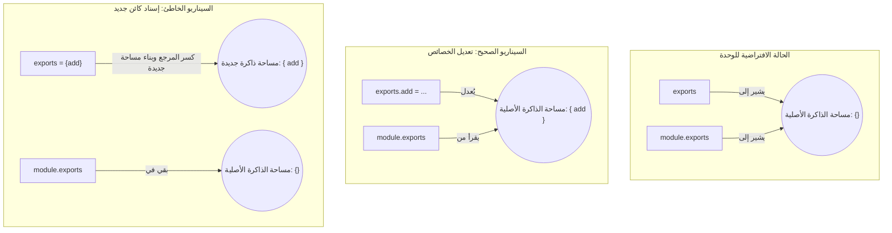

##  الفرق بين `module.exports` و `exports` في Node.js

### 1. التمهيد: لماذا نناقش هذا الموضوع؟

في الدرس السابق، استعرضنا خمسة أنماط مختلفة لاستيراد وتصدير الوحدات (Modules)، وكان النمط الخامس يعتمد على استخدام الكلمة المفتاحية **`exports`** كبديل مختصر لـ **`module.exports`**. رغم أن هذا النمط يعمل تقنياً، إلا أن المحاضر أشار إلى قاعدة هامة وهي: **"من الأفضل دائماً استخدام `module.exports` وتجنب استخدام `exports`"**.

الغرض الأساسي من هذا الدرس هو تقديم التفسير الأكاديمي والبرمجي الدقيق وراء هذه التوصية، وذلك من خلال فهم كيفية تعامل لغة جافاسكريبت مع الكائنات في الذاكرة.

---

### 2.  تمرير الكائنات بالمرجع (Object Reference in JavaScript)

لفهم المشكلة في Node.js، يجب أولاً فهم سلوك لغة جافاسكريبت الأساسي عند التعامل مع الكائنات (Objects).

**الفكرة الأساسية:** في جافاسكريبت، عندما تقوم بإسناد كائن إلى كائن آخر، فإنهما لا يصبحان نسختين منفصلتين، بل يُشيران معاً إلى **نفس العنوان في الذاكرة (Same address in memory)**. أي تعديل يُجرى على أحدهما، سينعكس تلقائياً على الآخر.

#### التجربة الأولى: تعديل الخصائص (Modifying Properties)

سنقوم بإنشاء ملف `object-reference.js` لاختبار هذا السلوك.

```javascript
// إنشاء الكائن الأول
const obj1 = {
    name: "Bruce Wayne"
};

// إسناد الكائن الأول للكائن الثاني (الآن كلاهما يشير لنفس مساحة الذاكرة)
let obj2 = obj1;

// تعديل خاصية داخل الكائن الثاني
obj2.name = "Clark Kent";

// طباعة الكائن الأول
console.log(obj1);
```

النتيجة: سيتم طباعة `Clark Kent` وليس `Bruce Wayne`. _السبب:_ تعديل الكائن الثاني أدى إلى تعديل الكائن الأول لأنهما مترابطان مرجعياً.

#### التجربة الثانية: كسر المرجع (Breaking the Reference)

ماذا يحدث لو قمنا بإسناد "كائن جديد بالكامل" (New Object Literal) للكائن الثاني بدلاً من تعديل خصائصه؟

```javascript
const obj1 = {
    name: "Bruce Wayne"
};

let obj2 = obj1;

// هنا يكمن التغيير: إسناد كائن جديد تماماً بدلاً من تعديل خاصية
obj2 = {
    name: "Clark Kent"
};

console.log(obj1);
```

_النتيجة:_ سيتم طباعة `Bruce Wayne`. _السبب :_ عند إسناد كائن جديد لـ `obj2`، تم **كسر المرجع (Reference is broken)**. أصبح `obj2` يشير إلى مساحة جديدة في الذاكرة، بينما ظل `obj1` محتفظاً بقيمته الأصلية في مساحته الخاصة دون أن يتأثر.

---

### 3. التطبيق على Node.js: العلاقة بين `module.exports` و `exports`

الآن، لنقم بتطبيق تجربة جافاسكريبت السابقة على بيئة Node.js.

**التشبيه الأكاديمي (The Analogy):**

- `‏` **`obj1`** يمثل الكائن الأساسي **`module.exports`**.
- `‏`**`obj2`** يمثل المتغير المختصر **`exports`**.

**كيف تعمل بيئة Node.js؟**

- في بداية تنفيذ أي ملف، تقوم Node.js بإنشاء كائن فارغ `module.exports = {}`.
- ثم تقوم بإنشاء مرجع مختصر له: `exports = module.exports`.
- **القاعدة الجوهرية:** عند استخدام دالة `require` لاستيراد وحدة، فإن Node.js **تُرجع فقط (Only returns) كائن `module.exports`**، ولا تُرجع المتغير `exports` على الإطلاق. المتغير `exports` هو مجرد مرجع (==Reference==) صُمم لتسهيل الكتابة.

#### السيناريو الأول: متى يعمل `exports` بنجاح؟ (تعديل الproperities)

إذا قمنا بإرفاق properities (دوال أو متغيرات) مباشرة للمتغير `exports`:

```javascript
exports.add = (a, b) => a + b;
exports.subtract = (a, b) => a - b;
```

هذا الكود سيعمل بشكل مثالي. لماذا؟ لأننا نعدل على "خصائص" الكائن، وبما أن `exports` يشير لنفس ذاكرة `module.exports`، فإن هذه الدوال ستُضاف بنجاح إلى `module.exports` الذي سيتم تصديره.

#### السيناريو الثاني: متى يفشل `exports` ويسبب أخطاء؟ (كسر المرجع)

==إذا حاولنا تصدير كائن كامل== يحتوي على الدوال باستخدام المتغير `exports` فقط:

```javascript
exports = {
    add: (a, b) => a + b,
    subtract: (a, b) => a - b
}
```

هذا الكود **سيفشل ولن يعمل**. لماذا؟ لأننا قمنا بـ "إسناد كائن جديد" إلى المتغير `exports`. كما تعلمنا في التجربة الثانية، هذا الإجراء يؤدي إلى **كسر المرجع**.

- سيصبح `exports` يحمل الكائن الجديد الذي يحتوي على الدوال.
- سيظل `module.exports` كائناً فارغاً `{}`.
- بما أن دالة `require` لا تُرجع سوى `module.exports`، فإن الملف المستقبل سيستلم كائناً فارغاً.
- محاولة استخدام الدوال (مثل `math.add()`) ستؤدي إلى ظهور خطأ في التطبيق (Error).

---

### 4. تجربة عملية: تصور المشكلة باستخدام وضع ال (Debugging)

لتأكيد هذه الآلية خلف الكواليس، سنستخدم  أداة ال (Debugger):

`‏`**Step 1: فحص الحالة الابتدائية** في بداية الملف، قبل تنفيذ أي كود، يكون كل من `exports` و `module.exports` عبارة عن كائنات فارغة `{}`.

`‏`**Step 2: تتبع سيناريو إرفاق الخصائص (`exports.add`)** عند التقدم خطوة بخطوة (Step over)، نلاحظ أن إضافة الدالة إلى `exports` تؤدي مباشرة إلى ظهور نفس الدالة داخل كائن `module.exports`، لأنهما يشيران لنفس الموقع. دالة `require` ستُرجع الكائن ممتلئاً بالدوال بنجاح.

`‏`**Step 3: تتبع سيناريو الإسناد الجديد (`exports = {add, subtract}`)** عند تتبع هذا الكود المكتوب بشكل خاطئ، نلاحظ بعد تنفيذ السطر أن `exports` امتلأ بالدوال، ولكن `module.exports` **بقي فارغاً تماماً `{}`**. هذا يثبت أن المرجع قد فُقد (Reference was lost)، وسينتج عن ذلك خطأ عند الاستيراد.

---

### 5. رسم توضيحي: كيف تنكسر العلاقة المرجعية (Reference Break)

يوضح الرسم التالي الفرق بين تعديل الخاصية وإسناد كائن جديد:



---

### 6. جدول مقارنة: `module.exports` مقابل `exports`

|وجه المقارنة|`module.exports`|`exports`|
|:--|:--|:--|
|**التعريف**|الكائن الأساسي المسؤول عن تحديد ما سيتم تصديره من الوحدة.|متغير مختصر يعمل كمرجع (Reference) يشير إلى الكائن الأساسي.|
|**سلوك بيئة Node.js**|هو الكائن الوحيد الذي تُرجعه دالة `require`.|تتجاهله دالة `require` عند إرجاع البيانات.|
|**أمان الاستخدام**|آمن جداً. يمكنك تعديل خصائصه أو إسناد كائن جديد إليه وسيعمل دائماً.|غير آمن. إسناد كائن جديد إليه يكسر المرجع ويُتلف التصدير.|

---

### 7. الخلاصة والتوصية النهائية (Best Practice)

> `‏` **Important Note** **الخلاصة والقاعدة الذهبية :** على الرغم من أن كتابة `exports` أقصر وأسهل من كتابة `module.exports`، إلا أن الارتباك الناتج عن نسيان الفرق بين "تعديل الخصائص" و "إسناد كائن جديد" لا يستحق المخاطرة (Just not worth it). 
> **احفظ هذه القاعدة:** يُنصح دائماً (Always use) باستخدام **`module.exports`** حصرياً عند تصدير أي شيء من الوحدة.

**مراجعة سريعة لل (Wrapper Parameters):** في نهاية المحاضرة، ذكّر المحاضر بأننا بانتهاء هذا الدرس نكون قد ألممنا وفهمنا دور جميع المعاملات الخمسة (All five parameters) التي تحقنها Node.js في دالة الغلاف (IIFE Wrapper) لكل وحدة وهي: `exports`, `require`, `module`, `__filename`, و `dirname__`.