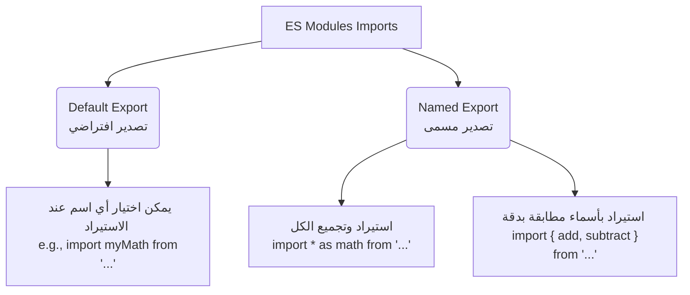

## وحدات إكما سكريبت (ES Modules) في Node.js

### 1. التمهيد والمشكلة (Context & Problem)

طوال الدروس السابقة، تم الاعتماد على نظام الوحدات المعروف باسم **CommonJS**، حيث يُعامل كل ملف كـ وحدة (Module) مستقلة، وتكون المتغيرات والدوال بداخله غير قابلة للوصول الافتراضي (Not accessible by default) إلا إذا تم تصديرها صراحةً باستخدام كائن `module.exports` واستيرادها باستخدام دالة `require`.

**المشكلة التاريخية (لماذا نحتاج نظاماً آخر؟):** عندما تم ابتكار تقنية Node.js، لم تكن لغة جافاسكريبت (JavaScript) تمتلك نظام وحدات مدمجاً بداخلها (No built-in module system). لذلك، اعتمدت Node.js افتراضياً على نظام **CommonJS** كحل لهذه المشكلة.

---

### 2. المفهوم الأساسي: وحدات إكما سكريبت (ES Modules)

**التعريف:** نظام وحدات إكما سكريبت، والذي يُعرف اختصاراً بـ **ESM** أو **ES Modules**، هو نظام الوحدات القياسي والرسمي المدمج في لغة جافاسكريبت نفسها.

**متى تم اعتماده ولماذا نستخدمه؟**

- **في لغة جافاسكريبت:** أصبح هذا النظام جزءاً معيارياً من اللغة بدءاً من إصدار **ES2015**.
- **في بيئة Node.js:** استغرق الأمر بعض الوقت حتى قامت الشركات المطورة للمتصفحات والمشرفون على Node.js بتطبيقه بالكامل. أصبح النظام مدعوماً ومستقراً (Stable support) في Node.js بداية من الإصدار رقم 14.
- **فائدته:** توحيد طريقة استيراد وتصدير الأكواد بين الواجهات الأمامية (Front-end) والواجهات الخلفية (Back-end)، مما يسهل العمل على المطورين.

---

### 3. قاعدة الامتداد الخاصة بـ (ES Modules)

> `‏` **Important Note** **قاعدة أساسية قبل كتابة الكود:** لاستخدام نظام ES Modules في Node.js، **يجب** أن يكون امتداد الملف هو `mjs.` وليس `js.` . هذا الامتداد يخبر بيئة Node.js صراحةً أن هذا الملف يستخدم معيار ES Modules وليس CommonJS.

---

### 4. أنماط الاستيراد والتصدير في ES Modules

يوفر هذا النظام عدة أنماط لتبادل الأكواد بين الملفات، تنقسم إلى فئتين رئيسيتين: التصدير الافتراضي (Default Exports) والتصدير المسمى (Named Exports).

#### أ. التصدير الافتراضي (Default Exports)

في هذا النوع، يُسمح للمطور بتسمية الfunction المُستوردة بأي اسم يريده داخل الملف المستقبل.

**النمط الأول: تصدير دالة/متغير فردي في النهاية (Single Export)** يتم تعريف الدالة بشكل طبيعي، ثم تصديرها في نهاية الملف باستخدام الكلمات المفتاحية `export default`.

`‏`**Step 1: التصدير من ملف `math-esm.mjs`**

```javascript
// تعريف الدالة
const add = (a, b) => {
    return a + b;
};

// التصدير الافتراضي للدالة
export default add;
```

`‏`**Step 2: الاستيراد في ملف `main.mjs`**

```javascript
// استيراد الدالة وتعيين اسم لها (add)
import add from './math-esm.mjs';

console.log(add(5, 5)); // النتيجة: 10
```

(ملاحظة: المخرجات المتوقعة عند تشغيل `node main.mjs` هي 10).

**النمط الثاني: التصدير الافتراضي المباشر (Inline Default Export)** بدلاً من تخصيص سطر منفصل للتصدير، يتم دمج `export default` مباشرة مع إنشاء الدالة.

**التصدير من `math-esm.mjs`:**

```javascript
// تصدير مباشر لدالة سهمية (Inline export)
export default (a, b) => {
    return a + b;
};
```

(الاستيراد في ملف `main.mjs` يظل مطابقاً تماماً للخطوة السابقة).

**النمط الثالث: تصدير كائن يحتوي على وظائف متعددة (Object Export)** عند الرغبة في تصدير أكثر من دالة، يتم وضعها داخل كائن (Object) وتصدير هذا الكائن.

**التصدير من `math-esm.mjs`:**

```javascript
const add = (a, b) => a + b;
const subtract = (a, b) => a - b;

// تصدير كائن يحتوي على الدالتين
// استخدام اختصار ES2015 لتطابق اسم المفتاح مع القيمة
export default {
    add,
    subtract
};
```

**الاستيراد العادي في `main.mjs`:**

```javascript
import math from './math-esm.mjs'; // استيراد الكائن بالكامل
console.log(math.add(5, 5)); // النتيجة: 10
console.log(math.subtract(5, 5)); // النتيجة: 0
```

(المخرجات: 10 و 0).

**الاستيراد باستخدام التفكيك (Destructuring Import):** ميزة من ميزات ES2015 تتيح استخراج الدوال مباشرة من الكائن المُستورد لتسهيل الاستخدام.

```javascript
// استخراج الدالتين مباشرة من الكائن المُستورد
const { add, subtract } = math;
console.log(add(5, 5));
```

#### ب. التصدير المسمى (Named Exports)

**النمط الرابع: التصدير المسمى (Named Export)** **الفكرة الأساسية:** في هذا النمط، **يجب** أن يكون اسم المتغير أو الدالة المُستوردة مطابقاً تماماً للاسم الذي تم تصديرها به. يتم ذلك باستخدام الكلمة المفتاحية `export` فقط قبل التصريح عن المتغير.

**التصدير من `math-esm.mjs`:**

```javascript
// وضع كلمة export قبل إنشاء كل دالة
export const add = (a, b) => a + b;
export const subtract = (a, b) => a - b;
```

**طرق الاستيراد في `main.mjs`:** هناك طريقتان للتعامل مع هذا النمط:

1. **استيراد الكل ككائن (Import All as Object):**
    
    ```javascript
    // استيراد جميع الوظائف المصدّرة وتجميعها في كائن اسمه math
    import * as math from './math-esm.mjs';
    console.log(math.add(5, 5));
    ```
    
2. **الاستيراد المباشر بأسماء مطابقة (Import Specific Names - الطريقة الأكثر شيوعاً):**
    
    ```javascript
    // استخدام أقواس التفكيك لاستيراد دوال محددة بأسمائها الدقيقة
    import { add, subtract } from './math-esm.mjs';
    console.log(add(5, 5));
    ```
    
    (هذه الطريقة تقوم بفك التشفير تلقائياً عند الاستيراد).

---

### 5. جدول مقارنة: CommonJS مقابل ES Modules

يوضح الجدول التالي أبرز الفروق بناءً على ما تم استعراضه:

| ES Modules (النظام القياسي الحديث) | CommonJS (النظام القديم/الافتراضي) | Feature (الميزة)                    |
| :--------------------------------- | :--------------------------------- | :---------------------------------- |
| المعيار الرسمي منذ ES2015.         | ابتكار مقترن بنشأة Node.js.        | **سنة التأسيس / المصدر**            |
| يجب أن يكون `mjs.`                 | `.js` (عادةً)                      | **امتداد الملف (File Extension)**   |
| `export` أو `export default`       | `module.exports`                   | **كلمة التصدير (Export Keyword)**   |
| الكلمة المفتاحية `import`.         | دالة `require()`                   | **كلمة الاستيراد (Import Keyword)** |

---

### 6. رسم توضيحي: خيارات استيراد ES Modules

يوضح الرسم التالي الخيارات المتاحة للمطور عند استيراد وحدة من نظام ESM:



---

### 7. ملاحظات ختامية للمحاضر (Wrap-up Notes)

> `‏` **Important Note**
> 
> - **للمطورين القادمين من الواجهات الأمامية (Front-end Developers):** إذا كنت قد عملت سابقاً في تطوير الواجهات الأمامية، فإن هذا التنسيق (ES Modules) سيكون مألوفاً جداً بالنسبة لك.
> - **مستقبل Node.js ومسار الدورة:** على الرغم من أن ES Modules قد يكون هو مستقبل Node.js، إلا أن المحاضر قرر الاستمرار في استخدام نظام **CommonJS** طوال بقية هذه الدورة. السبب في ذلك هو أن CommonJS سيبقى التنسيق الأساسي (Primary format) المستخدم بكثرة في بيئات العمل الحقيقية لعام أو عامين قادمين.

