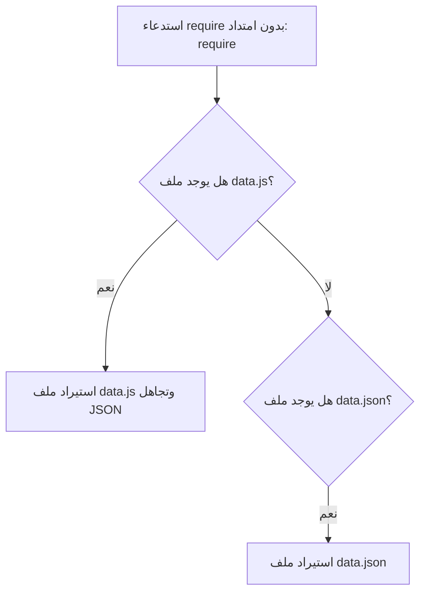

## استيراد بيانات JSON ووضع المراقبة (Watch Mode) في Node.js

### 1. التعامل مع بيانات JSON في Node.js

**التعريف والمصطلح (What is JSON?):** مصطلح **JSON** هو اختصار لـ **JavaScript Object Notation** (ترميز كائنات جافاسكريبت). هو عبارة عن تنسيق لتبادل البيانات (Data interchange format) يُستخدم بشكل شائع جداً للتواصل مع خوادم الويب (Web servers).

**الفكرة الأساسية وأوجه التشابه والاختلاف:** بيانات JSON تشبه إلى حد كبير الكائنات (Objects) في لغة جافاسكريبت، ولكن يوجد فرق جوهري واحد في البنية (Syntax).

|الخاصية (Feature)|كائن جافاسكريبت (JS Object)|كائن (JSON)|
|:--|:--|:--|
|**أسماء المفاتيح (Keys)**|تُكتب ككلمات عادية بدون علامات تنصيص.|**يجب** أن تُغلف بعلامات تنصيص مزدوجة (Wrapped with quotes).|

#### حالة عملية وتجربة: استيراد ملف JSON

لشرح كيفية استيراد هذه البيانات كـ وحدة (Module) في بيئة Node.js، قام المحاضر بإنشاء تجربة عملية.

`‏`**Step 1: إنشاء ملف البيانات (`data.json`)** تم إنشاء ملف جديد يحتوي على بيانات بصيغة JSON.

```json
// ملف data.json
{
    "name": "Bruce Wayne",
    "address": {
        "street": "Wayne Manor",
        "city": "Gotham"
    }
}
```

_شرح الكود:_ لاحظ أن المفاتيح مثل `"name"` و `"address"` تم تغليفها بعلامات تنصيص لتتوافق مع معيار JSON.

**Step 2: استيراد وقراءة الملف في (`index.js`)**

```javascript
// ملف index.js
const data = require('./data.json'); // استيراد ملف JSON

console.log(data); // طباعة الكائن بالكامل
console.log(data.name); // طباعة خاصية محددة
```

_شرح الكود والآلية:_

- عند استخدام دالة `require` لاستيراد ملف JSON، فإن السلوك الافتراضي (Default behavior) لبيئة Node.js هو أنها تقوم تلقائياً بتحليل (==Parse==) محتويات الملف وتحويلها إلى "كائن جافاسكريبت" (==JavaScript object==) حقيقي.
- بناءً على ذلك، يمكننا الوصول إلى الخصائص مباشرة (مثل `data.name`).
- عند تشغيل الأمر `node index` في الطرفية، سيتم طباعة الكائن، ثم طباعة القيمة `Bruce Wayne`.

#### مشكلة الامتدادات (File Extensions) في دالة `require`

من الممكن تقنياً تجاهل كتابة الامتداد `.json` عند الاستيراد (أي كتابة `require('./data')`)، وسيقوم Node.js بجلب البيانات بنجاح. ولكن هناك خطر خفي يكمن في هذه الطريقة.

> `‏` **Important Note** **تحذير وقاعدة هامة من المحاضر:** عند عدم تحديد الامتداد، فإن بيئة Node.js ستحاول أولاً البحث عن ملف بامتداد `.js` (أي `data.js`) قبل أن تبحث عن `data.json`. إذا حدث وكان لديك ملف باسم `data.js` في نفس المجلد، سيقوم Node.js باستيراده وتجاهل ملف JSON تماماً، مما سيؤدي إلى أخطاء في تطبيقك (Issues). **النصيحة:** يُنصح دائماً (Always use) بكتابة الامتداد `.json` صراحةً عند استيراد ملفات JSON.

**رسم توضيحي: آلية بحث Node.js عند تجاهل الامتداد**



---

### 2. وضع المراقبة (Watch Mode)

**التعريف والمشكلة (The Problem):** في الوضع الطبيعي لـ Node.js، كلما قمت بإجراء تعديل على ملفات الكود الخاصة بك، يجب عليك إيقاف العملية يدوياً وإعادة تشغيل الأمر `node index` لترى المخرجات الجديدة. على الرغم من أن هذا ليس أمراً بالغ الصعوبة، إلا أنه مزعج (Pain point).

**الفكرة الأساسية والحل:** في الإصدار رقم **18** من Node.js، تم تقديم ميزة جديدة تُسمى **وضع المراقبة (Watch Mode)**. وظيفة هذا الوضع هي مراقبة الكود المستورد باستمرار، وبمجرد اكتشاف أي تغيير أو حفظ للملفات، يقوم تلقائياً بإعادة تشغيل العملية (Restarts the process).

**كيف يعمل (الخطوات العملية):**

`‏`**Step 1: تشغيل وضع المراقبة** في الطرفية (Terminal)، بدلاً من كتابة `node index`، قم بكتابة الأمر التالي:

```shell
node --watch index
```

(أو `node --watch index.js`)

`‏`**Step 2: التعامل مع التحذير (Warning)** عند تشغيل الأمر، ستظهر لك رسالة تحذيرية تفيد بأن وضع المراقبة هو ميزة تجريبية (Experimental feature)، وهو أمر طبيعي ولا يدعو للقلق.

`‏`**Step 3: تجربة التحديث التلقائي**

- إذا كان الكود يحتوي على `console.log("hello world")`، ستظهر الجملة في التيرمينال.
- إذا قمت بتعديل النص إلى `"hello vishwas"` وحفظت الملف، ستلاحظ أن التيرمينال قامت بتحديث المخرجات فوراً دون الحاجة لكتابة أي أمر جديد.

**مميزات وضع المراقبة:**

- تحسين كبير جداً لتجربة المطور (Developer experience).
- مفيد جداً في السيناريوهات التي تتطلب تعديل محتوى الملفات والتحقق من المخرجات بشكل متكرر وسريع.

---

### 3. ملخص ختامي: قسم الوحدات المحلية (Local Modules Recap)

بهذا الدرس، يُختتم القسم الخاص بدراسة "الوحدات المحلية" (Local Modules) في دورة Node.js، والذي شمل المواضيع والمفاهيم الأكاديمية التالية كما لخصها المحاضر:

1. فهم ماهية الوحدة (Module) والحاجة إليها وأنواعها في Node.js.
2. التركيز على الوحدات المحلية (الملفات التي ننشئها ونشاركها داخل التطبيق).
3. دراسة تنسيق **CommonJS**، والذي يتضمن استخدام دالة `require` والكائن `module.exports` لاستيراد وتصدير الوحدات.
4. فهم الآلية الداخلية؛ حيث تُغلف كل وحدة بـ **IIFE** لتمتلك نطاقاً خاصاً (Private scope)، مع حقن 5 معاملات أساسية (Parameters) داخلها.
5. التعرف على تقنية التخزين المؤقت للوحدات (Module Caching).
6. استعراض الأنماط المختلفة للاستيراد والتصدير في كل من معيار CommonJS ومعيار **ES Modules**.
7. كيفية استيراد بيانات JSON واستخدام وضع المراقبة المستمرة للملفات.

**الخطوة القادمة في مسار التعلم:** في القسم التالي من الدورة، سيتم الانتقال من دراسة الوحدات المحلية إلى دراسة "الوحدات المدمجة" (**Built-in Modules**) التي تأتي جاهزة مع بيئة Node.js.