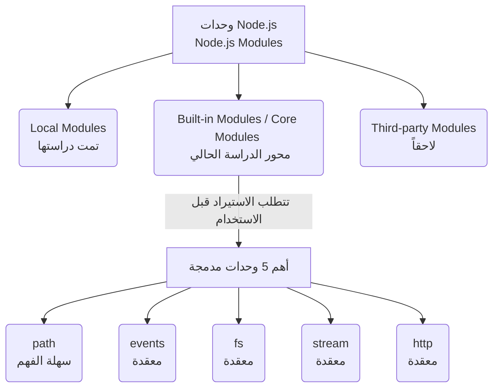

##  مقدمة في الوحدات المدمجة (Built-in Modules)

### 1. التمهيد ومراجعة أنواع الوحدات (Introduction & Modules Recap)

في بداية هذا القسم (القسم الثالث من الدورة)، قام المحاضر بإجراء مراجعة سريعة لما تم دراسته مسبقاً لربط المفاهيم ببعضها. تنقسم الوحدات (Modules) في بيئة Node.js بشكل أساسي إلى ثلاثة أنواع:

1. **الوحدات المحلية (Local Modules):** هي الوحدات التي نقوم نحن كمطورين بإنشائها، وكتابة الكود بداخلها، ومشاركتها داخل تطبيقنا الخاص (وهي ما تم التركيز عليه في القسم السابق بالكامل).
2. **الوحدات المدمجة (Built-in Modules):** هي الوحدات الأساسية التي تأتي مع بيئة Node.js، وهي محور تركيز هذا القسم الجديد.
3. **وحدات الطرف الثالث (Third-party Modules):** حزم خارجية يتم تثبيتها واستخدامها.

---

### 2. المفهوم الأساسي: الوحدات المدمجة (Built-in Modules)

**التعريف والمصطلحات:** الوحدات المدمجة (**Built-in Modules**) - والتي يُشار إليها أيضاً في الأوساط التقنية باسم "الوحدات الأساسية" (**Core Modules**) - هي عبارة عن وحدات أو مكتبات برمجية تأتي مضمنة وجاهزة (Ships with) بشكل افتراضي بمجرد تثبيت بيئة Node.js على جهازك.

**الفكرة الأساسية (كيف تعمل؟):** على الرغم من أن هذه الوحدات موجودة بالفعل داخل بيئة Node.js ومتاحة افتراضياً (Available by default)، إلا أن محرك التشغيل لا يقوم بتحميلها في الذاكرة تلقائياً في كل ملف تجنباً لاستهلاك الموارد.

> `‏` **Important Note** **قاعدة الاستخدام الجوهرية:**  على الرغم من أن الوحدات المدمجة متوفرة افتراضياً، **يجب عليك أولاً استيراد الوحدة (Import the module)** داخل ملفك البرمجي قبل أن تتمكن من استخدامها أو الوصول إلى دوالها.

---

### 3. أهم الوحدات المدمجة في Node.js (Key Built-in Modules)

تحتوي بيئة Node.js على عدد كبير من الوحدات المدمجة، ولكن لبناء التطبيقات العملية (Building applications)، أوضح المحاضر أن التركيز في هذه الدورة سينصب حصرياً على **خمس وحدات رئيسية** تعتبر هي الأكثر أهمية واستخداماً:

1. **وحدة `path`:** متخصصة في التعامل مع مسارات الملفات والمجلدات.
2. **وحدة `events`:** للتعامل مع الأحداث برمجياً.
3. **وحدة `fs`:** اختصار لـ File System، وتُستخدم للتعامل مع نظام الملفات (قراءة وكتابة الملفات).
4. **وحدة `stream`:** للتعامل مع تدفق البيانات.
5. **وحدة `http`:** لإنشاء خوادم الويب والتعامل مع طلبات الشبكة.

**ملاحظة حول مستوى الصعوبة:**

- أشار المحاضر إلى أن وحدة **`path`** تعتبر مباشرة وسهلة الفهم (Straightforward) بمجرد تطبيق بعض الأمثلة عليها.
- في المقابل، الوحدات الأربع المتبقية تعتبر أكثر تعقيداً (A little more complex).

> `‏` **Important Note**  نظراً لتعقيد بعض هذه الوحدات، ينصح المحاضر بشدة بعدم التردد في إعادة مشاهدة (Re-watch) أي جزء أو درس إذا شعرت أنك لا تستطيع المتابعة أو الفهم من المرة الأولى.

---

### 4. أين يوجد الكود المصدري لهذه الوحدات؟ (Source Code Location)

كـ معلومة إضافية (Side note) للمطورين المهتمين بالتعمق الأكاديمي والفضول التقني: إذا أردت يوماً الاطلاع على الكود المصدري الأصلي (Source code) الذي كُتبت به هذه الوحدات المدمجة لمعرفة كيف تعمل من الداخل، فيمكنك العثور على جميع ملفاتها داخل مجلد يُسمى **`lib`** الموجود ضمن ملفات تثبيت بيئة Node.js.

---

### 5. رسم توضيحي: هيكلة الوحدات في Node.js ومحور القسم الحالي

**الخطوة القادمة (Next Step):** بناءً على هذا التمهيد، سيبدأ المحاضر في الدرس القادم بالدخول العملي وشرح أول وأسهل هذه الوحدات، وهي وحدة **`path`**.