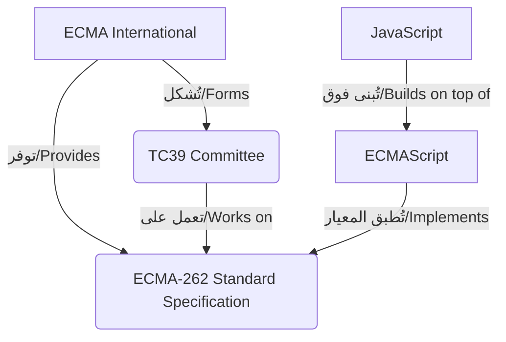

## الأساسيات التمهيدية لـ Node.js - مفهوم ECMAScript

### 1. التمهيد ومبدأ التعلم (Learning Approach)

قبل الدخول في تعقيدات "بيئة تشغيل جافاسكريبت" (JavaScript Runtime Environment) والتي تُبنى عليها تقنية Node.js، يجب بناء أساس نظري قوي للمفاهيم الجوهرية.

**التشبيه الأكاديمي (Analogy):** شبه المحاضر رحلة إتقان Node.js بألعاب الفيديو (Video Games)؛ لكي تتغلب على "الزعيم الأكبر" (Big Boss) - والذي يمثل في حالتنا فهم Node.js بشكل كامل - يجب عليك أولاً هزيمة "الزعماء الصغار" (Small Bosses) واكتساب الخبرة منهم. أول "زعيم صغير" يجب فهمه هو مصطلح **ECMAScript**.

---

### 2. السجل التاريخي لتطور لغة جافاسكريبت (Historical Timeline)

لفهم سبب وجود **ECMAScript**، يجب استعراض المشكلة التاريخية التي أدت لظهورها، وذلك عبر الخطوات الزمنية التالية:

`‏`**Step 1: ظهور واجهات المستخدم (1993)** تم إطلاق أول متصفح ويب يمتلك واجهة مستخدم رسومية (User Interface) وكان يُدعى **Mosaic**.

`‏`**Step 2: تأسيس Netscape والمشكلة التقنية (1994)** قام المطورون الأساسيون لمتصفح Mosaic بتأسيس شركة جديدة باسم **Netscape**، وأصدروا متصفحاً أكثر تطوراً سُمي بـ **Netscape Navigator**.

- **المشكلة:** على الرغم من شهرته، كان المتصفح يفتقر للقدرة على السلوك الديناميكي (Dynamic Behavior)؛ حيث كانت صفحات الويب ثابتة (Static Pages) ولا توجد أي تفاعلية (No Interactivity) بعد تحميل الصفحة.

`‏`**Step 3: ابتكار لغة JavaScript (1995)** لحل مشكلة التفاعلية، ابتكرت شركة Netscape لغة برمجة نصية (Scripting Language) جديدة.

> `‏` **Important Note** في الأصل، تم اختيار اسم **JavaScript** لأغراض تسويقية بحتة (Marketing Purpose)؛ وذلك استغلالاً لنجاح وشهرة لغة **Java** التي كانت "اللغة الأبرز" (Hot new language) في ذلك الوقت، ولا توجد علاقة تقنية مباشرة بينهما.

---

### 3. حرب المتصفحات ومشكلة التوافقية (Browser Wars & Compatibility Problem)

- **البداية:** في نفس العام (1995)، أطلقت شركة Microsoft متصفحها **Internet Explorer**، مما أدى إلى اندلاع "حرب المتصفحات" (Browser War) مع شركة Netscape.
- **الحاجة التقنية:** أدركت Microsoft أن لغة JavaScript غيّرت تجربة المستخدم (User Experience) على الويب بالكامل، وأرادت توفير نفس الميزة لمتصفحها.
- **عقبة التنفيذ:** لم يكن هناك "مواصفات قياسية" (Specification) مكتوبة للغة يمكن لـ Microsoft اتباعها لبرمجة محركها.
- **الحل المؤقت لـ Microsoft (1996):** قامت الشركة بعمل "هندسة عكسية" (Reverse Engineered) لمترجم الأكواد (Interpreter) الخاص بمتصفح Navigator، وأنشأت لغتها النصية الخاصة وأسمتها **JScript**.

**المعضلة الكبرى (The Problem):** رغم أن **JScript** كانت تخدم نفس الغرض، إلا أن بنيتها البرمجية وتطبيقها (Implementation) كانت مختلفة عن **JavaScript**. هذا الاختلاف خلق كابوساً للمطورين، حيث أصبح من الصعب جداً جعل المواقع تعمل بكفاءة على كلا المتصفحين. لدرجة أنه أصبح من الشائع رؤية شارات (Badges) على مواقع الويب مكتوب عليها:

- `‏`_"Best viewed in Netscape"_ (يُعرض بشكل أفضل على نتسكيب).
- `‏`_"Best viewed in Internet Explorer"_ (يُعرض بشكل أفضل على إنترنت إكسبلورر)، وذلك لأن الشركات لم تكن قادرة على تحمل تكلفة تطوير نسخ مختلفة من الموقع لدعم كلا اللغتين.

---

### 4. التوحيد القياسي وتدخل ECMA (Standardization)

لحل هذه الفوضى، في نوفمبر 1996، قامت شركة Netscape بتسليم لغة JavaScript إلى منظمة **ECMA International**.

**ما هي ECMA International؟**

- **التعريف:** هي جمعية صناعية مكرسة لعملية "التوحيد القياسي" (Standardization) لأنظمة المعلومات والاتصالات.
- **لماذا نستخدمها (الهدف)؟:** أرادت Netscape وضع "مواصفات قياسية" (Standard Specification) يمكن لجميع مصنعي المتصفحات (Browser Vendors) الالتزام بها (Conform to).
- **كيف تعمل وتفيدنا؟:** تضمن هذه المواصفات أن تبقى التطبيقات البرمجية (Implementations) متسقة وتعمل بنفس الطريقة عبر جميع المتصفحات.

عندما تتبنى منظمة ECMA تقنية جديدة، فإنها توفر شيئين أساسيين:

1. **المواصفات القياسية (Standard Specification).**
2. **لجنة تقنية مسؤولة عنها (Committee).**

---

### 5. المصطلحات التقنية الأساسية (Key Terminology)

بناءً على تدخل المنظمة، نتجت لدينا مجموعة من المصطلحات الأكاديمية الدقيقة التي يجب تفريقها:

-`‏` **ECMA-262:** هو الاسم الرمزي للمعيار والمواصفات القياسية (Standard Specification) الخاصة بلغة جافاسكريبت.
-`‏` **TC39 (Technical Committee 39):** هي اللجنة التقنية المتخصصة والمسؤولة عن صيانة وتطوير المعيار ECMA-262.
-`‏` **ECMAScript:** هو الاسم الرسمي للغة البرمجية التي تستند إلى معيار ECMA-262.

> `‏` **Important Note** **لماذا سُميت ECMAScript ولم تسمى JavaScript؟** قررت المنظمة استخدام اسم "ECMAScript" كلغة رسمية لأن شركة **Oracle** (التي استحوذت على شركة Sun Microsystems) هي من تمتلك العلامة التجارية (Trademark) لاسم "JavaScript" ولا يحق للمنظمة استخدامه كاسم للمعيار القياسي.

---

### 6. رسم توضيحي: العلاقة بين المعايير واللغات

لتبسيط وفهم بنية هذه المفاهيم، يمكن تمثيلها بالرسم البياني التالي:

---

### 7. التطور والإصدارات (Versioning)

على مر السنين، تم إصدار العديد من النسخ الخاصة بـ ECMAScript، ولكن أهم إصدار يجب التركيز عليه هو:

- `‏`**ES2015 (ويُعرف أيضاً بـ ES6):**
    - **الفكرة الأساسية:** هو الإصدار الذي قدم حزمة هائلة من الميزات التي أصبحت تُعرف باسم "جافاسكريبت الحديثة" (Modern JavaScript features).
    - **متى نستخدمه ولماذا؟:** أصبح فهم وتطبيق ميزات هذا الإصدار **متطلباً أساسياً (Prerequisite)** لكل من يريد الدخول في مجال التطوير باستخدام JavaScript بصفة عامة، و Node.js بصفة خاصة.

---

### 8. جدول المقارنة الشامل (الخلاصة)

| المصطلح (Term) |                                                       التعريف الأكاديمي (Definition)                                                        |
| :------------: | :-----------------------------------------------------------------------------------------------------------------------------------------: |
|  **ECMA-262**  |                                      هو المواصفات القياسية الصارمة للغة (The language specification).                                       |
| **ECMAScript** |                                             هي اللغة الرسمية التي تطبق وتمثل معيار (ECMA-262).                                              |
| **JavaScript** | هي لغة البرمجة العملية التي نستخدمها في كتابة الأكواد. هي في جوهرها تعتمد على ECMAScript ولكنها تُضيف وتُبنى فوقها (Builds on top of that). |

> `‏` **Important Note** **نصيحة ذهبية وملاحظة هامة جداً من المحاضر:** على الرغم من أن ECMAScript و JavaScript ليستا نفس الشيء من الناحية الأكاديمية البحتة، إلا أن هذين المصطلحين يُستخدمان كمترادفين (Interchangeably) في سوق العمل والمجتمع التقني.
> 
> **قاعدة لباقي الدورة:** لا تشتت نفسك (Do not get sidetracked) في محاولة البحث المعمق عن الفروقات الدقيقة بينهما. لغرض هذه السلسلة وبناء تطبيقات الويب، **من الآمن تماماً أن تتعامل مع مصطلح ECMAScript على أنه هو نفسه JavaScript** التي نألفها جميعاً.