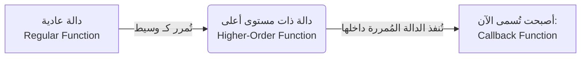

##  نمط الاستدعاء العكسي في (Callback Pattern) في Node.js

### 1. التمهيد والسياق (Context)

قبل الاستمرار في دراسة الوحدات المدمجة (Built-in Modules) في بيئة Node.js، من الضروري جداً أخذ منعطف تعليمي لفهم نمط برمجي جوهري تُبنى عليه معظم عمليات Node.js، وهو ما يُعرف بـ **نمط الاستدعاء العكسي (Callback Pattern)** أو أسلوب البرمجة بالاستدعاء العكسي (Callback style of programming).

---

### 2. المفهوم التأسيسي: الدوال في جافاسكريبت (Functions in JavaScript)

لفهم نمط الاستدعاء العكسي، يجب أولاً إدراك حقيقة أساسية حول كيفية تعامل لغة جافاسكريبت مع الدوال.

> `‏` **Important Note** **قاعدة جوهرية (Core Rule):** في لغة جافاسكريبت، تُعتبر الدوال **كائنات من الدرجة الأولى (First-class objects)**. **ماذا يعني ذلك ؟** يعني أنه تماماً مثل الكائنات (Objects) العادية، يمكن تمرير الدالة كـ "وسيط" (Argument) إلى دالة أخرى، كما يمكن أيضاً إرجاعها كـ "قيمة" (Value) من دالة أخرى.

---

### 3. المصطلحات الأساسية: Callback و Higher-Order Functions

بناءً على القاعدة السابقة، يبرز لدينا مصطلحان هندسيان مترابطان يمثلان جوهر هذا النمط:

#### أ. دالة الاستدعاء العكسي (Callback Function)

- **التعريف:** هي أي دالة (Function) يتم تمريرها كـ "وسيط" (Argument) إلى دالة أخرى.

#### ب. الدالة ذات المستوى الأعلى (Higher-Order Function)

- **التعريف:** هي الدالة التي "تستقبل" دالة أخرى كـ وسيط (Argument)، أو تقوم بـ "إرجاع" دالة كقيمة.

---

### 4. حالة عملية: بناء وتتبع نمط الاستدعاء العكسي (Code Example)

لفهم العلاقة بين المصطلحين، استعرض المحاضر مثالاً برمجياً مبسطاً.

**الخطوات البرمجية (Step-by-Step):**

`‏`**Step 1: تعريف الدالة الأولى (ستصبح لاحقاً الـ Callback)** نقوم بتعريف دالة بسيطة للترحيب تستقبل اسماً وتطبعه.

```javascript
// دالة الترحيب
function greet(name) {
    console.log(`Hello ${name}`);
}
```

`‏`**Step 2: تعريف الدالة الثانية (ستصبح الـ Higher-Order Function)** نقوم بتعريف دالة أخرى، ولكن الميزة هنا أن معاملها (Parameter) هو دالة أخرى.

```javascript
// Higher-Order Function
function greetVishwas(greetFn) {
    const name = 'Vishwas';
    greetFn(name); // استدعاء الدالة المُمررة وتمرير الاسم إليها
}
```

`‏`**Step 3: الاستدعاء والتنفيذ** نقوم الآن باستدعاء الدالة الثانية، ونُمرر الدالة الأولى كـ وسيط لها.


```javascript
// تمرير دالة greet كمعامل إلى دالة greetVishwas
greetVishwas(greet);
```

**مسار التحكم (Execution Flow) خلف الكواليس:**

1. عند تشغيل الكود، ينتقل مسار التحكم إلى دالة `greetVishwas`.
2. داخلها، تم تمرير الدالة `greet`، وأصبح يُشار إليها محلياً بالاسم `greetFn`.
3. يقوم الكود بإنشاء الثابت `name` بقيمة "Vishwas".
4. يتم استدعاء `greetFn` (والتي هي في الحقيقة دالة `greet`) ويُمرر لها الاسم.
5. ينتقل التنفيذ إلى دالة `greet`، وتُطبع النتيجة: `Hello Vishwas`.

لتبسيط الفكرة وتوضيح المسميات الأكاديمية، يمكن إعادة تسمية الكود السابق برمجياً ليعكس المصطلحات الدقيقة:

```javascript
function higherOrderFunction(callbackFunction) {
    const name = 'Vishwas';
    callbackFunction(name); // تنفيذ دالة الاستدعاء العكسي
}
```

---

### 5. رسم توضيحي: العلاقة بين الدوال



---

### 6. تصنيف دوال الاستدعاء العكسي (Categorizing Callbacks)

السؤال الأهم هنا هو: **لماذا نحتاج إلى هذا النمط (Why do we need callbacks)؟** للإجابة على هذا السؤال، يجب تقسيم دوال الcallbacks إلى فئتين رئيسيتين بناءً على "وقت" تنفيذها:

#### أ. الاستدعاء العكسي المتزامن (Synchronous Callbacks)

- **التعريف:** هو الcallbacks الذي يتم تنفيذه **فوراً ومباشرةً (Executed immediately)** بمجرد انتقال مسار التحكم إلى ال Higher-Order Functions.
- **أمثلة برمجية:**
    - دالة `greet` في المثال السابق هي استدعاء متزامن لأنها نُفذت فوراً.
    - الدوال المُمررة لعمليات المصفوفات مثل: `map` أو `filter` أو `sort`.
- **الفكرة الأساسية:** في هذه الحالات، تحدد دالة الـ Callback مجرد "منطق" (Logic) يجب على الHigher-Order Functions تطبيقه فوراً، ولا يوجد أي تأخير زمني.

#### ب. الاستدعاء العكسي غير المتزامن (Asynchronous Callbacks)

- **التعريف:** هو الCallbacks الذي يُستخدم لتأخير تنفيذ دالة معينة (Delay the execution) حتى يحين وقت معين أو يقع حدث معين (Until a particular time or event has occurred).
- **الفكرة الأساسية:** يُستخدم هذا النوع لاستئناف (Resume or continue) تنفيذ الأكواد بعد انتهاء عملية غير متزامنة (Asynchronous operation) كانت تعمل في الخلفية.

---

### 7. لماذا نستخدم الـ Asynchronous Callbacks في Node.js؟

> `‏` **Important Note تُعتبر دوال الAsynchronous Callbacks مهمة جداً (Really important) لأن معظم الوحدات المدمجة (Modules) في Node.js تمتلك طبيعة غير متزامنة (Asynchronous nature)**.

**الهدف الرئيسي (لماذا نستخدمها؟):** الهدف الأساسي من استخدامها في Node.js هو **منع حظر التنفيذ (Prevent blocking of execution)**. إذا كان لدينا عملية تستغرق وقتاً طويلاً، فإننا لا نريد أن يتوقف البرنامج بأكمله عن العمل بانتظارها. بدلاً من ذلك، نُمرر دالة Callback تعمل فقط عندما تنتهي هذه العملية الطويلة.

**أمثلة على العمليات التي تتطلب Async Callbacks في Node.js:**

1. قراءة البيانات من ملف (Reading data from a file).
2. جلب البيانات من قاعدة البيانات (Fetching data from a database).
3. معالجة طلبات الشبكة (Handling a network request).

---

### 8. أمثلة توضيحية من بيئة المتصفح (Browser JS Examples)

لتقريب فكرة الاستدعاء العكسي غير المتزامن، استشهد المحاضر بأمثلة مألوفة من جافاسكريبت المتصفح ومكتبة jQuery:

**المثال الأول: معالجات الأحداث (Event Handlers)**

```javascript
// عند إضافة مستمع لحدث النقر (Click Event)
button.addEventListener('click', function callbackFn() {
    console.log('Button clicked!');
});
```

- **كيف تعمل:** عندما يقرأ جافاسكريبت هذا السطر، فإنه **لا** يقوم بتنفيذ الدالة فوراً. بدلاً من ذلك، يتم "تأخير" التنفيذ حتى يقع الحدث (قيام المستخدم بالنقر على الزر).

**المثال الثاني: جلب البيانات في jQuery**

```javascript
// استخدام مكتبة jQuery لجلب بيانات من رابط
$.get(URL, function callbackFn(data) {
    console.log(data);
});
```

- **كيف تعمل:** الArgument الأول هو الرابط، والArgument الثاني هو دالة الـ Callback. لا يتم استدعاء هذه الدالة إطلاقاً إلا **بعد (Only after)** أن يتم تحميل البيانات من السيرفر بنجاح.

---

### 9. جدول مقارنة: المتزامن مقابل غير المتزامن (Sync vs Async Callbacks)

|وجه المقارنة (Feature)|المتزامن (Synchronous Callback)|غير المتزامن (Asynchronous Callback)|
|:--|:--|:--|
|**وقت التنفيذ (Execution Time)**|فوراً (Immediately).|مُؤجل (Delayed) بناءً على حدث أو وقت.|
|**الهدف الأساسي (Main Goal)**|توفير منطق (Logic) ليتم تطبيقه على الفور.|استئناف الكود (Resume code) بعد انتهاء عملية في الخلفية.|
|**خطر حظر البرنامج (Blocking)**|يوقف باقي الكود حتى ينتهي من عمله.|**يمنع حظر التنفيذ** (Prevent blocking of execution).|
|**أمثلة شائعة (Common Examples)**|`map()`, `filter()`, `sort()`|قراءة الملفات، قواعد البيانات، أحداث النقر `click`.|

---

### 10. الخلاصة والخطوة القادمة (Conclusion & Next Steps)

- **الخلاصة:** نمط الاستدعاء العكسي (Callback Pattern) هو أسلوب برمجي شائع جداً وقوي في Node.js، يعتمد على تمرير دوال كArgument لدوال أخرى. أهميته القصوى تبرز في الاستخدام غير المتزامن (Async) لتأخير التنفيذ حتى تكتمل المهام الثقيلة دون إيقاف البرنامج.
- **الخطوة القادمة:** بعد أن أصبح هذا النمط التأسيسي مفهوماً، سيتم في الدروس القادمة استئناف دراسة الوحدات المدمجة (Built-in Modules) في Node.js لرؤية هذا النمط قيد التطبيق العملي.