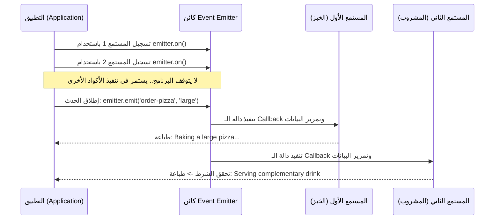

## وحدة الأحداث في Node.js (Events Module)

### 1. المفهوم الأساسي: وحدة الأحداث (Events Module)

**التعريف:** وحدة الأحداث (**Events Module**) هي ثاني الوحدات المدمجة (Built-in Modules) التي نتناولها في بيئة Node.js. وهي وحدة تسمح لنا بالعمل مع "الأحداث" وإدارتها داخل التطبيق.

**ما هو الحدث (Event)؟** الحدث هو عبارة عن "إجراء" (Action) أو "حدوث شيء ما" (Occurrence) داخل التطبيق الخاص بنا، والذي يمكننا الاستجابة له برمجياً.

**الفكرة الأساسية ولماذا نستخدمها؟** تسمح لنا هذه الوحدة بـ إرسال أو إطلاق أحداث مخصصة (**Dispatch custom events**) من ابتكارنا، ومن ثم الاستجابة لهذه الأحداث عند وقوعها بطريقة لا تحظر سير تنفيذ البرنامج الأساسي (**Non-blocking manner**).

**كيف تعمل ومصطلحاتها الجوهرية؟** مفهوم الأحداث ليس حكراً على بيئة Node.js، بل هو مفهوم مقتبس من حياتنا اليومية. وهو يعتمد على مصطلحين رئيسيين:

1. **إطلاق الحدث (Emitting):** الإعلان عن وقوع الحدث في النظام.
2. **الاستماع للحدث (Listening):** انتظار وقوع الحدث لتنفيذ استجابة (رد فعل) معينة.

---

### 2. التشبيه العملي (Real-World Analogy: سيناريو طلب البيتزا)

لتقريب المفهوم برمجياً،  تخيل أنك تشعر بالجوع وذهبت إلى مطعم "دومينوز" (Domino's) لتناول البيتزا.

- في نقطة البيع (العداد)، تقوم بوضع "طلب بيتزا".
- بمجرد وضع الطلب، يرى الطاهي الطلب على الشاشة ويقوم بـ "خبز البيتزا" لك.

**تحليل السيناريو برمجياً:**

- **الحدث (The Event):** هو لحظة "وضع الطلب" (Order being placed).
- **الاستجابة للحدث (The Response):** هي عملية "خبز البيتزا" (Baking a pizza) من قبل الطاهي. _الهدف من هذا القسم هو كتابة كود يحاكي هذا السيناريو اليومي بدقة._

---

### 3. خطوات استخدام الوحدة برمجياً (Implementation Steps)

لإنشاء وإدارة الأحداث في التطبيق (داخل ملف `index.js`)، نتبع الخطوات المترتبة التالية:

**Step 1: استيراد الوحدة (Importing the module)** نستخدم دالة `require` مع بادئة `node:` لاستيراد الوحدة المدمجة.

```javascript
const EventEmitter = require('node:events');
```

> `‏` **Important Note** **تسمية الثابت بـ `EventEmitter` وليس `events`:**  
> السبب  هو أن  ال Events Module لا تُرجع كائناً عادياً، بل تُرجع **"فئة" (Class)** تُسمى `EventEmitter`. هذه الclass تُغلف (Encapsulates) جميع الوظائف اللازمة لإطلاق الأحداث والاستجابة لها، لذا فإن هذه التسمية هي الأكثر دقة وملاءمة.

`‏`**Step 2: إنشاء نسخة من الفئة (Instantiating the class)** بما أننا استوردنا فئة (Class)، يجب علينا إنشاء كائن (Object) منها لنتمكن من استخدامه.

```javascript
const emitter = new EventEmitter();
```

`‏`**Step 3: تسجيل المستمع (Registering an Event Listener)** الآن يجب أن نُعرّف النظام بما يجب فعله عند وقوع الحدث. يتم ذلك باستخدام طريقة (Method) تُسمى **`on`**.

```javascript
// تسجيل المستمع للحدث الذي سنسميه 'order-pizza'
emitter.on('order-pizza', () => {
    console.log("Order received! Baking a pizza");
});
```

_شرح الكود:_ طريقة `emitter.on` تقبل معاملين (Parameters):

1. **اسم الحدث (Event Name):** وهو هنا النص `'order-pizza'`.
2. **المستمع (The Listener):** وهو عبارة عن (**Callback function**). وكما تعلمنا سابقاً، فإن وظيفة دالة الـ Callback هنا هي "تأخير تنفيذ الكود" (Delay execution) حتى يقع الحدث المرتبط بها.

**Step 4: إطلاق أو بث الحدث (Emitting the Event)** الآن، لنقم بإخبار النظام أن الحدث قد وقع فعلاً، وذلك باستخدام طريقة **`emit`**.

```javascript
// بث الحدث في النظام
emitter.emit('order-pizza');
```

_شرح الكود:_

- عند وصول مسار التنفيذ إلى هذا السطر، يتم إطلاق وبث (Broadcast) الحدث.
- فوراً، تقوم بيئة Node.js بالبحث عن أي "مستمعين" (Listeners) مسجلين لهذا الحدث المحدد واستدعاء دوال الـ Callback الخاصة بهم.

---

### 4. تمرير البيانات مع الأحداث (Passing Data to Listeners)

**الفكرة الأساسية:** في بعض الأحيان، مجرد إطلاق الحدث لا يكفي؛ بل نحتاج إلى تمرير بيانات مصاحبة له. في مثال البيتزا، عند الطلب، نحتاج إلى تحديد "الحجم" (Size) و"الإضافات" (Topping).

**كيف تعمل؟** لتحقيق ذلك، كل ما عليك فعله هو إضافة المعاملات (Arguments) الإضافية في دالة `emit` مباشرة بعد اسم الحدث. ستقوم بيئة Node.js بتمرير هذه البيانات تلقائياً إلى دالة المستمع (Listener).

**الكود المعدل:**

```javascript
const EventEmitter = require('node:events');
const emitter = new EventEmitter();

// 1. المستمع يستقبل البيانات كـ Parameters
emitter.on('order-pizza', (size, topping) => {
    console.log(`Baking a ${size} pizza with ${topping}`);
});

// 2. إطلاق الحدث مع تمرير البيانات كـ Arguments
emitter.emit('order-pizza', 'large', 'mushroom');
```

_المخرجات عند تشغيل الملف:_ `Baking a large pizza with mushroom`

---

### 5. تسجيل مستمعين متعددين لنفس الحدث (Multiple Listeners)

**الميزة والفائدة:** تسمح لنا فئة `EventEmitter` بتسجيل أكثر من مستمع (Multiple listeners) لحدث واحد. بمجرد إطلاق الحدث، سيتم تنفيذ جميع المستمعين المسجلين له بالترتيب.

**حالة عملية:** نريد إضافة قاعدة جديدة للمطعم: "إذا كان حجم البيتزا كبيراً (Large)، قم بتقديم مشروب مجاني".

**الكود:**

```javascript
// المستمع الأول (الأساسي)
emitter.on('order-pizza', (size, topping) => {
    console.log(`Baking a ${size} pizza with ${topping}`);
});

// المستمع الثاني (لنفس الحدث)
emitter.on('order-pizza', (size) => {
    if (size === 'large') {
        console.log("Serving complementary drink");
    }
});

// إطلاق الحدث
emitter.emit('order-pizza', 'large', 'mushroom');
```

_المخرجات:_ سيتم طباعة رسالة الخبز أولاً، تليها رسالة المشروب المجاني.

---

### 6. البرمجة الموجهة بالأحداث (Event-Driven Programming) والتنفيذ غير المحظور

> `‏` **Important Note** **ملاحظة جوهرية  (في غاية الأهمية):** الطريقة التي نكتب بها هذا الكود **لا تحظر التنفيذ (Not blocking execution)** للبرنامج الأساسي.

**التجربة للإثبات:** لو أضفنا أمر طباعة عادياً قبل سطر إطلاق الحدث مباشرة:

```javascript
console.log("Do work before event occurs in the system");
emitter.emit('order-pizza', 'large', 'mushroom');
```

_ماذا يحدث خلف الكواليس؟_

- لا يتوقف التنفيذ عند تسجيل المستمعين (`emitter.on`) في انتظار وقوع الحدث.
- سيتم طباعة `Do work before event occurs in the system` أولاً.
- ثم يتم إطلاق الحدث وتُطبع رسائل البيتزا.

**المصطلح  (Definition):** هذا النمط البرمجي - حيث يتم تأخير تنفيذ دالة (Delay the execution of a function) حتى يتم الإشارة (Signaled) إلى وقوع حدث معين في النظام بدلاً من إيقاف البرنامج لانتظاره - يُعرف باسم **البرمجة الموجهة بالأحداث (Event-driven programming)**، وهو نمط يُستخدم بكثافة عالية جداً في بيئة Node.js.

---

### 7. رسم توضيحي: آلية عمل وحدة الأحداث



**الخطوة القادمة (Next Steps):** أشار المحاضر إلى أننا لم ننتهِ بعد من دراسة وحدة الأحداث؛ حيث سيتناول الدرس القادم كيفية إنشاء "وحدتنا الخاصة" (Our own module) وبنائها بالاعتماد والتوسيع (Builds on top of) على فئة `EventEmitter`.