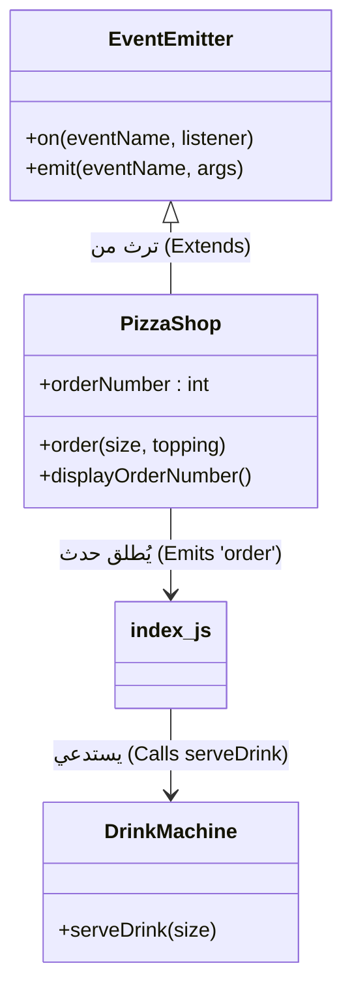

## الوراثة والتوسيع من فئة الأحداث (Extending from EventEmitter)

### 1. التمهيد والهدف من الدرس (Introduction & Objective)

في الدرس السابق، تعلمنا كيفية استخدام وحدة الأحداث (**Events Module**) لإنشاء كائن من كلاس ال `EventEmitter` واستخدامه لإطلاق الأحداث (Emit) والاستجابة لها (Listen). **الهدف من هذا الدرس:** بدلاً من استخدام كائن `EventEmitter` بشكل مباشر ومستقل، سنتعلم كيف نقوم بإنشاء "وحدتنا الخاصة" (Custom Module) التي تُبنى فوق (Builds on top of) كلاس `EventEmitter`، مما يمنح وحدتنا القدرة على إطلاق الأحداث الخاصة بها مع الاحتفاظ بالproperitites  وال functions المستقلة.

---

### 2. المفهوم التأسيسي: الوراثة في جافاسكريبت (Inheritance)

**التعريف:** الوراثة هي ميزة برمجية من مبادئ البرمجة الكائنية التوجه (OOP)، تسمح لفئة (Class) باكتساب ووراثة الخصائص والوظائف (Properties and Methods) الموجودة في Class أخر.

**لماذا نستخدمها في Node.js؟** لجعل وحداتنا المخصصة (مثل كلاس متجر بيتزا) قادرة على التعامل مع الطلبات باستخدام "المعمارية الموجهة بالأحداث" (**Event-driven architecture**).

**كيف تعمل؟** في جافاسكريبت (تحديداً منذ إصدار **ES2015**)، نستخدم الكلمة المفتاحية `extends` لجعل Class يرث من Class أخر، ونستخدم دالة ==`()super`== داخل ال (Constructor) لتهيئة الClass الأب (Parent class).

---

### 3. حالة عملية: بناء متجر بيتزا مخصص (Step-by-Step Implementation)

لشرح المفهوم الأكاديمي، قام المحاضر ببناء تطبيق مصغر لمتجر بيتزا يتطور تدريجياً.

#### الخطوة الأولى (Step 1): إنشاء الModule الأساسية (بدون Events)

تم إنشاء ملف `pizzashop.js` يحتوي على فئة عادية لا تتصل بالأحداث.

```javascript
// ملف pizzashop.js
class PizzaShop {
    // المُنشئ: يُنفذ عند إنشاء نسخة جديدة من الفئة
    constructor() {
        this.orderNumber = 0; // تهيئة رقم الطلب بصفر
    }

    // طريقة (Method) لطلب بيتزا
    order() {
        this.orderNumber++; // زيادة رقم الطلب بواحد
    }

    // طريقة (Method) لعرض رقم الطلب الحالي
    displayOrderNumber() {
        console.log(`Current order number: ${this.orderNumber}`);
    }
}

// تصدير الكلاس لاستخدامها في ملفات أخرى
module.exports = PizzaShop;
```

في ملف `index.js`، نقوم بالاستيراد والتجربة:

```javascript
// ملف index.js
const PizzaShop = require('./pizzashop'); // استيراد الوحدة
const pizzaShop = new PizzaShop(); // إنشاء نسخة (Instance)

pizzaShop.order(); // تنفيذ طلب
pizzaShop.displayOrderNumber(); // طباعة النتيجة: Current order number 1
```

#### الخطوة الثانية (Step 2): تطبيق الوراثة (Extending EventEmitter)

الآن، نريد دمج قدرات الأحداث داخل فئة `PizzaShop` ذاتها.

```javascript
// ملف pizzashop.js (بعد التعديل)
const EventEmitter = require('node:events'); // 1. استيراد فئة باعث الأحداث

// 2. استخدام extends للوراثة من EventEmitter
class PizzaShop extends EventEmitter {
    constructor() {
        super(); // 3. استدعاء مُنشئ الفئة الأب (EventEmitter) - خطوة إلزامية
        this.orderNumber = 0;
    }

    // تعديل الدالة لتقبل المعاملات وتطلق حدثاً
    order(size, topping) {
        this.orderNumber++;
        // 4. إطلاق الحدث. (this) هنا تشير إلى كائن PizzaShop الذي أصبح الآن باعثاً للأحداث!
        this.emit('order', size, topping);
    }

    displayOrderNumber() {
        console.log(`Current order number: ${this.orderNumber}`);
    }
}

module.exports = PizzaShop;
```

_الشرح العميق:_ بفضل الوراثة، لم نعد بحاجة لإنشاء كائن `emitter` منفصل. الكلمة المفتاحية `this` أصبحت تمتلك جميع صلاحيات `EventEmitter` (مثل `this.emit` و `this.on`).

#### الخطوة الثالثة (Step 3): الاستماع للأحداث المدمجة في الملف الرئيسي

في ملف `index.js`، نعامل كائن `pizzaShop` على أنه `EventEmitter` كامل الصلاحيات.

```javascript
// ملف index.js (بعد التعديل)
const PizzaShop = require('./pizzashop');
const pizzaShop = new PizzaShop();

// تسجيل مستمع للحدث باستخدام الكائن نفسه
pizzaShop.on('order', (size, topping) => {
    console.log(`Order received! Baking a ${size} pizza with ${topping}`);
});

// تنفيذ الطلب (وهذا سيقوم داخلياً بإطلاق حدث 'order')
pizzaShop.order('large', 'mushrooms');
pizzaShop.displayOrderNumber();
```

_المخرجات المتوقعة:_

```javascript
Order received! Baking a large pizza with mushrooms
Current order number: 1
```

---

### 4. المفهوم المتقدم: الارتباط الفضفاض (Loose Coupling) باستخدام الأحداث

**التعريف:** الارتباط الفضفاض (**Loose Coupling**) هو مبدأ في هندسة البرمجيات يعني تصميم أجزاء النظام (الوحدات/Modules) بحيث تعتمد على بعضها البعض بأقل قدر ممكن.

**الفكرة الأساسية ولماذا نستخدمها؟** في تطبيقنا، نريد تقديم "مشروب مجاني" إذا كان حجم البيتزا كبيراً. بدلاً من كتابة منطق المشروب داخل فئة `PizzaShop` (مما يؤدي إلى "ارتباط وثيق" / Tight Coupling)، نقوم بفصل منطق المشروب في وحدة مستقلة تماماً، ونستخدم **الأحداث** للربط بينهما في الملف الرئيسي `index.js`.

**فائدة هذا المبدأ:** يسمح بربط وحدات مختلفة معاً للعمل بتناغم دون أن تكون متداخلة برمجياً بقوة، مما يسهل صيانة الكود وتطويره.

#### تطبيق المبدأ برمجياً (Adding DrinkMachine):

**Step 1: إنشاء وحدة المشروبات (`drinkmachine.js`)**

```javascript
// ملف drinkmachine.js
class DrinkMachine {
    // طريقة لتقديم المشروب بناءً على الحجم
    serveDrink(size) {
        if (size === 'large') {
            console.log("Serving complementary drink");
        }
    }
}

module.exports = DrinkMachine; // تصدير الفئة
```

**Step 2: الربط الفضفاض عبر الأحداث في `index.js`**

```javascript
// ملف index.js (النهائي)
const PizzaShop = require('./pizzashop');
const DrinkMachine = require('./drinkmachine'); // استيراد وحدة المشروبات

const pizzaShop = new PizzaShop();
const drinkMachine = new DrinkMachine(); // إنشاء نسخة

// المستمع للحدث: يربط بين المتجر وآلة المشروبات
pizzaShop.on('order', (size, topping) => {
    console.log(`Order received! Baking a ${size} pizza with ${topping}`);

    // استدعاء آلة المشروبات داخل المستمع وليس داخل متجر البيتزا
    drinkMachine.serveDrink(size);
});

pizzaShop.order('large', 'mushrooms');
pizzaShop.displayOrderNumber();
```

_المخرجات النهائية:_

```
Order received! Baking a large pizza with mushrooms
Serving complementary drink
Current order number: 1
```

---

### 5. رسم توضيحي: معمارية الارتباط الفضفاض والوراثة



---

### 6. جدول مقارنة: الارتباط الوثيق مقابل الارتباط الفضفاض

| الميزة (Feature)            | الارتباط الوثيق (Tight Coupling)                                                  | الارتباط الفضفاض باستخدام الأحداث (Loose Coupling)                                      |
| :-------------------------- | :-------------------------------------------------------------------------------- | :-------------------------------------------------------------------------------------- |
| **تعريف العلاقة**           | الكلاسات تستدعي بعضها مباشرة من الداخل (مثال: `PizzaShop` يستدعي `DrinkMachine`). | الكلاسات لا تعرف شيئاً عن بعضها؛ نقطة التجمع (مثل `index.js`) هي من ينسق عبر المستمعين. |
| **الاعتمادية (Dependency)** | عالية جداً؛ تغيير في فئة قد يكسر الفئة الأخرى.                                    | منخفضة جداً (Minimal dependency).                                                       |
| **توصية المحاضر**           | غير محبذ في الأنظمة المعقدة.                                                      | **الممارسة المُوصى بها** لبناء تطبيقات قابلة للتوسع والصيانة.                           |

---

### 7. الملاحظة الأهم في المحاضرة (The Ultimate Takeaway)

>  `‏` **Important Note** **لماذا نتعلم هذا النمط؟ (في غاية الأهمية للمحاضرات القادمة)** أكد المحاضر بشدة أن الهدف الرئيسي من هذا الدرس ليس مجرد بناء متجر بيتزا، بل إدراك حقيقة جوهرية في قلب معمارية Node.js:
> 
> **"معظم الوحدات المدمجة الأساسية (Built-in Modules) في Node.js - وتحديداً وحدات `fs` (نظام الملفات) و `streams` (التدفقات) و `http` (الخوادم) التي سيتم دراستها في الدروس القادمة - جميعها ترث وتتوسع (Extend) من فئة `EventEmitter`".**
> 
> **الخلاصة:** استيعابك لكيفية بناء فئة ترث من `EventEmitter` سيجعل فهمك للوحدات القادمة أمراً سهلاً وبديهياً، لأنها تعمل جميعها بنفس المنطق تماماً (تطلق أحداثاً مخصصة وتستجيب لها).