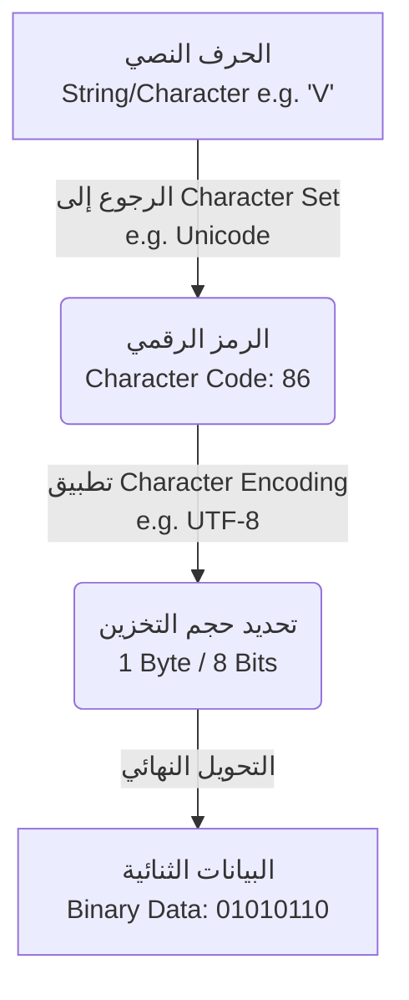

## مجموعات الأحرف والترميز (Character Sets and Encoding)

### 1. التمهيد والسياق (Context)

قبل المضي قدماً في دراسة الوحدات المدمجة المتبقية في بيئة Node.js (مثل `fs` و `stream` و `http`)، من الضروري جداً أخذ منعطف تأسيسي لفهم المفاهيم الأساسية لعلوم الحاسوب التي تعتمد عليها هذه الوحدات. يركز هذا الدرس حصرياً على فهم كيفية تعامل الحاسوب مع النصوص من خلال دراسة المفاهيم التالية: **البيانات الثنائية (Binary Data)**، **مجموعات الأحرف (Character Sets)**، و **ترميز الأحرف (Character Encoding)**.

---

### 2. البيانات الثنائية (Binary Data)

**التعريف:** البيانات الثنائية (**Binary Data**) هي الصيغة الأساسية التي تعتمد عليها أجهزة الحاسوب لتخزين وتمثيل البيانات، وتتكون بالكامل من مجموعة من الأصفار والآحاد (Zeros and Ones).

**المصطلحات الأساسية:**

- **البت (Bit):** هو اختصار لمصطلح (Binary Digit) أو الرقم الثنائي. يمثل كل `0` أو `1` في البيانات الثنائية "بتاً" واحداً.

**كيف تعمل؟ (الفكرة الرياضية خلف التحويل):** لكي يتمكن الحاسوب من التعامل مع أي بيانات (مثل الرقم `4`)، يجب عليه تحويلها إلى تمثيلها الثنائي. يتم هذا التحويل عبر عملية رياضية بسيطة تعتمد على "النظام الرقمي ذو الأساس 2" (**Base 2 Numeric System**).

**حالة عملية (التجربة الرياضية للرقم 4):** التمثيل الثنائي للرقم `4` هو `100`. كيف فهم الحاسوب ذلك؟ يتم حسابها من اليمين إلى اليسار باستخدام قوى الرقم 2 (Powers of 2):

- الخانة الأولى (0): $2^0 \times 0 = 0$
- الخانة الثانية (0): $2^1 \times 0 = 0$
- الخانة الثالثة (1): $2^2 \times 1 = 4$
- **المجموع:** $4 + 0 + 0 = 4$.

---

### 3. تمثيل النصوص والأحرف (Representing Characters)

الحاسوب لا يتعامل فقط مع الأرقام، بل يتعامل بكثرة مع السلاسل النصية (**Strings**). كيف يحول الحاسوب حرفاً مثل الحرف `V` إلى بيانات ثنائية؟

**الخطوات (Step-by-Step):** تمر عملية تحويل الأحرف إلى بيانات ثنائية بمرحلتين أساسيتين:

-`‏` **Step 1:** يقوم الحاسوب أولاً بتحويل الحرف إلى "رقم" يمثل هذا الحرف.
-`‏` **Step 2:** يقوم الحاسوب بتحويل هذا الرقم إلى تمثيله الثنائي (Binary representation).

**المصطلح :** الرقم الذي يعبر عن الحرف يُسمى **رمز الحرف (Character Code)**.

**مثال برمجي (التحقق من رمز الحرف):** لإثبات هذه الفكرة، يمكنك استخدام وحدة التحكم (DevTools Console) في المتصفح وتنفيذ دالة جافاسكريبت التالية:

```javascript
// استخدام دالة charCodeAt لمعرفة الرقم الممثل للحرف V
'V'.charCodeAt();
```

شرح الكود: هذه الدالة المبنية في جافاسكريبت تأخذ الحرف `V` وتُرجع قيمته الرقمية. النتيجة ستكون **`86`**. هذا يعني أن التمثيل الرقمي للحرف `V` هو `86`.

---

### 4. مجموعات الأحرف (Character Sets)

السؤال المنطقي هنا: كيف عرف الحاسوب أن الرقم `86` تحديداً هو الذي يجب أن يمثل الحرف `V`؟ الإجابة تكمن في مفهوم "مجموعات الأحرف".

**التعريف:** مجموعة الأحرف (**Character Set**) هي عبارة عن قائمة أو قاموس مُعرّف مسبقاً (Predefined list) يحتوي على مجموعة من الأحرف، حيث يتم تخصيص رقم محدد (Numeric representation) لكل حرف.

**أشهر مجموعات الأحرف:** يوجد العديد من مجموعات الأحرف، ولكن الأكثر شهرة واستخداماً هما:

1. `‏` **Unicode** (اليونيكود).
2.`‏` **ASCII** (الأسكي).

**كيف تعمل؟** في مثالنا السابق، المتصفح يستخدم معيار **Unicode**. وفقاً لقواعد مجموعة `Unicode`، فإن الرقم `86` يمثل الحرف الكبير `V`. (أشار المحاضر إلى موقع `unicodeable.com` كمرجع حيث يمكن البحث عن أي حرف ورؤية قيمته الرقمية التي ستتطابق مع ما يعطيه المتصفح).

---

### 5. ترميز الأحرف (Character Encoding)

الآن وقد عرفنا أن الحرف `V` يقابله الرقم `86` في مجموعة الأحرف، قد تعتقد أن الحاسوب سيقوم فوراً بتحويل الرقم 86 إلى نظام ثنائي وانتهى الأمر. هذا "صحيح جزئياً"، وهنا يأتي دور المفهوم الأخير.

**التعريف:** ترميز الأحرف (**Character Encoding**) هو النظام أو القاعدة التي تُملي على الحاسوب **كيفية** تمثيل وتخزين الرقم (المستخرج من Character Set) كبيانات ثنائية (Binary Data) قبل حفظه في الذاكرة.

**لماذا نستخدمه وما الفكرة الأساسية؟** الفكرة الأساسية لترميز الأحرف هي تحديد **"عدد البتات" (How many bits)** التي يجب استخدامها لتمثيل الرقم الواحد في النظام الثنائي.

**حالة عملية (معيار UTF-8):** أشهر أنظمة ترميز الأحرف هو نظام **UTF-8**.

- ينص معيار `UTF-8` على أن الأحرف يجب أن يتم ترميزها باستخدام **البايتات (Bytes)**.
- **البايت (Byte)** الواحد يتكون من **8 بت (8 bits)** (أي 8 أصفار وآحاد).

**كيف يعمل الترميز برمجياً (أمثلة تفصيلية)؟**

- **مثال الرقم 4:** كما درسنا سابقاً، الرقم 4 ثنائياً هو `100` (ثلاثة بتات فقط). ولكن نظام `UTF-8` يُجبرنا على استخدام بايت كامل (8 بت). لذلك، يتدخل الحاسوب ويضيف 5 أصفار إلى اليسار ليصبح المجموع 8 بت. _النتيجة في الذاكرة:_ `00000100`.
    
- **مثال الحرف V:** الرقم الممثل له هو `86`. تحويله للثنائي مع تطبيق قواعد `UTF-8` (8 بت) ينتج عنه: _النتيجة في الذاكرة:_ `01010110`.
    

> `‏` **Important Note** **ملاحظة إضافية :** الإرشادات والقواعد الخاصة بالترميز (Encoding) لا تقتصر فقط على النصوص والأحرف، بل توجد قواعد وأنظمة ترميز مشابهة تماماً تحدد كيفية تحويل وتخزين **الصور (Images)** و **الفيديوهات (Videos)** بصيغة بيانات ثنائية (Binary format) داخل الحاسوب.

---

### 6. جدول مقارنة: مجموعة الأحرف مقابل ترميز الأحرف

لفهم الفرق الدقيق بين المفهومين اللذين غالباً ما يسببان ارتباكاً:

|المفهوم (Feature)|مجموعة الأحرف (Character Set)|ترميز الأحرف (Character Encoding)|
|:--|:--|:--|
|**التعريف**|قاموس يربط الحرف برقم محدد (Character code).|قاعدة تحدد كيف يُكتب هذا الرقم كأصفار وآحاد في الذاكرة.|
|**الدور الأساسي**|الإجابة على سؤال: "ما هو الرقم الذي يمثل الحرف؟"|الإجابة على سؤال: "كم عدد البتات المستخدمة لحفظ هذا الرقم؟"|
|**أمثلة قياسية**|**Unicode**, **ASCII**|**UTF-8**|

---

### 7. رسم توضيحي: دورة حياة البيانات النصية

يوضح الرسم التالي التدفق الكامل لكيفية تحويل الحرف إلى بيانات مخزنة داخل الحاسوب:



**الخلاصة والخطوة القادمة:** هذه المعرفة التأسيسية حول كيفية تحويل وتمثيل البيانات على مستوى البت (Bit) والبايت (Byte) هي المفتاح الأساسي لفهم الدرس القادم، والذي سيغوص في مفاهيم **التدفقات والمخازن المؤقتة (Streams and Buffers)** في بيئة Node.js.