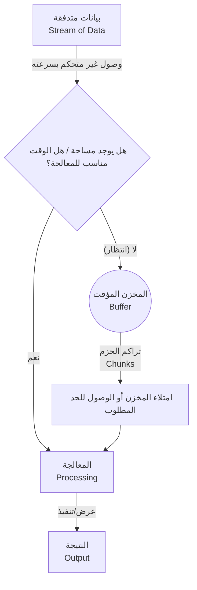

##  التدفقات والمخازن المؤقتة (Streams and Buffers) في Node.js

### 1. التمهيد والسياق (Context)

في الدرس السابق، تم تأسيس الفهم حول البيانات الثنائية (Binary Data) وكيفية فهم الحواسيب للأصفار والآحاد، بالإضافة إلى مجموعات الأحرف (Character Sets) وترميز الأحرف (Character Encoding). يبني هذا الدرس على تلك المفاهيم الأساسية لشرح اثنين من أهم المفاهيم الجوهرية في بيئة Node.js: التدفقات (Streams) والمخازن المؤقتة (Buffers).

---

### 2. المفهوم الأول: التدفقات (Streams)

**التعريف:** التدفق (**Stream**) هو عبارة عن تسلسل من البيانات (==Sequence of data==) التي يتم نقلها من نقطة إلى أخرى بمرور الوقت.

**الفكرة الأساسية وكيف تعمل؟** في بيئة Node.js، تعتمد فكرة التدفقات على معالجة البيانات على شكل **أجزاء أو حزم (Chunks)** بمجرد وصولها، بدلاً من الانتظار حتى تتوفر حزمة البيانات بأكملها قبل البدء في معالجتها.

**أمثلة لتوضيح الفكرة (متى نستخدمها؟):**

- **بث الفيديو (YouTube Streaming):** عند مشاهدة فيديو على يوتيوب، أنت لا تنتظر تحميل ملف الفيديو بالكامل لكي تبدأ المشاهدة. بل تصل البيانات على شكل حزم (Chunks)، وتقوم بمشاهدة هذه الحزم بينما تستمر بقية البيانات بالوصول بمرور الوقت.
- **نقل الملفات (File Transfer):** عند نقل محتويات من (ملف أ) إلى (ملف ب) داخل نفس الحاسوب، فإنك لا تنتظر حفظ كامل محتوى (ملف أ) في الذاكرة المؤقتة لنقله. بدلاً من ذلك، تصل المحتويات وتُنقل على شكل حزم، بينما تتدفق بقية البيانات بمرور الوقت.

**مميزاتها:** تمنع هذه التقنية عمليات التنزيل غير الضرورية للبيانات، وتوفر بشكل كبير في استهلاك الذاكرة (Memory usage)، مما يحسن أداء التطبيق.

---

### 3. المفهوم الثاني: المخازن المؤقتة (Buffers)

بما أن البيانات تنتقل بمرور الوقت، تبرز الحاجة لمعرفة كيف يتم إدارة حركة هذا التسلسل من البيانات، وهنا يأتي دور المخزن المؤقت (Buffer).

**التعريف:** المخزن المؤقت (**Buffer**) هو منطقة تخزين صغيرة ومحدودة يتعمد محرك Node.js الاحتفاظ بها في بيئة التشغيل (Runtime) لمعالجة تدفق البيانات.

**الفكرة الأساسية (تشبيه الأفعوانية - Roller Coaster Analogy):** لفهم الفكرة بعمق، طرح المحاضر تشبيهاً بمدينة الملاهي:

- تخيل لعبة أفعوانية (Roller Coaster) تتسع لـ 30 شخصاً فقط.
- نحن لا نستطيع التحكم في سرعة أو وتيرة وصول الأشخاص للعبة.
- إذا وصل 100 شخص دفعة واحدة، سيركب 30 شخصاً، وسيضطر الـ 70 الباقون للانتظار في الطابور للجولة القادمة.
- بالمقابل، إذا وصل شخص واحد فقط، سيضطر للانتظار في الطابور حتى يصل 10 أشخاص على الأقل (كقاعدة لرفع الكفاءة).
- في كلا الحالتين، لا يمكنك التحكم في وتيرة وصول الناس، ولكن يمكنك فقط تحديد "الوقت المناسب" لإرسالهم في الجولة.
- منطقة الانتظار (الطابور) هذه هي ما يمثل الـ **Buffer**.

**كيف تعمل في Node.js؟** بالمثل، لا يمكن لـ Node.js التحكم في سرعة وصول البيانات عبر التدفق (Stream). يمكنه فقط تحديد الوقت المناسب لإرسال البيانات للمعالجة. إذا كان هناك بيانات قيد المعالجة بالفعل، أو كانت البيانات الواصلة قليلة جداً ولا تكفي للمعالجة، يقوم Node.js بوضع هذه البيانات القادمة في "منطقة انتظار" وهي الـ **Buffer**.

**حالة عملية (سرعة الإنترنت في بث الفيديو):**

- **اتصال سريع:** سرعة وصول البيانات ستكون كافية لملء المخزن المؤقت (Buffer) فوراً وإرسالها للمعالجة وعرض الفيديو بشكل مستمر.
- **اتصال بطيء:** بعد معالجة الحزمة الأولى، سيعرض مشغل الفيديو "أيقونة التحميل" (Loading Spinner)، وهذا مؤشر مرئي على أن المشغل **ينتظر** وصول المزيد من البيانات لتملأ الـ Buffer. بمجرد امتلائه ومعالجته، يُستأنف الفيديو، بينما تستمر البيانات الجديدة بالانتظار في المخزن المؤقت.

---

### 4. جدول مقارنة: التدفق مقابل المخزن المؤقت

|الميزة (Feature)|التدفق (Stream)|المخزن المؤقت (Buffer)|
|:--|:--|:--|
|**طبيعة العمل**|عملية النقل المستمر للبيانات من نقطة لأخرى بمرور الوقت.|منطقة تخزين مؤقتة للبيانات قبل معالجتها.|
|**التحكم بالسرعة**|لا يمكن التحكم في سرعة وصوله.|يحدد متى يتم إرسال البيانات للمعالجة لضمان الكفاءة.|
|**التشبيه العملي**|حركة وصول الأشخاص إلى مدينة الملاهي.|طابور الانتظار قبل ركوب اللعبة.|

---

### 5. التطبيق العملي والبرمجي (Code Implementation)

لربط مفهوم الـ Buffer بالبيانات الثنائية (Binary Data) وترميز الأحرف (Encoding) من الدرس السابق، قمنا بكتابة الكود التالي.

**ملاحظة هامة:** توفر بيئة Node.js ميزة الـ Buffer كـ **ميزة عالمية (Global feature)**، مما يعني أنك لست بحاجة لاستيراد أي وحدة (No import required) لاستخدامها.

```javascript
// الخطوة 1: إنشاء مخزن مؤقت يحتوي على السلسلة النصية 'vishwas'
// نستخدم الطريقة Buffer.from ونحدد الترميز (utf-8 هو الافتراضي ويمكن تجاهله)
const buffer = Buffer.from('vishwas', 'utf-8'); //

// الخطوة 2: طباعة تمثيل الكائن بصيغة JSON
console.log(buffer.toJSON()); //
// المخرجات: { type: 'Buffer', data: [ 118, 105, 115, 104, 119, 97, 115 ] }

// الخطوة 3: طباعة المخزن المؤقت نفسه لرؤية البيانات الثنائية الخام
console.log(buffer); //
// المخرجات: <Buffer 76 69 73 68 77 61 73>

// الخطوة 4: إعادة تحويل البيانات إلى نص مقروء
console.log(buffer.toString()); //
// المخرجات: vishwas

// الخطوة 5: الكتابة فوق المخزن المؤقت (تعديله)
buffer.write('code'); //
console.log(buffer.toString()); //
// المخرجات: code was

// الخطوة 6: محاولة كتابة نص أطول من سعة المخزن
buffer.write('codevolution'); //
console.log(buffer.toString()); //
// المخرجات: codevol (تم تجاهل بقية الأحرف)
```

---

### 6. التحليل العميق للأكواد (Deep Explanation of Code)

1. **الارتباط الأول (مخرجات دالة `toJSON`):** مصفوفة الأرقام الناتجة `[118, 105, ...]` تمثل الأرقام المخصصة لكل حرف في جدول اليونيكود (Unicode character codes) للكلمة الممررة. (مثلاً: الرقم 86 يمثل الحرف `V` الكبير، بينما 118 تمثل `v` الصغير).
    
2. **الارتباط الثاني (مخرجات دالة `console.log(buffer)`):** عند طباعة الـ `buffer` مباشرة، فإنه يعرض البيانات الثنائية الخام (Raw binary data) ولكن بصيغة **النظام السداسي عشر (Hexadecimal - Base 16)**.
    
    - **لماذا السداسي عشر وليس الأصفار والآحاد؟** لأن طباعة 8 بتات (Bits) لكل حرف ستغرق وتملأ الشاشة (Flood the terminal) بشكل غير مقروء.
    - **مثال رياضي:** القيمة `56` بالنظام السداسي عشر تساوي تماماً القيمة الثنائية `01010110`، والتي تساوي الرقم `86` الممثل للحرف `V`.
3. **الارتباط الثالث (سعة الذاكرة المحدودة - Limited Memory):** عند استخدام دالة `buffer.write('code')`، كانت النتيجة `code was`. هذا لأن المخازن المؤقتة (Buffers) لها **حجم ذاكرة محدود (Limited memory)** يتم تحديده عند إنشائها (في حالتنا يتسع لـ 7 أحرف من كلمة vishwas). لذلك، قامت كلمة `code` بـ "استبدال أو الكتابة فوق" (Overwrite) أول 4 أحرف فقط، وبقيت أحرف `was` كما هي. وعند محاولة كتابة `codevolution`، تم تجاهل الأحرف الأخيرة لأنها لم تجد مساحة في الـ Buffer.
    

---

### 7. رسم توضيحي: دورة حياة البيانات في التدفق والمخزن المؤقت



---

### 8. ملاحظات المحاضر الختامية

>`‏` **Important Note** **لماذا نتعلم هذه التفاصيل الدقيقة؟ : قد لا تضطر أبداً في مسيرتك المهنية إلى التعامل المباشر وكتابة أكواد المخازن المؤقتة (Buffers) بشكل يدوي، لأن Node.js تستخدمها داخلياً نيابة عنك كلما تطلب الأمر ذلك. من الناحية التقنية، كان بإمكاننا الانتقال فوراً لدراسة وحدات مثل `fs` (نظام الملفات) أو `http` (الخوادم) دون فهم هذه التفاصيل الدقيقة. ولكن، إن فهم هذه الأساسيات يمثل المفتاح الجوهري لبناء "نموذج ذهني" (Mental Model) قوي وصحيح لأي تقنية تقوم بتعلمها.
