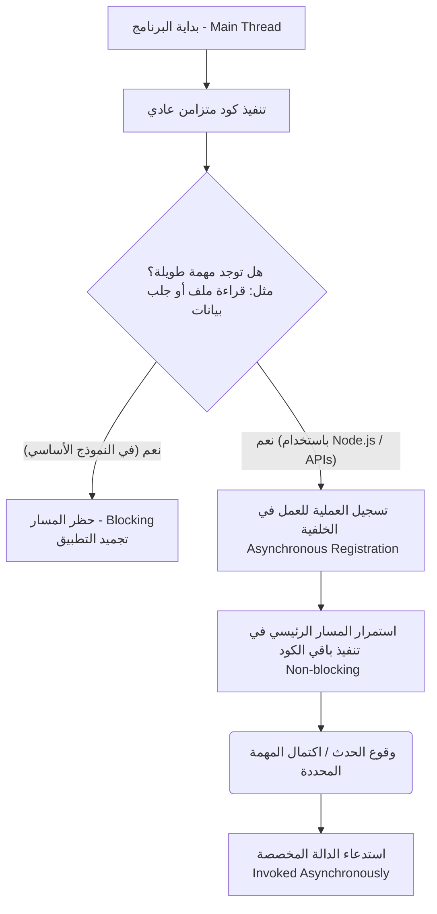

## جافاسكريبت غير المتزامنة (Asynchronous JavaScript)

### 1. التمهيد وموضوع المحاضرة (Introduction)

يعتبر هذا الدرس منعطفاً تأسيسياً سريعاً قبل العودة للتعمق في دراسة الوحدات المدمجة (Built-in Modules) في بيئة Node.js. الهدف من هذا الدرس هو فهم ماهية (What) ولماذا (Why) نحتاج إلى استخدام **جافاسكريبت غير المتزامنة (Asynchronous JavaScript)**، حيث يمثل هذا السلوك جوهر عمل بيئة Node.js والأساس الذي كُتبت به وحداتها المدمجة.

---

### 2. الطبيعة الأساسية للغة جافاسكريبت (The Basic Nature of JavaScript)

لفهم السلوك غير المتزامن، يجب أولاً فهم كيف تعمل لغة جافاسكريبت في شكلها الأساسي المجرد (Most basic form).

> `‏` **Important Note** **قاعدة جوهرية (Core Rule):** لغة جافاسكريبت في أساسها هي لغة **متزامنة (Synchronous)**، **حاجبة للتنفيذ (Blocking)**، و**أحادية المسار (Single-threaded)**.

لنفصل هذه المصطلحات الأكاديمية الثلاثة:

#### أ. متزامنة (Synchronous)

- **التعريف:** تعني أن الكود يُنفذ من الأعلى إلى الأسفل (Top-down)، بحيث يتم تنفيذ سطر واحد فقط في كل مرة.
- **مثال تطبيقي:** إذا كان لدينا دالتان تقومان بطباعة رسائل، فسيتم تنفيذ الكود بالترتيب؛ حيث تُطبع الرسالة `A` أولاً، ثم تليها الرسالة `B`.

#### ب. حاجبة للتنفيذ (Blocking)

- **التعريف:** بسبب طبيعة اللغة المتزامنة، مهما استغرقت العملية الحالية من وقت، فإن العملية التي تليها لن تبدأ أبداً حتى تنتهي العملية السابقة بالكامل.
- **حالة عملية (تجميد المتصفح):** إذا كان لدينا دالة `A` تحتوي على كود مكثف (Intensive chunk of code) يستغرق معالجته 10 ثوانٍ أو دقيقة كاملة، فإن جافاسكريبت مُجبرة على إنهائه قبل الانتقال للدالة `B`. في تطبيقات الويب، يتسبب هذا في تجميد المتصفح (Frozen) ومنعه من التعامل مع مدخلات المستخدم أو أداء مهام أخرى حتى تعيد تطبيقات الويب التحكم إلى المعالج. هذا ما يُعرف بـ **حظر التنفيذ (Blocking)**.

#### ج. أحادية المسار (Single-threaded)

- **التعريف والمصطلحات:** المسار (**Thread**) هو ببساطة عملية (Process) يستخدمها برنامج جافاسكريبت لتنفيذ مهمة معينة.
- **الفكرة الأساسية:** على عكس بعض لغات البرمجة الأخرى التي تدعم تعدد المسارات (Multi-threading) ويمكنها تشغيل مهام متعددة بالتوازي، تمتلك جافاسكريبت مساراً واحداً فقط يُسمى **المسار الرئيسي (Main Thread)** لتنفيذ أي كود. وفي هذا المسار، لا يمكن تنفيذ سوى مهمة واحدة في الوقت ذاته.

---

### 3. المشكلة الجوهرية للنموذج الأساسي (The Problem)

هذا النموذج الأساسي (الSyncronous، الBlocking، Single Thread) يخلق مشكلة ضخمة (Huge problem) عند بناء تطبيقات حقيقية.

**حالة عملية: جلب البيانات (Fetching Data)** تخيل أن لدينا مهمة لجلب بيانات من قاعدة بيانات (Database)، ثم تشغيل كود لمعالجة هذه البيانات المسترجعة.

- **السيناريو الأول (الانتظار):** سيتعين علينا الانتظار عند السطر الأول حتى يتم جلب البيانات، وهو أمر قد يستغرق ثانية أو أكثر. خلال هذا الوقت، سيُحظر الthread ولن نتمكن من تنفيذ أي كود آخر (Blocking).
- **السيناريو الثاني (تخطي الانتظار):** إذا مضت جافاسكريبت ببساطة للسطر التالي دون انتظار البيانات، فسنواجه **خطأ برمجياً (Error)**، لأن المتغير الذي يحمل البيانات أو الاستجابة (Response) لن يحتوي على ما نتوقعه.

---

### 4. الحل: السلوك غير المتزامن (Asynchronous Behavior)

نظراً للمشكلة السابقة، نحن بحاجة ماسة إلى طريقة لتحقيق سلوك غير متزامن (**Asynchronous Behavior**).

> `‏` **Important Note** **حقيقة تقنية هامة:** للإجابة على سؤال "كيف نطبق البرمجة غير المتزامنة؟"،  **"لغة جافاسكريبت وحدها لا تكفي لتحقيق ذلك (Just JavaScript is not enough)"**.

**كيف تعمل إذن؟** نحن بحاجة إلى أجزاء وتقنيات خارجية (Outside of JavaScript) لمساعدتنا في كتابة كود غير متزامن:

1. **في الواجهة الأمامية (Front-end):** يأتي دور متصفحات الويب (Web Browsers).
2. **في الواجهة الخلفية (Back-end):** يأتي دور بيئة **Node.js**.

**الآلية (The Mechanism):** تقوم المتصفحات وبيئة Node.js بتعريف دوال وواجهات برمجة تطبيقات (APIs) تسمح لنا بتسجيل (Register) دوال معينة بحيث لا يتم تنفيذها بشكل متزامن، بل يتم استدعاؤها **بشكل غير متزامن (Invoked asynchronously)** عندما يقع حدث (Event) معين.

**أمثلة على الأحداث التي تطلق السلوك غير المتزامن:**

1. مرور وقت معين (Passage of time).
2. تفاعل المستخدم مع الفأرة (Mouse interaction).
3. قراءة البيانات من نظام الملفات (Data being read from a file system).
4. وصول البيانات عبر الشبكة (Arrival of data over the network).

**الفائدة الجوهرية:** هذا الأسلوب يسمح للكود الخاص بك بالقيام بعدة أشياء في نفس الوقت دون إيقاف أو حظر **المسار الرئيسي (Main Thread)**.

---

### 5. جدول مقارنة: جافاسكريبت المتزامنة مقابل غير المتزامنة

|السمة (Feature)|جافاسكريبت المتزامنة (Synchronous JS)|جافاسكريبت غير المتزامنة (Asynchronous JS)|
|:--|:--|:--|
|**آلية التنفيذ**|سطر سطر من الأعلى للأسفل.|تسجيل المهام لتُنفذ لاحقاً عند وقوع حدث.|
|**حالة المسار (Thread)**|يتم حظره (Blocked) بالكامل أثناء المهام الطويلة.|يبقى حراً للعمل على مهام أخرى (Non-blocking).|
|**الاعتمادية البيئية**|تعمل بالاعتماد على محرك جافاسكريبت الأساسي فقط.|تعتمد على بيئات خارجية مثل Node.js أو المتصفحات (APIs).|
|**التأثير على تجربة الاستخدام**|قد تؤدي لتجميد التطبيق (App frozen) أثناء المعالجة المكثفة.|تحافظ على استجابة التطبيق وسلاسته.|

---

### 6. رسم توضيحي: دورة السلوك غير المتزامن في Node.js

---

### 7. الخلاصة والخطوات القادمة (Summary & Next Steps)

- **الخلاصة:** لغة جافاسكريبت في طبيعتها Asyncronous، Blocking ، Single thread. هذه الطبيعة غير مفيدة لبناء التطبيقات (Not beneficial for writing apps)، لذلك نلجأ إلى السلوك غير المتزامن غير الحاجب (Non-blocking asynchronous behavior) الذي توفره بيئة Node.js والمتصفحات. هذا النمط من البرمجة يعتبر أساسياً (Fundamental) وهو صميم الطريقة التي كُتبت بها الوحدات المدمجة في Node.js.
- **الخطوة القادمة:** بعد استيعاب هذه المفاهيم الجوهرية (مجموعات الأحرف، الترميز، التدفقات، المخازن المؤقتة، وجافاسكريبت غير المتزامنة)، أعلن المحاضر عن جاهزيتنا التامة للعودة إلى المسار الرئيسي لدراسة الوحدات المدمجة، حيث سيكون الدرس القادم مخصصاً لدراسة وحدة نظام الملفات (**fs Built-in Module**).
