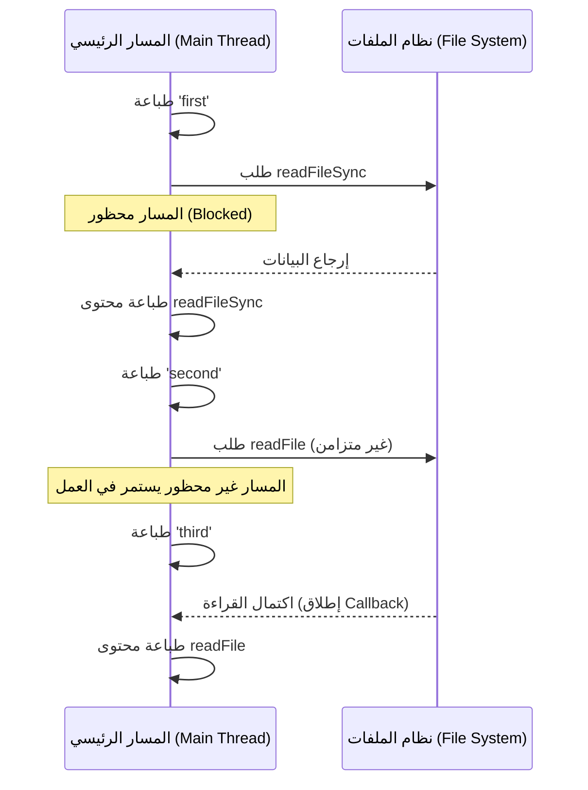

##  وحدة نظام الملفات (fs Module) في Node.js

### 1. المفهوم الأساسي: وحدة نظام الملفات (fs Module)

**التعريف:** وحدة **fs** (اختصاراً لـ File System) هي إحدى الوحدات المدمجة (Built-in Modules) في بيئة Node.js، والتي تتيح للمطورين التفاعل والعمل مع نظام الملفات الموجود على جهاز الحاسوب (قراءة، كتابة، تعديل الملفات).

**الفكرة الأساسية ولماذا نستخدمها؟** تطبيقات الواجهة الخلفية (Back-end) تحتاج باستمرار إلى قراءة بيانات من ملفات أو تخزين بيانات ومعلومات (مثل السجلات Logs أو الإعدادات) في ملفات. وحدة `fs` توفر جميع الدوال (Methods) اللازمة للقيام بهذه العمليات.

**خطوات الاستيراد الأساسية:** بما أنها وحدة مدمجة، يجب علينا استيرادها أولاً قبل استخدامها في الملف الرئيسي (مثل `index.js`).

`‏`**Step 1:** نستخدم دالة `require`. 
`‏`**Step 2:** نمرر اسم الوحدة مسبوقاً ببروتوكول `:node` كأفضل ممارسة.

```javascript
// استيراد وحدة نظام الملفات وتخزينها في ثابت
const fs = require('node:fs');
```

---

### 2. قراءة الملفات بشكل متزامن (Reading Files Synchronously)

#### دالة `readFileSync`

- **التعريف:** هي دالة تُستخدم لقراءة محتويات ملف معين بشكل متزامن (==Synchronous==).
- **كيف تعمل؟** تجبر محرك جافاسكريبت (JavaScript Engine) على التوقف والانتظار (Wait) حتى يتم قراءة محتويات الملف بالكامل قبل الانتقال لتنفيذ السطر التالي من الكود.
- **متى نستخدمها؟** نستخدمها فقط إذا كانت البيانات المقروءة أساسية وحتمية لتشغيل باقي التطبيق (مثال: قراءة ملف إعدادات التكوين Configuration data في بداية تشغيل التطبيق).
- **عيوبها:** في حال كان حجم الملف كبيراً، أو كان هناك عدد كبير من المستخدمين المتزامنين (Concurrent users)، فإن هذه الدالة ستؤدي إلى تجميد التطبيق وضعف شديد في الأداء.

> `‏` **Important Note** **تحذير في بيئة العمل:** بما أن جافاسكريبت تعمل بمسار أحادي (Single-threaded)، فإن استخدام `readFileSync` يؤدي إلى "حظر المسار الرئيسي" (Block the main thread). يُنصح بتجنبها في العمليات المتكررة أو أثناء استجابة التطبيق لطلبات المستخدمين حتى لا يتجمد التطبيق.

**المثال العملي (شرح الكود):** لدينا ملف اسمه `file.txt` يحتوي على النص `"hello code Evolution"`.

```javascript
// استدعاء الدالة المتزامنة وتمرير مسار الملف النسبي
// قمنا بتخزين النتيجة في الثابت fileContents
const fileContents = fs.readFileSync('./file.txt');

// طباعة النتيجة
console.log(fileContents);
```

**الارتباط بمفهوم المخازن المؤقتة (Buffers):** إذا قمنا بتشغيل الكود أعلاه كما هو، ستكون النتيجة المطبوعة عبارة عن **مخزن مؤقت ببيانات ثنائية (Buffer with binary data)**. لتحويل هذه البيانات الثنائية إلى نص مقروء للبشر (Human-readable format)، يجب أن نمرر **الترميز (Encoding)** كمعامل ثانٍ للدالة. تستخدم وحدة `fs` المخازن المؤقتة داخلياً لتمثيل البيانات المقروءة.

**الكود بعد التعديل:**

```javascript
// إضافة الترميز 'utf-8' كمعامل ثانٍ
const fileContents = fs.readFileSync('./file.txt', 'utf-8');
console.log(fileContents); // النتيجة: hello code Evolution
```

---

### 3. قراءة الملفات بشكل غير متزامن (Reading Files Asynchronously)

#### دالة `readFile`

- **التعريف:** هي النسخة غير المتزامنة (==Asynchronous==) لقراءة الملفات.
- **الفكرة الأساسية ولماذا نستخدمها؟** تسمح لبيئة Node.js بقراءة الملف في الخلفية دون حظر المسار الرئيسي (Without blocking the main thread).
- **كيف تعمل؟** تستقبل مسار الملف، والترميز، ودالة استدعاء عكسي (Callback function). عند اكتمال قراءة الملف، تقوم Node.js بتنفيذ دالة الاستدعاء العكسي لمعالجة البيانات.

>  `‏` **Important Note** **نمط هام جداً : Error-First Callback Pattern** الدوال غير المتزامنة في Node.js تعتمد غالباً على نمط يُسمى (نمط الCallback ذو الخطأ أولاً). هذا يعني أن المعامل الأول (First argument) لدالة الـ Callback يكون دائماً مُخصصاً للخطأ (`error`).
> 
> - إذا حدث خطأ (مثلاً الملف غير موجود): سيحتوي هذا الparameter على تفاصيل الخطأ.
> - إذا نجحت العملية: سيكون هذا الparameter مساوياً لـ `null`، ويتم تعبئة الparameter الثاني (`data`) بمحتويات الملف.

**المثال العملي (شرح الكود):**

```javascript
// استدعاء الدالة غير المتزامنة
fs.readFile('./file.txt', 'utf-8', (error, data) => {
    // التحقق من وجود خطأ أولاً (Error-First)
    if (error) {
        console.log(error); // طباعة الخطأ إن وُجد
    } else {
        console.log(data); // طباعة محتويات الملف في حال النجاح
    }
});
```

---

### 4. التجربة العملية: إثبات السلوك غير المتزامن

لفهم كيف تتصرف Node.js وتثبت أن التطبيق لا يتجمد (App will not freeze)، سوف نضيف أوامر طباعة (Log statements) قبل وبين وبعد عمليات قراءة الملفات:

```javascript
console.log('first'); // 1

// القراءة المتزامنة (حاجبة للتنفيذ)
const fileContents = fs.readFileSync('./file.txt', 'utf-8');
console.log(fileContents); // 2

console.log('second'); // 3

// القراءة غير المتزامنة (غير حاجبة للتنفيذ)
fs.readFile('./file.txt', 'utf-8', (error, data) => {
    if (error) {
        console.log(error);
    } else {
        console.log(data); // 5 (تُنَفذ لاحقاً بعد انتهاء القراءة)
    }
});

console.log('third'); // 4
```

**الترتيب الفعلي للمخرجات (Execution Order):**

1.`‏` `first`
1.`‏` `hello code Evolution` (نتيجة القراءة المتزامنة التي أوقفت الكود حتى انتهت).
1. `‏``second`
2. `‏``third` (تم طباعتها فوراً بينما كانت القراءة غير المتزامنة تعمل في الخلفية).
3. `‏``hello code Evolution` (نتيجة القراءة غير المتزامنة، حيث استدعت Node.js دالة الـ Callback بعد أن أصبح الملف جاهزاً، حتى لو استغرق الأمر 5 ثوانٍ، فلن يتوقف باقي الكود).

**رسم توضيحي لتدفق التنفيذ (Execution Flow):**



---

### 5. كتابة الملفات (Writing Files)

كما في القراءة، تقدم وحدة `fs` نسختين لكتابة البيانات في الملفات.

#### أ. الكتابة بشكل متزامن (`writeFileSync`)

- **كيف تعمل:** تستقبل مسار الملف كparameter أول، والمحتوى النصي كمعامل ثانٍ.
- **ملاحظات هامة:**
    - إذا كان الملف غير موجود، ستقوم Node.js بإنشائه تلقائياً (Creates a new file).
    - إذا كان الملف موجوداً مسبقاً، ستقوم Node.js **بالكتابة فوقه ومسح محتواه القديم** (Overwrites the contents).

```javascript
// إنشاء ملف greet.txt وكتابة النص داخله بشكل متزامن
fs.writeFileSync('./greet.txt', 'hello world');
```

#### ب. الكتابة بشكل غير متزامن (`writeFile`)

- **كيف تعمل:** تستقبل مسار الملف، المحتوى، ثم دالة استدعاء عكسي (Callback) للتعامل مع النتيجة (أو الخطأ).

```javascript
// كتابة ملف بشكل غير متزامن
fs.writeFile('./greet.txt', 'hello vishwas', (error) => {
    if (error) {
        console.log(error);
    } else {
        console.log("File written"); // تأكيد نجاح العملية
    }
});
```

---

### 6. الإضافة للملف بدلاً من الكتابة فوقه (Appending to files)

**المشكلة:** افتراضياً، دوال الكتابة (`writeFile` و `writeFileSync`) تقوم بحذف المحتوى القديم وكتابة محتوى جديد (Overwrite). **الحل:** إذا أردنا الاحتفاظ بالمحتوى القديم وإضافة نص جديد إليه (Append)، يجب تمرير **كائن خيارات (Options object)** كparameter ثالث، وتحديد قيمة الخاصية `flag` لتكون `'a'` (اختصاراً لـ append).

```javascript
// إضافة النص للملف الموجود مع وضع علامة append
fs.writeFile('./greet.txt', ' hello vishwas', { flag: 'a' }, (error) => {
    if (error) {
        console.log(error);
    } else {
        console.log("File written");
    }
});
```

النتيجة في الملف: سيكون المحتوى النهائي `hello world hello vishwas` بدلاً من استبدال النص الأول.

---

### 7. جدول مقارنة: قراءة الملفات (Sync vs Async)

|وجه المقارنة (Feature)|القراءة المتزامنة (`readFileSync`)|القراءة غير المتزامنة (`readFile`)|
|:--|:--|:--|
|**طبيعة التنفيذ**|حاجبة للتنفيذ (Blocking).|غير حاجبة للتنفيذ (Non-blocking).|
|**المعاملات (Arguments)**|مسار الملف، الترميز (اختياري).|مسار الملف، الترميز (اختياري)، دالة Callback.|
|**الاسترجاع (Return)**|تُرجع محتوى الملف مباشرة لمتغير.|لا تُرجع شيئاً للمتغير، بل تمرر البيانات لـ Callback.|
|**الأداء**|سيء مع الملفات الكبيرة والمستخدمين المتعددين.|**ممتاز (موصى به)** لتطبيقات الويب والمستخدمين المتعددين.|

---

### 8. الخلاصة وتمهيد للدرس القادم

- تعتمد Node.js على وحدة `fs` للتعامل مع نظام الملفات.
- الدوال المتزامنة (بلاحقة `Sync`) توقف تنفيذ الكود، بينما الدوال غير المتزامنة تعتمد على دوال الاستدعاء العكسي (Callbacks) لتجنب تجميد التطبيق.
- نستخدم ترميز `utf-8` لتحويل البيانات الثنائية (Buffers) لنصوص مقروءة.
- يمكننا استخدام `flag: 'a'` لمنع الكتابة فوق الملفات وإضافة نصوص جديدة إليها.
- **تمهيد:** أشار المحاضر إلى أن الاعتماد على نمط الـ Callbacks يفي بالغرض، لكن Node.js قدمت نسخة مبنية على **الوعود (Promises)** لوحدة `fs` لتسهيل كتابة الكود، وهو ما سيكون موضوع الدرس القادم.