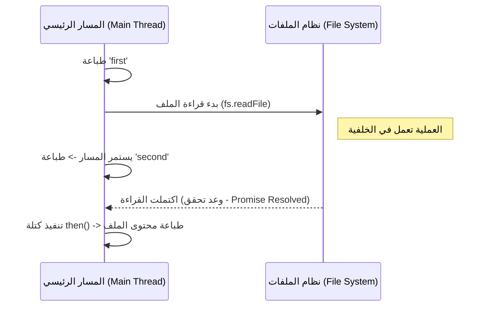

## وحدة نظام الملفات المعتمدة على الوعود (fs Promise Module) في Node.js

### 1. المفهوم الأساسي: وحدة (fs Promise Module)

**التعريف:** وحدة **fs Promise Module** هي النسخة الحديثة والمعتمدة على الوعود (**Promises**) من وحدة نظام الملفات المدمجة (`fs`) في بيئة Node.js.

**الفكرة الأساسية:** بدلاً من الاعتماد على دوال ال (**Callbacks**) للتعامل مع القراءة والكتابة غير المتزامنة للملفات، تستخدم هذه الوحدة تقنية الوعود (**Promises**)، مما يسمح بالتعامل مع العمليات غير المتزامنة بطريقة أكثر تنظيماً وتسلسلاً.

**لماذا ومتى نستخدمها؟**

- تُستخدم للتعامل مع الملفات (قراءة، كتابة، إلخ) دون حظر الthread الرئيسي (Non-blocking).
- من الشائع جداً مقابلتها في بيئات العمل الحديثة (Recent code bases).
- تُستخدم بشكل خاص ومكثف عند العمل مع وحدات إكما سكريبت (**ES Modules**).

**مميزاتها:** تجعل الكود نظيفاً ومقروءاً بشكل أسهل بكثير (Easier to read) مقارنة بنمط الـ Callbacks الذي قد يؤدي إلى تعقيد الكود وتداخله.

**عيوبها :** تستهلك قدراً أعلى بقليل جداً من الموارد (وقت التنفيذ وتخصيص الذاكرة) مقارنة بالنسخة التقليدية المعتمدة على ال (Callback-based version).

---

### 2. الخطوات العملية: استخدام الوعود مع (then / catch)

للانتقال من وحدة `fs` التقليدية إلى النسخة المعتمدة على الوعود، نتبع الخطوات التالية:

`‏`**Step 1: استيراد الوحدة (Importing the Module)** يجب تعديل مسار الاستيراد ليُشير صراحةً إلى مجلد الوعود.

```javascript
// نقوم بإلحاق /promises بمسار الوحدة المدمجة
const fs = require('node:fs/promises');
```

`‏`**Step 2: قراءة الملف ومعالجة الوعد (Reading File & Handling Promise)** نستخدم دالة `readFile`، وبما أنها تُرجع وعداً (Promise)، نستخدم كتلتي `.then()` و `.catch()` لمعالجة النتيجة.

```javascript
// 1. استدعاء الدالة وتمرير اسم الملف والترميز
fs.readFile('file.txt', 'utf-8')
    // 2. كتلة then تُستدعى عندما ينجح الوعد (Resolves successfully)
    .then((data) => {
        console.log(data); // طباعة محتويات الملف
    })
    // 3. كتلة catch تُستدعى عندما يفشل الوعد (Rejects with an error)
    .catch((error) => {
        console.log(error); // طباعة الخطأ
    });
```

شرح  الكود:

- الدالة `readFile` تبدأ عملية قراءة الملف في الخلفية وتُرجع "وعداً".
- إذا تمت القراءة بنجاح، يتم استدعاء دالة `then` ونحصل على البيانات (data) لطباعتها.
- إذا حدث خطأ (مثلاً الملف غير موجود)، يتم استدعاء دالة `catch` للتعامل مع الخطأ.

---

### 3. إثبات السلوك غير المتزامن (Proving Asynchronous Behavior)

كما هو الحال مع الـ Callbacks، فإن وحدة الpromises لا تحظر التنفيذ (Non-blocking). لإثبات ذلك، سنقوم  بتجربة إضافة أوامر طباعة قبل وبعد استدعاء دالة قراءة الملف:

```javascript
console.log('first'); // يطبع أولاً

fs.readFile('file.txt', 'utf-8')
    .then((data) => console.log(data)) // يطبع ثالثاً (عند اكتمال القراءة)
    .catch((error) => console.log(error));

console.log('second'); // يطبع ثانياً
```

**كيف تعمل بيئة Node.js هنا؟**

1. تبدأ Node.js بقراءة الملف، وتضع هذه العملية "جانباً" (Set it aside) في الخلفية.
2. يسمح هذا لل thread الرئيسي بمواصلة تنفيذ الكود المتبقي (طباعة `second`).
3. عند اكتمال قراءة الملف تماماً، تقوم Node.js بتنفيذ كتلة `then` (أو `catch`).
4. **الفائدة العملية:** بفضل هذا النهج غير المتزامن، لن يتجمد تطبيقك (App will not freeze) عندما يتفاعل عدة مستخدمين مع التطبيق في نفس الوقت.
#### رسم توضيحي: مسار التنفيذ باستخدام الوعود



---

### 4. استخدام نمط (Async / Await) المتقدم

**التعريف:** نمط **Async / Await** هو ببساطة "غلاف شكلي" (Syntactical wrapper) مبني فوق الوعود (Promises)، يُستخدم لجعل الكود غير المتزامن يبدو وكأنه متزامن، مما يسهل قراءته بشكل كبير.

> `‏` **Important Note** **ملاحظة وخطأ شائع (Top-level Await Constraint):** لا يمكنك استخدام الكلمة المفتاحية `await` بشكل مباشر ومستقل في الملف العادي (Top-level)، لأنها مدعومة فقط داخل وحدات إكما سكريبت (الملفات بامتداد `.mjs`). **الحل في CommonJS:** لتجنب الأخطاء، يجب تغليف الكود داخل "دالة غير متزامنة" (`async function`).

**التطبيق العملي (كتابة الكود خطوة بخطوة):**

```javascript
const fs = require('node:fs/promises');

// 1. إنشاء دالة تحمل الكلمة المفتاحية async
async function readFile() {
    // 2. استخدام كتلتي try و catch لاصطياد الأخطاء
    try {
        // 3. استخدام الكلمة المفتاحية await لانتظار حل الوعد
        const data = await fs.readFile('file.txt', 'utf-8');
        console.log(data); // طباعة البيانات في حال النجاح
    } catch (error) {
        // 4. معالجة الخطأ إن حدث
        console.log(error);
    }
}

// 5. استدعاء الدالة لتشغيلها
readFile();
```

شرح  الكود: هذا الكود يقوم بنفس وظيفة كتلتي `.then` و `.catch` تماماً، المخرجات ستكون `hello code evolution`. ولكن من منظور هندسة البرمجيات، هذا الكود أسهل في القراءة والتتبع المنطقي.

![[Pasted image 20260714115436.png]]
![[Pasted image 20260714115514.png]]

---

### 5. جدول مقارنة: Callbacks مقابل Promise APIs في وحدة `fs`

لتحديد الأداة المناسبة لتطبيقك، لخص المحاضر الفروق الجوهرية كالتالي:

| وجه المقارنة (Feature)                  | نسخة الاستدعاء العكسي (Callback-based `fs`)                 | نسخة الوعود (Promise-based `fs/promises`)                                |
| :-------------------------------------- | :---------------------------------------------------------- | :----------------------------------------------------------------------- |
| **طريقة الاستيراد**                     | `require('node:fs')`                                        | `require('node:fs/promises')`                                            |
| **سهولة القراءة (Readability)**         | قد تكون معقدة (خاصة عند تداخل الاستدعاءات Callback hell).   | أسهل جداً في القراءة، خاصة مع `async/await`.                             |
| **الأداء (Performance)**                | **الأفضل (Maximal Performance)**.                           | أقل بشكل طفيف جداً بسبب الغلاف الإضافي.                                  |
| **استهلاك الذاكرة (Memory Allocation)** | أقل استهلاكاً.                                              | يستهلك ذاكرة أعلى قليلاً لإنشاء ال promise object.                       |
| **توصية المحاضر (Recommendation)**      | تُستخدم فقط إذا كان "الأداء الأقصى" هو أولوية حرجة للتطبيق. | **مُوصى باستخدامها دائماً** إذا لم يكن الأداء الاستثنائي مصدر قلق رئيسي. |

---

### 6. الخلاصة والخطوة القادمة

- توفر Node.js نسخة حديثة من وحدة الملفات تسمى `fs/promises` لتجنب تعقيد الـ Callbacks.
- تتيح هذه الوحدة استخدام `()then.` و `()catch.` لمعالجة العمليات دون إيقاف التطبيق.
- يُعتبر استخدام نمط `async/await` بداخل كتل `try/catch` هو الطريقة الأنظف والأحدث لكتابة هذا الكود.
- في بيئات العمل التي تتطلب أداءً حرجاً (Critical performance)، تظل نسخة الـ Callbacks هي الأفضل، وفيما عدا ذلك، يُنصح بشدة باستخدام الـ Promises.
- **الخطوة القادمة:** بعد فهم كيفية التعامل مع الملفات، سينتقل المحاضر في الدرس القادم إلى دمج هذا الفهم مع مفاهيم التدفقات والأنابيب (**Streams and Pipes**) في بيئة Node.js.