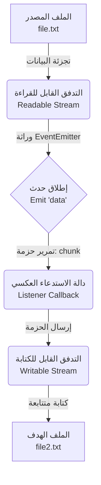

##  التدفقات (Streams) في Node.js 

### 1. المفهوم الأساسي: التدفقات (Streams)

**التعريف:** التدفق (**Stream**) هو عبارة عن تسلسل من البيانات (Sequence of data) التي يتم نقلها من نقطة إلى أخرى بمرور الوقت.

**الفكرة الأساسية (كيف تعمل؟):** بدلاً من انتظار توفر حجم البيانات بالكامل في الذاكرة دفعة واحدة لمعالجتها، تعتمد التدفقات على تقسيم البيانات ومعالجتها على شكل **حزم أو أجزاء (Chunks)** متتالية.

**لماذا ومتى نستخدمها؟ (الفوائد):**

- **توفير الذاكرة (Memory Efficiency):** تمنع الاستخدام غير الضروري للذاكرة المؤقتة (Temporary memory). فعند التعامل مع ملفات ضخمة (حجمها بالميجابايت)، لا نضطر لتحميل الملف كاملاً في الذاكرة.
- **توفير الوقت (Time Efficiency):** يبدأ التطبيق في معالجة البيانات فور وصول الحزمة الأولى (First chunk) دون انتظار بقية الملف.
- تُستخدم بكثرة عند نقل البيانات بين الملفات، أو في طلبات واستجابات الشبكة.

> `‏` **Important Note** **معلومة هندسية جوهرية:** وحدة التدفقات (Streams) هي في الواقع "وحدة مدمجة" (Built-in module) في Node.js ترث وتتوسع (Inherits) من فئة **`EventEmitter`**. نحن كمطورين نادراً ما نستخدم وحدة الstream  بشكل مباشر ومستقل، بل نستخدمها من خلال الوحدات المدمجة الأخرى (مثل وحدة `fs` و `http`) التي تستخدم الstream داخلياً (Internally) لأداء وظائفها.

---

### 2. التشبيه العملي (Real-World Analogy)

**حالة النقل بين الملفات:** إذا أردت نقل محتويات من (`file.txt`) إلى (`file2.txt`) داخل نفس الحاسوب:

- **الطريقة العادية (بدون Streams):** يجب أن تنتظر قراءة محتوى (`file.txt`) بالكامل وتخزينه في الذاكرة المؤقتة، ثم نقله دفعة واحدة إلى (`file2.txt`).
- **طريقة التدفقات (Streams):** يتم نقل المحتوى في شكل حزم (Chunks) بمرور الوقت. بمجرد قراءة حزمة من الملف الأول، يتم كتابتها فوراً في الملف الثاني، مما يفرغ الذاكرة لاستقبال الحزمة التالية.

---

### 3. التطبيق العملي: استخدام التدفقات مع وحدة نظام الملفات (fs Module)

لفهم كيفية استخدام التدفقات، سنقوم ببناء كود لنقل محتوى ملف إلى آخر.

**الخطوات العملية:**

`‏`**Step 1: استيراد الوحدة وإنشاء تدفق قابل للقراءة (Readable Stream)** نستخدم طريقة `createReadStream` لقراءة البيانات على شكل حزم.

```javascript
const fs = require('node:fs');

// إنشاء تدفق للقراءة من file.txt مع تحديد الترميز
const readableStream = fs.createReadStream('./file.txt', {
    encoding: 'utf-8'
});
```

`‏`**Step 2: إنشاء تدفق قابل للكتابة (Writable Stream)** نستخدم طريقة `createWriteStream` لاستقبال البيانات وكتابتها.

```javascript
// إنشاء تدفق للكتابة في file2.txt
const writableStream = fs.createWriteStream('./file2.txt');
```

`‏`**Step 3: الاستماع لحدث البيانات (Listening to 'data' event)** بما أن التدفقات ترث من فئة `EventEmitter`، فإن التدفق القابل للقراءة يُطلق حدثاً يُسمى **`data`** كلما وصلت حزمة (Chunk) جديدة من البيانات.

```javascript
// تسجيل مستمع (Listener) للحدث 'data'
readableStream.on('data', (chunk) => {
    console.log(chunk); // طباعة الحزمة الحالية
    writableStream.write(chunk); // كتابة الحزمة الحالية في الملف الثاني
});
```

كيف يعمل الكود؟ عند تشغيل الملف، ستبدأ بيئة Node.js بقراءة الملف الأول، وكلما توفرت حزمة بيانات، ستُطلق حدث `data`، وتمرر هذه الحزمة لدالة الـ Callback لتقوم بكتابتها في الملف الثاني.

---

### 4. التحكم في حجم الحزمة والمخزن المؤقت (Buffer Size & highWaterMark)

**المشكلة: (لماذا ظهرت البيانات كحزمة واحدة؟)** إذا كان الملف الأول يحتوي على نص قصير مثل `"hello code evolution"` (والذي يتكون من 18 حرفاً، أي 18 بايت)، فإن الكود السابق سيطبع النص بالكامل دفعة واحدة ولن نلاحظ فكرة الـ (Chunks).

- **السبب:** الحجم الافتراضي (Default size) للمخزن المؤقت (Buffer) الذي تستخدمه التدفقات هو **64 كيلوبايت (==64 kilobytes==)**. بما أن 18 بايت أصغر بكثير من 64 كيلوبايت، فإن الملف بأكمله اتسع داخل حزمة واحدة.

**الحل: استخدام خاصية `highWaterMark`** للتحكم في حجم الحزمة التي يتم نقلها، يمكننا إضافة خيار `highWaterMark` داخل كائن الخيارات (Options object) عند إنشاء التدفق.

**الكود المُعدّل:**

```javascript
// تحديد حجم الحزمة ليكون 2 بايت فقط
const readableStream = fs.createReadStream('./file.txt', {
    encoding: 'utf-8',
    highWaterMark: 2
});
```

_النتيجة:_ عند تشغيل الكود الآن، سيقوم التطبيق بطباعة النص على شكل مقاطع مكونة من حرفين فقط في كل مرة (مثل: `he`, `ll`, `o` ...إلخ)، مما يُثبت عملياً أن البيانات تتدفق في حزم صغيرة بمرور الوقت.

---

### 5. أنواع التدفقات في Node.js (Types of Streams)

أوضح المحاضر أن هناك **أربعة أنواع رئيسية (4 Types)** من التدفقات في Node.js، وكل منها يخدم غرضاً محدداً:

1. **التدفقات القابلة للقراءة (Readable Streams):**
    
    - **التعريف:** تدفقات يتم قراءة البيانات منها.
    - **مثال:** قراءة ملف باستخدام وحدة `fs`، أو طلبات الشبكة (HTTP Request) التي نستقبل عبرها البيانات.
2. **التدفقات القابلة للكتابة (Writable Streams):**
    
    - **التعريف:** تدفقات يتم كتابة وإرسال البيانات إليها.
    - **مثال:** كتابة البيانات في ملف، أو استجابات الشبكة (HTTP Response) التي نرسل عبرها البيانات للعميل.
3. **التدفقات المزدوجة (Duplex Streams):**
    
    - **التعريف:** تدفقات تمتلك القدرتين معاً (مقروءة ومكتوبة في نفس الوقت).
    - **مثال:** مقابس الاتصال الشبكي (Sockets).
4. **تدفقات التحويل (Transform Streams):**
    
    - **التعريف:** نوع خاص من التدفقات المزدوجة، يتيح لك "تعديل أو تحويل" (Modify or transform) البيانات أثناء قراءتها وكتابتها.
    - **مثال:** ضغط الملفات (File compression)؛ حيث يتم قراءة بيانات، ثم ضغطها (تحويلها)، ثم كتابتها كبيانات مضغوطة.

---

### 6. جدول مقارنة: أنواع التدفقات الأربعة

| نوع التدفق (Stream Type) |          الوظيفة (Functionality)          |           مثال تطبيقي (Example)           |
| :----------------------: | :---------------------------------------: | :---------------------------------------: |
|       **Readable**       |    قراءة البيانات كحزم (Read chunks).     |  `fs.createReadStream()`, `HTTP Request`  |
|       **Writable**       |    كتابة البيانات كحزم (Write chunks).    | `fs.createWriteStream()`, `HTTP Response` |
|        **Duplex**        |    قراءة وكتابة البيانات معاً (Both).     |      Network Sockets (مقابس الشبكة)       |
|      **Transform**       | قراءة، تحويل، ثم كتابة البيانات (Modify). |    فك وضغط الملفات (File Compression)     |

---

### 7. رسم توضيحي: مسار البيانات في التدفقات ووحدة الأحداث

يوضح هذا الرسم البياني كيف تتكامل وحدة نظام الملفات (`fs`) مع التدفقات (Streams) ووحدة الأحداث (`EventEmitter`) لنقل البيانات:

