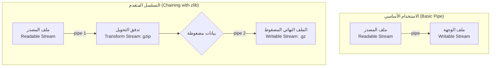

## المرجع الدراسي الاحترافي: الأنابيب (Pipes) في Node.js

### 1. التمهيد والسياق (Context)

في الدرس السابق، درسنا مفهوم التدفقات (**Streams**) في سياق قراءة وكتابة محتويات الملفات. استخدمنا دالة `createReadStream` لإنشاء تدفق قابل للقراءة (Readable Stream) من ملف، ودالة `createWriteStream` لإنشاء تدفق قابل للكتابة (Writable Stream) إلى ملف. 
لربط الاثنين، قمنا بالاستماع إلى الحدث `data` لكتابة الحزم (Chunks) يدوياً. نظراً لأن هذا النمط (قراءة ثم كتابة) شائع جداً في البرمجة، توفر بيئة Node.js طريقة أسهل، أبسط، وأكثر كفاءة للقيام بنفس المهمة، وهي استخدام **الأنابيب (Pipes)**.

---

### 2. المفهوم الأساسي: الأنابيب (Pipes)

**التعريف:**
الأنبوب (**Pipe**) هو دالة أو طريقة (Method) مدمجة في بيئة Node.js تُستخدم لأخذ البيانات من تدفق قابل للقراءة (Readable Stream) وتوصيلها وتمريرها مباشرة إلى تدفق قابل للكتابة (Writable Stream) بخطوة واحدة برمجية.

**التشبيه العملي (Real-World Analogy):**
لفهم المفهوم بعيداً عن المصطلحات التقنية، تخيل أنبوب مياه يربط بين خزان مياه (Tank) وحوض مطبخ (Kitchen Sink):
- **الخزان (Tank):** يغذي الأنبوب بالماء (يمثل التدفق القابل للقراءة - Readable Stream).
- **الأنبوب (Pipe):** ينقل الماء.
- **الحوض (Sink):** يستقبل الماء المتدفق عبر الصنبور (يمثل التدفق القابل للكتابة - Writable Stream).
تماماً مثل هذا التشبيه، الأنبوب في Node.js يقرأ البيانات من المصدر ويكتبها في الوجهة بسلاسة.

**لماذا نستخدمها؟ (المميزات):**
- استبدال كتابة كود معقد (الاستماع للأحداث ومعالجة الحزم يدوياً) بسطر برمجي واحد.
- إدارة تدفق البيانات بكفاءة عالية خلف الكواليس.

---

### 3. التطبيق العملي: الاستخدام الأساسي للأنبوب

لتحويل الكود من الاعتماد على الحدث `data` إلى استخدام طريقة `pipe`، نقوم بالآتي:

**الخطوات:**
-`‏` **Step 1:** نقوم بتعليق (Comment out) أو حذف الكود القديم الخاص بالاستماع لحدث `data`.
-`‏` **Step 2:** نستخدم دالة `pipe` مباشرة على التدفق القابل للقراءة، ونمرر لها التدفق القابل للكتابة كمعامل (Argument).

**الكود البرمجي (في ملف `index.js`):**

```javascript
// بافتراض أننا أنشأنا التدفقين مسبقاً باستخدام وحدة fs
// const readableStream = fs.createReadStream('./file.txt');
// const writableStream = fs.createWriteStream('./file2.txt');

// بدلاً من الاستماع لحدث 'data'، نستخدم سطر واحد فقط:
readableStream.pipe(writableStream);
```
شرح الكود:
هذا السطر الوحيد يقوم تلقائياً بقراءة الحزم من `readableStream` وكتابتها في `writableStream`. عند تشغيل الملف، ستجد أن محتوى الملف الأول قد نُسخ بالكامل إلى الملف الثاني تماماً كما حدث في الدرس السابق.

---

### 4. ميزة التسلسل (Chaining) وشروطها

**الفكرة الأساسية:**
الميزة الأقوى لدالة `pipe` هي أنها **تُرجع التدفق الوجهة (Returns the destination stream)**. هذا السلوك يسمح لنا بربط عدة أنابيب ببعضها البعض، وهو ما يُعرف بـ **التسلسل (Chaining)**.

> `‏` **Important Note**
> **الشرط الجوهري لاستخدام التسلسل (Chaining Condition):**
> لكي تتمكن من استخدام `()pipe.` مرة أخرى لربط تدفق ثالث، **يجب** أن يكون التدفق الوجهة (Destination Stream) في الأنبوب الأول من نوع:
> 1. قابل للقراءة (**Readable**)
> 2. مزدوج (**Duplex**)
> 3. تدفق تحويل (**Transform Stream**)

> **الخطأ الشائع:** لا يمكنك استخدام التسلسل إذا كان التدفق الوجهة هو تدفق قابل للكتابة فقط (Writable Stream)، لأنه يستقبل البيانات ولا يخرجها، وبالتالي لا يمكن للأنبوب التالي أن يقرأ منه.

---

### 5. وحدة الضغط (zlib Module) وتدفقات التحويل

لشرح وتطبيق ميزة "التسلسل" برمجياً، قدم المحاضر وحدة مدمجة جديدة في Node.js تُسمى `zlib`.

**التعريف بوحدة `zlib`:**
هي وحدة مدمجة توفر وظائف لضغط الملفات (Compression functionality) باستخدام خوارزمية تُسمى **gzip**. بعبارة أبسط، تُستخدم لإنشاء ملفات مضغوطة (Zipped files).

**لماذا استخدمناها في هذا الدرس؟**
تتميز وحدة `zlib` بأنها تحتوي على **تدفق تحويل (Transform Stream)** مدمج. وكما تعلمنا، فإن Transform Stream هو نوع يقبل البيانات، يُعدلها (يضغطها هنا)، ثم يُخرجها. وبما أنه يُخرج البيانات، فهو يحقق شرط **التسلسل (Chaining)** المذكور أعلاه.

---

### 6. التطبيق المتقدم: التسلسل لإنشاء ملف مضغوط

الهدف من هذا الكود هو قراءة ملف نصي، ضغط محتواه أثناء التدفق، ثم كتابة النتيجة في ملف مضغوط جديد.

**الخطوات:**
- **Step 1:** استيراد الوحدات اللازمة (`fs` و `zlib`).
- **Step 2:** إنشاء تدفق التحويل الخاص بالضغط باستخدام `zlib.createGzip()`.
- **Step 3:** ربط التدفقات ببعضها (القراءة -> الضغط -> الكتابة) باستخدام التسلسل (Chaining).

**الكود البرمجي المتقدم:**

```javascript
const fs = require('node:fs');
const zlib = require('node:zlib'); // 1. استيراد وحدة الضغط

// 2. إنشاء تدفق تحويل (Transform Stream) باستخدام خوارزمية gzip
const gzip = zlib.createGzip();

// 3. إنشاء التدفق القابل للقراءة
const readableStream = fs.createReadStream('./file.txt', 'utf-8');

// 4. عملية التسلسل (Chaining):
readableStream
    .pipe(gzip) // الأنبوب الأول: يمرر البيانات من الملف إلى دالة الضغط (Transform Stream)
    .pipe(fs.createWriteStream('./file2.txt.gz')); // الأنبوب الثاني: يأخذ البيانات المضغوطة ويكتبها في ملف نهائي
```
شرح الآلية خلف الكواليس:
1. يقوم `readableStream` بقراءة البيانات الخام من `file.txt`.
2. الدالة `pipe(gzip).` تأخذ هذه البيانات وتمررها لتدفق التحويل (gzip). بما أن `gzip` هو Transform Stream، فإنه يقوم بضغط البيانات، وتُرجع الدالة هذا التدفق المضغوط.
3. نظراً لأن الدالة أرجعت تدفقاً يمكن القراءة منه، نستخدم `()pipe.` مرة أخرى لتمرير هذه البيانات المضغوطة إلى `fs.createWriteStream` الذي يقوم بحفظها في ملف بامتداد `.gz` .

---

### 7. رسم توضيحي: الفرق بين الأنبوب البسيط والأنبوب المتسلسل

يوضح الرسم التالي التدفق المنطقي للبيانات في كلا الحالتين اللتين تمت دراستهما في هذا الدرس:



---

### 8. الخلاصة والتمهيد للدرس القادم

- الأنابيب (Pipes) توفر طريقة أنيقة وفعالة لربط تدفقات القراءة والكتابة بسطر برمجي واحد.
- ميزة التسلسل (Chaining) تجعل من السهل معالجة البيانات على مراحل (مثل القراءة، ثم الضغط، ثم الكتابة).
- يجب مراعاة أنواع التدفقات (Readable, Writable, Transform) عند التخطيط لربط الأنابيب.
- **تمهيد:** بانتهاء هذا الدرس، نكون قد انتهينا من جزء كبير من الوحدات المدمجة، ويتبقى لنا دراسة الوحدة الأهم لبناء خوادم الويب، وهي وحدة **HTTP Module**، والتي سيتم تناولها في الدرس القادم.

