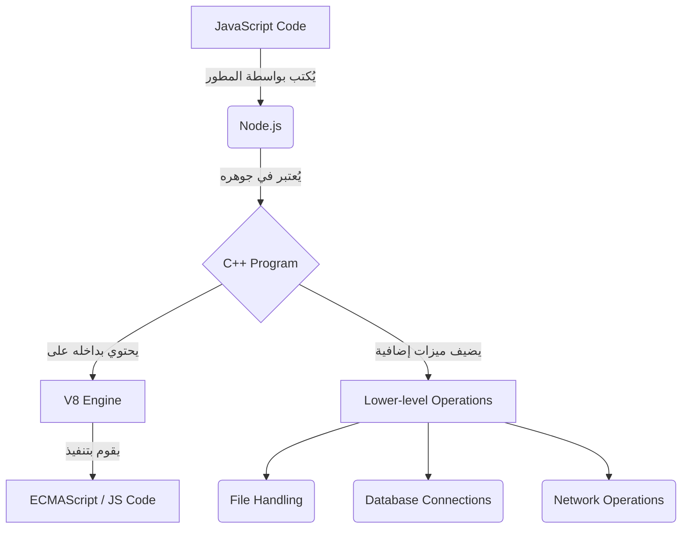

##  محرك V8 الخاص بجوجل وبنية Node.js (Chrome's V8 Engine)

### 1. مفهوم محرك جافاسكريبت (JavaScript Engine)

**التعريف:** هو برنامج حاسوبي (Program) وظيفته تحويل الكود المصدري للغة جافاسكريبت (**JavaScript code**) الذي يكتبه المطورون إلى لغة الآلة (**Machine code**).

**الفكرة الأساسية ولماذا نستخدمه؟** لا يستطيع جهاز الكمبيوتر قراءة أو فهم لغة جافاسكريبت بشكل مباشر. لذلك، نحتاج إلى هذا المحرك كـ "مترجم" لكي يسمح للكمبيوتر بتنفيذ المهام المحددة في الكود. باختصار، وظيفة المحرك هي تشغيل وتنفيذ أكواد جافاسكريبت (**Execute JavaScript code**).

**ملاحظات مهمة:** عادةً ما يتم تطوير محركات جافاسكريبت من قِبل الشركات المطورة لمتصفحات الويب (**Web browser vendors**)، حيث يمتلك كل متصفح رئيسي محركاً خاصاً به مبنياً بداخله.

---

### 2. مقارنة: محركات جافاسكريبت في المتصفحات الرئيسية

هذه قائمة بأشهر المحركات وارتباطها بالمتصفحات كما يلي:

|المتصفح (Web Browser)|محرك جافاسكريبت (JavaScript Engine)|المطور (Developer)|
|:--|:--|:--|
|**Chrome**|**V8** (محور اهتمامنا)|Google|
|**Firefox**|**SpiderMonkey**|Mozilla|
|**Safari**|**JavaScriptCore**|Apple|
|**Original Edge**|**Chakra**|Microsoft|

---

### 3. محرك V8 (Google's V8 Engine)

**التعريف:** هو محرك جافاسكريبت مفتوح المصدر (**Open source JavaScript engine**) تم إنشاؤه وتطويره بواسطة شركة **Google** في عام 2008 لصالح متصفح Chrome.

**الخصائص الجوهرية لمحرك V8:** بالرجوع إلى الريبو الرسمي للمحرك على **GitHub** (v8.dev)، نستخلص أربع حقائق أساسية:

1. **مفتوح المصدر:** الكود المصدري متاح للعامة.
2. **تطبيق المعايير القياسية:** يقوم المحرك بتطبيق لغة **ECMAScript** تماماً كما هو منصوص عليه في المواصفات القياسية **ECMA-262**.
3. **لغة البرمجة المستخدمة في بناءه:** تمت كتابة محرك V8 باستخدام لغة ==**C++**== وليس لغة جافاسكريبت.
4. **طبيعة التشغيل:** يمكن تشغيل محرك V8 بطريقتين:
    - **بشكل مستقل (==Stand-alone==):** لتنفيذ بعض أكواد جافاسكريبت مباشرة.
    - **مدمج (==Embedded==):** يمكن تضمينه أو حقنه داخل أي تطبيق أو برنامج مكتوب بلغة **C++**.

> `‏` **Important Note**  محرك V8 مكتوب بلغة **C++**. من المهم جداً حفظ هذه المعلومة وعدم نسيانها، لأن فهم كيفية بناء **Node.js** يُبنى بالكامل على هذه الحقيقة.

---

### 4. كيف وُلد Node.js؟ (العلاقة بين V8 و Node.js)

**المشكلة (لماذا نحتاج Node.js؟):** لغة جافاسكريبت مصممة للعمل داخل المتصفح، وتفتقر إلى القدرة على تنفيذ المهام ذات المستوى المنخفض (**Lower-level operations**).

**قوة لغة C++:** على الجانب الآخر، تعتبر لغة **C++** ممتازة وقوية جداً في أداء العمليات ذات المستوى المنخفض مثل:

- التعامل مع الملفات (**File handling**).
- الاتصال بقواعد البيانات (**Database connections**).
- عمليات الشبكة (**Network operations**).

**الحل والابتكار (كيف تعمل البيئة؟):** بما أن محرك V8 يسمح بدمجه (**Embedding**) داخل أي برنامج **C++**، فقد قام مطورو **Node.js** باستغلال هذه الميزة.

- قاموا بكتابة تطبيق/برنامج باستخدام لغة **C++**.
- قاموا بدمج محرك V8 داخل هذا التطبيق.

**النتيجة (ما هو Node.js؟):** برنامج الـ **C++** الذي تحدثنا عنه للتو هو نفسه **Node.js**. هذا الدمج يعطيك قوة هائلة؛ حيث يتيح لك كتابة كود جافاسكريبت، وعند تنفيذه، يقوم برنامج الـ **C++** بإضافة ميزات ووظائف جديدة للغة جافاسكريبت لم تكن تمتلكها من قبل (وهي الوظائف القوية الخاصة بلغة C++).

---

### 5. رسم توضيحي: معمارية Node.js المبنية على V8

يوضح الرسم التالي العلاقة بين جافاسكريبت، V8، وبرنامج C++ لتكوين Node.js:

---

### 6. ملخص الخطوات لفهم الآلية (Summary Steps)

لتلخيص ما يحدث خلف الكواليس:

-`‏` **Step 1:** يكتب المطور كود جافاسكريبت، ولكن الكمبيوتر لا يفهمه.
-`‏` **Step 2:** يُستخدم محرك جافاسكريبت (مثل V8) كبرنامج لتحويل هذا الكود إلى لغة آلة.
-`‏` **Step 3:** بما أن V8 مكتوب بلغة C++، تم دمجه داخل برنامج C++ مخصص.
-`‏` **Step 4:** هذا البرنامج المخصص (Node.js) يقوم بتشغيل كود جافاسكريبت عبر محرك V8، وفي نفس الوقت يمنحه قدرات إضافية مستمدة من لغة C++ (كالتعامل مع الملفات والشبكات).