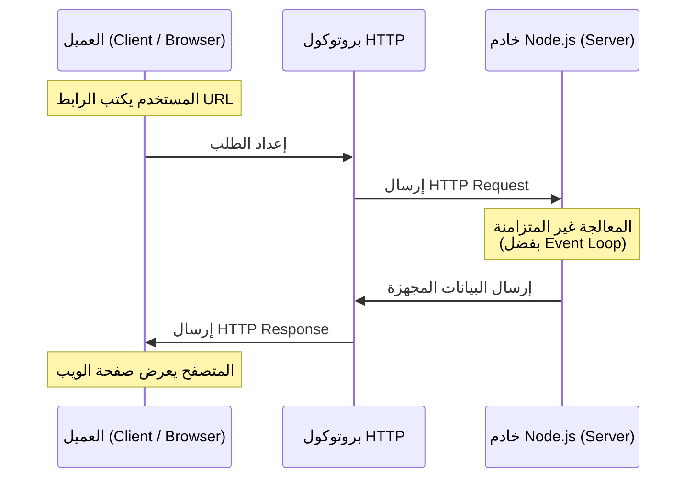

##  وحدة HTTP وكيفية عمل الويب في Node.js

### 1. التمهيد والسياق (Context)

تُمثل وحدة **HTTP** الوحدة المدمجة (Built-in Module) الأخيرة التي سيتم تناولها في هذا القسم من الدورة. ولكن، قبل الغوص في الأكواد البرمجية وكيفية استخدام هذه الوحدة، من الضروري جداً بناء فهم نظري قوي حول "كيفية عمل الويب" (How the web works). بعبارة أخرى: ماذا يحدث خلف الكواليس عندما تقوم بكتابة رابط (URL) في متصفح الويب الخاص بك؟

---

### 2. المفهوم الأساسي: نموذج العميل والخادم (The Client-Server Model)

**التعريف:**
نموذج العميل والخادم هو البنية التحتية الأساسية التي يقوم عليها الإنترنت. لتوضيح هذا النموذج، يجب تقسيم أجهزة الحاسوب المتصلة بشبكة الإنترنت إلى فئتين رئيسيتين:

#### أ. العملاء (Clients)
- **التعريف:** هي الأجهزة المتصلة بالإنترنت (مثل أجهزة الحاسوب الشخصية أو الهواتف المحمولة) بالإضافة إلى البرمجيات (Software) المتاحة على هذه الأجهزة والتي تُستخدم للوصول إلى الويب (مثل متصفحات الويب Web Browsers).
- **الدور:** طلب الحصول على البيانات أو الوصول إلى صفحات الويب.

#### ب. الخوادم (Servers)
- **التعريف:** هي أجهزة حاسوب (Computers) مُخصصة لتخزين صفحات الويب، والمواقع، والتطبيقات (Web pages, sites, or applications).
- **الدور:** استقبال الطلبات، وتجهيز البيانات، وإرسالها كاستجابة.

**كيف تعمل دورة الحياة في هذا النموذج (الخطوات العملية)؟**
عندما تكتب رابطاً (URL) في المتصفح، يحدث التسلسل التالي:
1. **الطلب (Request):** يقوم جهاز "العميل" بطلب الوصول إلى صفحة ويب معينة.
2. **المعالجة (Processing):** يتلقى "الخادم" هذا الطلب ويبحث عن الصفحة المطلوبة.
3. **الاستجابة (Response):** يتم تحميل نسخة (Copy) من صفحة الويب من الخادم وإرسالها كاستجابة إلى العميل.
4. **العرض (Display):** يقوم متصفح العميل بعرض هذه الصفحة للمستخدم.

#### جدول مقارنة: العميل مقابل الخادم

| وجه المقارنة | العميل (Client) | الخادم (Server) |
| :--- | :--- | :--- |
| **المكونات** | جهاز متصل بالإنترنت + برمجيات (مثل المتصفح). | جهاز حاسوب مخصص لتخزين البيانات. |
| **الوظيفة الأساسية** | إرسال الطلبات (Requests) واستقبال الاستجابات. | استقبال الطلبات وإرسال الاستجابات (Responses). |
| **أمثلة** | هاتفك المحمول، متصفح Chrome. | أجهزة تخزين مواقع الويب والتطبيقات. |

---

### 3. بروتوكول  (HTTP)

**المشكلة الجوهرية (The Problem):**
نحن نعلم الآن أن هناك نقلاً للبيانات (Data transfer) يحدث بين العميل والخادم. ولكن، ما هي الصيغة أو التنسيق (Format) الذي تنتقل به هذه البيانات؟ ماذا لو كان الخادم لا يستطيع فهم الطلب المرسل من العميل؟ أو ماذا لو كان العميل لا يستطيع فهم الاستجابة القادمة من الخادم؟

**الحل: استخدام HTTP**
- **التعريف:** مصطلح **HTTP** هو اختصار لـ **Hypertext Transfer Protocol** (بروتوكول نقل النص التشعبي).
- **الفكرة الأساسية:** هو عبارة عن "بروتوكول" (Protocol) أو معيار يحدد **التنسيق (Format)** والقواعد التي يجب أن يتبعها كل من العملاء والخوادم للتحدث والتواصل مع بعضهم البعض وفهم البيانات المتبادلة.

**كيف يعمل؟**
بناءً على هذا البروتوكول، أصبحت العملية مُقننة وموحدة:
- يرسل العميل طلباً يُسمى: **HTTP Request** (طلب HTTP).
- يُرسل الخادم استجابة تُسمى: **HTTP Response** (استجابة HTTP).
(هذه هي الآلية التي يعمل بها الويب على مستوى عالٍ Very high level).

---

### 4. دور بيئة Node.js في الويب

السؤال الأهم هنا: **أين يتناسب Node.js مع هذه الصورة الكاملة؟**
ببساطة، يمكننا استخدام Node.js لإنشاء وبناء **"خادم ويب" (Web Server)**.

> `‏` **Important Note**
> **لماذا تعتبر بيئة Node.js مثالية لبناء خوادم الويب؟**
> هنذكر سببين تقنيين جوهريين يجعلان Node.js خياراً مثالياً (Perfect) لإنشاء الخوادم:
> 1. **الوصول لنظام التشغيل:** تمتلك Node.js القدرة على الوصول إلى وظائف نظام التشغيل (OS functionality) مثل إمكانيات "الشبكات" (Networking).
> 2. **حلقة الأحداث (Event Loop):** تمتلك Node.js حلقة أحداث مدمجة تسمح لها بتشغيل المهام بشكل **غير متزامن (Asynchronously)**، مما يجعلها قادرة على التعامل مع أحجام ضخمة جداً من الطلبات المتزامنة (Simultaneously handle large volumes of requests) بكفاءة عالية ودون حظر للتنفيذ.

---

### 5. وحدة HTTP المدمجة (The HTTP Module)

**التعريف:**
هي وحدة مدمجة (Built-in module) في Node.js تسمح للمطورين بإنشاء خوادم ويب (Web servers) قادرة على نقل البيانات عبر شبكة الإنترنت.

**الفكرة الأساسية ولماذا نستخدمها؟**
كما ذكرنا سابقاً، لكي يعمل خادم Node.js الخاص بنا بشكل صحيح ويتواصل مع متصفحات المستخدمين (العملاء)، **يجب** أن يحترم ويلتزم بتنسيق وقواعد HTTP. وحدة الـ `http` المدمجة هي الأداة التي توفر لنا جميع الدوال والوظائف الجاهزة لإنشاء خادم يتحدث لغة HTTP بطلاقة، مما يسمح بنقل البيانات بشكل صحيح.

---

### 6. رسم توضيحي: بنية عمل الويب ووحدة HTTP

يوضح الرسم التالي دورة الحياة الكاملة التي تم شرحها في هذا الدرس، وموقع Node.js منها:

**الخطوة القادمة (Next Step):**
هذا الدرس كان مخصصاً لإرساء الفهم النظري لآلية عمل الويب وأهمية بروتوكول HTTP. في الدرس القادم، سيتم الانتقال إلى التطبيق العملي وكتابة الكود البرمجي لإنشاء أول خادم ويب حقيقي باستخدام وحدة الـ `http` في Node.js.