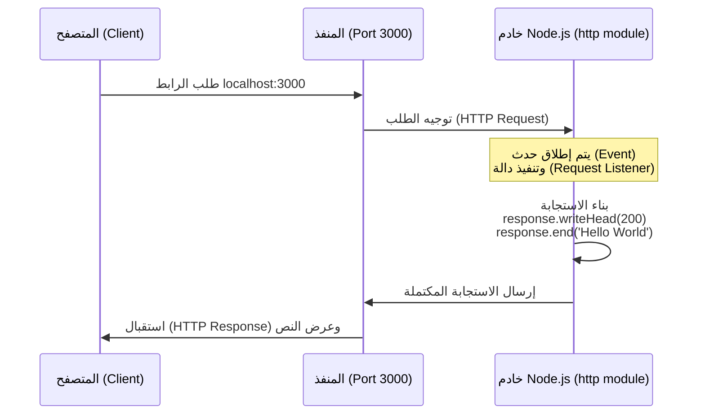

## إنشاء خادم ويب باستخدام وحدة HTTP في Node.js

### 1. التمهيد والسياق (Context)
في الدرس السابق، تعرفنا نظرياً على بروتوكول **HTTP** وكيفية عمل الويب من خلال نموذج "العميل والخادم" (Client-Server Model). في هذا الدرس، ننتقل من الجانب النظري إلى التطبيق العملي الكامل، حيث سنتعلم كيفية كتابة الكود اللازم لإنشاء خادم ويب (Web Server) يعتمد على بيئة Node.js باستخدام الوحدة المدمجة **`http`**.

---

### 2. المفهوم الأساسي: دالة إنشاء الخادم (`createServer`)

**التعريف:**
هي دالة أساسية (Method) موجودة داخل وحدة `http` المدمجة، تُستخدم لتهيئة وإنشاء خادم ويب جديد قادر على استقبال طلبات الشبكة والرد عليها.

**الفكرة الأساسية (كيف تعمل؟):**
تستقبل هذه الدالة "دالة استدعاء عكسي" (**Callback Function**) كمعامل (Argument) لها. هذه الدالة الممررة تعمل بمثابة **"مستمع للطلبات" (Request Listener)**. 

> `‏`  **Important Note**
> **الارتباط بوحدة الأحداث (EventEmitter):**
> معلومة هندسية جوهرية : وحدة الـ `http` في الحقيقة ترث وتتوسع من كلاس **`EventEmitter`** التي درسناها سابقاً. لذلك، دالة الـ Callback التي نمررها هنا لا تُنفذ فوراً، بل يتم تنفيذها تلقائياً **في كل مرة** يصل فيها طلب جديد (Request) إلى الخادم.

#### كائنات دالة الاستدعاء العكسي (Callback Arguments)
تقوم بيئة Node.js تلقائياً (Automatically injects) بتمرير كائنين (Objects) لهذه الدالة:

1. **كائن الطلب (`request`):**
   - **وظيفته:** يحتوي على جميع المعلومات والتفاصيل الخاصة بالطلب القادم من العميل (مثل الرابط، المتصفح المستخدم، البيانات المرسلة).
2. **كائن الاستجابة (`response`):**
   - **وظيفته:** يُستخدم لبناء وتجهيز الرد (Response) الذي سيتم إرساله عائداً إلى العميل (المتصفح). نحن نستخدم هذا الكائن لكتابة كود الاستجابة.
 
---

### 3. التشبيه العملي: مفهوم المنفذ (Port Number)

قبل كتابة الكود، يجب أن نفهم كيف يحدد المتصفح الخادم الخاص بنا.

**التعريف:**
المنفذ (**Port**) هو نقطة نهاية اتصال وهمية تحدد عملية أو خدمة معينة تعمل على نظام التشغيل.

**التشبيه (Analogy):**
- تخيل أن جهاز الحاسوب الخاص بك هو عبارة عن **"مبنى سكني" (Apartment Building)** يحتوي على العديد من الشقق.
- قد يكون هناك العديد من الخوادم أو البرامج التي تعمل على جهازك في نفس الوقت (سكّان مختلفون).
- **رقم المنفذ (Port Number)** هو **"رقم باب الشقة" (Door Number)**. 
- لكي يصل الطلب إلى خادم Node.js الخاص بنا تحديداً، يجب أن نخبر السيرفر بالاستماع إلى "رقم باب" محدد (مثلاً: 3000).

---

### 4. خطوات التطبيق العملي (Code Implementation)

لإنشاء الخادم، نقوم بكتابة الكود التالي في ملف `index.js` بخطوات متسلسلة:

`‏`**Step 1: استيراد الوحدة (Importing the Module)**
نستورد الوحدة المدمجة لبروتوكول HTTP.
```javascript
const http = require('node:http');
```

`‏`**Step 2: إنشاء الخادم وكتابة كود الاستجابة (Creating the Server)**
نستدعي دالة `createServer` ونمرر لها الـ Callback للتعامل مع الطلب والاستجابة.

```javascript
const server = http.createServer((request, response) => {
    // 1. تحديد حالة الرد ونوع المحتوى
    response.writeHead(200, {
        'Content-Type': 'text/plain'
    });
    
    // 2. إرسال النص النهائي وإنهاء الاستجابة
    response.end('Hello World');
});
```

`‏`**Step 3: الاستماع للطلبات (Listening for Requests)**
نخبر الخادم بالاستماع على المنفذ (Port) رقم 3000، ونمرر دالة Callback اختيارية لطباعة رسالة تأكيد في الطرفية.
```javascript
server.listen(3000, () => {
    console.log('Server running on port 3000');
});
```

---

### 5. شرح تفصيلي لدوال كائن الاستجابة (`response` Methods)

من الكود السابق، استخدمنا دالتين أساسيتين لبناء الاستجابة، إليك شرحهما :

#### أ. دالة `()response.writeHead`
- **التعريف:** تُستخدم لكتابة "رؤوس الاستجابة" (Response Headers) وحالة الطلب (Status Code).
- **البرامتر الأول (200):** يمثل رمز حالة HTTP (HTTP Status Code). الرقم `200` يمثل استجابة ناجحة (Successful response).
- **البرامتر الثاني (Content-Type):** كائن يحدد نوع المحتوى المرسل.

> `‏` **Important Note**
> **أهمية تحديد نوع المحتوى (Content-Type):**
> تقنياً، تحديد الـ `Content-Type` هو أمر "اختياري" (Optional). إذا لم تقم بكتابته، سيُرسل الخادم النص، وسيحاول المتصفح "التخمين" (Guess) لمعرفة نوع المحتوى. ولكن، **يُوصى دائماً (Always recommended)** بتحديده صراحةً (مثل `text/plain` للنصوص العادية) كأفضل ممارسة (Good practice) لتجنب أي أخطاء في العرض.

#### ب. دالة `()response.end`
- **التعريف:** تُستخدم لإرسال البيانات النهائية إلى العميل وإخبار السيرفر بأن عملية تجهيز الاستجابة قد انتهت (End the response).
- **الفكرة الأساسية:** مررنا لها السلسلة النصية `'Hello World'` ليتم عرضها على شاشة المتصفح.

---

### 6. تشغيل الخادم واختباره (Execution & Testing)

**التشغيل في ال (Terminal):**
عند كتابة أمر `node index` لتشغيل الملف، ستُطبع الجملة `Server running on port 3000`.

> `‏` **Important Note**
> **ملاحظة جوهرية لسلوك بيئة التشغيل:**
> ستلاحظ أن البرنامج **لم يُغلق (Doesn't exit)** ولم يعد سطر الأوامر متاحاً للكتابة. هذا السلوك مقصود تماماً؛ فالخادم الآن في حالة "انتظار واستماع" مستمر (Waiting for requests) للطلبات على البورت 3000. (لإيقاف الخادم يدوياً يجب الضغط على `Ctrl + C`).

**الاختبار عبر المتصفح (Browser):**
- نفتح متصفح الويب ونكتب في شريط العنوان: `localhost:3000`.
- `‏`**`localhost`**: يشير إلى المضيف المحل (جهاز الحاسوب الخاص بك الذي يعمل كخادم الآن).
- **`3000`**: هو رقم الport.
- **النتيجة:** ستظهر رسالة `Hello World` على الشاشة.

(ملاحظة: إذا فتحت أدوات المطور Inspect Element ثم توجهت إلى تبويب Network وقمت بتحديث الصفحة، سترى طلب واستجابة HTTP القياسية، وفي قسم Response Headers سترى نوع المحتوى Content-Type الذي قمت بتحديده).

---

### 7. رسم توضيحي: دورة حياة الطلب والاستجابة في الخادم



---

### 8. تمرين عملي للمحاضر (Homework / Exercise)

في نهاية المحاضرة، طلب المحاضر إجراء تمرين بسيط لفهم حجم البيانات المتاحة:
- **المهمة:** قم بكتابة `console.log(request)` داخل دالة الاستدعاء العكسي.
- **الهدف:** عند تحديث الصفحة في المتصفح، انظر إلى الطرفية (Terminal) لتشاهد الكمية الهائلة من التفاصيل وأزواج (Key-Value pairs) المتاحة داخل كائن الطلب.
- **ملاحظة المحاضر:** لا تقلق إذا كانت معظم هذه المعلومات لا تبدو منطقية الآن (Will not make sense to you). الهدف فقط هو إدراك مدى قوة هذا الكائن وحجم البيانات التي يمكنك الوصول إليها إذا احتجت لذلك في المستقبل.