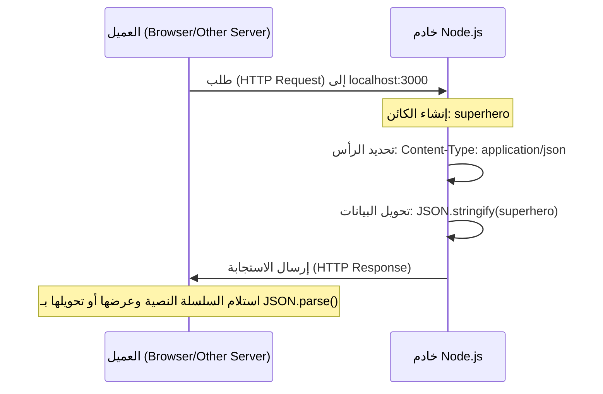

## إرسال استجابة بصيغة (JSON Response) في Node.js

### 1. التمهيد والسياق (Context)
في الدرس السابق، تعلمنا كيفية إنشاء خادم ويب (HTTP Server) باستخدام الوحدة المدمجة `http` في بيئة Node.js، وقمنا بإرسال استجابة للمتصفح عبارة عن "نص عادي" (Plain Text). 
الهدف من هذا الدرس هو الانتقال خطوة للأمام وتعلم كيفية الاستجابة (Respond) بإرسال بيانات منظمة ومهيكلة بصيغة **JSON** إلى العميل (Client).

---

### 2. التجربة العملية والمشكلة (The Problem & Common Error)

لشرح الحاجة إلى صيغة JSON، بدأ المحاضر بتجربة عملية لمحاولة إرسال "كائن جافاسكريبت" (JavaScript Object) بشكل مباشر في الاستجابة.

**التجربة (محاولة خاطئة):**
```javascript
// إنشاء كائن جافاسكريبت عادي
const superhero = {
    firstName: 'Bruce',
    lastName: 'Wayne'
};

// محاولة إرسال الكائن مباشرة إلى العميل
response.end(superhero); 
```

**النتيجة والأخطاء الشائعة (The Error):**
عند تشغيل الخادم (`node index`) وتحديث المتصفح، سيواجه التطبيق مشكلة ولن يعمل. بالعودة إلى محرر الأكواد (VS Code)، سيظهر الخطأ التالي في الطرفية (Terminal):
> "The chunk argument must be of type string or an instance of buffer or uint array instead received an instance of object".
(يعني الخطأ: يجب أن تكون حزمة البيانات المرسلة من نوع "سلسلة نصية" أو "مخزن مؤقت"buffer ، ولكن تم استلام "كائن" بدلاً من ذلك).

> `‏` **Important Note**
> **قاعدة جوهرية في إرسال البيانات عبر HTTP:**
> بناءً على الخطأ السابق، يُمنع تماماً (We can't) إرسال كائنات جافاسكريبت (JavaScript Objects) كما هي (As is) في استجابة HTTP. لحل هذه المشكلة، يجب تحويل هذا الobject إلى تنسيق مدعوم، وهو تنسيق **JSON**

---

### 3. المفهوم الأساسي: ترميز كائنات جافاسكريبت (JSON)

**التعريف ومصطلح الاختصار:**
مصطلح **JSON** هو اختصار لـ **JavaScript Object Notation** (ترميز كائنات جافاسكريبت). 

**الفكرة الأساسية (ما هو ولماذا نستخدمه؟):**
هو عبارة عن "تنسيق لتبادل البيانات" (Data interchange format) يُستخدم بشكل واسع ومثالي للتواصل ونقل البيانات عبر بروتوكول  (**HTTP**) بين الserver والclient.

**كيف تتعامل Node.js مع JSON؟**
من الميزات الرائعة لاستخدام تنسيق JSON هو أن محرك **V8 Engine** (المحرك الذي تعمل عليه بيئة Node.js) يمتلك وظائف مدمجة (Built-in functionality) جاهزة لدعم هذا التنسيق وتحويل البيانات إليه دون الحاجة لأي مكتبات خارجية.

---

### 4. دوال التحويل المدمجة (Conversion Methods)

لإجراء عملية التحويل من وإلى تنسيق JSON، يوفر محرك جافاسكريبت دالتين أساسيتين:

1. **دالة `()JSON.stringify`:**
   - **وظيفتها:** تأخذ كائن جافاسكريبت (JS Object) ك (Argument) وتقوم بتحويله إلى "سلسلة نصية" (String representation) بصيغة JSON.
   - **متى نستخدمها:** تُستخدم عند إعداد البيانات لإرسالها في الاستجابة (Response).

1. **دالة `()JSON.parse`:**
   - **وظيفتها:** تقوم بالعكس تماماً؛ تأخذ بيانات بصيغة JSON (نص) وتحولها مجدداً إلى كائن جافاسكريبت (JS Object) يمكن التعامل معه برمجياً.
   - **متى نستخدمها:** تُستخدم عندما نستقبل بيانات من العميل ونريد معالجتها داخل الserver .

---

### 5. خطوات التطبيق العملي: إرسال (JSON Response)

لإصلاح الخطأ السابق وإرسال الكائن بنجاح، يجب اتباع الخطوات التالية بدقة:

`‏`**Step 1: تحديد نوع المحتوى في رأس الاستجابة (Setting the Content-Type)**

يجب أن نخبر المتصفح (العميل) بشكل صريح أن البيانات التي سيستقبلها هي بصيغة JSON. نقوم بذلك بتغيير قيمة `Content-Type` لتصبح `application/json`.

`‏`**Step 2: تحويل الكائن وإرساله (Stringify and End)**
نستخدم الدالة المدمجة لتحويل الكائن إلى نص داخل دالة إنهاء الاستجابة `()response.end`.

**الكود النهائي والصحيح:**
```javascript
const http = require('node:http');

const server = http.createServer((request, response) => {
    // إنشاء كائن جافاسكريبت
    const superhero = {
        firstName: 'Bruce',
        lastName: 'Wayne'
    };

    // الخطوة 1: تحديد حالة الرد ونوع المحتوى كـ JSON
    response.writeHead(200, {
        'Content-Type': 'application/json'
    });
    
    // الخطوة 2: تحويل الكائن إلى نص بصيغة JSON ثم إرساله
    response.end(JSON.stringify(superhero));
});

server.listen(3000, () => {
    console.log('Server running on port 3000');
});
```

**نتيجة التنفيذ:**
عند إعادة تشغيل الخادم وتحديث المتصفح، سيتم عرض الكائن كسلسلة نصية مهيكلة على الشاشة بنجاح (String representation of our object).

---

### 6. المفهوم التأسيسي: واجهة برمجة التطبيقات (API)


بمجرد قيامك بتنفيذ هذا الكود، فقد قمت رسمياً بكتابة **أول واجهة برمجة تطبيقات (API)** لك باستخدام Node.js.

**التعريف ومصطلح الاختصار:**
مصطلح **API** هو اختصار لـ **Application Programming Interface** (واجهة برمجة التطبيقات). 

**كيف تعمل في سياق تطبيقنا؟**
- لدينا الآن نقطة نهاية (Endpoint) تعمل على الرابط: `localhost:3000`.
- هذه النقطة تقوم بإرجاع بيانات (Returns some data)، وهذه البيانات عبارة عن كائن يحتوي على الاسم الأول والأخير.
- **الميزة الكبرى:** من خلال القيام بذلك، ليس فقط متصفح الويب الخاص بك، بل **أي خادم آخر (Any server)** قادر على إجراء طلب (Make a request) يمكنه الآن جلب هذه البيانات من تطبيقك.

> `‏` **Important Note**
> **ملاحظة للمستقبل من المحاضر:**
> فهم التصميم الكامل للـ APIs وتفاصيلها هو موضوع متقدم سيتم تغطيته في سلسلة دورات أخرى منفصلة (Another series). ما يهمك في هذه المرحلة هو استيعاب أن استخدام خاصية `Content-Type: application/json` مع الدالة `()JSON.stringify` يعتبر أمراً "كافياً تماماً" (Sufficient) لإرسال استجابة JSON للعميل وتكوين نقطة نهاية (API Endpoint).

---

### 7. جدول مقارنة: النص العادي مقابل JSON

|          وجه المقارنة          | استجابة النص العادي (Plain Text) |           استجابة جيسون (JSON Response)           |
| :----------------------------: | :------------------------------: | :-----------------------------------------------: |
| **نوع المحتوى (Content-Type)** |           `text/plain`           |                `application/json`                 |
|       **طبيعة البيانات**       |         نص حر غير مهيكل.         | بيانات مهيكلة كأزواج (Key-Value) تُشبه كائنات JS. |
|    **التحضير قبل الإرسال**     |     لا تتطلب أي تحويل إضافي.     |  تتطلب تحويل الكائن باستخدام `()JSON.stringify`.  |
|  **حالة الاستخدام الرئيسية**   |   عرض رسائل بسيطة للمستخدمين.    | تبادل البيانات بين الخوادم وتطبيقات الويب (APIs). |

---

### 8. رسم توضيحي: مسار إرسال استجابة JSON



**الخطوة القادمة (Next Step):**
بعد أن تعلمنا كيفية الاستجابة بالنصوص العادية وببيانات JSON، سيكون الدرس القادم مخصصاً لتعلم كيفية إرسال استجابة تحتوي على صفحات ويب باستخدام لغة **HTML**.