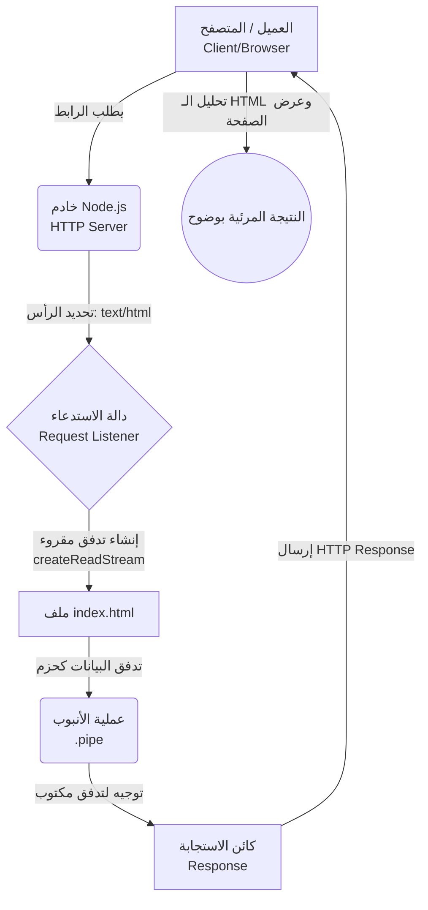

##  إرسال استجابة بصيغة (HTML Response) في Node.js

### 1. التمهيد والسياق (Context)
في الدروس السابقة، تعلمنا كيفية إنشاء web server وإرسال استجابة بصيغة نص عادي (Plain Text) ثم بصيغة بيانات مهيكلة (JSON Response). 
الهدف من هذا الدرس هو استكمال سلسلة الاستجابات وتعلم كيفية إرسال صفحات ويب كاملة بصيغة **HTML** كاستجابة للعميل (المتصفح)، مع التركيز على أفضل الممارسات الهندسية لتحقيق أعلى أداء (Performance) للserver.

---

### 2. التجربة الأولى: المشكلة في استخدام النص العادي (Plain Text)

لشرح كيفية تعامل المتصفح مع البيانات، سنبدأ بتجربة إرسال  (Tags) خاصة بلغة HTML بينما نوع المحتوى محدد كنص عادي.

**الخطوات والتجربة:**
قمنا بتغليف النص `Hello World` بوسم الترويسة `<h1>`.

```javascript
// تحديد نوع المحتوى كنص عادي
response.writeHead(200, {
    'Content-Type': 'text/plain' 
});

// إرسال النص مغلفاً بوسم HTML
response.end('<h1>Hello World</h1>');
```

**النتيجة والخطأ الشائع (The Issue):**
عند عمل ريفريش للمتصفح، المخرجات لا تكون كما هو متوقع (Not as expected). بدلاً من رؤية نص كبير الحجم وعريض، يطبع المتصفح الوسوم كما هي: `<h1>Hello World</h1>`.
- **السبب :** المتصفح يعرض ما نطلبه منه بالضبط. بما أننا حددنا `Content-Type` كـ `text/plain`، فإن المتصفح يعامل الاستجابة كنص حرفي (Literal text) ولا يحاول تحليل أو معالجة (Parse) أي  HTML Tags بداخلها.

---

### 3. الحل الأساسي: تغيير نوع المحتوى (Content-Type: text/html)

**كيف تعمل؟**
لكي نُجبر المتصفح على معالجة البيانات وتحليلها كصفحة ويب بدلاً من نص عادي، يجب علينا تغيير قيمة رأس الاستجابة (Response Header) الخاص بنوع المحتوى.

**الكود المُعدل:**
```javascript
// تحديد نوع المحتوى كـ HTML
response.writeHead(200, {
    'Content-Type': 'text/html' 
});

response.end('<h1>Hello World</h1>');
```
**النتيجة:**
الآن، عند تحديث المتصفح، سيتم عرض النص `Hello World` بخط كبير وعريض (Bold)، وهو التنسيق الافتراضي (Default styling) لوسم `<h1>`. هذه هي الطريقة الأساسية لإرسال محتوى HTML كاستجابة.

---

### 4. المشكلة الهندسية: كتابة HTML داخل ملف جافاسكريبت

**الفكرة الأساسية ولماذا لا نستخدمها؟**
على الرغم من أن الطريقة السابقة تعمل بشكل سليم، إلا أنه من الناحية الهندسية (Typically)، **لا ينبغي أبداً** بناء محتوى HTML كسلسلة نصية (String) داخل نفس ملف جافاسكريبت. هذا يؤدي إلى كود فوضوي وصعب الصيانة.

**الحل المعياري:**
بدلاً من ذلك، نُعرّف هيكل HTML في **ملف منفصل (Separate file)**، ثم نقوم بقراءة محتويات هذا الملف من داخل خادم Node.js وإرسالها كاستجابة.

**الخطوات التجهيزية:**
`‏`**Step 1:** إنشاء ملف جديد باسم `index.html`.
`‏`**Step 2:** كتابة هيكل HTML الأساسي داخله (باستخدام `!` ثم `Tab` في المحرر).
`‏`**Step 3:** وضع رسالة داخل وسم `<h1>` في الـ `body` (مثال: `from index.html`).

---

### 5. الطريقة الأولى لاستدعاء الملف: القراءة المتزامنة (Synchronous Reading)

بما أننا نتعامل مع ملفات، فنحن بحاجة لاستخدام الوحدة المدمجة الخاصة بنظام الملفات (**fs Module**).

**الخطوات البرمجية:**

**Step 1: استيراد وحدة الملفات**
```javascript
const fs = require('node:fs');
```

**Step 2: قراءة الملف داخل مستمع الطلبات (Request Listener)**
```javascript
const server = http.createServer((request, response) => {
    // 1. تحديد نوع المحتوى كـ HTML
    response.writeHead(200, { 'Content-Type': 'text/html' });
    
    // 2. قراءة محتوى الملف بشكل متزامن
    const html = fs.readFileSync('./index.html', 'utf-8');
    
    // 3. إرسال المحتوى المقروء كاستجابة
    response.end(html);
});
```

> `‏` **Important Note**
> **لماذا استخدمنا  `readFileSync` وليس `readFile`؟**
> أ استخدام النسخة المتزامنة (Sync) هنا لأننا **نريد الانتظار (Wait)** حتى تتم قراءة محتوى الملف بالكامل قبل الشروع في الرد (Responding) على طلب العميل.

**عيوب هذه الطريقة (Drawbacks):**
على الرغم من نجاح هذه الطريقة، يجب أن تضع في اعتبارك أن دالة `readFileSync` تقرأ محتويات الملف بالكامل "دفعة واحدة" (At once). إذا كان ملف HTML كبيراً جداً (Large HTML file)، سيتم تخزين كل هذا المحتوى في **مخزن مؤقت مؤقت (Temporary Buffer)** في الذاكرة، مما قد يؤدي إلى استهلاك غير ضروري وغير فعال للذاكرة (Unnecessary use of memory).

---

### 6. الطريقة الثانية والمُثلى: استخدام التدفقات والأنابيب (Streams & Pipes)

لحل مشكلة استهلاك الذاكرة وجعل الخادم أعلى كفاءة وأداءً (More performant)، نعتمد على المفاهيم التي درسناها سابقاً: **التدفقات (Streams)** و **الأنابيب (Pipes)**.

**الفكرة الأساسية (كيف تعمل؟):**
بدلاً من قراءة الملف بالكامل وتخزينه في الذاكرة، نقوم بإنشاء "تدفق قابل للقراءة" (Readable Stream) من ملف `index.html`، ثم نقوم بتوصيله (Piping) مباشرة إلى كائن الاستجابة `response` والذي يمثل "تدفقاً قابلاً للكتابة" (Writable Stream). هذا يرسل البيانات للمتصفح على شكل حزم (Chunks).

**الخطوات البرمجية (الطريقة المُحسنة):**

```javascript
const server = http.createServer((request, response) => {
    // 1. تحديد نوع المحتوى كـ HTML
    response.writeHead(200, { 'Content-Type': 'text/html' });
    
    // 2. استخدام التدفقات والأنابيب بدلاً من القراءة المتزامنة
    // يتم إنشاء تدفق للقراءة من الملف، ويتم توجيهه (pipe) مباشرة للاستجابة
    fs.createReadStream('./index.html').pipe(response);
    
    // ملاحظة: لا نحتاج لاستخدام response.end() هنا لأن دالة pipe تقوم بإنهاء الاستجابة تلقائياً بعد اكتمال التدفق.
});
```
**المميزات:**
هذا الكود يقوم بنفس الوظيفة تماماً ويعرض نفس المخرجات على المتصفح، ولكن بأداء أعلى بكثير (More performant) واستهلاك ذكي لموارد الذاكرة.

---

### 7. جدول مقارنة: طرق إرسال ملف HTML

|     وجه المقارنة (Feature)     |  القراءة المتزامنة (`readFileSync`)   |        التدفقات والأنابيب (Streams & Pipes)         |
| :----------------------------: | :-----------------------------------: | :-------------------------------------------------: |
|       **آلية المعالجة**        |    قراءة الملف كاملاً دفعة واحدة.     |  قراءة وإرسال الملف على شكل حزم متتالية (Chunks).   |
|      **استهلاك الذاكرة**       | مرتفع (تستخدم Temporary Buffer كامل). |                  منخفض جداً وفعال.                  |
|    **الأداء (Performance)**    |    بطيء نسبياً مع الملفات الكبيرة.    | **عالي الأداء (Performant - الطريقة المُوصى بها)**. |
| **الحاجة لـ `()response.end`** |      مطلوبة صراحةً لإنهاء الرد.       |       غير مطلوبة (تُدار تلقائياً عبر `pipe`).       |

---

### 8. أفضل الممارسات وملاحظات ختامية للمحاضر

>`‏` **Important Note**
> **1. مسار الملفات الأفضل (Best Practice for File Paths):**
> لغرض التبسيط في هذا الدرس، استخدم المحاضر "المسار النسبي" (`index.html/.`). ومع ذلك، في بيئات العمل الحقيقية، **يجب عليك الالتزام (Stick to)** باستخدام المتغير المدمج **`__dirname`** متى أمكنك ذلك لضمان دقة تحديد المسار المطلق للملفات وتجنب الأخطاء عند تشغيل الخادم من مجلدات مختلفة.
> 
> **2. استخدام وضع المراقبة (Watch Mode):**
>        لتجنب إيقاف وإعادة تشغيل الخادم يدوياً (Ctrl+C ثم `node index`) بعد كل تعديل برمجي، يُرجى تذكر استخدام "وضع المراقبة" (Watch mode) الذي تمت دراسته مسبقاً عن طريق تشغيل الخادم بالأمر: `node --watch index`.

---

### 9. رسم توضيحي: مسار إرسال استجابة HTML باستخدام التدفقات


