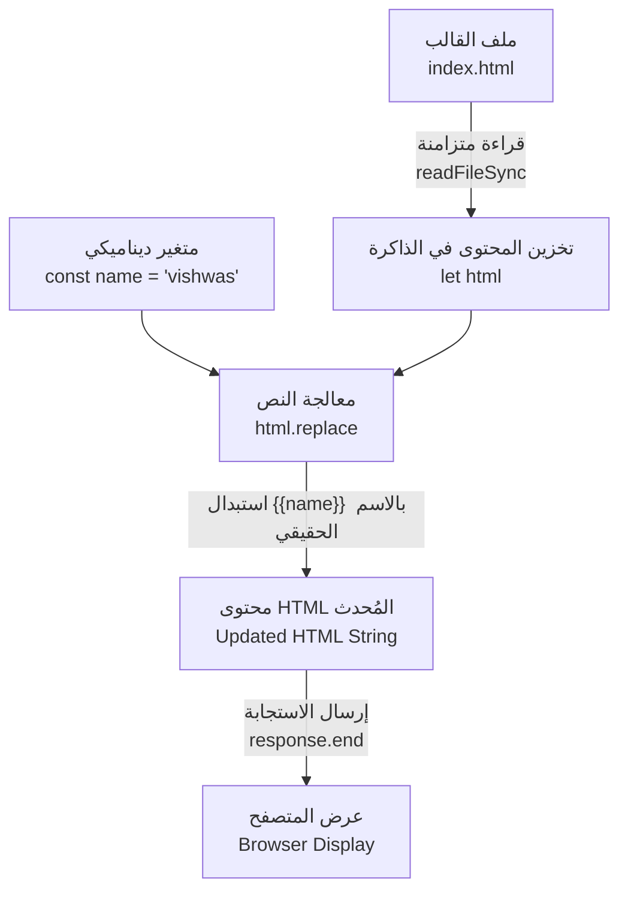

## قوالب HTML والبيانات الديناميكية (HTML Templates)

### 1. التمهيد والسياق (Context)
في الدرس السابق، تعلمنا كيفية إرسال استجابة بصيغة HTML (HTML Response) من خلال قراءة ملف HTML باستخدام وحدة نظام الملفات وإرساله مباشرة للعميل عبر التدفقات والأنابيب (`createReadStream` و `pipe`). 
هذه الطريقة تعتبر ممتازة جداً وفعالة لـ **صفحات HTML الثابتة (Static HTML Pages)**، أي الصفحات التي لا يتغير محتواها أبداً بناءً على المستخدم. 

ولكن، ماذا لو واجهنا موقفاً نحتاج فيه إلى حقن أو إضافة **قيم ديناميكية (Dynamic values)** داخل صفحة HTML قبل إرسالها؟ (مثل: الترحيب بالمستخدم المسجل دخوله وعرض اسمه الشخصي على الشاشة). هنا يبرز موضوع هذا الدرس.

---

### 2. المفهوم الأساسي: قوالب HTML (HTML Templates)

**التعريف:**
قالب HTML هو ببساطة ملف HTML عادي يحتوي على "عناصر نائبة" (Placeholders) أو علامات مميزة، تُستخدم لتمثيل الأماكن التي سيتم فيها حقن البيانات المتغيرة (Dynamic data) بواسطة سيرفر Node.js قبل إرسال الصفحة النهائية للعميل.

**الفكرة الأساسية (كيف تعمل؟):**
لحل هذه المشكلة بأبسط طريقة ممكنة (The most basic solution)، سنعتمد  على تقنية **"استبدال السلاسل النصية" (String Replacement)** المدمجة في لغة جافاسكريبت.

**لماذا ومتى نستخدمها؟**
نستخدمها عندما نحتاج إلى إرسال صفحة ويب متغيرة المحتوى تعتمد على بيانات مستخرجة من الserver  (مثل جلب اسم المستخدم، أو بيانات من قاعدة بيانات) وتضمينها داخل تصميم HTML جاهز.

---

### 3. التغيير الجوهري في معمارية الكود (التخلي عن التدفقات)

> `‏` **Important Note**
> **ملاحظة معمارية هامة جداً:**
> لتطبيق تقنية استبدال النصوص،  **يجب أن نزيل (Remove)** كود التدفقات والأنابيب (`()fs.createReadStream().pipe`) الذي كتبناه في الدرس السابق، وأن **نعود مجدداً (Go back)** لاستخدام طريقة القراءة المتزامنة (`fs.readFileSync`).
> **التفسير  (لماذا؟):** لأن استخدام الأنابيب (Pipes) ينقل البيانات الخام (Raw chunks) مباشرة من الملف إلى الاستجابة دون أن يمنحنا الفرصة لتعديلها. وبما أننا بحاجة لمعالجة وتعديل هذا المحتوى برمجياً (Handle this a little different) قبل إرساله، فيجب علينا قراءة الملف بالكامل وتخزينه في الذاكرة أولاً لنتمكن من إجراء عملية الاستبدال.

---

### 4. خطوات التطبيق العملي (Implementation Steps)

لإنشاء قالب HTML وحقن قيم ديناميكية فيه، اتبع الخطوات التأسيسية التالية:

`‏`**Step 1: تجهيز قالب HTML (HTML Template Setup)**
نفتح ملف `index.html` ونقوم بكتابة نص الترحيب. لتحديد المكان الذي سنضع فيه القيمة الديناميكية، نستخدم أقواساً  (Double curly braces) كعلامة مميزة يسهل البحث عنها برمجياً.
مثال في ملف HTML: `Hello {{name}} Welcome to node`.

`‏`**Step 2: تعريف المتغير الديناميكي (Define Dynamic Variable)**
في ملف الserver الأساسي (مثل `index.js`)، نقوم بتعريف القيمة التي نريد عرضها (مثلاً: جلب اسم المستخدم من قاعدة البيانات أو تعريفه برمجياً).

`‏`**Step 3: قراءة محتوى الملف برمجياً (Read File Contents)**
نقوم بقراءة ملف HTML بالكامل لتخزينه كنص (String). وهنا يجب تغيير نوع المتغير من `const` (ثابت لا يتغير) إلى **`let`** لكي نتمكن من تعديل محتواه وإعادة تعيينه في الخطوة التالية.

`‏`**Step 4: استبدال السلسلة النصية (String Replacement)**
نستخدم دالة `()replace.` الخاصة بجافاسكريبت للبحث عن العلامة `{{name}}` داخل محتوى HTML واستبدالها بقيمة المتغير الديناميكي.

`‏`**Step 5: إرسال الاستجابة (Send Response)**
نرسل ملف HTML المُحدث كاستجابة للعميل.

---

### 5. التطبيق البرمجي (Code Implementation)

إليك الكود المكتوب في ملف الخادم (JavaScript) مع شرح كل سطر:

```javascript
const http = require('node:http');
const fs = require('node:fs');

const server = http.createServer((request, response) => {
    // 1. تحديد نوع المحتوى كصفحة ويب (HTML)
    response.writeHead(200, {
        'Content-Type': 'text/html'
    });

    // 2. تعريف القيمة الديناميكية التي نريد حقنها (اسم المستخدم كمثال)
    const name = 'vishwas'; //

    // 3. قراءة محتويات ملف HTML بالكامل وتخزينها في متغير قابل للتعديل (let)
    // نستخدم readFileSync لأننا نحتاج المحتوى كاملاً قبل المعالجة
    let html = fs.readFileSync('./index.html', 'utf-8'); //

    // 4. عملية الحقن (String Replacement)
    // البحث عن القوسين المعقوفين المزدوجين {{name}} واستبدالها بقيمة الثابت name
    html = html.replace('{{name}}', name); //

    // 5. إرسال محتوى HTML بعد التحديث كاستجابة نهائية للمتصفح
    response.end(html); //
});

server.listen(3000, () => {
    console.log('Server running on port 3000');
});
```

**النتيجة (Output):**
عند حفظ الملفات وإعادة تشغيل خادم Node، ثم تحديث المتصفح، سنرى المخرجات المتوقعة على الشاشة: `hello vishwas welcome to node`. لقد نجحنا في تكوين قالب HTML وتمرير قيم ديناميكية إليه من جافاسكريبت بمنتهى البساطة (Really simple).

---

### 6. رسم توضيحي: مسار عمل القوالب الديناميكية

يوضح هذا المخطط دورة الحياة وتعديل البيانات في الذاكرة قبل وصولها للعميل:



**الخطوة القادمة (Next Step):**
بهذا نكون قد انتهينا من التعرف على كيفية التعامل مع قوالب HTML. أشار المحاضر إلى أن الدرس القادم سينقلنا لتعلم مفهوم جوهري في بناء خوادم الويب وهو **التوجيه (Routing)** باستخدام خادم HTTP.