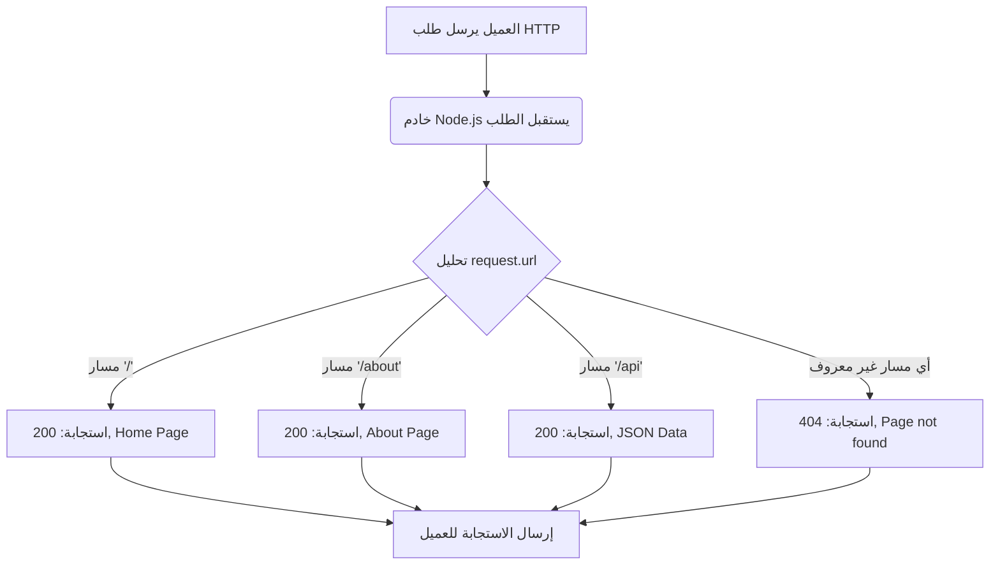

## المرجع الدراسي الاحترافي: التوجيه (HTTP Routing) في Node.js

### 1. التمهيد والسياق (Context & The Problem)

في الدروس السابقة، قمنا بإنشاء خادم ويب يستجيب للطلبات، ولكن واجهتنا مشكلة منطقية: عند الانتقال إلى الرابط الرئيسي (`localhost:3000`) أو إضافة مسارات مختلفة مثل (`about/`) أو (`api/`)، كان الserver  يعرض **نفس الاستجابة دائماً**. 

في تطبيقات الويب الحقيقية (Typical websites)، هذا السلوك غير صحيح؛ فالمسار `about/` يجب أن يعرض صفحة "من نحن"، والمسار `api/` يجب أن يعود ببيانات بصيغة JSON. الهدف من هذا الدرس هو محاكاة هذا السلوك الحقيقي من خلال تعلم مفهوم **التوجيه (Routing)**.

---

### 2. المفهوم الأساسي: التوجيه (Routing)

**التعريف:**
التوجيه (**Routing**) هو عملية ربط أو تخطيط الطلبات القادمة من العميل (Requests) بالاستجابات المناسبة لها (Appropriate response) بناءً على الرابط المطلوب في الكود.

**الفكرة الأساسية وكيف تعمل؟**
يعتمد التوجيه في وحدة `http` المدمجة على ==استخراج معلومات الطلب القادم من العميل== من خلال "كائن الطلب" (`request object`)، وتحديداً استخدام خاصيتين أساسيتين يوفرها هذا الكائن للتعرف على وجهة العميل وماذا يريد:

1. **الخاصية الأولى `request.url`:**
   - **التعريف:** تعطينا هذه الخاصية "سلسلة الاستعلام" أو مسار الرابط (URL query string) الذي طلبه المستخدم.
   - **كيف تعمل:**
     - عند طلب `localhost:3000` ⬅️ تكون قيمة `request.url` هي القيمة الافتراضية (الجذر / Root) وتُكتب هكذا: `/`.
     - عند طلب `localhost:3000/about` ⬅️ تكون القيمة: `about/`.
     - عند طلب `localhost:3000/api` ⬅️ تكون القيمة: `api/`.

2. **الخاصية الثانية `request.method`:**
   - **التعريف:** تعطينا هذه الخاصية نوع ال  HTTP Method المستخدمة في الطلب (HTTP Method).
   - **الأمثلة:** `GET`, `POST`, `PUT`, `DELETE`.

> `‏` **Important Note**
> **القاعدة الذهبية للتوجيه:**
>  الجمع بين الخاصيتين (`request.url` لمعرفة المسار، و `request.method` لمعرفة نوع العملية) يُمكّنك من التعامل مع أي نوع من أنواع التوجيه (Handle any type of routing) باستخدام وحدة `http` المدمجة.

---

### 3. خطوات بناء نظام التوجيه (Implementation Steps)

لإنشاء نظام التوجيه برمجياً، نستخدم جملاً شرطية كلاسيكية مثل `if-else statement` أو `switch statement` للتحقق من قيمة `request.url` وإرسال استجابة مختلفة لكل مسار.

**الخطوات العملية:**
- `‏`**Step 1:** نقوم بتفريغ محتوى دالة الاستدعاء العكسي (Request listener body) السابقة لنبدأ من جديد.
- `‏`**Step 2:** نكتب الشرط الأول للتحقق من المسار الجذري `/` وإرسال نص عادي.
- `‏`**Step 3:** نكتب الشرط الثاني للمسار `about/` وإرسال نص عادي مختلف.
- `‏`**Step 4:** نكتب الشرط الثالث للمسار `api/` وإرسال بيانات بصيغة JSON.
-`‏` **Step 5 (مهمة جداً):** نكتب شرطاً افتراضياً (Fallback / else) للتعامل مع الروابط غير الموجودة وإرسال رمز الخطأ `404`.

---

### 4. التطبيق البرمجي الشامل (Code Implementation)

إليك الكود الكامل لتطبيق التوجيه، مع شرح مفصل لكل حالة:

```javascript
const http = require('node:http');

const server = http.createServer((request, response) => {
    // 1. المسار الجذري (Home Page)
    if (request.url === '/') {
        response.writeHead(200, { 'Content-Type': 'text/plain' });
        response.end('Home Page');
    } 
    // 2. مسار صفحة "من نحن" (About Page)
    else if (request.url === '/about') {
        response.writeHead(200, { 'Content-Type': 'text/plain' });
        response.end('About Page');
    } 
    // 3. مسار واجهة برمجة التطبيقات (API Endpoint)
    else if (request.url === '/api') {
        response.writeHead(200, { 'Content-Type': 'application/json' });
        // استخدام JSON.stringify لتحويل الكائن إلى نص مهيكل
        response.end(JSON.stringify({
            firstName: 'Bruce',
            lastName: 'Vain' // تمت كتابتها كما وردت من المحاضر
        }));
    } 
    // 4. حالة الروابط غير المعرفة (Page Not Found)
    else {
        // نستخدم رمز الحالة 404 للإشارة إلى أن الصفحة غير موجودة
        response.writeHead(404);
        response.end('Page not found');
    }
});

server.listen(3000, () => {
    console.log('Server running on port 3000');
});
```

**أهمية المسار الأخير (الروابط غير الموجودة `404`):**
لماذا يجب علينا وضع جملة `else` الأخيرة برمز الحالة `404` (مثل تجربة مسار `vishwas/`)؟ 
- **السبب:** لضمان إعلام المستخدم وإبلاغه صراحةً (Ensure the user is informed) بأنه لا يوجد مسار أو رابط بهذا الاسم في تطبيقنا (No such URL exists).

---

### 5. الأخطاء الشائعة  (Common Errors)

أثناء بناء المحاضر لهذا الكود، واجه خطأً عند محاولة تحديث المتصفح (Refresh)، حيث تعطل الخادم ولم يعمل بشكل صحيح.
- **سبب الخطأ:** نسي المحاضر إزالة الاستجابة القديمة (First response) التي كانت موجودة في بداية الكود قبل الجمل الشرطية `if-else`.
- **الدرس المستفاد :** في بيئة Node.js، لا يمكنك إرسال أكثر من استجابة واحدة (`response.end`) لنفس الطلب. يجب التأكد من مسار الكود بحيث يُنفذ `response.end` مرة واحدة فقط لكل طلب (Request).

---

### 6. جدول مقارنة: استجابات المسارات المختلفة بناءً على الكود

| المسار المطلوب (`request.url`) | رمز الحالة (Status Code) | نوع المحتوى (Content-Type) |     النتيجة الظاهرة للعميل (Response)     |
| :----------------------------: | :----------------------: | :------------------------: | :---------------------------------------: |
|              `/`               |          `200`           |        `text/plain`        |                `Home Page`                |
|            `/about`            |          `200`           |        `text/plain`        |               `About Page`                |
|             `/api`             |          `200`           |     `application/json`     | `{"firstName":"Bruce","lastName":"Vain"}` |
|   `/vishwas` أو أي مسار آخر    |          `404`           |     افتراضي (غير محدد)     |             `Page not found`              |

---

### 7. رسم توضيحي: خوارزمية التوجيه في خادم Node.js



---

### 8. ملاحظة ختامية من المحاضر (مهمة لبيئة العمل الحقيقية)

> ⚠️ **Important Note**
> على الرغم من أننا تعلمنا كيف نقوم بالتوجيه يدوياً باستخدام الجمل الشرطية وخصائص `request`، إلا أن المحاضر أوضح نقطة جوهرية بخصوص التطبيقات الحقيقية (Real world apps):
> **"في التطبيقات الحقيقية، أنت عادةً ما تعتمد على إطار عمل ويب (Web Framework) للتعامل مع كل هذه الأمور والتوجيهات نيابة عنك"**. (وهذا ما يُمهد للدرس القادم).