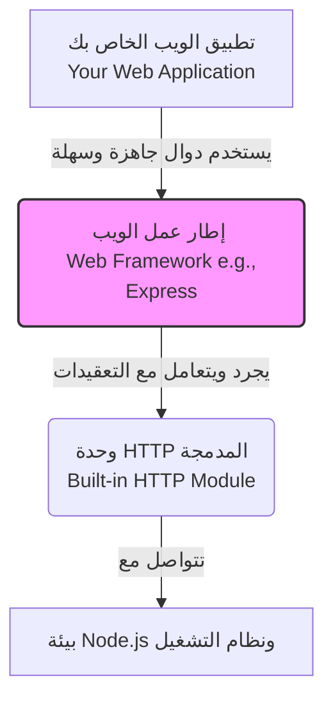

## إطارات عمل الويب (Web Frameworks) ومراجعة الوحدات المدمجة

### 1. التمهيد والمشكلة (The Context & The Problem)

في الدروس السابقة من هذا القسم، تعلمنا كيفية استخدام وحدة **HTTP** المدمجة للقيام بالعديد من المهام الأساسية مثل:
- إنشاء خادم (Create a server).
- الوصول إلى معلومات الطلب (Access request information).
- إرسال الاستجابات (Send responses) وتعديل رؤوسها (Headers) وحالتها (Status).
- الاستجابة بصيغ مختلفة كالنص العادي، قوالب HTML، وبيانات JSON.
- توجيه الطلبات (Routing).

**المشكلة الهندسية في بيئة العمل الحقيقية:**
على الرغم من أن الاعتماد المباشر على وحدة `http` يعمل بشكل ممتاز، إلا أنه **ليس الطريقة المتبعة** لإنشاء الخوادم والتعامل مع الطلبات عند بناء تطبيقات ضخمة على مستوى الشركات (Enterprise scale applications). 

---

### 2. المفهوم الأساسي: إطارات عمل الويب (Web Frameworks)

**التعريف:**
إطار عمل الويب (**Web Framework**) هو أداة أو بيئة برمجية تُبنى فوق الوحدات الأساسية (مثل وحدة `http` في Node.js) لتبسيط وتسهيل عملية تطوير تطبيقات الويب أو الهواتف المحمولة.

**الفكرة الأساسية ولماذا نستخدمها؟ (Why & Core Concept):**
يقوم إطار العمل بـ "تجريد" أو "إخفاء" الأكواد ذات المستوى المنخفض (**Abstracts the low-level code**). 
- **الفائدة:** هذا التجريد يسمح للمطور بالتركيز على "متطلبات التطبيق" (Requirements) والمنطق البرمجي (Business logic) بدلاً من الانشغال بكتابة الأكواد التأسيسية المعقدة لتنفيذ مهام بسيطة (مثل التوجيه أو التعامل مع الاستجابات).

**كيف تعمل في بيئة Node.js؟**
جميع إطارات العمل الخاصة بـ Node.js تُبنى أساساً فوق (Build on top of) وحدة **HTTP** المدمجة. فهي لا تلغي الوحدة، بل تغلفها بوظائف جاهزة تجعل تنفيذ جميع الميزات التي درسناها سابقاً أمراً في غاية السهولة.

**أشهر إطارات العمل في Node.js (Examples):**
ذكر المحاضر عدة أمثلة شائعة لإطارات العمل في Node.js، ومنها:
1. **Express** (الأكثر شهرة واستخداماً).
2. **Nest**.
3. **Hapi**.
4. **Koa**.
5. **Sails**.

---

### 3. التشبيه العملي (Real-World Analogy)

لتقريب مفهوم "التجريد" (Abstraction)، سنضرب تشبيهاً بعالم تطوير الواجهات الأمامية (Front-end):

- في الواجهات الأمامية، توفر لغة جافاسكريبت واجهة برمجة تطبيقات منخفضة المستوى للتعامل مع الشاشة تُسمى (DOM API).
- بدلاً من استخدام (DOM API) بشكل مباشر ومعقد، يستخدم المطورون إطارات عمل ومكتبات مثل **Angular** أو **React** أو **Vue** لبناء واجهات المستخدم بسهولة.
- **بالمثل تماماً في الواجهات الخلفية (Back-end):** بدلاً من استخدام وحدة `http` مباشرة، نستخدم إطارات عمل مثل **Express** لبناء خوادم ويب بكفاءة وسرعة.

#### جدول مقارنة: التجريد في الواجهات الأمامية والخلفية

|               بيئة التطوير               | الأداة منخفضة المستوى (Low-level API) | إطار العمل المُجرد (Framework / Library) |
| :--------------------------------------: | :-----------------------------------: | :--------------------------------------: |
|     **الواجهة الأمامية (Front-end)**     |                DOM API                |           Angular, React, Vue            |
| **الواجهة الخلفية (Back-end / Node.js)** |           وحدة HTTP المدمجة           |     Express, Nest, Hapi, Koa, Sails      |

---

### 4. رسم توضيحي: معمارية إطارات العمل في Node.js

---

### 5. ملاحظات المحاضر حول مسار الدورة

> `‏` **Important Note**
> **مستقبل الدورة وإطار عمل Express:**
> - يعتبر **Express** إطار عمل شهير جداً، وسيتم تخصيص "سلسلة دروس منفصلة قادمة" لتعلم جميع ميزاته بالكامل.
> - **أما في الوقت الحالي:** سيستمر تركيز هذه الدورة الحالية حصرياً على بيئة **Node.js الأساسية والمجردة** دون استخدام إطارات عمل خارجية.

---

### 6. المراجعة الشاملة للقسم: الوحدات المدمجة (Section Recap)

قبل الانتقال للقسم الجديد، لخص المحاضر جميع المفاهيم والوحدات المدمجة (Built-in Modules - التي تأتي مضمنة وجاهزة مع Node.js) التي تمت دراستها في هذا القسم:

1. **وحدة المسارات (`path` module):** توفر أدوات مساعدة للتعامل مع مسارات الملفات والمجلدات.
2. **نمط الاستدعاء العكسي ووحدة الأحداث (Callback pattern & `events` module):** فهمنا النمط المطلوب للتعامل مع الأحداث، وتعلمنا كيف نوسع (Extend) فئة `EventEmitter`.
3. **مجموعات الأحرف والترميز (Character sets and encoding):** دراسة نظرية ضرورية لفهم أساسيات التدفقات والمخازن المؤقتة.
4. **جافاسكريبت غير المتزامنة (Asynchronous JavaScript):** أخذنا منعطفاً لفهم ماهية ولماذا نستخدم السلوك غير المتزامن.
5. **وحدة نظام الملفات (`fs` module):** تسمح لنا بالتعامل والتفاعل مع نظام الملفات على جهاز الحاسوب.
6. **التدفقات (`streams`):** تسمح بمعالجة البيانات بكفاءة عالية على شكل حزم متتالية (Chunks) بدلاً من تحميلها دفعة واحدة.
7. **الأنابيب (`pipes`):** أداة تتيح لنا قراءة وكتابة البيانات بطريقة مبسطة جداً.
8. **وحدة الخوادم (`http` module):** تُستخدم لإنشاء الخوادم، التعامل مع الطلبات، توجيهها (Routing)، وإرسال استجابات متنوعة (نصوص، HTML، JSON).

توجد وحدات مدمجة أخرى في Node.js، لكن هذه هي الوحدات الأهم والأكثر محورية التي يجب إتقانها.

---

### 7. التمهيد للقسم القادم (Next Steps)

> `‏` **Important Note**
> **المرحلة المتقدمة:**
> في القسم القادم من الدورة، سيتم إلقاء نظرة عميقة ومفصلة على **"كيف تعمل بيئة Node.js من الداخل وخلف الكواليس" (Node.js under the hood)**، وهو قسم في غاية الأهمية (You don't want to miss) لفهم الآلية الهندسية لبيئة التشغيل.