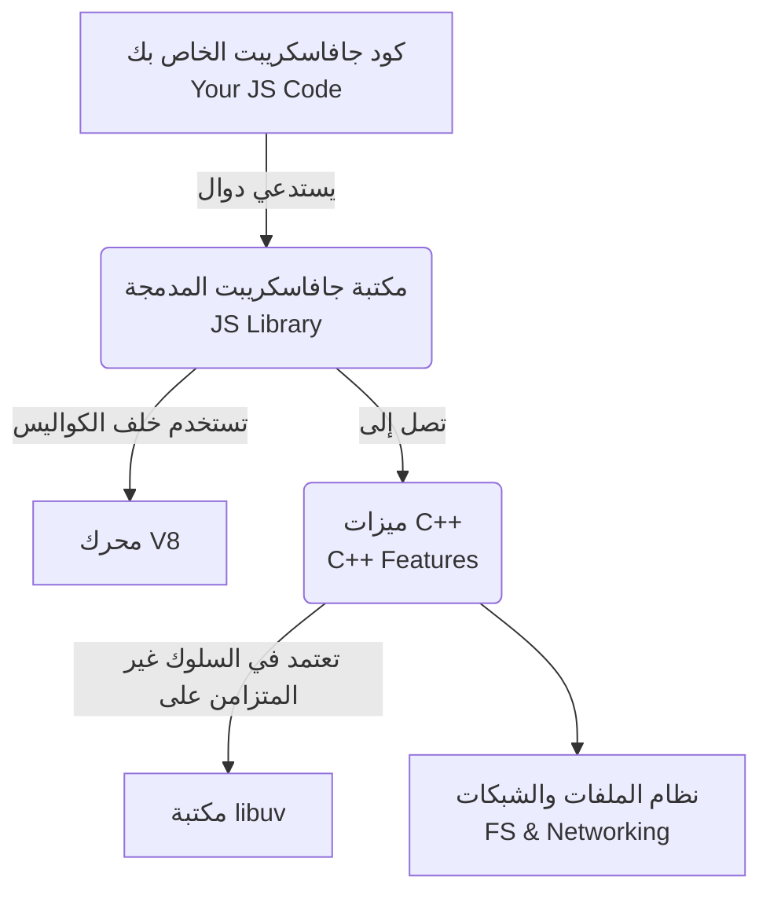

## مراجعة بيئة التشغيل والطبيعة الأساسية لـ Node.js (Node Runtime Recap)

### 1. التمهيد وموضوع القسم (Introduction to Node.js Internals)

في هذا القسم الجديد من السلسلة، ننتقل لأخذ نظرة أعمق وأكثر تفصيلاً على "الآلية الداخلية" (Internals) لبيئة Node.js وكيف تعمل خلف الكواليس. وللبدء في هذا القسم بشكل صحيح، يجب علينا أولاً استرجاع ومراجعة موضوعين رئيسيين تم دراستهما مسبقاً: بيئة تشغيل Node (Node Runtime) وجافاسكريبت غير المتزامنة (Asynchronous JavaScript).

---

### 2. المفهوم الأول: بيئة تشغيل نود (Node.js Runtime)

**التعريف:** بيئة تشغيل نود (**Node Runtime**) هي بيئة متكاملة توفر جميع المكونات والعناصر اللازمة لاستخدام وتشغيل أي برنامج مكتوب بلغة جافاسكريبت (JavaScript program) خارج متصفح الويب.

**المكونات الأساسية لبيئة التشغيل (Core Components):** تتكون بيئة التشغيل في جوهرها من ثلاثة مكونات رئيسية:

1. **التبعيات الخارجية (External Dependencies):**
    - هي عبارة عن مكتبات (Libraries) خارجية تعتمد عليها Node.js لأداء وظائفها الأساسية.
    - **أمثلة:** محرك **V8** (المسؤول عن تنفيذ كود جافاسكريبت) ومكتبة **libuv**.

2. **ميزات وإمكانيات C++ (C++ Features):
    - هي الوظائف ذات المستوى المنخفض (Low-level) التي تتيح التفاعل المباشر مع نظام التشغيل.
    - **أمثلة:** الوصول إلى نظام الملفات (File system access) والشبكات (Networking).

3. **مكتبة جافاسكريبت (JavaScript Library):**
    - توفر هذه المكتبة الدوال والأدوات المساعدة (Functions and utilities) التي تسمح لكتاب الأكواد بالاستفادة من ميزات C++ المذكورة أعلاه من خلال كود جافاسكريبت الخاص بهم.
    - **كيف تعمل:** تعتمد هذه المكتبة في عملها على استخدام محرك **V8** خلف الكواليس (Behind the scenes) لمعالجة الأكواد.

---

### 3. المفهوم الثاني: الطبيعة الأساسية للغة جافاسكريبت (Asynchronous JavaScript Recap)

في شكلها الأساسي والمجرد (Most basic form)، لغة جافاسكريبت تمتلك ثلاث صفات جوهرية تحدد طريقة عملها:

#### أ. متزامنة (Synchronous)

- **التعريف:** تعني أن الكود يُنفذ من الأعلى إلى الأسفل (Top-down)، بحيث يتم تنفيذ سطر واحد فقط في أي وقت محدد (Only one line executing at any given time).
- **مثال تطبيقي:** إذا كان لدينا دالتان (`A` و `B`) تقومان بطباعة رسائل، فإن الدالة `A` سيتم تنفيذها وطباعتها أولاً قبل الدالة `B`.

#### ب. حاجبة للتنفيذ (Blocking)

- **التعريف:** بسبب طبيعة اللغة المتزامنة، مهما استغرقت العملية السابقة (Previous process) من وقت، فلن تبدأ العملية اللاحقة (Subsequent process) حتى تكتمل الأولى تماماً.
- **حالة عملية (تجميد المتصفح):** إذا كان لدينا دالة `A` تحتوي على كود مكثف (Intensive chunk of code) يستغرق معالجته 10 ثوانٍ أو دقيقة كاملة، فإن جافاسكريبت مُجبرة على إنهائه قبل الانتقال للدالة `B`.
- **الأثر:** في تطبيقات الويب التي تعمل على المتصفح، إذا تم تنفيذ كود مكثف دون إعادة التحكم للمتصفح، سيظهر المتصفح للمستخدم وكأنه "متجمد" (Frozen). هذا ما يُسمى بالحظر (Blocking)؛ حيث يُمنع المتصفح من الاستمرار في التعامل مع مدخلات المستخدم (User input) أو أداء مهام أخرى حتى ينتهي التطبيق من مهمته.

#### ج. أحادية المسار (Single-threaded)

- **التعريف:** ال (**Thread**) هو ببساطة عملية (Process) يستخدمها برنامج جافاسكريبت لتنفيذ مهمة معينة، وكل Thread يمكنه القيام بمهمة واحدة فقط في الوقت ذاته.
- **الفكرة الأساسية:** على عكس بعض اللغات الأخرى التي تدعم "تعدد المسارات" (Multi-threading) ويمكنها تشغيل مهام متعددة بالتوازي (In parallel)، تمتلك جافاسكريبت Thread واحد فقط يُسمى **الThread الرئيسي (Main thread)** لتنفيذ أي كود.

---

### 4. التناقض المنطقي والحل (The Paradox & The Solution)

**المشكلة:** إذا كانت جافاسكريبت بالفعل لغة متزامنة، حاجبة، وأحادية المسار، فكيف نفسر السلوك "غير المتزامن" (Asynchronous behavior) لدوال مثل قراءة الملفات (`fs.readFile`) أو إنشاء خوادم الويب (`http.createServer`) في Node.js؟

> `‏` **Important Note** **السر خلف السلوك غير المتزامن في Node.js:** لغة جافاسكريبت وحدها **غير كافية (Not sufficient)** لتفسير أو تحقيق هذا السلوك غير المتزامن. نحن بحاجة إلى أجزاء وتقنيات جديدة من خارج بيئة جافاسكريبت (Outside of JavaScript) لمساعدتنا في كتابة كود غير متزامن، وفي حالة Node.js، هذه القطعة السحرية والتبعية الخارجية (External dependency) هي مكتبة **libuv**.

---

### 5. رسم توضيحي: بنية بيئة تشغيل Node.js

بناءً على المكونات الثلاثة التي ذكرها المحاضر لبيئة التشغيل، يمكن تمثيل الهيكلية كالتالي:

---

### 6. التمهيد للدرس القادم (Next Steps)

 الهدف الرئيسي من هذا القسم هو الفهم العميق لمكتبة **libuv**. في الدرس القادم، سيتم التركيز حصرياً على استكشاف ماهية مكتبة `libuv`، والدور المحوري الذي تلعبه في تحقيق المعمارية الموجهة بالأحداث وغير المتزامنة (Asynchronous event-driven architecture) التي تتميز بها بيئة Node.js.