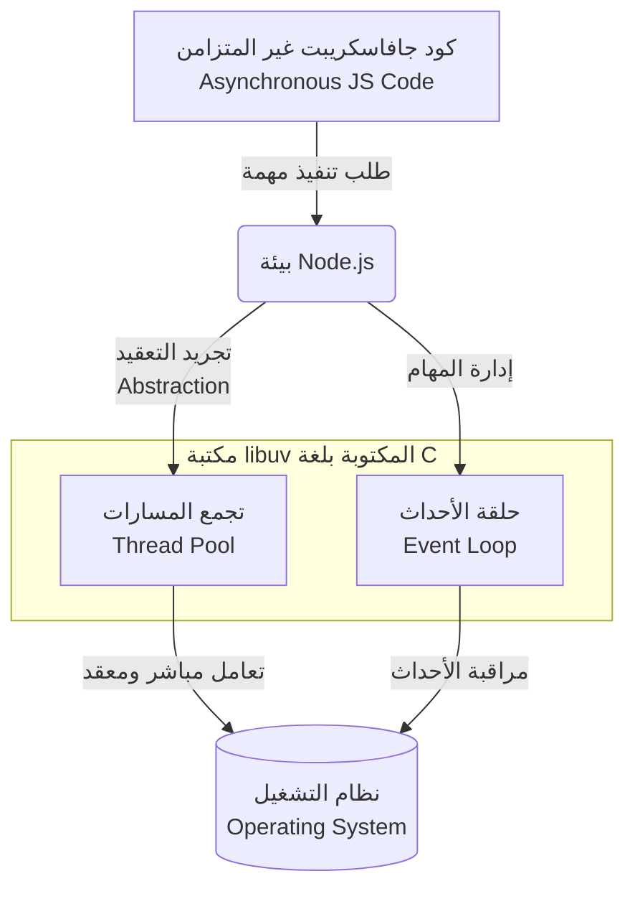

## المرجع الدراسي الاحترافي: مكتبة (libuv) في Node.js

### 1. التمهيد والسياق (Context)

بعد أن تعرفنا في الدرس السابق على البنية الأساسية لبيئة تشغيل Node.js وكيف تعتمد على مكتبات خارجية لتحقيق سلوكها غير المتزامن، ننتقل في هذا الدرس للتركيز على القطعة البرمجية الأهم في هذه البنية: مكتبة **`libuv`**. سنعتمد  في شرح هذه المكتبة على منهجية ثلاثية: **ما هي (What)، لماذا نحتاجها (Why)، وكيف تعمل (How)**.

---

### 2. المفهوم الأساسي: ما هي مكتبة libuv؟ (What is libuv?)

**التعريف:** مكتبة **`libuv`** هي عبارة عن مكتبة برمجية مفتوحة المصدر (**==Open Source Library==**) وتعمل على منصات وأنظمة تشغيل متعددة (**==Cross-platform==**).

**الخصائص التقنية:** على عكس بيئة Node.js التي نكتب أكوادها بلغة جافاسكريبت، فإن مكتبة `libuv` مكتوبة بالكامل بلغة السي (**==C language==**).

---

### 3. الأهمية والوظيفة: لماذا نحتاج إلى libuv؟ (?Why do we need libuv)

تلعب هذه المكتبة دوراً حيوياً ومحورياً لا يمكن الاستغناء عنه في بيئة Node.js، وذلك لسببين رئيسيين:

1. **إدارة العمليات غير المتزامنة (==Handling Asynchronous Operations==):** المهمة الأساسية لمكتبة `libuv` هي تولي مسؤولية تنفيذ ومعالجة "العمليات غير المتزامنة وغير الحاجبة للتنفيذ" (**==Asynchronous non-blocking operations==**) داخل Node.js. بفضلها، لا تتجمد جافاسكريبت عند تنفيذ مهام طويلة مثل قراءة الملفات أو طلبات الشبكة.
    
2. **التجريد وإخفاء التعقيد (==Abstraction==):** تقوم هذه المكتبة بتجريد وإخفاء كافة التعقيدات (**==Abstracts away all the complexity==**) المرتبطة بالتعامل والتخاطب المباشر مع نظام التشغيل (**Operating System**).
    
    - الشرح : بدلاً من أن يضطر مطور Node.js لكتابة أكواد معقدة تتوافق مع نظام تشغيل Windows بشكل مختلف عن Linux للقيام بعمليات الإدخال والإخراج، تقوم `libuv` بتوحيد هذه العملية والتعامل مع نظام التشغيل بالنيابة عن المطور.

---

### 4. آلية العمل: كيف تعمل مكتبة libuv؟ (How does it do that?)

للقيام بوظائفها المعقدة في إدارة العمليات غير المتزامنة والتخاطب مع نظام التشغيل، تعتمد مكتبة `libuv` على ميزتين أساسيتين (Two very important features):

1. **تجمع المسارات (==Thread Pool==):** مجموعة من threads التنفيذ التي تعمل في الخلفية للتعامل مع المهام الثقيلة.
2. **حلقة الأحداث (==Event Loop==):** الآلية التي تدير وتنسق تنفيذ دوال الاستدعاء العكسي (Callbacks) وتراقب اكتمال المهام.

---

### 5. ملاحظات المحاضر المنهجية

>`‏` **Important Note** **بناء النموذج الذهني (Forming a Mental Model):** نوّه المحاضر إلى أن مكتبة `libuv` تحتوي تقنياً على تفاصيل وميزات أكثر بكثير من مجرد هاتين الميزتين. ولكن، بالنسبة للمطورين المبتدئين (As beginners)، فإن فهم واستيعاب آلية عمل **تجمع المسارات (Thread Pool)** و **حلقة الأحداث (Event Loop)** يُعد **كافياً تماماً (More than sufficient)** لمساعدتك على تكوين "نموذج ذهني" صحيح وواضح حول كيفية تعامل بيئة Node.js مع الأكواد غير المتزامنة.

---

### 6. رسم توضيحي: موقع libuv في معمارية Node.js

يوضح الرسم التالي دور مكتبة `libuv` كوسيط أساسي داخل بيئة تشغيل Node.js بناءً على الشرح:

**الخطوة القادمة (Next Step):** بناءً على هذه المقدمة، أعلن المحاضر أن الدروس القادمة ستكون مخصصة لشرح هاتين الميزتين بالتفصيل الدقيق، وسيكون الدرس القادم هو نقطة البداية لشرح الميزة الأولى: **تجمع المسارات (Thread Pool)**.