## المرجع الدراسي الاحترافي: تجمع المسارات (Thread Pool) في Node.js

### 1. التمهيد والسياق (Context)
في الدروس السابقة، تعلمنا أن لغة جافاسكريبت هي لغة أحادية المسار (Single-threaded) وحاجبة للتنفيذ (Blocking). ومع ذلك، لاحظنا أن بيئة Node.js تستطيع تنفيذ مهام غير متزامنة (Asynchronous) وغير حاجبة (Non-blocking). يعود الفضل في ذلك إلى مكتبة **libuv**. في هذا الدرس، سنسلط الضوء على إحدى أهم ميزات هذه المكتبة، وهي **ال (Thread Pool)**، لفهم كيف تتم العمليات خلف الكواليس.

---

### 2. مراجعة السلوك غير المتزامن (Asynchronous Behavior Recap)

لإثبات السلوك غير المتزامن، سنطرح مثالاً قمنا بدراسته سابقاً باستخدام وحدة نظام الملفات (`fs`) لقراءة ملف.

**الكود البرمجي:**
```javascript
const fs = require('node:fs');

console.log('first'); // 1. طباعة الرسالة الأولى

// 2. قراءة الملف بشكل غير متزامن
fs.readFile('./file.txt', 'utf-8', (err, data) => {
    console.log('file contents'); // تُطبع أخيراً بعد اكتمال القراءة
});

console.log('last'); // 3. طباعة الرسالة الأخيرة
```
**المخرجات:**
1.`‏` `first`
2.`‏` `last`
3.`‏` `file contents`

**الاستنتاج:**
من الواضح أن دالة `readFile` غير متزامنة (Asynchronous) وغير حاجبة (Non-blocking)، حيث سمحت بتنفيذ الكود الذي يليها (طباعة `last`) بينما كانت عملية قراءة الملف مستمرة في الخلفية. السؤال هنا: **كيف تمكنت Node.js من فعل ذلك؟** الإجابة تكمن في **تجمع المسارات (Thread Pool)**.

---

### 3. المفهوم الأساسي: تجمع المسارات (Thread Pool)

**التعريف:**
تجمع المسارات (**Thread Pool**) هو حرفياً مجموعة (Pool) من ال (Threads) المنفصلة التي توفرها مكتبة **libuv** لبيئة Node.js.

**الفكرة الأساسية (كيف تعمل؟):**
لفهم الآلية، سنستخدم "محادثة تخيلية" بين ال thread الرئسي لجافاسكريبت (Main Thread) ومكتبة libuv:
- **الMain Thread:** "مرحباً libuv، أحتاج إلى قراءة محتويات ملف، ولكن هذه مهمة تستغرق وقتاً طويلاً (Time-consuming task)، ولا أريد حظر بقية الكود من التنفيذ. هل يمكنك تولي هذه المهمة عني (Offload this task)؟"
- **مكتبة libuv:** "بالتأكيد أيها المسار الرئيسي. على عكسك (حيث أنك أحادي الthread )، أنا أمتلك **تجمعاً من الثريدات (Pool of threads)** يمكنني استخدامها لتشغيل هذه المهام الثقيلة. عندما تنتهي المهمة ويتم جلب البيانات، سأقوم بتشغيل دالة ال (Callback function) المرتبطة بها."

**لماذا نستخدمها ومتى؟**
تُستخدم لتفريغ (Offload) المهام التي تستغرق وقتاً طويلاً (مثل عمليات الإدخال/الإخراج كقراءة الملفات، أو العمليات الحسابية المعقدة) من الMain Thread، لضمان عدم توقف أو تجميد التطبيق.

---

### 4. وحدة التشفير (Crypto Module)

لإجراء تجارب دقيقة وقياس أداء "ال Pool thread"، سنقدم  built-in module جديدة.

**التعريف:**
وحدة **Crypto** هي وحدة مدمجة (Built-in module) في Node.js توفر وظائف تشفيرية (Cryptographic functionality). 

**دالة (PBKDF2):**
وهي اختصار لـ **Password-Based Key Derivation Function 2** (دالة اشتقاق المفتاح المستندة إلى كلمة المرور 2).
- **الفكرة الأساسية:** هي إحدى الطرق الشائعة جداً لـ "تشفير كلمات المرور" (==Hash passwords==) قبل تخزينها في قواعد البيانات.
- **لماذا استخدمناها في التجربة؟** لأنها تُعد مهمة "مكثفة الاستهلاك للمعالج" (CPU intensive method) وتستغرق وقتاً طويلاً، وبالتالي يتم تحويلها تلقائياً (Offloaded) إلى تجمع مسارات libuv.

---

### 5. التجربة الأولى: التنفيذ المتزامن (Synchronous Execution)

سنقوم بقياس الوقت المستغرق لتشغيل النسخة **المتزامنة** من دالة التشفير باستخدام كائن التاريخ المدمج في جافاسكريبت (`Date object`).

**الكود البرمجي:**
```javascript
const crypto = require('node:crypto');

// قياس الوقت قبل التنفيذ
const start = Date.now();

// تشفير كلمة مرور (استدعاء واحد) - المعاملات هنا لغرض التجربة فقط
crypto.pbkdf2Sync('password', 'salt', 100000, 512, 'sha512');

// حساب الوقت المستغرق وطباعته
console.log('Hash: ', Date.now() - start);
```

**النتائج والمخرجات:**
- **استدعاء واحد (1 Call):** استغرق حوالي `261` مللي ثانية (ms).
- **استدعاء الدالة مرتين متتاليتين (2 Calls):** استغرق حوالي `522` مللي ثانية (تقريباً الضعف).
- **استدعاء الدالة 3 مرات متتالية (3 Calls):** استغرق حوالي `783` مللي ثانية (ثلاثة أضعاف).
(ملاحظة: هذه الأرقام قد تتغير بناءً على قوة عتاد الحاسوب Hardware الخاص بك).

**الاستنتاج الهندسي:**
كل استدعاء لدالة `pbkdf2Sync` هو متزامن (Synchronous) وحاجب للتنفيذ (Blocking). التنفيذ هنا تسلسلي (Sequential)؛ إذا كان استدعاء واحد يستغرق وقت (T)، فإن 3 استدعاءات ستستغرق (3T).

> `‏` **Important Note**
> **قاعدة جوهرية :**
> أي دالة أو  (Method) في Node.js تنتهي باللاحقة **`Sync`** (مثل `readFileSync` أو `pbkdf2Sync`)، فهي **تعمل دائماً على ال (Runs on the main thread) وتكون حاجبة للتنفيذ (Blocking)**. لا تعتمد هذه الدوال على ال pool threads الخاصة ب libuv.

---

### 6. التجربة الثانية: التنفيذ غير المتزامن (Asynchronous Execution)

الآن، سنقوم بتجربة النسخة **غير المتزامنة** (`pbkdf2`) والتي تعتمد على دالة استدعاء عكسي (Callback)، باستخدام حلقة تكرار (For loop) لتقييم الأداء.

**الكود البرمجي:**
```javascript
const crypto = require('node:crypto');

const MAX_CALLS = 3; // التحكم بعدد الاستدعاءات
const start = Date.now();

for (let i = 0; i < MAX_CALLS; i++) {
    // استدعاء الدالة غير المتزامنة
    crypto.pbkdf2('password', 'salt', 100000, 512, 'sha512', () => {
        // تُطبع هذه النتيجة عند انتهاء التشفير
        console.log(`Hash ${i + 1}: `, Date.now() - start);
    });
}
```

**النتائج والمخرجات:**
- عندما `MAX_CALLS = 1`: استغرق حوالي `261` مللي ثانية.
- عندما `MAX_CALLS = 2`: استغرق الاستدعاءان معاً حوالي `260` مللي ثانية! (وقت أعلى بشكل طفيف جداً، ولكنه **ليس الضعف**).
- عندما `MAX_CALLS = 3`: استغرقت جميعها حوالي `270` مللي ثانية! (الاستدعاء الثالث **لم يأخذ ثلاثة أضعاف الوقت**).

**الاستنتاج الهندسي:**
التنفيذ هنا متوازٍ (**Parallel execution**). كل استدعاء لدالة `pbkdf2` تم تشغيله في **مسار منفصل (==Separate thread==)** داخل تجمع مسارات libuv (Thread Pool). نظراً لأنها عولجت في نفس الوقت، انتهت جميعها في وقت متقارب جداً.

> `‏` **Important Note**
> **حقيقة هندسية دقيقة حول المسارات (How it actually works):**
> دوال مثل `fs.readFile` و `crypto.pbkdf2` تعمل بشكل "متزامن" (Synchronously) داخل المسار المنفصل (Own thread) المخصص لها في ال (Thread Pool). ولكن، من وجهة نظر "المسار الرئيسي" (Main thread)، تبدو العملية وكأنها غير متزامنة (Asynchronous)، لأن الMain Thread لم يتوقف واصل عمله.

---

### 7. جدول مقارنة: التنفيذ المتزامن مقابل غير المتزامن (Crypto Module)

|    وجه المقارنة (Feature)    |        الدالة `pbkdf2Sync` (المتزامنة)         |               الدالة `pbkdf2` (غير المتزامنة)               |
| :--------------------------: | :--------------------------------------------: | :---------------------------------------------------------: |
|       **مكان التنفيذ**       |  المسار الرئيسي (Main Thread) لبيئة Node.js.   | مسار منفصل (Separate Thread) في Thread Pool الخاص بـ libuv. |
|       **سلوك المسار**        |   يحظر (Blocks) تنفيذ أي كود آخر حتى ينتهي.    |           لا يحظر المسار الرئيسي (Non-blocking).            |
| **نمط التنفيذ عند التكرار**  |         تسلسلي (Sequential Execution).         |                متوازٍ (Parallel Execution).                 |
| **الوقت الإجمالي لـ 3 مهام** | $T \times 3$ (ثلاثة أضعاف وقت المهمة الواحدة). |          $\approx T$ (تقريباً نفس وقت مهمة واحدة).          |

---

### 8. رسم توضيحي: مسار التنفيذ التسلسلي مقابل المتوازي

يوضح الرسم التالي الفرق الجوهري في كيفية تعامل Node.js مع المهام الثقيلة في التجربتين:

```mermaid
gantt
    title التجربة الأولى: التنفيذ المتزامن (Sequential Execution)
    dateFormat  s
    axisFormat %S
    
    section Main Thread
    pbkdf2Sync 1       :a1, 0, 1s
    pbkdf2Sync 2       :a2, after a1, 1s
    pbkdf2Sync 3       :a3, after a2, 1s

    %% --------------------------------------------------------

    title التجربة الثانية: التنفيذ غير المتزامن المتوازي (Parallel Execution)
    dateFormat  s
    axisFormat %S

    section Main Thread
    Offload tasks to libuv :b1, 0, 0.1s
    
    section libuv Thread 1
    pbkdf2 (Task 1)        :c1, after b1, 1s
    
    section libuv Thread 2
    pbkdf2 (Task 2)        :c2, after b1, 1s
    
    section libuv Thread 3
    pbkdf2 (Task 3)        :c3, after b1, 1s
```



(توضيح الرسم: في التنفيذ المتزامن، تنتظر المهمة الثانية انتهاء الأولى، بينما في التنفيذ المتوازي، تعمل جميع المهام في نفس الوقت في مسارات منفصلة).

**الخطوة القادمة (Next Steps):**
في هذا الدرس، لاحظنا أن `libuv` تمكنت من التعامل مع 3 مهام في نفس الوقت بسهولة. في الدرس القادم، سنقوم بزيادة قيمة الثابت `MAX_CALLS` أكثر لنكتشف ما سيحدث عندما يتجاوز عدد المهام سعة تجمع المسارات (Thread Pool Size) ونفهم القيود المعمارية لذلك.