## المرجع الدراسي الاحترافي: حجم تجمع المسارات (Thread Pool Size) في Node.js

### 1. التمهيد والسياق (Context)
في الدرس السابق، استكشفنا كيف تقوم بيئة Node.js بتفريغ (Offload) بعض المهام غير المتزامنة مثل دالة التشفير (`pbkdf2`) إلى **ال (Thread Pool)** الخاص بمكتبة **libuv**. لاحظنا أن تنفيذ الدالة 3 مرات حدث بالتوازي (In parallel). 
السؤال الجوهري الذي يطرحه هذا الدرس هو: **كم عدد المسارات (Threads) المتاحة إجمالاً في هذا الPool؟ وهل يمكننا التحكم بهذا العدد لزيادة الأداء؟** تمت الإجابة على هذه الأسئلة من خلال سلسلة من التجارب العملية.

---

### 2. التجربة الأولى: اكتشاف الحجم الافتراضي (Default Pool Size)

لمعرفة الحجم الافتراضي لتجمع المسارات، قام المحاضر بزيادة عدد الاستدعاءات لدالة التشفير (`pbkdf2`) تدريجياً.

**الخطوات والملاحظات (Step-by-Step):**

- `‏`**Step 1:** تعيين عدد الاستدعاءات إلى 4 (`MAX_CALLS = 4`).
  - **النتيجة:** انتهت جميع عمليات التشفير الأربعة في نفس الوقت تقريباً (حوالي 300 مللي ثانية).
  
- `‏`**Step 2:** تعيين عدد الاستدعاءات إلى 5 (`MAX_CALLS = 5`).
  - **النتيجة:** العمليات الأربع الأولى انتهت في 300 مللي ثانية، بينما العملية الخامسة (Hash 5) استغرقت **ضعف الوقت** (حوالي 600 مللي ثانية).

**الاستنتاج الأكاديمي (Inference):**
- تمتلك مكتبة **libuv** حجماً افتراضياً يبلغ **4 مسارات (4 Threads)** فقط.
- عندما نطلب 5 مهام، تقوم المسارات الأربعة الأولى بمعالجة أول 4 مهام في نفس الوقت. 
- تضطر المهمة الخامسة إلى **الانتظار (Wait)** حتى يفرغ أحد المسارات. بمجرد انتهاء المهمة الأولى، يستلم الthread الفارغ المهمة الخامسة، مما يفسر سبب استغراقها لضعف الوقت الإجمالي.

---

### 3. التجربة الثانية: زيادة حجم تجمع المسارات (Increasing Thread Pool Size)

السؤال المنطقي: هل يمكننا زيادة هذا العدد لكي تعمل 5 أو 6 مهام بالتوازي وتحسين الأداء؟ الإجابة هي: نعم.

**كيف تعمل (طريقة التعديل):**
يمكننا تعديل حجم تجمع المسارات من خلال التلاعب بمتغيرات البيئة (Environment Variables) الخاصة بعملية Node.js، وتحديداً المتغير المسمى **`UV_THREADPOOL_SIZE`**.

**التطبيق البرمجي (Code Implementation):**
```javascript
// تعيين حجم تجمع المسارات إلى 5 بدلاً من 4 الافتراضية
process.env.UV_THREADPOOL_SIZE = 5;

const crypto = require('node:crypto');
const MAX_CALLS = 5; 
const start = Date.now();

for (let i = 0; i < MAX_CALLS; i++) {
    crypto.pbkdf2('password', 'salt', 100000, 512, 'sha512', () => {
        console.log(`Hash ${i + 1}: `, Date.now() - start);
    });
}
```

**النتيجة والاستنتاج:**
- عند تعيين الحجم إلى `5` وتشغيل 5 مهام، انتهت جميعها في نفس الوقت ولم تستغرق المهمة الخامسة ضعف الوقت.
- عند تعيين الحجم إلى `6` وتشغيل 6 مهام، حدث نفس الشيء.
- **الفائدة:** زيادة حجم ال thread pool يسمح بتنفيذ المزيد من المهام غير المتزامنة بالتوازي، مما يُحسن إجمالي وقت التنفيذ (Improves total time taken).

---

### 4. التجربة الثالثة: القيود وعتاد الحاسوب (Hardware Limitations)

هنا يبرز سؤال خطير: إذا كانت زيادة الthread تُحسن الأداء، لماذا لا نجعلها 100 أو 1000 ثريد؟

**التجربة (حالة عملية على جهاز المحاضر):**
- **مواصفات الجهاز:** حاسوب (MacBook) يمتلك **8 أنوية معالج فعلية (8 CPU Cores)**.
- **الاختبار الأول:** تم تعيين حجم تجمع المسارات إلى `8`، وعدد المهام إلى `8`.
  - **النتيجة:** استغرقت جميع المهام حوالي `300` مللي ثانية (أداء ممتاز، مسار واحد لكل نواة).
- **الاختبار الثاني:** تم تعيين حجم تجمع المسارات إلى `16`، وعدد المهام إلى `16`.
  - **النتيجة:** استغرقت جميع المهام ما بين `550` إلى `600` مللي ثانية! (أي **ضعف الوقت** رغم وجود 16 مساراً).

**الشرح  (لماذا حدث ذلك؟):**
- المشكلة تكمن في **مُجدول نظام التشغيل (OS Scheduler)**.
- عندما يكون لدينا 16 ثريد برمجياً ولكننا نمتلك 8 أنوية فيزيائية (Physical cores) فقط، فإن نظام التشغيل يضطر للقيام بعملية تُسمى التبديل أو "التبديل السياقي" (**==Context Switching / Juggling threads==**).
- يقوم نظام التشغيل بالتبديل السريع بين الـ 16 ثريد على الـ 8 أنوية لضمان حصول كل ثريد على قدر متساوٍ من وقت المعالجة.
- نتيجة لهذه المشاركة والتبديل (Sharing cores)، فإن المهمة التي كانت تستغرق 300 مللي ثانية وهي تحتكر النواة، ستستغرق الآن ضعف الوقت لأن النواة مقسمة بين مهمتين.

> `‏` **Important Note**
> **القاعدة الذهبية لتحسين الأداء (Performance Rule):**
> زيادة حجم  (`Thread Pool Size`) يُمكن أن يُحسن الأداء، ولكن هذا التحسن **محدود إجبارياً** بعدد أنوية المعالج (CPU Cores) المتاحة في الجهاز. إذا تجاوزت المسارات عدد الأنوية، سيزداد متوسط الوقت المستغرق لكل مهمة.

---

### 5. جدول مقارنة: تأثير العلاقة بين المسارات وأنوية المعالج

| عدد المهام (Tasks) | حجم تجمع المسارات المخصص (Pool Size) | عدد أنوية المعالج الفيزيائية (CPU Cores) |    الوقت المستغرق المتوقع (Performance)     |                         السبب التقني                         |
| :----------------: | :----------------------------------: | :--------------------------------------: | :-----------------------------------------: | :----------------------------------------------------------: |
|     **5 مهام**     |          **4 (الافتراضي)**           |                 8 أنوية                  |         المهمة الـ 5 تستغرق الضعف.          |       نفاد المسارات؛ المهمة الـ 5 تنتظر مساراً فارغاً.       |
|     **8 مهام**     |             **8 مسارات**             |                 8 أنوية                  | جميع المهام تنتهي سريعاً ($\approx 300ms$). |        تخصيص مثالي (1 مسار = 1 نواة). لا يوجد انتظار.        |
|    **16 مهمة**     |            **16 مساراً**             |                 8 أنوية                  | جميع المهام تستغرق الضعف ($\approx 600ms$). | عنق زجاجة في العتاد؛ نظام التشغيل يُبدّل المهام على الأنوية. |

---

### 6. رسم توضيحي: آلية عمل المهام وتجمع المسارات الافتراضي

يوضح مخطط (Gantt) التالي سلوك مكتبة `libuv` بحجمها الافتراضي (4 مسارات) عند إعطائها 5 مهام معالجة:

```mermaid
gantt
    title سلوك مكتبة libuv الافتراضي (4 مسارات) مع 5 مهام
    dateFormat  s
    axisFormat %S
    
    section Thread 1 (مسار 1)
    المهمة 1 (Hash 1)        :a1, 0, 1s
    المهمة 5 (Hash 5)        :a5, after a1, 1s
    
    section Thread 2 (مسار 2)
    المهمة 2 (Hash 2)        :a2, 0, 1s
    
    section Thread 3 (مسار 3)
    المهمة 3 (Hash 3)        :a3, 0, 1s
    
    section Thread 4 (مسار 4)
    المهمة 4 (Hash 4)        :a4, 0, 1s
```


*(يُظهر الرسم بوضوح كيف تضطر المهمة الخامسة للانتظار حتى ينتهي المسار الأول من عمله، مما يُضاعف وقتها الإجمالي).*

---

### 7. الخلاصة والتمهيد للدرس القادم

- تُدير مكتبة `libuv` المهام الثقيلة وغير المتزامنة عبر **تجمع المسارات (Thread Pool)**.
- الحجم الافتراضي لهذا التجمع هو **4 مسارات**.
- يمكننا تغيير هذا الحجم باستخدام ==`process.env.UV_THREADPOOL_SIZE`==.
- الأداء محكوم بـ **عدد أنوية المعالج** المتاحة في خادم الاستضافة الخاص بك.
- **التمهيد:** أكد المحاضر في النهاية أن مكتبة `libuv` وتجمع المسارات يساعدان في تنفيذ **بعض (Some)** المهام غير المتزامنة في Node.js، وليس جميعها! لمعرفة ما هي المهام التي لا تستخدم Thread Pool وكيف تعمل، سيكون ذلك موضوع الدرس القادم.