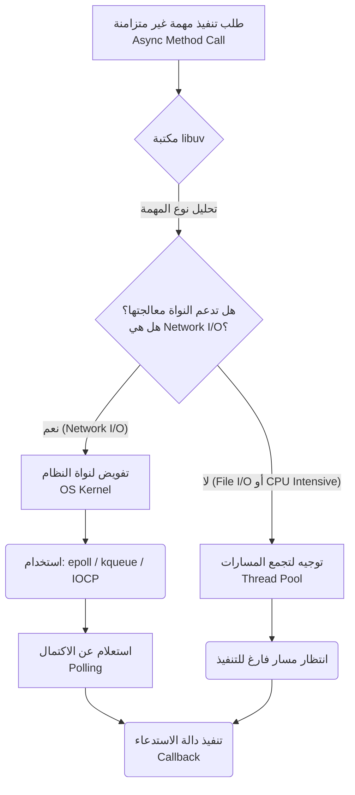

## المرجع الدراسي الاحترافي: عمليات الإدخال والإخراج للشبكة (Network I/O) في Node.js

### 1. التمهيد والسياق (Context)
في الدروس الخمسة السابقة، قمنا بإجراء تجارب لفهم دور **تجمع المسارات (Thread Pool)** الخاص بمكتبة **libuv** عند تنفيذ مهام غير متزامنة مثل قراءة الملفات (`fs.readFile`) أو التشفير (`crypto.pbkdf2`).
في هذا الدرس، نبقى في نفس إطار عمل مكتبة **libuv** والدوال غير المتزامنة، ولكن سنسلط الضوء على نقطة معمارية مختلفة تماماً من خلال إجراء التجربة السادسة باستخدام دوال تعتمد على **عمليات الإدخال والإخراج للشبكة (Network I/O)**.

---

### 2. المفهوم الأساسي: وحدة (https) وطلبات الشبكة

**التعريف:**
وحدة **`https`** هي وحدة مدمجة (Built-in Module) في Node.js، وهي ببساطة "النسخة الآمنة" (Secure version) من وحدة `http` التي درسناها سابقاً.

**الفكرة الأساسية في هذه التجربة:**
سنستخدم دالة `()https.request` لإجراء طلب شبكة (Network Request) إلى موقع خارجي (Google.com)، وسنقوم بقياس الوقت الذي تستغرقه هذه العملية لفهم كيف تتعامل بيئة Node.js مع هذا النوع من المهام.

---

### 3. خطوات التطبيق العملي: إعداد التجربة السادسة

قمنا بإيقاف كود التشفير (`pbkdf2`) وتجميد سطر تعديل حجم `Thread Pool` من الدرس السابق، وكتبنا الكود التالي بدلاً منه.

`‏`**Step 1:** استيراد وحدة `https` المدمجة.
`‏`**Step 2:** استخدام حلقة تكرار `for` للتحكم بعدد الطلبات المتزامنة عبر المتغير `MAX_CALLS`.
`‏`**Step 3:** استدعاء دالة `https.request` وتمرير الرابط وال callback function.
`‏`**Step 4:** الاستماع لأحداث `data` و `end` لقياس الوقت عند اكتمال الاستجابة.

**الكود البرمجي (Code Implementation):**
```javascript
// 1. استيراد وحدة https الآمنة
const https = require('node:https');

// تحديد عدد الطلبات المراد تنفيذها
const MAX_CALLS = 1; 

// تسجيل وقت البداية
const start = Date.now();

// 2. استخدام حلقة التكرار لإطلاق الطلبات
for (let i = 0; i < MAX_CALLS; i++) {
    // 3. إرسال طلب إلى جوجل، وتمرير دالة للتعامل مع الاستجابة (response)
    https.request('https://google.com', (response) => {
        
        // الاستماع لحدث 'data' (مطلوب لاستمرار تدفق البيانات)
        response.on('data', () => {}); 
        
        // 4. الاستماع لحدث 'end' الذي يُطلق عند اكتمال الاستجابة
        response.on('end', () => {
            // حساب الوقت المستغرق وطباعته
            console.log(`Request ${i + 1}: `, Date.now() - start);
        });
        
    }).end(); // إنهاء وإرسال الطلب فعلياً
}
```

---

### 4. تنفيذ التجربة والملاحظات المدهشة (Execution & Results)

سنقوم بتشغيل الكود مع تغيير قيمة `MAX_CALLS` في كل مرة، وكانت النتائج كالتالي:

- عند `MAX_CALLS = 1`: استغرق الطلب حوالي **200** مللي ثانية.
- عند `MAX_CALLS = 2`: تراوح متوسط الوقت بين **200 إلى 300** مللي ثانية.
- عند `MAX_CALLS = 4`: تراوح المتوسط بين **200 إلى 300** مللي ثانية.
- **الاختبار الحاسم (تجاوز سعة Thread Pool):** عند `MAX_CALLS = 6` (وهو رقم أكبر من الحجم الافتراضي لتجمع المسارات البالغ 4)، استمر المتوسط بين **200 إلى 300** مللي ثانية!
- **الاختبار القاسي:** عند `MAX_CALLS = 12`، بشكل مفاجئ (Surprisingly)، ظل المتوسط بين **200 إلى 300** مللي ثانية لجميع الطلبات الـ 12!

---

### 5. الاستنتاجات الهندسية الدقيقة (Engineering Inferences)

بناءً على النتائج السابقة، نستنتج نقطتين جوهريتين تُفسران الآلية الداخلية:

1. **لا يتم استخدام تجمع المسارات (Does not use Thread Pool):**
   على الرغم من أن دالة `https.request` هي دالة غير متزامنة (Asynchronous)، إلا أنها **==لا تستخدم** `Thread Pool`==. الدليل على ذلك هو ثبات الوقت (Average time remains the same) سواء أطلقنا طلباً واحداً أو 12 طلباً. لو كانت تعتمد على `Thread Pool`، للاحظنا تضاعف الوقت بعد الطلب الرابع (كما حدث في درس التشفير).

2. **لا تتأثر بعدد أنوية المعالج (==Not affected by CPU cores==):**
   حتى مع تشغيل 12 طلباً في نفس الوقت، كان الأداء ثابتاً ولم ينخفض، مما يعني أن هذه العملية ليست "مكثفة الاستهلاك للمعالج" (Not a CPU-bound operation).

---

### 6. كيف تعمل إذن؟ (السر خلف الكواليس)

إذا لم تستخدم `Thread Pool`، فكيف عالجت Node.js 12 طلباً شبكياً في نفس الوقت دون إيقاف الMain Thread ؟

**التفسير العلمي:**
دالة `https.request` هي عملية **إدخال/إخراج للشبكة (==Network Input/Output operation==)**. في هذا النوع من المهام، تقوم مكتبة **`libuv`** بـ **تفويض أو إحالة (==Delegates==)** العمل بالكامل إلى **نواة نظام التشغيل (==Operating System Kernel==)**.

**آلية الاستعلام (Polling):**
تقوم النواة (Kernel) بإجراء الاتصال الشبكي، وكلما أمكن، تقوم مكتبة `libuv` بعملية **"استعلام" (Poll)** للنواة لتتحقق مما إذا كان الطلب قد اكتمل أم لا. هذا هو السبب المباشر الذي جعلنا نرى نفس وقت الاستجابة لـ 1، أو 4، أو حتى 12 طلباً متزامناً.

---

### 7. المفهوم الشامل: كيف تعالج libuv المهام غير المتزامنة؟

> `‏` **Important Note**
> **الخلاصة المعمارية الشاملة لبيئة Node.js:**
> بناءً على ما سبق، تُعالج مكتبة `libuv` الدوال غير المتزامنة (Async Methods) بواحدة من **طريقتين مختلفتين**:
> 1. **الآليات غير المتزامنة الأصلية للنظام (Native Async Mechanisms)**.
> 2. **تجمع المسارات (Thread Pool)**.

#### أ. الآليات غير المتزامنة الأصلية (Native Async Mechanisms)
- **متى تُستخدم؟** كلما كان ذلك ممكناً (Whenever possible)، تُفضل `libuv` استخدام الآليات المدعومة مباشرة من نواة نظام التشغيل لتجنب ال Blocking for main thread.
- **الأمثلة:** عمليات الشبكات (Network I/O).
- **الاختلاف حسب نظام التشغيل (OS Specific):** نظراً لأن هذه الآليات جزء من نواة النظام، فإن كل نظام تشغيل يمتلك آلية مختلفة تتعامل معها `libuv`:
  -`‏` **Linux:** يستخدم تقنية `epoll`.
  - `‏`**Mac OS:** يستخدم تقنية `kqueue`.
  -`‏` **Windows:** يستخدم تقنية `IO Completion Port`.
- **الميزة الكبرى (Scalability):** الاعتماد على هذه التقنيات يجعل Node.js عالية القابلية للتوسع (Scalable)، لأن القيد الوحيد هنا هو قدرة نواة نظام التشغيل نفسه، وليس عدد مسارات محدودة.

#### ب. تجمع المسارات (Thread Pool)
- **متى يُستخدم؟** إذا لم يكن هناك دعم أصلي في نظام التشغيل للمهمة (==No native async support==)، وكانت المهمة تتعلق بـ:
  - ملفات النظام (==File I/O==) مثل `fs.readFile`.
  - عمليات مكثفة للمعالج (==CPU Intensive==) مثل التشفير `crypto.pbkdf2`.
- **العيوب:** على الرغم من أنها تحافظ على السلوك غير المتزامن (Asynchronicity)، إلا أنها يمكن أن تتحول إلى **عنق زجاجة (Bottleneck)** إذا أصبحت جميع ال (Threads) مشغولة بمهام ثقيلة.

---

### 8. جدول مقارنة: طرق معالجة المهام في (libuv)

| الميزة (Feature) | آليات النظام الأصلية (Native Async Mechanisms) | تجمع المسارات (Thread Pool) |
| :--- | :--- | :--- |
| **نوع المهام الموكلة إليها** | عمليات الشبكة (Network I/O) مثل `https.request`. | ملفات النظام (File I/O) والعمليات الحسابية (CPU Intensive). |
| **جهة التنفيذ الفعلية** | نواة نظام التشغيل (OS Kernel). | مسارات خلفية تابعة لمكتبة (libuv). |
| **أمثلة على التقنيات** | `epoll` (Linux), `kqueue` (Mac), `IOCP` (Win). | 4 مسارات افتراضية قابلة للتعديل. |
| **قابلية التوسع (Scalability)**| عالية جداً (محدودة بقدرة النواة فقط). | محدودة (تتأثر بـسعة التجمع وعدد أنوية المعالج). |
| **نقاط الضعف** | لا يوجد ضعف تقريبي في البيئات العادية. | تصبح عنق زجاجة (Bottleneck) عند ازدحام المهام. |

---

### 9. رسم توضيحي: مسار القرار في مكتبة (libuv)

يوضح هذا الرسم كيف تتخذ مكتبة `libuv` قرار معالجة أي دالة غير متزامنة قادمة من Node.js:


