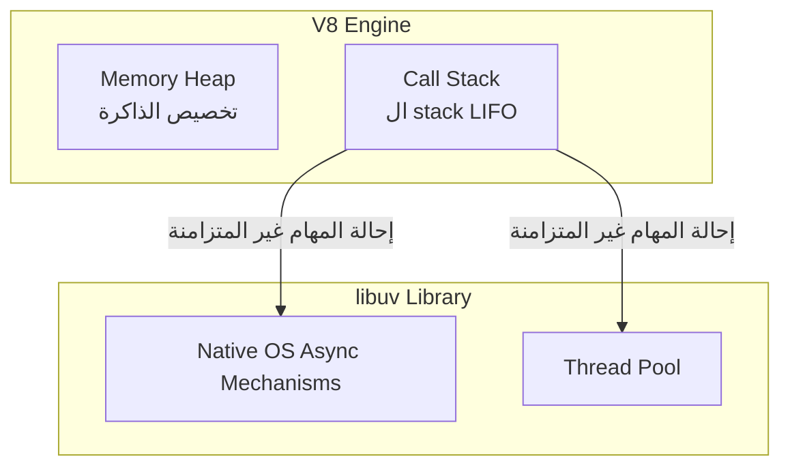

## حلقة الأحداث (Event Loop) في Node.js

### 1. التمهيد والسياق (Context & Recap)
قبل الغوص في مفهوم الEvent Loop ، سنسترجع نقطتين جوهريتين تمثلان الأساس لفهم كيفية تنفيذ الأكواد في بيئة Node.js:
1. **لغة جافاسكريبت (JavaScript):** هي لغة متزامنة (Synchronous)، حاجبة للتنفيذ (Blocking)، وأحادية المسار (Single-threaded).
2. **البرمجة غير المتزامنة (Async Programming):** لجعل البرمجة غير المتزامنة ممكنة في Node.js، فإننا نحتاج ونعتمد بشكل أساسي على مكتبة **`libuv`**.

---

### 2. معمارية تنفيذ الأكواد في بيئة Node.js (Node Runtime Architecture)

لتوضيح كيف يتم التنفيذ خلف الكواليس، يمكن تخيل بيئة تشغيل Node.js مقسمة إلى جزئين رئيسيين:

#### أ. محرك V8 (V8 Engine)
وهو المحرك المسؤول عن تنفيذ كود جافاسكريبت، ويتكون من قسمين:
*   **كومة الذاكرة (==Memory Heap==):** تُستخدم لتخصيص الذاكرة (Memory allocation) كلما قمت بتعريف متغيرات أو دوال.
*   **مكدس الاستدعاءات (==Call Stack==):** كلما قمت بتنفيذ كود، يتم دفع (Push) الدوال إلى هذا الstack، وعندما تنتهي الدالة، يتم إخراجها (Popped off). يعمل هذا الstack بناءً على هيكل بيانات (Stack) الذي يتبع قاعدة **ما يدخل أخيراً يخرج أولاً (LIFO - Last In First Out)**.

#### ب. مكتبة libuv
كلما قمت بتنفيذ دالة غير متزامنة (Async method)، يتم تفريغها أو إحالتها (Offloaded) إلى مكتبة `libuv`. تقوم `libuv` بتنفيذ هذه المهمة باستخدام:
1.  **الآليات غير المتزامنة الأصلية لنظام التشغيل (==Native async mechanisms of the OS==)**.
2.  إذا لم يكن ذلك ممكناً، تستخدم **تجمع المسارات (==Thread Pool==)** لضمان عدم حظر المسار الرئيسي (Main thread).

**رسم توضيحي: معمارية التنفيذ**


---

### 3. تحليل آليات تنفيذ الكود (Code Execution Walkthrough)

لفهم الفرق الفعلي، استعرض المحاضر سيناريوهين لتنفيذ الأكواد:

#### السيناريو الأول: تنفيذ الكود المتزامن (Synchronous Code)
**الكود:**
```javascript
console.log('first');
console.log('second');
console.log('third');
```
**خطوات التنفيذ:**
1.  يبدأ التنفيذ دائماً في النطاق العام (Global scope)، فيتم دفع الدالة العامة `Global` إلى مكدس الاستدعاءات (`Call Stack`).
2.  عند السطر الأول، تُدفع دالة `console.log('first')` للستاك، تُنفذ فتُطبع `first`، ثم تُخرج من الستاك (Popped off).
3.  يُنفذ السطر الثاني وتُطبع `second` وتُخرج، ثم السطر الثالث وتُطبع `third` وتُخرج.
4.  لعدم وجود كود آخر، تُخرج الدالة `Global` ويفرغ الستاك.

#### السيناريو الثاني: تنفيذ الكود غير المتزامن (Asynchronous Code)
**الكود:**
```javascript
console.log('first');
fs.readFile('./file.txt', 'utf-8', (err, data) => {
    console.log('second');
});
console.log('third');
```
**خطوات التنفيذ:**
1.  تُpush الدالة `Global` للستاك.
2.  تُpush وتُنفذ دالة السطر الأول وتطبع `first` وتُخرج.
3.  عند الوصول للسطر الثاني، تُpush دالة `fs.readFile` للstack. وبما أنها عملية غير متزامنة، يتم **إحالتها إلى libuv** مع دالة ال (Callback) الخاصة بها.
4.  يتم إخراج دالة `fs.readFile` من الstack فوراً لأن مهمتها انتهت بالنسبة لـ V8.
5.  في الخلفية، تبدأ `libuv` بقراءة الملف في `Thread Pool`.
6.  في هذه الأثناء، يكمل جافاسكريبت للسطر الأخير، فيدفع ويطبع `third`، ثم يُخرجها. يفرغ الstack وتخرج دالة `Global`.
7.  عندما تكتمل قراءة الملف، يتم دفع دالة الاستدعاء العكسي (Callback) إلى المكدس، وتُنفذ جملة الطباعة بداخلها، فتطبع `second`، ثم تفرغ وتُخرج.

---

### 4. التساؤلات الجوهرية (The Core Questions)
بعد استعراض السيناريو الثاني، تم طرح عدة أسئلة هامة:
1.  عندما تكتمل مهمة غير متزامنة في `libuv`، متى تقرر Node.js تنفيذ دالة الـ Callback؟ هل تقاطع التنفيذ العادي أم تنتظر؟
2.  ماذا عن دوال مثل `setTimeout` و `setInterval`؟
3.  إذا انتهت دالة `setTimeout` ودالة `fs.readFile` في نفس الوقت، من منهما يُنفذ أولاً؟ وهل لأحدهما أولوية (Priority)؟

**الإجابة على كل هذا تكمن في فهم "حلقة الأحداث" (Event Loop)**.

---

### 5. المفهوم الأساسي: حلقة الأحداث (Event Loop)

**التعريف التقني:**
من الناحية التقنية البحتة، ال Event Loop هي مجرد برنامج مكتوب بلغة سي (**C Program**). 

**الفكرة الأساسية (كيف تعمل؟):**
يمكنك التفكير في حلقة الأحداث كـ "نمط تصميم" (Design Pattern) يقوم بتنظيم وتنسيق وإدارة (Orchestrates or coordinates) تنفيذ الأكواد المتزامنة وغير المتزامنة معاً في بيئة Node.js.
(ملاحظة: شكر المحاضر المطور "Deepal Jayasekara" الذي استلهم منه التمثيل المرئي لهذه الحلقة والذي سيعتمد عليه في الشرح).

**متى تعمل؟**
هذه الحلقة تظل "حية" وتعمل طالما أن تطبيق Node.js قيد التشغيل (Up and running).

---

### 6. طوابير حلقة الأحداث (Event Loop Queues)

في كل دورة (Iteration) من حلقة الأحداث، نمر عبر **6 طوابير مختلفة (6 different queues)**. كل طابور يحتوي على دالة أو أكثر من دوال ال (Callbacks) التي تنتظر دورها للتنفيذ على `Call Stack`.
#### جدول مقارنة: أنواع الطوابير ومحتوياتها وموقعها

|              اسم الطابور (Queue Name)               |                    محتواه من دوال الـ Callbacks                    | الانتماء الهيكلي (Part of) |
| :-------------------------------------------------: | :----------------------------------------------------------------: | :------------------------: |
|          **طابور المؤقتات (Timer Queue)**           |          الدوال المرتبطة بـ `setTimeout` و `setInterval`.          |       مكتبة `libuv`        |
|        **طابور الإدخال/الإخراج (I/O Queue)**        | الدوال المرتبطة بالعمليات غير المتزامنة (مثل وحدات `fs` و `http`). |       مكتبة `libuv`        |
|            **طابور الفحص (Check Queue)**            | الدوال المرتبطة بالدالة المخصصة لـ Node والتي تسمى `setImmediate`. |       مكتبة `libuv`        |
|           **طابور الإغلاق (Close Queue)**           |        الدوال المرتبطة بحدث الإغلاق (Close events) للمهام.         |       مكتبة `libuv`        |
|       **طابور Next Tick** (جزء من Microtask)        |            الدوال المرتبطة بدالة `()process.nextTick`.             |   بيئة Node (وليس libuv)   |
| **طابور الوعود (Promise Queue)** (جزء من Microtask) |         الدوال المرتبطة بالوعود الأصلية (Native Promises).         |   بيئة Node (وليس libuv)   |

> `‏` **Important Note**
> **ملاحظة معمارية دقيقة:** الطوابير الأربعة الرئيسية (Timer, I/O, Check, Close) هي جزء أساسي من مكتبة `libuv`. بينما طوابير الـ (Microtask) المكونة من (nextTick و Promise) **ليست** جزءاً من `libuv`، ولكنها جزء من بيئة تشغيل Node وتلعب دوراً بالغ الأهمية في ترتيب التنفيذ.

---

### 7. قواعد وترتيب التنفيذ في حلقة الأحداث (Priority & Execution Rules)

هنا نصل إلى قلب كيفية عمل Node.js. توجد قواعد صارمة لتسلسل التنفيذ (Sequence of execution) يجب فهمها بدقة:

> `‏` **Important Note**
> **القاعدة الصفرية (الشرط المسبق):**
> جميع أكواد جافاسكريبت المتزامنة المكتوبة بواسطة المستخدم (User written synchronous JS code) تأخذ الأولوية القصوى! لا تتدخل "حلقة الأحداث" وتبدأ عملها إلا **بعد أن يكون ال call stack فارغاً تماماً (Only after the call stack is empty)**.

بمجرد أن يفرغ الstack، تبدأ حلقة الأحداث باتباع الخطوات الـ 9 التالية بالترتيب:

* `‏`  **Step 1:** يتم تنفيذ دوال طوابير الـ **Microtask** بالكامل. (دائماً يُنفذ طابور `nextTick` أولاً، ثم طابور `Promise`).
* `‏`  **Step 2:** يتم تنفيذ جميع الدوال الموجودة في طابور المؤقتات (**Timer queue**).
* `‏`  **Step 3:** يتم التحقق من طوابير الـ **Microtask** وتنفيذ ما فيها (إن وُجد) **بعد تنفيذ كل دالة** من دوال طابور المؤقتات. (`nextTick` ثم `Promise`).
* `‏`  **Step 4:** يتم تنفيذ جميع الدوال الموجودة في طابور الإدخال والإخراج (**I/O queue**).
* `‏`  **Step 5:** يتم التحقق مرة أخرى من طوابير الـ **Microtask** وتنفيذ ما فيها (إن وُجد). (`nextTick` ثم `Promise`).
*  `‏` **Step 6:** يتم تنفيذ جميع الدوال الموجودة في طابور الفحص (**Check queue**).
* `‏`  **Step 7:** يتم التحقق من طوابير الـ **Microtask** وتنفيذ ما فيها (إن وُجد) **بعد تنفيذ كل دالة** من دوال طابور الفحص. (`nextTick` ثم `Promise`).
* `‏`  **Step 8:** يتم تنفيذ جميع الدوال الموجودة في طابور الإغلاق (**Close queue**).
*  `‏` **Step 9:** لمرة أخيرة في نفس الدورة، يتم التحقق من طوابير الـ **Microtask** وتنفيذ ما فيها. (`nextTick` ثم `Promise`).

**آلية استمرار الحلقة:**
عند هذه النقطة، إذا كانت هناك المزيد من المهام ودوال الاستدعاء (Callbacks) التي تحتاج لمعالجة، تبقى الحلقة حية وتُعاد نفس الخطوات. أما إذا تم تنفيذ كل شيء ولم يعد هناك كود لمعالجته، يتم إغلاق حلقة الأحداث وتنهي Node.js عملها (Event Loop exits).

---

### 8. الإجابات على التساؤلات الجوهرية (Resolving the Paradox)

بناءً على الخطوات المذكورة أعلاه، أجاب المحاضر بوضوح على الأسئلة المطروحة مسبقاً:

1.  **متى تُنفذ دالة الـ Callback وما إذا كانت تقاطع الكود؟**
    *   **الإجابة:** تُنفذ فقط عندما يكون `Call Stack` فارغاً. التدفق العادي للتنفيذ لن يُقاطع أبداً (Normal flow of execution will not be interrupted) لتشغيل دالة استدعاء عكسي.
2.  **أين تقع أولويات `setTimeout` و `setInterval`؟**
    *   **الإجابة:** تقع في طابور المؤقتات (Timer queue) وتُعطى الأولوية الأولى للتنفيذ مباشرة بعد الانتهاء من أولويات الـ Microtask.
3.  **إذا اكتمل `setTimeout` وعملية I/O (مثل `fs.readFile`) في نفس اللحظة تماماً، أيهما يُنفذ أولاً؟**
    *   **الإجابة:** الدالة المرتبطة بـ المؤقت (Timer callback) ستُنفذ أولاً قبل الدالة المرتبطة بـ الإدخال/الإخراج (I/O callback)، وذلك بناءً على ترتيب الخطوات الواضح في معمارية الحلقة.

*(ملاحظة ختامية: أكد المحاضر على أهمية طباعة وحفظ التمثيل المرئي لهذه الخطوات في الذهن، حيث سيتم تخصيص الفيديوهات القادمة لإجراء تجارب بالكود لإثبات والتحقق من هذا الترتيب الدقيق للتنفيذ)*.