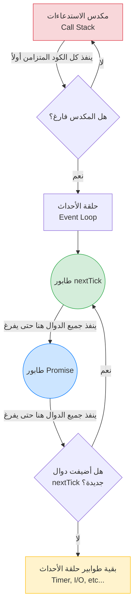

##  طوابير المهام الدقيقة (Microtask Queues) في Node.js

### 1. التمهيد ومراجعة حلقة الأحداث (Context & Event Loop Recap)
في الدروس السابقة، قمنا ببناء نموذج ذهني لكيفية تنفيذ الأكواد غير المتزامنة من خلال فهم **حلقة الأحداث (Event Loop)**. 
تتكون ال Event Loop في بيئة Node.js من **6 طوابير مختلفة (6 Different Queues)**:
1. طابوران للمهام الدقيقة (**Microtask Queues**): وهما طابور `nextTick` وطابور الوعود `Promise`.
2. طابور المؤقتات (**Timer Queue**).
3. طابور الإدخال والإخراج (**I/O Queue**).
4. طابور الفحص (**Check Queue**).
5. طابور الإغلاق (**Close Queue**).

في كل دورة من الEvent Loop، يتم سحب (Dequeue) دوال ال (Callbacks) في الوقت المناسب وتنفيذها على **ال (Call Stack)**.
الهدف من هذا الدرس هو التركيز حصرياً على **طوابير المهام الدقيقة (Microtask Queues)** وفهم ترتيب تنفيذها (Order of execution) من خلال سلسلة من التجارب.

---

### 2.  كيفية إضافة دوال إلى طوابير المهام الدقيقة (Queueing Callbacks)

قبل إجراء التجارب، يجب أن نعرف كيف يمكننا برمجياً إدراج دالة  (Callback) داخل هذه الطوابير المحددة:

**أ. الإضافة إلى طابور (nextTick Queue):**
- **التعريف:** نستخدم Built-in method وهي `()process.nextTick`.
- **كيف تعمل:** عندما يتم تنفيذ هذه الmethod على Callback، يتم أخذ دالة الـ Callback المُمررة إليها ووضعها في طابور `nextTick` لتنتظر دورها.
- **الصيغة البرمجية (Syntax):**
  ```javascript
  process.nextTick(() => {
      // الكود الخاص بك هنا
  });
  ```

**ب. الإضافة إلى طابور الوعود (Promise Queue):**
- **التعريف:** هناك عدة طرق، ولكن الطريقة التي سنعتمد عليها في تجاربنا هي استخدام `()Promise.resolve().then`.
- **كيف تعمل:** عندما يتحقق الوعد (Promise Resolves)، فإن الدالة المُمررة إلى بلوك `()then.` يتم إدراجها في طابور الوعود `Promise Queue`.
- **الصيغة البرمجية (Syntax):**
  ```javascript
  Promise.resolve().then(() => {
      // الكود الخاص بك هنا
  });
  ```

---

### 3. التجربة الأولى: الكود المتزامن مقابل الكود غير المتزامن (Sync vs Async)

الهدف من هذه التجربة هو معرفة من يمتلك الأولوية القصوى عند تشغيل أي ملف جافاسكريبت.

**الكود البرمجي للتجربة:**
```javascript
// 1. كود متزامن عادي
console.log('console.log 1');

// 2. كود غير متزامن يتم إضافته لطابور nextTick
process.nextTick(() => {
    console.log('this is process.nextTick 1');
});

// 3. كود متزامن عادي
console.log('console.log 2');
```

**المخرجات (Output):**
1. `‏` `console.log 1`
2. `‏` `console.log 2`
3. `‏` `this is process.nextTick 1`

> `‏` **Important Note**
> **الاستنتاج الأول والقاعدة الذهبية (Inference 1):**
> جميع أكواد جافاسكريبت المتزامنة المكتوبة بواسطة المستخدم (**All user-written synchronous JavaScript code**) تأخذ **الأولوية المطلقة (Priority)** على أي كود غير متزامن (Async code) ترغب بيئة التشغيل في تنفيذه لاحقاً.

**كيف تعمل خلف الكواليس؟ (مسار التنفيذ):**
- `‏`**Step 1:** يتم دفع `console.log 1` إلى ال (`Call Stack`)، وتُنفذ، وتُطبع النتيجة، ثم تُخرج من الستاك (Popped off).
- `‏`**Step 2:** يتم دفع `process.nextTick` للستاك، وتقوم بإدراج الـ Callback الخاص بها في طابور `nextTick Queue`، ثم تُخرج من الستاك. (دالة الـ Callback تنتظر دورها الآن).
-`‏` **Step 3:** يتم دفع `console.log 2` للستاك، وتُنفذ وتُخرج.
-`‏` **Step 4:** الآن call stack **فارغ تماماً** ولا يوجد كود متزامن متبقي. هنا فقط، ينتقل التحكم إلى **حلقة الأحداث (Event Loop)**.
-`‏` **Step 5:** تقوم حلقة الأحداث بسحب دالة الـ Callback من طابور `nextTick` وتدفعها إلى ال call stack لتنفيذها وطباعة الرسالة الأخيرة.

---

### 4. التجربة الثانية: أولوية (nextTick) مقابل (Promise)

الآن سنضع طابوري المهام الدقيقة في منافسة مباشرة لنرى أيهما يُنفذ أولاً.

**الكود البرمجي للتجربة:**
```javascript
// 1. إضافة دالة إلى طابور الوعود (Promise Queue)
Promise.resolve().then(() => {
    console.log('this is Promise.resolve 1');
});

// 2. إضافة دالة إلى طابور nextTick Queue (كُتبت بعد الوعد)
process.nextTick(() => {
    console.log('this is process.nextTick 1');
});
```

**المخرجات (Output):**
1. `‏` `this is process.nextTick 1`
2. `‏` `this is Promise.resolve 1`

> `‏` **Important Note**
> **الاستنتاج الثاني (Inference 2):**
> ==جميع دوال ال (Callbacks) الموجودة في طابور **`nextTick Queue`** يتم تنفيذها **دائماً قبل** دوال الاستدعاء الموجودة في طابور **`Promise Queue`**،== بغض النظر عن ترتيب كتابتها في الكود. هذا السلوك ناتج عن الطريقة التي كُتب بها الكود المصدري لبيئة التشغيل (How the source code is written).

---

### 5. التجربة الثالثة والمتقدمة: تداخل طوابير المهام الدقيقة (Nested Microtasks)

لإثبات الفهم العميق، سنقوم بإجراء تجربة معقدة تتضمن دوالاً متداخلة (Nested) لمعرفة سلوك حلقة الأحداث.

**الكود البرمجي للتجربة:**
```javascript
// إضافة 3 دوال لـ nextTick
process.nextTick(() => console.log('nextTick 1'));
process.nextTick(() => {
    console.log('nextTick 2');
    // إضافة دالة متداخلة جديدة لطابور nextTick
    process.nextTick(() => console.log('inner nextTick inside nextTick'));
});
process.nextTick(() => console.log('nextTick 3'));

// إضافة 3 دوال لـ Promise
Promise.resolve().then(() => console.log('Promise 1'));
Promise.resolve().then(() => {
    console.log('Promise 2');
    // إضافة دالة متداخلة جديدة لطابور nextTick من داخل الوعد
    process.nextTick(() => console.log('inner nextTick inside Promise'));
});
Promise.resolve().then(() => console.log('Promise 3'));
```

**المخرجات الدقيقة (Output):**
1. `nextTick 1`
2. `nextTick 2`
3. `nextTick 3`
4. `inner nextTick inside nextTick`
5. `Promise 1`
6. `Promise 2`
7. `Promise 3`
8. `inner nextTick inside Promise`

**الشرح  لخطوات التنفيذ (كيف حدث ذلك؟):**
- `‏` **Step 1:** يُنفذ ال call stack جميع الأوامر الرئيسية. ينتج عن ذلك 3 دوال في طابور `nextTick` و 3 دوال في طابور `Promise`.
- `‏`**Step 2:** يفرغ الstack ويدخل التحكم لحلقة الأحداث. طابور `nextTick` يحصل على الأولوية.
- `‏`**Step 3:** تُنفذ الدالة الأولى (`nextTick 1`).
- `‏`**Step 4:** تُنفذ الدالة الثانية (`nextTick 2`). هذه الدالة تقوم بإدراج (Queue) دالة جديدة **في نهاية** طابور `nextTick`.
- `‏`**Step 5:** تُنفذ الدالة الثالثة (`nextTick 3`).
- `‏`**Step 6:** نظراً لأن طابور `nextTick` تمت إضافة دالة جديدة إليه للتو في الخطوة 4، تكتشف حلقة الأحداث ذلك وتُنفذها (`inner nextTick inside nextTick`) قبل أن تغادر الطابور.
- `‏`**Step 7:** الآن طابور `nextTick` فارغ تماماً. ينتقل التحكم إلى طابور `Promise`.
- `‏`**Step 8:** تُنفذ الدالة الأولى (`Promise 1`).
- `‏`**Step 9:** تُنفذ الدالة الثانية (`Promise 2`). هذه الدالة تُضيف دالة جديدة ولكن إلى طابور **`nextTick`**.
- `‏`**Step 10:** نظراً لأن التحكم **لا يزال داخل** طابور `Promise`، فإنه سيستمر في إفراغ هذا الطابور أولاً. فتُنفذ الدالة الثالثة (`Promise 3`).
- `‏`**Step 11:** يفرغ طابور `Promise`. تقوم حلقة الأحداث بالتحقق مجدداً من طوابير المهام الدقيقة، وتجد دالة جديدة في طابور `nextTick` (التي أُضيفت في الخطوة 9). فتنتقل إليها وتنفذها (`inner nextTick inside Promise`).

---

### 6. جدول مقارنة: طوابير المهام الدقيقة (Microtask Queues)

|   وجه المقارنة (Feature)   |                  طابور (nextTick Queue)                   |                         طابور الوعود (Promise Queue)                         |
| :------------------------: | :-------------------------------------------------------: | :--------------------------------------------------------------------------: |
| **دالة الإضافة (Method)**  |               `process.nextTick(callback)`                |                      `Promise.resolve().then(callback)`                      |
|  **الأولوية (Priority)**   |    **الأولوية القصوى** داخل حلقة الأحداث (ينفذ أولاً).    |            أولوية ثانوية (ينفذ بعد إفراغ طابور nextTick تماماً).             |
| **سلوك الإضافة المتداخلة** | الإضافة المتداخلة تُنفذ في نفس دورة الطابور قبل الانتقال. | الإضافة لطابور آخر (nextTick) من داخل الوعد لا تقاطع الوعد، بل تُنفذ لاحقاً. |
|                            |                                                           |                                                                              |

---

### 7. تحذير هندسي هام: تجويع حلقة الأحداث (Event Loop Starvation)

> `‏` **Important Note**
> **لماذا لا يُنصح باستخدام `process.nextTick` بكثرة؟**
> يحذر المحاضر (وتحذر الوثائق الرسمية) من الاستخدام المفرط لـ `()process.nextTick`. 
> **السبب:** الاستدعاء اللانهائي (Endless calls) أو إضافة عدد هائل من الدوال إلى هذا الطابور سيؤدي إلى ما يُسمى بـ **تجويع حلقة الأحداث (Event Loop Starvation)**.
> **كيف يحدث التجويع؟** إذا ظل طابور `nextTick` ممتلئاً باستمرار، فإن التحكم (Control) لن يتجاوز أبداً طوابير المهام الدقيقة، مما يعني أن الطوابير الأخرى (مثل طابور الإدخال والإخراج I/O Queue) سيتم "تجويعها" ولن تحصل أبداً على فرصة لتنفيذ دوالها (Starving the I/O queue from getting to run its own callbacks).

**متى يجب استخدام `process.nextTick` إذن؟ (الاستخدامات المشروعة):**
وفقاً لوثائق Node.js الرسمية، هناك سببان رئيسيان لاستخدامها:
1. السماح للمستخدمين بمعالجة الأخطاء (Handle errors)، أو تنظيف الموارد غير المطلوبة، أو إعادة محاولة إجراء الطلب (Retry request) **قبل أن تستمر حلقة الأحداث**.
2. السماح لـ Callback بالعمل **بعد** أن يتم تفريغ مكدس الاستدعاءات (Call stack has unwound)، ولكن **قبل** أن تستمر حلقة الأحداث وتنتقل للطوابير الأخرى.

---

### 8. رسم توضيحي: مسار أولوية طوابير المهام الدقيقة (Microtask Flow)

يوضح هذا المخطط تسلسل التنفيذ الذي تتبعه Node.js عند التعامل مع الكود المتزامن والمهام الدقيقة:


