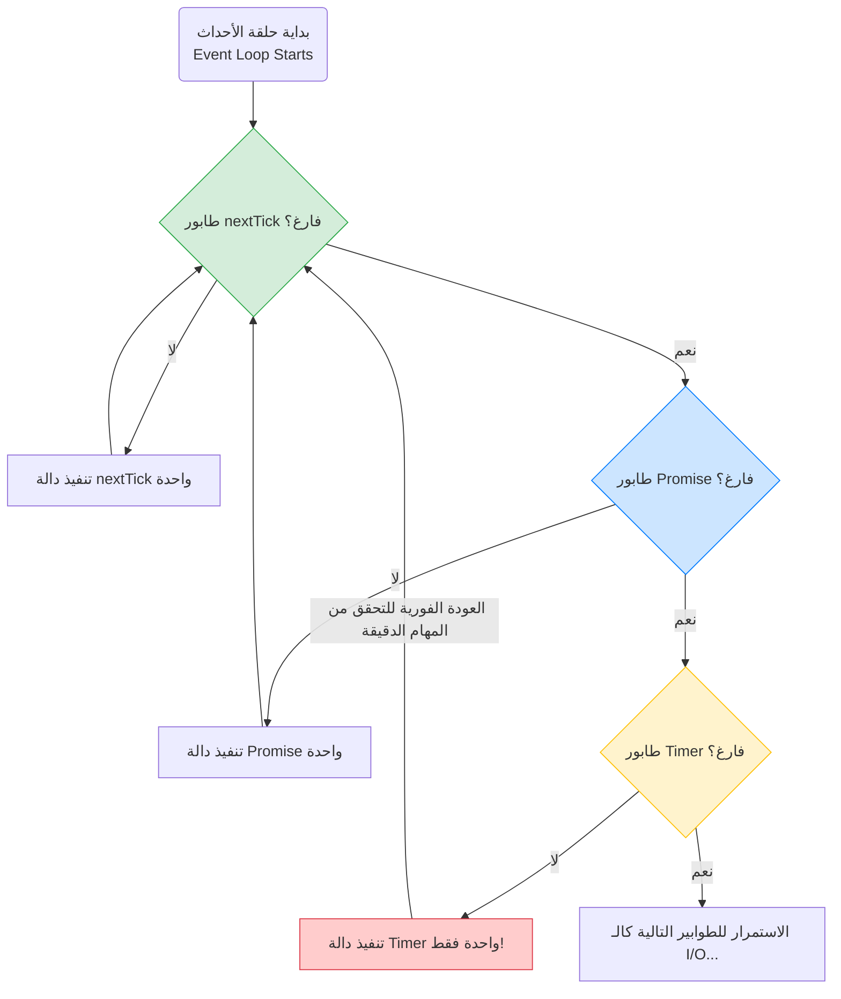

## طابور المؤقتات (Timer Queue) في Node.js

### 1. التمهيد والسياق (Context & Recap)
في الدروس السابقة، تعرفنا على طوابير المهام الدقيقة (**Microtask Queues**) والتي تتضمن كلاً من طابور `nextTick` وطابور الوعود `Promise`، وفهمنا ترتيب أولويتها أثناء تنفيذ الأكواد غير المتزامنة (Asynchronous code). 
في هذا الدرس، سنمضي قدماً في هيكل حلقة الأحداث (**Event Loop**) لنستكشف الطابور التالي في الترتيب وهو **طابور المؤقتات (Timer Queue)**، وكيف يتفاعل ويتداخل مع الطوابير الأخرى.

---

### 2. المفهوم الأساسي: طابور المؤقتات (Timer Queue)

**التعريف:**
هو أحد طوابير ال Event Loop الأساسية، وظيفته الاحتفاظ بدوال ال (**Callbacks**) التي تم تأجيل تنفيذها لفترة زمنية محددة.

**كيف نضيف دالة إلى طابور المؤقتات (Queueing Callbacks)؟**
لإدراج دالة استدعاء عكسي في هذا الطابور، تتيح لنا بيئة Node.js استخدام إحدى الدالتين المدمجتين التاليتين:
1. الدالة `()setTimeout`
2. الدالة `()setInterval`
(ملاحظة: سيعتمد المحاضر على استخدام `setTimeout` حصرياً في جميع التجارب لشرح المفهوم).

**الصيغة البرمجية (Syntax):**
```javascript
// المعامل الأول: دالة الاستدعاء العكسي (Callback function)
// المعامل الثاني: التأخير الزمني بالمللي ثانية (Delay in milliseconds)
setTimeout(() => {
    // الكود المراد تنفيذه
}, delay);
```

> `‏` **Important Note**
> **حقيقة هندسية حول هيكل البيانات (Data Structure Reality):**
>  من الناحية التقنية، ==ال Timer Queue **ليس طابوراً (Not a Queue)** بالمعنى الحرفي== لعلوم الحاسب، بل هو مبني باستخدام هيكل بيانات يُسمى **الHeap الصغرى (Min Heap)**. ولكن، لغرض التبسيط وبناء الفهم الأساسي، سنستمر في إطلاق اسم "Queue" عليه والتعامل معه على هذا الأساس، حيث أن ذلك يجعل العملية أسهل للفهم.

---

### 3. التجربة الثالثة: المهام الدقيقة مقابل المؤقتات (Microtask Queues vs Timer Queue)

الهدف من هذه التجربة هو معرفة من يحصل على الأولوية عندما تتواجد مهام في طوابير الـ `Microtask` وطابور الـ `Timer` في نفس الوقت.

**الكود البرمجي للتجربة:**
*(تم البناء على الكود المعقد من الدرس السابق وإضافة 3 مؤقتات في بدايته)*

```javascript
// 1. إضافة 3 دوال لطابور المؤقتات بتأخير 0 مللي ثانية
setTimeout(() => console.log('setTimeout 1'), 0);
setTimeout(() => console.log('setTimeout 2'), 0);
setTimeout(() => console.log('setTimeout 3'), 0);

// 2. دوال طابور nextTick (مع دالة متداخلة)
process.nextTick(() => console.log('nextTick 1'));
process.nextTick(() => {
    console.log('nextTick 2');
    process.nextTick(() => console.log('inner nextTick inside nextTick'));
});
process.nextTick(() => console.log('nextTick 3'));

// 3. دوال طابور الوعود Promise (مع دالة متداخلة)
Promise.resolve().then(() => console.log('Promise 1'));
Promise.resolve().then(() => {
    console.log('Promise 2');
    process.nextTick(() => console.log('inner nextTick inside Promise'));
});
Promise.resolve().then(() => console.log('Promise 3'));
```

**المخرجات (Output):**
1. `nextTick 1`
2. `nextTick 2`
3. `nextTick 3`
4. `inner nextTick inside nextTick`
5. `Promise 1`
6. `Promise 2`
7. `Promise 3`
8. `inner nextTick inside Promise`
9. `setTimeout 1`
10. `setTimeout 2`
11. `setTimeout 3`

> `‏` **Important Note**
> **الاستنتاج الثالث (Inference 3):**
> ==يتم تنفيذ جميع ال callback function الموجودة في طوابير المهام الدقيقة (**Microtask Queues**) بالكامل **قبل** البدء في تنفيذ أي callback function موجودة في طابور المؤقتات (**Timer Queue**).==

**خطوات التنفيذ خلف الكواليس (Execution Visualization):**
- `‏` **Step 1:** يقوم ال (`Call Stack`) بتنفيذ الكود، مما ينتج عنه إدراج 3 دوال في `Timer Queue`، و 4 دوال (واحدة ستضاف لاحقاً) في `nextTick Queue`، و 3 دوال في `Promise Queue`.
- `‏` **Step 2:** يفرغ الStack، ويدخل التحكم إلى حلقة الأحداث (`Event Loop`).
- `‏` **Step 3:** يُعطى طابور `nextTick` الأولوية القصوى. تُسحب وتُنفذ الدوال الثلاث الأولى. أثناء الدالة الثانية، تتم إضافة دالة `nextTick` متداخلة جديدة.
- `‏` **Step 4:** تُنفذ الدالة المتداخلة الجديدة قبل مغادرة طابور `nextTick`. (الآن الطابور فارغ).
- `‏` **Step 5:** ينتقل التحكم لطابور `Promise`. تُسحب وتُنفذ الدوال الأولى والثانية. أثناء الدالة الثانية، تُضاف دالة `nextTick` متداخلة جديدة.
- `‏` **Step 6:** تُنفذ الدالة الثالثة للوعد. (الآن طابور الوعود فارغ).
- `‏` **Step 7:** تعود حلقة الأحداث لفحص طابور `nextTick`، وتجد الدالة الجديدة (المُضافة من الوعد) وتنفذها.
- `‏` **Step 8:** الآن طوابير الـ `Microtask` فارغة تماماً، فينتقل التحكم أخيراً إلى طابور المؤقتات (`Timer Queue`).
- `‏` **Step 9:** تُسحب وتُنفذ دوال الـ `setTimeout` الأولى، ثم الثانية، ثم الثالثة بالترتيب.

---

### 4. التجربة الرابعة: التداخل أثناء تنفيذ المؤقتات (Interleaved Execution)

ماذا يحدث لو قمنا بإضافة دالة إلى طوابير الـ `Microtask` **أثناء** قيام حلقة الأحداث بتنفيذ دوال من طابور المؤقتات؟

**الكود البرمجي للتجربة:**
سنقوم بتعديل دالة المؤقت الثاني فقط لإضافة دالة متداخلة:
```javascript
setTimeout(() => console.log('setTimeout 1'), 0);
setTimeout(() => {
    console.log('setTimeout 2');
    // إضافة دالة متداخلة لطابور nextTick من داخل المؤقت
    process.nextTick(() => console.log('inner nextTick inside setTimeout'));
}, 0);
setTimeout(() => console.log('setTimeout 3'), 0);
```

**المخرجات (Output):**
1. `‏` `setTimeout 1`
2. `‏` `setTimeout 2`
3. `‏` `inner nextTick inside setTimeout` (انتبه لمكان التنفيذ)
4. `‏` `setTimeout 3`

> `‏` **Important Note**
> **الاستنتاج الرابع (Inference 4 - هام جداً):**
> ==يتم تنفيذ دوال طوابير المهام الدقيقة (**Microtask Queues**) **بين (In between)** عمليات تنفيذ دوال طابور المؤقتات (**Timer Queue**).==
> بعبارة أخرى: حلقة الأحداث لا تقوم بإفراغ طابور المؤقتات دفعة واحدة! بل تتحقق من طوابير المهام الدقيقة **بعد كل تنفيذ لدالة واحدة** من طابور المؤقتات.

**خطوات التنفيذ (كيف حدث ذلك؟):**
- `‏` **Step 1:** بافتراض أن طوابير الـ Microtask فارغة في البداية. ينتقل التحكم لطابور `Timer Queue` الذي يحتوي على 3 دوال.
- `‏` **Step 2:** تُسحب وتُنفذ دالة المؤقت الأول ويُطبع `setTimeout 1`.
- `‏` **Step 3:** تعود حلقة الأحداث فوراً للتحقق من طوابير `Microtask`. (تجدها فارغة فتكمل طريقها).
- `‏` **Step 4:** تُسحب وتُنفذ دالة المؤقت الثاني، ويُطبع `setTimeout 2`. وبسبب هذا التنفيذ، يتم إدراج دالة جديدة في طابور `nextTick`.
- `‏` **Step 5:** كالعادة، تعود حلقة الأحداث للتحقق من طوابير `Microtask` بعد التنفيذ. هذه المرة تجد دالة في `nextTick`.
- `‏` **Step 6:** تقوم بسحب الدالة الدقيقة وتنفيذها فوراً، ويُطبع `inner nextTick inside setTimeout`.
- `‏` **Step 7:** الآن الطوابير الدقيقة فارغة مجدداً، تعود حلقة الأحداث لطابور المؤقتات وتنفذ الدالة الثالثة ليُطبع `setTimeout 3`.

(تدريب للمحاضر كواجب: جرب استبدال `process.nextTick` في الكود السابق بـ `Promise.resolve().then()` وستلاحظ أن الاستنتاج سيبقى صحيحاً وينطبق بنفس الطريقة).

---

### 5. التجربة الخامسة: ترتيب التنفيذ بتأخيرات مختلفة (FIFO Order)

في هذه التجربة، سنستخدم فقط طابور المؤقتات، ولكن مع تمرير قيم تأخير (Delays) مختلفة لمعرفة كيف يتعامل معها.

**الكود البرمجي للتجربة:**
```javascript
// تعيين 3 مؤقتات بأوقات مختلفة
setTimeout(() => console.log('setTimeout 1'), 1000); // تأخير 1 ثانية (1000ms)
setTimeout(() => console.log('setTimeout 2'), 500);  // تأخير نصف ثانية (500ms)
setTimeout(() => console.log('setTimeout 3'), 0);    // تأخير صفر ثانية (0ms)
```

**المخرجات (Output):**
1. `setTimeout 3`
2. `setTimeout 2`
3. `setTimeout 1`

**الاستنتاج الخامس (Inference 5):**
==يتم تنفيذ ال callback function في ال Timer Queue بنظام **"ما يدخل أولاً يخرج أولاً" (FIFO - First In, First Out)**، ولكن **بناءً على انقضاء الوقت الأقل**. ==
المؤقت الذي يمتلك أقل وقت تأخير (Least delay) هو الذي يتم إدراجه في الطابور أولاً، وبالتالي هو أول من تقوم حلقة الأحداث بتنفيذه.

---

### 6. جدول مقارنة: الأولويات بين الطوابير المدروسة حتى الآن

| الترتيب المطلق (Priority) |        الطابور (Queue)        |       متى تتحقق منه حلقة الأحداث؟ (Event Loop Check)       |
| :-----------------------: | :---------------------------: | :--------------------------------------------------------: |
|           **1**           | **Microtask: nextTick Queue** | بعد إفراغ ال call stack، وبعد كل تنفيذ لدالة من طابور آخر. |
|           **2**           | **Microtask: Promise Queue**  |                فور إفراغ طابور `nextTick`.                 |
|           **3**           |        **Timer Queue**        |     عندما تكون جميع طوابير `Microtask` السابقة فارغة.      |

---

### 7. رسم توضيحي: مسار التنفيذ المتداخل (Interleaved Execution Flow)

يوضح المخطط التالي سلوك حلقة الأحداث المعقد الذي تم إثباته في التجربة الرابعة (التحقق المستمر من الطوابير الدقيقة):

