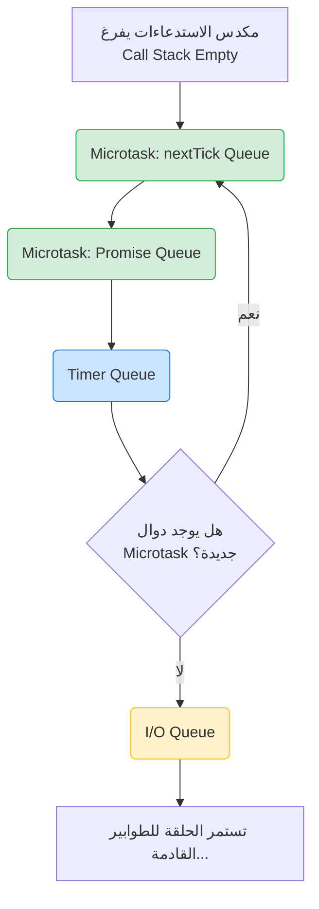

##  طابور الإدخال والإخراج (I/O Queue) في Node.js

### 1. التمهيد والسياق (Context)
في الدروس السابقة، درسنا ترتيب تنفيذ الأكواد مع أخذ الكود المتزامن (Synchronous code)، وطوابير المهام الدقيقة (**Microtask Queues** والتي تشمل `nextTick` و `Promise`)، وطابور المؤقتات (**Timer Queue**) في الاعتبار. 
في هذا الدرس، سنقوم بإضافة **طابور الإدخال والإخراج (I/O Queue)** إلى الصورة الكاملة لحلقة الأحداث (**Event Loop**) لمعرفة أين يقع ترتيبه وأولويته مقارنة بالطوابير الأخرى.

---

### 2. المفهوم الأساسي: طابور الإدخال والإخراج (I/O Queue)

**التعريف:**
هو أحد الطوابير الرئيسية داخل ال Event Loop في Node.js، وهو مخصص للتعامل مع دوال ال (**Callbacks**) الناتجة عن عمليات الإدخال والإخراج غير المتزامنة.

**كيف يتم إضافة دالة إلى هذا الطابور؟**
مُعظم الدوال غير المتزامنة (Async methods) القادمة من الوحدات المدمجة (Built-in modules) في Node.js تقوم بإدراج (Queue) دالة الcallback الخاصة بها داخل الـ **I/O Queue**.
*   **مثال:** الدالة `readFile` من وحدة نظام الملفات `fs`.

---

### 3. التجربة السادسة: الـ (I/O Queue) مقابل الـ (Microtask Queues)

الهدف من هذه التجربة هو معرفة من يمتلك الأولوية القصوى: دوال الـ Microtasks أم دوال الـ I/O.

**الكود البرمجي:**
```javascript
const fs = require('node:fs');

// 1. إضافة دالة لطابور الإدخال والإخراج (I/O Queue)
fs.readFile(__filename, () => {
    console.log('this is read file 1');
});

// 2. إضافة دالة لطابور nextTick
process.nextTick(() => {
    console.log('this is process.nextTick 1');
});

// 3. إضافة دالة لطابور الوعود (Promise Queue)
Promise.resolve().then(() => {
    console.log('this is Promise.resolve 1');
});
```

**المخرجات (Output):**
1. `this is process.nextTick 1`
2. `this is Promise.resolve 1`
3. `this is read file 1`

**الاستنتاج الهندسي (Inference):**
==دوال الcallback الموجودة في طوابير الـ **Microtask Queues** يتم تنفيذها **قبل** دوال الcallback الموجودة في طابور الـ **I/O Queue**.==

**خطوات التنفيذ خلف الكواليس (Execution Visualization):**
1. يُنفذ ال (`Call Stack`) الكود بالكامل، فينتج عن ذلك: دالة في طابور `nextTick`، ودالة في طابور `Promise`، ودالة في طابور `I/O`.
2. يفرغ الstack، وتدخل حلقة الأحداث (`Event Loop`).
3. الأولوية القصوى لطابور `nextTick`، تُسحب دالته وتُنفذ (يُطبع النص الأول).
4. ينتقل التحكم لطابور `Promise`، تُسحب دالته وتُنفذ (يُطبع النص الثاني).
5. حلقة الأحداث تمر على طابور المؤقتات (`Timer Queue`) وتجده فارغاً.
6. تصل الحلقة إلى طابور الـ `I/O Queue`، وتسحب دالة `readFile` وتنفذها (يُطبع النص الثالث).

---

### 4. التجربة السابعة: الـ (I/O Queue) مقابل (Timer Queue) والسلوك الغريب (The Anomaly)

الهدف من هذه التجربة هو وضع دالة إدخال/إخراج في منافسة مع مؤقت زمني مدته صفر (`0ms`).

**الكود البرمجي:**
```javascript
const fs = require('node:fs');

// 1. إضافة دالة لطابور الإدخال والإخراج
fs.readFile(__filename, () => {
    console.log('this is read file 1');
});

// 2. إضافة دالة لطابور المؤقتات بتأخير 0 مللي ثانية
setTimeout(() => {
    console.log('this is setTimeout 1');
}, 0);
```

**المخرجات والمشكلة:**
عند تشغيل هذا الكود (`node index`) عدة مرات متتالية، ستلاحظ **سلوكاً غير متسق (Inconsistent Behavior)**:
*   في بعض المرات يُطبع: `read file 1` ثم `setTimeout 1`.
*   وفي مرات أخرى يُطبع: `setTimeout 1` ثم `read file 1`.

> `‏` **Important Note**
> **الاستنتاج الجوهري للتجربة السابعة:**
> ==عند تشغيل دالة `setTimeout` بتأخير زمني قدره صفر مللي ثانية (0ms) جنباً إلى جنب مع دالة إدخال/إخراج غير متزامنة (I/O async method)، فإن **ترتيب التنفيذ لا يمكن ضمانه أبداً (The order of execution can never be guaranteed)**.==

#### الشرح : لماذا لا يمكن ضمان الترتيب؟
السبب يعود إلى كيفية بناء المتصفحات وبيئة Node.js باستخدام لغة ++C:
1. **الحد الأدنى للتأخير (Minimum Delay):** في الكود المصدري لمحرك (Chromium) المكتوب بلغة ++C، هناك عملية حسابية لحساب وقت المؤقت باستخدام الدالة: `max(1, interval)`. هذا يعني أنه إذا مررت القيمة `0` مللي ثانية، سيقوم المحرك بتجاوزها وتعيينها إلى الحد الأدنى وهو **`1` مللي ثانية**. بيئة Node.js تتبع نفس هذا النهج.
2. **عامل الوقت وسرعة المعالج (CPU Timing):**
   *   إذا كان المعالج سريعاً جداً ودخلت حلقة الأحداث إلى طابور المؤقتات (`Timer Queue`) عند الزمن **`0.05` مللي ثانية**، فإن المؤقت (الذي أصبح مدته 1ms) **لم ينتهِ بعد**. لذلك تتجاوزه حلقة الأحداث وتنتقل إلى `I/O Queue` وتُنفذ `readFile` أولاً.
   *   أما إذا كان المعالج مشغولاً (Busy CPU) ودخلت حلقة الأحداث إلى طابور المؤقتات عند الزمن **`1.01` مللي ثانية**، فإن وقت المؤقت **قد انقضى بالفعل**، فيتم تنفيذ دالة الـ `setTimeout` أولاً، ثم تنتقل الحلقة إلى `I/O Queue`.
بسبب عدم القدرة على التنبؤ بمدى انشغال المعالج (CPU)، لا يمكننا ضمان الترتيب في هذه الحالة الخاصة.

---

### 5. التجربة الثامنة: ترتيب التنفيذ الشامل (The Complete Picture)

في هذه التجربة، سنجمع كل الطوابير معاً (Microtasks, Timer, I/O)، ولكن لضمان عدم حدوث السلوك الغريب (Anomaly) المذكور في التجربة السابعة، سنستخدم "حيلة برمجية".

**الحيلة البرمجية:**
استخدام حلقة تكرار فارغة (`for loop`) تستهلك بعض الوقت على ال (`Call Stack`). هذا يضمن أنه عندما تفرغ حلقة التكرار وتدخل Node.js إلى حلقة الأحداث (`Event Loop`)، يكون المؤقت الزمني (الذي مدته 1 مللي ثانية) قد انتهى بالتأكيد، مما يضمن أن دالة الـ `setTimeout` جاهزة للتنفيذ فوراً.

**الكود البرمجي:**
```javascript
const fs = require('node:fs');

// 1. I/O Queue
fs.readFile(__filename, () => {
    console.log('this is read file 1');
});

// 2. Microtask (nextTick Queue)
process.nextTick(() => {
    console.log('this is process.nextTick 1');
});

// 3. Microtask (Promise Queue)
Promise.resolve().then(() => {
    console.log('this is Promise.resolve 1');
});

// 4. Timer Queue
setTimeout(() => {
    console.log('this is setTimeout 1');
}, 0);

// حلقة تكرار فارغة لاستهلاك وقت المعالج لضمان انقضاء الـ 1 مللي ثانية للمؤقت
for (let i = 0; i < 2000000000; i++) {}
```

**المخرجات الثابتة والمضمونة (Output):**
1. `this is process.nextTick 1`
2. `this is Promise.resolve 1`
3. `this is setTimeout 1`
4. `this is read file 1`

**الاستنتاج النهائي للتجربة الثامنة:**
==دوال الcallback في طابور الـ **I/O Queue** يتم تنفيذها **بعد** دوال الـ **Microtask Queues**، و **بعد** دوال طابور المؤقتات **Timer Queue**.==

---

### 6. جدول مقارنة: أولويات التنفيذ في حلقة الأحداث (حتى الآن)

| الترتيب (Priority) | اسم الطابور (Queue Name) | أمثلة على الدوال المنتمية له |
| :---: | :--- | :--- |
| **1 (الأعلى)** | **Microtask: nextTick Queue** | `process.nextTick()` |
| **2** | **Microtask: Promise Queue** | `Promise.resolve().then()` |
| **3** | **Timer Queue** | `setTimeout()`, `setInterval()` |
| **4 (الأدنى)** | **I/O Queue** | `fs.readFile()`, والعمليات غير المتزامنة المشابهة |

---

### 7. رسم توضيحي: مسار حلقة الأحداث (The Event Loop Flow)

يوضح هذا الرسم البياني التسلسل الدقيق الذي تتبعه حلقة الأحداث لتفريغ الطوابير بناءً على ما تعلمناه في هذا الدرس:

