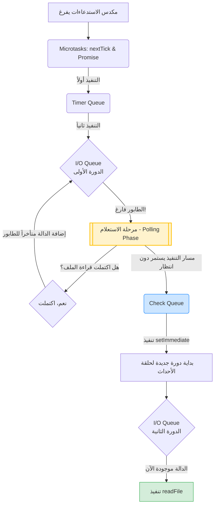

## استعلام الإدخال والإخراج (I/O Polling) وطابور الفحص (Check Queue) في Node.js

### 1. التمهيد والسياق (Context)
في الدرس السابق، درسنا ترتيب تنفيذ الأكواد عندما يكون **طابور الإدخال والإخراج (I/O Queue)** جزءاً من الصورة، ولاحظنا الترتيب التالي: طوابير المهام الدقيقة (Microtasks) أولاً، ثم طابور المؤقتات (Timer Queue)، وأخيراً طابور الإدخال والإخراج.
في هذا الدرس، يظل تركيزنا منصباً على طابور الـ **I/O Queue**، ولكننا سنبدأ بالتحرك تدريجياً نحو الطابور الذي يليه وهو **طابور الفحص (Check Queue)**. الهدف من هذا الدرس هو الكشف عن تفصيلة هندسية دقيقة ومخفية تتعلق بآلية عمل الـ I/O Queue من خلال إجراء تجربة جديدة.

---

### 2. المفهوم التأسيسي الجديد: دالة (setImmediate)

قبل إجراء التجربة، يجب أن نتعلم كيف نتعامل مع طابور الفحص (**Check Queue**).

**التعريف:**
دالة **`setImmediate`** هي دالة مدمجة في بيئة Node.js تُستخدم لإدراج (Queue) ال  (Callback function) داخل **طابور الفحص (Check Queue)** حصرياً.

**الفكرة الأساسية وكيف تعمل؟**
بناء الجملة البرمجية (Syntax) لهذه الدالة مشابه جداً لدالة `process.nextTick`. أنت تقوم بتمرير callback function  إليها، وتقوم بيئة التشغيل بوضع هذه الدالة في ال check Queue لتنتظر دورها في  (Event Loop).

**الصيغة البرمجية (Syntax):**
```javascript
setImmediate(() => {
    // الكود المراد تنفيذه في طابور الفحص
});
```

---

### 3. التجربة التاسعة: اكتشاف السلوك الغريب (The Anomaly)

سنقوم في هذه التجربة بالبناء على الكود الذي توقفنا عنده في الدرس السابق، وسنضيف إليه دالة `setImmediate` لاختبار ترتيب التنفيذ بين طابور الإدخال/الإخراج وطابور الفحص.

**الكود البرمجي للتجربة:**
```javascript
const fs = require('node:fs');

// 1. عملية قراءة ملف (I/O Queue)
fs.readFile(__filename, () => {
    console.log('this is read file 1');
});

// 2. مهمة دقيقة (nextTick Queue)
process.nextTick(() => {
    console.log('this is process.nextTick 1');
});

// 3. مهمة دقيقة (Promise Queue)
Promise.resolve().then(() => {
    console.log('this is Promise.resolve 1');
});

// 4. مؤقت زمني (Timer Queue)
setTimeout(() => {
    console.log('this is setTimeout 1');
}, 0);

// 5. دالة الفحص (Check Queue) - الإضافة الجديدة
setImmediate(() => {
    console.log('this is setImmediate 1');
});

// (بافتراض وجود حلقة تكرار طويلة for loop هنا كما في الدرس السابق لضمان استغراق وقت كافٍ)
```

**التوقع المنطقي (Expected Output):**
بناءً على الترتيب المعماري لحلقة الأحداث الذي درسناه (الـ I/O Queue يأتي قبل الـ Check Queue)، من المفترض أن نرى `read file 1` يُطبع **قبل** `setImmediate 1`.

**المخرجات الفعلية الصادمة (Actual Output):**
1. `this is process.nextTick 1`
2. `this is Promise.resolve 1`
3. `this is setTimeout 1`
4. `this is setImmediate 1` *(تمت طباعته قبل قراءة الملف!)*
5. `this is read file 1`

**المشكلة:**
ظهور `setImmediate` قبل `read file` يبدو غريباً جداً (A little strange) بالنظر إلى أن طابور الـ I/O يسبق طابور الفحص في حلقة الأحداث.

---

### 4. التفسير : مفهوم استعلام الإدخال/الإخراج (I/O Polling)

لفهم هذا السلوك الغريب، يجب أن نغوص تحت الغطاء (Under the hood) ونفهم آلية تُسمى **الاستعلام (Polling)**.

لماذا لم تجد حلقة الأحداث دالة قراءة الملف في طابور الـ I/O؟
لقد افترضنا أنه بسبب وجود حلقة تكرار طويلة (Long for loop) استهلكت وقت المعالج، فإن عملية قراءة الملف (`readFile`) يفترض أن تكون قد اكتملت بحلول الوقت الذي تدخل فيه حلقة الأحداث إلى الـ I/O Queue، وبالتالي يجب أن تكون دالة الاستدعاء موجودة وجاهزة. ولكن الواقع المعماري مختلف تماماً.

**الحقيقة الهندسية:**
حلقة الأحداث (Event Loop) ==مُجبرة على إجراء عملية **استعلام (Poll)** ==للتحقق مما إذا كانت عمليات الإدخال/الإخراج (I/O operations) قد اكتملت بالفعل أم لا. والأهم من ذلك، أنها **لا تقوم بإدراج دوال الاستدعاء في طابور الـ I/O إلا بعد اكتمال العملية فعلياً**.

---

### 5. خطوات التنفيذ خلف الكواليس (Execution Walkthrough)

إليك الترتيب الدقيق لما حدث في هذه التجربة خطوة بخطوة:

* `‏`   **Step 1:** يتم تنفيذ جميع العبارات الخمس على مكدس الاستدعاءات (**Call Stack**).
* `‏`  **Step 2:** يُسفر ذلك عن إدراج دوال الاستدعاء في طوابيرها المناسبة (واحدة في nextTick، واحدة في Promise، واحدة في Timer، وواحدة في Check queue) **باستثناء** دالة `readFile` التي لم تُدرج في نفس الوقت.
*  `‏` **Step 3:** يفرغ المكدس، ويدخل التحكم إلى حلقة الأحداث. يتم التحقق من طوابير **Microtasks** أولاً، فيُطبع `nextTick 1` يليه `Promise 1`.
* `‏`  **Step 4:** ينتقل التحكم إلى طابور المؤقتات (**Timer Queue**)، ويُنفذ ما بداخله ليُطبع `setTimeout 1`.
* `‏`  **Step 5:** الآن يصل التحكم إلى طابور الإدخال والإخراج (**I/O Queue**). عندما تدخله حلقة الأحداث للمرة الأولى، تجده **فارغاً (Empty)**.
* `‏`  **Step 6:** بما أن الطابور فارغ، ينتقل التحكم فوراً إلى مرحلة الاستعلام (**Polling part**) الموجودة بين الطوابير في حلقة الأحداث.
*  `‏` **Step 7:** في مرحلة الاستعلام، تسأل حلقة الأحداث عملية `readFile`: "هل انتهيتِ؟". تجيب العملية: "نعم". حينها فقط تقوم حلقة الأحداث بإدراج (Queue up) دالة الاستدعاء في الـ **I/O Queue**.
*  `‏` **Step 8:** لكن مهلاً! لقد تجاوزت (Past) عملية التنفيذ بالفعل طابور الـ I/O، لذا يجب على دالة `readFile` أن تنتظر دورها.
* `‏`  **Step 9:** يواصل التحكم مساره ويصل إلى طابور الفحص (**Check Queue**). يجد بداخله دالة الـ `setImmediate`، فيقوم بتنفيذها ويُطبع `setImmediate 1`.
* `‏`  **Step 10:** لم يتبقَ شيء في الدورة الحالية (Current iteration). تبدأ حلقة الأحداث دورة جديدة (New iteration).
* `‏`  **Step 11:** تتحقق من طوابير المهام الدقيقة والمؤقتات وتجدها فارغة. ثم تصل مجدداً إلى الـ **I/O Queue**. الآن، تجد دالة الاستدعاء الخاصة بقراءة الملف التي أُضيفت في الدورة السابقة. تُنفذها، ويُطبع أخيراً `read file 1`.

*(ملاحظة من المحاضر: هذا ما حدث بالضبط في تجربتنا في الدرس السابق أيضاً، ولكن بما أنه لم يكن لدينا كود إضافي مثل `setImmediate` ليتم تشغيله بعده، لم نلاحظ هذا السلوك الاستعلامي وتأخر التنفيذ للدورة التالية)*.

---

### 6. الاستنتاج الجوهري للتجربة

> `‏` **Important Note**
> **الاستنتاج الذهبي (The Inference):**
> يتم "استعلام" (Polled) أحداث الإدخال والإخراج (I/O Events)، ولا يتم إضافة دوال الاستدعاء العكسي (Callback functions) الخاصة بها إلى طابور الـ **I/O Queue** إلا **بعد (Only after)** أن تكتمل عملية الإدخال/الإخراج بالكامل.

---

### 7. رسم توضيحي: مسار حلقة الأحداث وعملية الاستعلام (Event Loop Polling Mechanism)

يوضح هذا المخطط كيف تتجاوز حلقة الأحداث طابور الـ I/O في الدورة الأولى وتكتشف العملية في الدورة الثانية بسبب الاستعلام:



**الخطوة القادمة (Next Step):**
بهذا الفهم العميق لآلية الاستعلام (I/O Polling)، أصبحنا مستعدين للمضي قدماً في الدرس القادم لفهم واستكشاف المزيد من التفاصيل حول طابور الفحص (**Check Queue**).