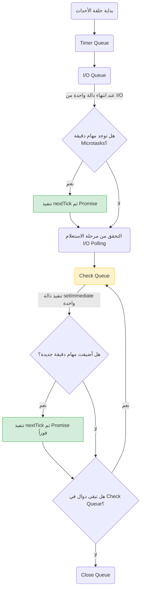

## المرجع الدراسي الاحترافي: طابور الفحص (Check Queue) في Node.js

### 1. التمهيد والسياق (Context & Recap)
في الدرس السابق، تعرفنا على مفهوم "استعلام الإدخال والإخراج" (**I/O Polling**) الذي يحدث بين طابور الإدخال/الإخراج (**I/O Queue**) وطابور الفحص (**Check Queue**)، وكيف أن هذا الاستعلام يفسر سبب تنفيذ دالة `setImmediate` قبل دالة `readFile` في التجربة السابقة. 
الآن، ماذا لو اكتمل الاستعلام (I/O polling) وكانت هناك بالفعل دالة استدعاء عكسي (Callback) موجودة في الـ **I/O Queue**؟ هذا الدرس يركز على استكشاف طابور الفحص (**Check Queue**) وعلاقته بالطوابير الأخرى من خلال أربع تجارب عملية.

---

### 2. المفهوم الأساسي: طابور الفحص (Check Queue)

*   **التعريف:** هو أحد طوابير حلقة الأحداث (**Event Loop**) في بيئة Node.js، وهو مخصص حصرياً لتنفيذ دوال الاستدعاء العكسي التي يتم إضافتها باستخدام الدالة المدمجة `setImmediate`.
*   **الفكرة الأساسية:** تقوم حلقة الأحداث بزيارة هذا الطابور مباشرة بعد الانتهاء من طابور الإدخال والإخراج ومرحلة الاستعلام.
*   **متى نستخدمها؟** تُستخدم الدالة `setImmediate` عندما نرغب في تنفيذ كود غير متزامن في أسرع وقت ممكن، ولكن *بعد* أن تنتهي حلقة الأحداث من معالجة عمليات الإدخال والإخراج (I/O operations).

---

### 3. التجربة العاشرة: ترتيب (Check Queue) بعد الاستعلام

الهدف من هذه التجربة هو ضمان إدراج دالة `setImmediate` في طابور الفحص **فقط بعد** اكتمال استعلام الإدخال والإخراج.

**الخطوات والكود البرمجي:**
قمنا بوضع دالة `setImmediate` **داخل** دالة الاستدعاء العكسي الخاصة بـ `fs.readFile`.

```javascript
const fs = require('node:fs');

// قراءة الملف (I/O operation)
fs.readFile(__filename, () => {
    console.log('this is read file 1'); // يُطبع أولاً
    
    // إضافة دالة لطابور الفحص من داخل الـ I/O Queue
    setImmediate(() => {
        console.log('this is inner setImmediate inside read file'); // يُطبع ثانياً
    });
});
```

**المخرجات (Output):**
1. `this is read file 1`
2. `this is inner setImmediate inside read file`

> ⚠️ **Important Note**
> **الاستنتاج الجوهري للتجربة 10:**
> يتم تنفيذ دوال الاستدعاء في طابور الفحص (**Check Queue**) بعد تنفيذ دوال طوابير المهام الدقيقة (**Microtask Queues**)، وطابور المؤقتات (**Timer Queue**)، وطابور الإدخال والإخراج (**I/O Queue**).

**مسار التنفيذ خلف الكواليس (Execution Visualization):**
1. يُفرغ مكدس الاستدعاءات (**Call Stack**) وتدخل حلقة الأحداث الطوابير الأولية وتجدها فارغة.
2. في مرحلة الاستعلام (**I/O Polling**)، تكتمل قراءة الملف وتُضاف دالة الاستدعاء إلى الـ **I/O Queue**.
3. تنتهي الدورة الأولى لحلقة الأحداث لعدم وجود مهام أخرى.
4. في الدورة الثانية، تصل حلقة الأحداث إلى الـ **I/O Queue**، تجد الدالة وتنفذها (يُطبع النص الأول).
5. تنفيذ هذه الدالة يُضيف دالة جديدة إلى طابور الفحص (**Check Queue**).
6. تنتقل حلقة الأحداث إلى طابور الفحص، تسحب الدالة وتنفذها (يُطبع النص الثاني).

---

### 4. التجربة الحادية عشرة: المهام الدقيقة بين (I/O Queue) و (Check Queue)

ماذا لو أضفنا مهام دقيقة (Microtasks) داخل دالة `readFile` بجانب `setImmediate`؟

**الكود البرمجي للتجربة:**
```javascript
const fs = require('node:fs');

fs.readFile(__filename, () => {
    console.log('this is read file 1');
    
    // إضافة دالة لطابور الفحص
    setImmediate(() => {
        console.log('this is inner setImmediate inside read file');
    });

    // إضافة دوال لطوابير المهام الدقيقة
    process.nextTick(() => {
        console.log('this is inner process.nextTick inside read file');
    });
    
    Promise.resolve().then(() => {
        console.log('this is inner Promise.resolve inside read file');
    });
});
```

**المخرجات (Output):**
1. `this is read file 1`
2. `this is inner process.nextTick inside read file`
3. `this is inner Promise.resolve inside read file`
4. `this is inner setImmediate inside read file`

> ⚠️ **Important Note**
> **الاستنتاج الجوهري للتجربة 11:**
> يتم تنفيذ دوال طوابير المهام الدقيقة (**Microtask Queues**) **بين** طابور الإدخال/الإخراج (**I/O Queue**) وطابور الفحص (**Check Queue**). 
> بعبارة أخرى، قبل أن تغادر حلقة الأحداث طابور الـ I/O للانتقال إلى طابور الفحص، تقوم بفحص وتفريغ طوابير المهام الدقيقة أولاً.

---

### 5. التجربة الثانية عشرة: التداخل أثناء تنفيذ طابور الفحص (Interleaved Execution)

الهدف هنا هو معرفة كيف تتعامل حلقة الأحداث إذا تمت إضافة مهام دقيقة **أثناء** قيامها بتفريغ طابور الفحص نفسه.

**الكود البرمجي للتجربة:**
```javascript
// 1. الدالة الأولى في طابور الفحص
setImmediate(() => console.log('setImmediate 1'));

// 2. الدالة الثانية في طابور الفحص (تحتوي على مهام متداخلة)
setImmediate(() => {
    console.log('setImmediate 2');
    
    // مهام دقيقة تضاف أثناء التنفيذ
    process.nextTick(() => console.log('nextTick 1'));
    Promise.resolve().then(() => console.log('Promise.resolve 1'));
});

// 3. الدالة الثالثة في طابور الفحص
setImmediate(() => console.log('setImmediate 3'));
```

**المخرجات (Output):**
1. `setImmediate 1`
2. `setImmediate 2`
3. `nextTick 1`
4. `Promise.resolve 1`
5. `setImmediate 3`

**خطوات ومسار التنفيذ (Execution Walkthrough):**
1. حلقة الأحداث تدخل طابور الفحص الذي يحتوي على 3 دوال.
2. تُسحب الدالة الأولى وتُنفذ (`setImmediate 1`).
3. تُسحب الدالة الثانية وتُنفذ (`setImmediate 2`)، وهذا التنفيذ يضيف دوالاً إلى طوابير الـ `nextTick` والـ `Promise`.
4. **الخطوة الحاسمة:** حلقة الأحداث لا تكمل سحب الدالة الثالثة مباشرة! الطوابير الدقيقة لها "أولوية قصوى جداً" (very high priority)، لذا يتم التحقق منها **بين كل تنفيذ والآخر** داخل طابور الفحص.
5. تُنفذ دالة الـ `nextTick` ثم دالة الـ `Promise`.
6. بعد أن تفرغ طوابير المهام الدقيقة، يعود التحكم لطابور الفحص لتنفيذ الدالة الثالثة والأخيرة (`setImmediate 3`).

---

### 6. التجربة الثالثة عشرة: الشذوذ الزمني (Timer Anomaly) مع طابور الفحص

في هذه التجربة نضع مؤقتاً زمنياً مدته صفر مقابل دالة `setImmediate` في النطاق العام (Global scope).

**الكود البرمجي:**
```javascript
// مؤقت زمني بتأخير 0 مللي ثانية
setTimeout(() => console.log('setTimeout 1'), 0);

// دالة طابور الفحص
setImmediate(() => console.log('setImmediate 1'));
```

**المخرجات والمشكلة (The Anomaly):**
عند تشغيل هذا الكود عدة مرات، يكون الترتيب **غير ثابت (not the same)**.
*   أحياناً: `setTimeout 1` يليه `setImmediate 1`.
*   وأحياناً أخرى: `setImmediate 1` يليه `setTimeout 1`.

> ⚠️ **Important Note**
> **الاستنتاج الجوهري للتجربة 13:**
> عند تشغيل `setTimeout` بتأخير `0ms` جنباً إلى جنب مع `setImmediate`، فإن ترتيب التنفيذ **لا يمكن ضمانه أبداً (can never be guaranteed)**. 
> **السبب:** يرجع هذا إلى كيفية عمل المعالج (CPU Timing) وآلية الحد الأدنى للتأخير التي درسناها سابقاً في طابور الإدخال/الإخراج. 
> **الحل:** لضمان تنفيذ المؤقت أولاً دائماً، يجب إضافة حلقة تكرار تستهلك بعض الوقت (time consuming for Loop) قبل الكود لضمان انقضاء الـ 1 مللي ثانية.

---

### 7. جدول مقارنة: الأولويات بين الطوابير في حلقة الأحداث

| الترتيب المطلق | اسم الطابور | دوال الاستدعاء المعنية | ملاحظة هندسية حول التنفيذ |
| :---: | :--- | :--- | :--- |
| **1** | **Microtasks** (`nextTick` و `Promise`) | `process.nextTick()`, `Promise.then()` | لهما أولوية مطلقة ويتم التحقق منهما بين كل تنفيذ في الطوابير الأخرى. |
| **2** | **Timer Queue** | `setTimeout()`, `setInterval()` | يتم تنفيذه بعد إفراغ المهام الدقيقة. |
| **3** | **I/O Queue** | `fs.readFile()` ونحوها | تنفذ دواله فقط بعد اكتمال مرحلة استعلام الإدخال والإخراج. |
| **4** | **Check Queue** | `setImmediate()` | يُنفذ بعد الـ I/O وبعد التحقق من المهام الدقيقة. |

---

### 8. رسم توضيحي: مسار التنفيذ بين (I/O Queue) و (Check Queue)

يوضح المخطط التالي سلوك حلقة الأحداث بناءً على التجربتين 11 و 12:


