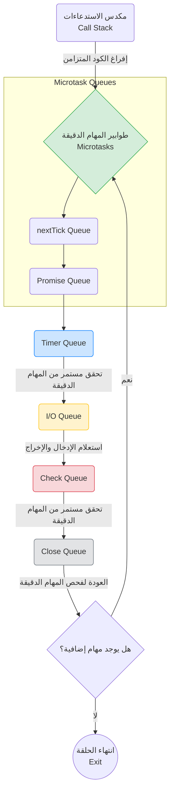

## المرجع الدراسي الاحترافي: طابور الإغلاق (Close Queue) والملخص الشامل لحلقة الأحداث (Event Loop)

### 1. التمهيد والسياق (Context)
في الدروس السابقة، قمنا ببناء فهمنا لحلقة الأحداث (**Event Loop**) تدريجياً عبر دراسة طوابير المهام الدقيقة، طابور المؤقتات، طابور الإدخال والإخراج، وطابور الفحص. 
في هذا الدرس (والذي يمثل التجربة الرابعة عشرة والأخيرة في هذا القسم)، سنسلط الضوء على الطابور الأخير المتبقي في حلقة الأحداث، وهو **طابور الإغلاق (Close Queue)**، لنكمل بذلك الصورة المعمارية الكاملة لبيئة Node.js.

---

### 2. المفهوم الأساسي: طابور الإغلاق (Close Queue)

**التعريف:**
هو الطابور السادس والأخير في دورة حلقة الأحداث (Event Loop)، وهو مخصص حصرياً للتعامل مع دوال الاستدعاء العكسي (**Callbacks**) المرتبطة بأحداث الإغلاق (Close events).

**كيف تتم إضافة دالة إلى هذا الطابور؟**
يتم إدراج (Queue) دالة استدعاء عكسي في هذا الطابور ببساطة عن طريق إضافة مستمعين (Listeners) لأحداث الإغلاق (Close events) على الكائنات التي تدعم ذلك (مثل التدفقات Streams).

---

### 3. التجربة الرابعة عشرة: (Close Queue) مقابل جميع الطوابير الأخرى

الهدف من هذه التجربة النهائية هو دمج جميع الطوابير التي درسناها معاً لتحديد الترتيب المطلق والأخير لـ **طابور الإغلاق** مقارنة بالطوابير الأخرى.

**الخطوات والكود البرمجي للتجربة:**
سنقوم بإنشاء "تدفق قراءة" (Readable Stream)، ثم نغلقه، ونستمع لحدث الإغلاق. في نفس الوقت، سنضيف دوالاً لجميع الطوابير الأخرى.

```javascript
// 1. استيراد وحدة نظام الملفات
const fs = require('node:fs');

// 2. إنشاء تدفق قراءة من الملف الحالي
const readableStream = fs.createReadStream(__filename);

// 3. إغلاق التدفق برمجياً باستخدام دالة close()
readableStream.close();

// 4. إضافة مستمع لحدث الإغلاق (يضيف الدالة إلى Close Queue)
readableStream.on('close', () => {
    console.log('this is from readable stream close event callback');
});

// 5. إضافة دالة لطابور الفحص (Check Queue)
setImmediate(() => {
    console.log('this is setImmediate 1');
});

// 6. إضافة دالة لطابور المؤقتات (Timer Queue)
setTimeout(() => {
    console.log('this is setTimeout 1');
}, 0);

// 7. إضافة دالة لطابور الوعود (Promise Queue)
Promise.resolve().then(() => {
    console.log('this is Promise.resolve 1');
});

// 8. إضافة دالة لطابور nextTick Queue
process.nextTick(() => {
    console.log('this is process.nextTick 1');
});
```

**المخرجات الفعلية (Output):**
1. `this is process.nextTick 1`
2. `this is Promise.resolve 1`
3. `this is setTimeout 1`
4. `this is setImmediate 1`
5. `this is from readable stream close event callback`

> ⚠️ **Important Note**
> **الاستنتاج النهائي (The Inference):**
> يتم تنفيذ دوال الاستدعاء العكسي الموجودة في طابور الإغلاق (**Close Queue callbacks**) **بعد** تنفيذ جميع دوال الاستدعاء في الطوابير الأخرى خلال دورة معينة من دورات حلقة الأحداث (in a given iteration of the event loop).

---

### 4. مسار التنفيذ خلف الكواليس (Execution Visualization)

إليك الترتيب الدقيق لما حدث في مكدس الاستدعاءات وحلقة الأحداث:
*   **Step 1:** يقوم مكدس الاستدعاءات (**Call Stack**) بتنفيذ جميع العبارات البرمجية المكتوبة.
*   **Step 2:** ينتج عن ذلك إدراج (Queueing) دالة استدعاء واحدة في كل طابور من طوابير حلقة الأحداث (باستثناء طابور I/O Queue لأنه غير مستخدم هنا).
*   **Step 3:** يفرغ المكدس من الكود المتزامن، فينتقل التحكم إلى حلقة الأحداث.
*   **Step 4:** تُسحب دالة طابور `nextTick Queue` وتُنفذ.
*   **Step 5:** تُسحب دالة طابور الوعود `Promise Queue` وتُنفذ.
*   **Step 6:** ينتقل التحكم لطابور المؤقتات `Timer Queue` وتُنفذ الدالة الخاصة به.
*   **Step 7:** ينتقل التحكم لطابور الفحص `Check Queue` وتُنفذ الدالة.
*   **Step 8:** أخيراً، يصل التحكم إلى طابور الإغلاق `Close Queue`، حيث تُسحب الدالة النهائية وتُنفذ.

*(بهذا نكون قد أكملنا فهم جميع الطوابير، والأمر في غاية البساطة إذا تابعت التسلسل المنطقي للتجارب)*.

---

### 5. الملخص الشامل لحلقة الأحداث (The Event Loop Comprehensive Recap)

بعد إكمال 14 تجربة مختلفة، قام المحاضر بتلخيص الخصائص الجوهرية لحلقة الأحداث في النقاط التالية لتكون مرجعاً ثابتاً:

**ما هي حلقة الأحداث؟**
حلقة الأحداث هي برنامج مكتوب بلغة سي (**C program**)، وظيفته الأساسية هي تنظيم وتنسيق (Orchestrates or coordinates) تنفيذ الأكواد المتزامنة (Synchronous) وغير المتزامنة (Asynchronous) داخل بيئة Node.js.

**كيف تُنسق التنفيذ؟**
تقوم الحلقة بتنسيق تنفيذ دوال الاستدعاء من خلال المرور على **6 طوابير مختلفة (6 different queues)** بترتيب صارم ومحدد.

#### جدول مقارنة: طرق الإدراج في طوابير حلقة الأحداث الستة

| الترتيب المطلق | اسم الطابور (Queue Name) | كيف نضيف دالة إليه برمجياً؟ (How to Queue) |
| :---: | :--- | :--- |
| **1** | **nextTick Queue** (Microtask) | استخدام الدالة: `process.nextTick()`. |
| **2** | **Promise Queue** (Microtask) | حل أو رفض وعد: `Promise.resolve()` أو `reject`. |
| **3** | **Timer Queue** | استخدام المؤقتات: `setTimeout()` أو `setInterval()`. |
| **4** | **I/O Queue** | تنفيذ أي دالة غير متزامنة (Async method) للوحدات المدمجة. |
| **5** | **Check Queue** | استخدام الدالة: `setImmediate()`. |
| **6** | **Close Queue** | إرفاق مستمع لحدث الإغلاق: `on('close', ...)`. |

> ⚠️ **Important Note**
> **القاعدة الذهبية الاستثنائية للتنفيذ (The Golden Rule):**
> الترتيب العام يتبع الجدول أعلاه تماماً، **ولكن مع نقطة إضافية وحاسمة جداً:** 
> طوابير المهام الدقيقة (أي `nextTick Queue` و `Promise Queue`) يتم التحقق منها وتنفيذ ما بداخلها **بين كل طابور وآخر**، وليس هذا فحسب، بل يتم التحقق منها **بين تنفيذ كل دالة استدعاء وأخرى** (in between each callback execution) داخل طابور المؤقتات (Timer Queue) وطابور الفحص (Check Queue).

---

### 6. رسم توضيحي: المعمارية الكاملة والنهائية لحلقة الأحداث (Complete Event Loop Architecture)

يلخص هذا المخطط (Mermaid) المعمارية الكاملة التي استغرقنا 14 تجربة لفهمها بدقة:



*(ختاماً: بهذا الدرس تنتهي وحدة استكشاف الآلية الداخلية (Internals) لمعالجة الأكواد غير المتزامنة في Node.js)*.