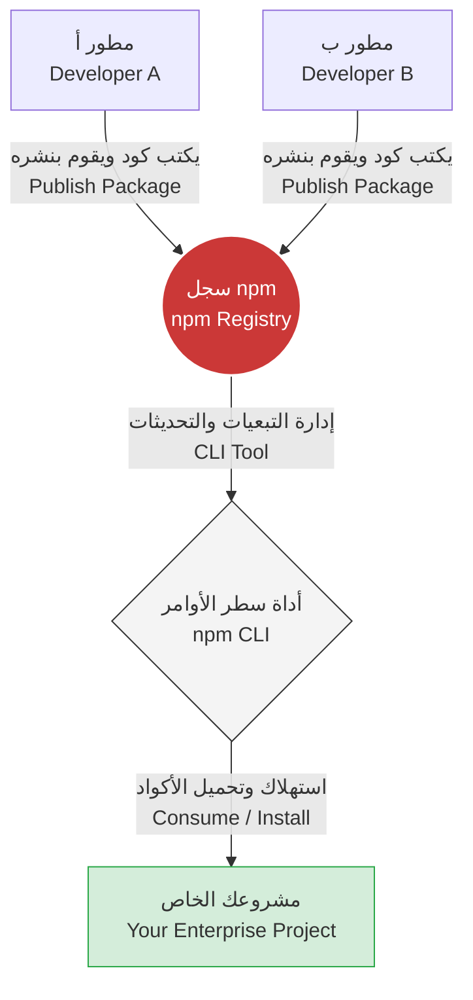

## المرجع الدراسي الاحترافي: مقدمة إلى (npm)

### 1. التمهيد والسياق (Context)
في هذا القسم الجديد من الدورة (القسم السادس)، ننتقل من استكشاف الآلية الداخلية لبيئة Node.js إلى دراسة أداة تُعد حجر الأساس في بيئة تطوير جافاسكريبت الحديثة وهي **`npm`**. 
عند بناء تطبيقات ضخمة على مستوى الشركات (**Enterprise scale applications**) أو حتى في مشاريعك الجانبية (**Side projects**)، فإننا نادراً ما نكتب كل سطر كود من الصفر. نحن نعتمد بشكل مستمر على أكواد كُتبت مسبقاً بواسطة مطورين آخرين، وهنا تبرز الحاجة الجوهرية لفهم واستخدام `npm`.

---

### 2. المفهوم الأساسي: ما هو (npm)؟

للإجابة على هذا السؤال بشكل أكاديمي ودقيق، يجب أن نفهم أن **`npm`** يمثل شيئين رئيسيين في آنٍ واحد:
1. أكبر مكتبة برمجيات في العالم (**World's largest software library**).
2. مدير حزم برمجية (**Software package manager**).

سيتم تفصيل كلا الوجهين في الأقسام التالية.

---

### 3. الوجه الأول: (npm) كمكتبة برمجيات (Software Library)

**التعريف:**
هي قاعدة بيانات عامة وضخمة جداً (**Large public database**) تحتوي على أكواد جافاسكريبت (تُسمى حزم أو Packages) ومتاحة للمطورين من جميع أنحاء العالم.

**التشبيه العملي (Analogy):**
لتقريب الفكرة، ضرب المحاضر تشبيهاً بمكتبة الكتب التقليدية:
*   كما أن مكتبة الكتب تحتوي على آلاف الكتب التي ألفها كُتّاب مختلفون، فإن **سجل npm (npm registry)** هو مكتبة تحتوي على آلاف "حزم الأكواد" (**Code Packages**) التي كتبها مطورون مختلفون.

**لماذا نستخدمها؟**
*   **المشاركة (Share/Publish):** إذا قمت بكتابة حزمة كود مفيدة، يمكنك نشرها (**Publish**) على سجل npm ليستخدمها الآخرون.
*   **الاستهلاك والاستعارة (Consume/Borrow):** إذا واجهتك مشكلة برمجية ووجدت حزمة جاهزة تحلها، يمكنك استعارة هذا الكود بدلاً من إضاعة الوقت في "إعادة اختراع العجلة" (**Without having to reinvent the wheel**).

*(ملاحظة: يمكنك البحث عن أي حزمة واكتشاف هذه المكتبة الضخمة عبر زيارة الموقع الرسمي: `npmjs.com`).*

---

### 4. الوجه الثاني: (npm) كمدير حزم برمجية (Software Package Manager)

**التعريف:**
هو أداة تعمل عبر واجهة سطر الأوامر (**CLI Tool - Command Line Interface**) تتيح للمطورين تثبيت وإدارة حزم الأكواد داخل مشاريعهم بكل سهولة.

**الفكرة الأساسية ولماذا نحتاج إلى "إدارة" الحزم؟**
مشاركة واستعارة الأكواد تبدو فكرة بسيطة نظرياً، ولكن بناء نظام متكامل حولها يُولد تعقيدات هندسية ضخمة. تتولى أداة `npm` (كمدير حزم) حل وإدارة هذه التعقيدات نيابة عنك، والتي تشمل:
1.  كيف يقوم المطور المستهلك بتحميل الحزمة من السجل إلى مشروعه؟
2.  كيف يقوم المؤلف بنشر حزمته بشكل صحيح؟
3.  **التحديثات:** ماذا لو قام مؤلف الحزمة بتغيير اسم دالة (Function name)؟ كيف يحصل المستهلك على هذا التحديث في حزمة مُثبتة بالفعل؟
4.  **التبعيات (Dependencies):** ماذا لو كانت الحزمة التي أستخدمها تعتمد في عملها على حزم أخرى؟ كيف يتم تحميل جميع هذه التبعيات بشكل متسلسل وصحيح؟

---

### 5. خطوات التثبيت والتحقق (Installation & Verification)

كيف نحصل على أداة `npm` في أجهزتنا؟

*   **خطوة التثبيت:** لا توجد حاجة للقيام بتثبيت منفصل (**No need for a separate installation**). أداة `npm` هي مدير الحزم الافتراضي لبيئة Node.js، وتأتي "مدمجة" (**Bundled**) ويتم تثبيتها تلقائياً بمجرد تثبيتك لبرنامج Node.js.

*   **خطوة التحقق من الإصدار:** للتأكد من وجودها على جهازك ومعرفة إصدارها الحالي، افتح سطر الأوامر (Terminal) واكتب الكود التالي:

```bash
# أمر التحقق من إصدار مدير الحزم
npm -v
```
*شرح الكود: الحرف `v` هو اختصار لـ Version. سيقوم هذا الأمر بطباعة رقم إصدار `npm` المُثبت حالياً على جهازك.*

---

### 6. جدول مقارنة: (npm) والبدائل المتاحة

على الرغم من أن `npm` هو الأداة الافتراضية والأشهر، إلا أن هناك أدوات أخرى طُورت لاحقاً تؤدي نفس الوظيفة. إليك مقارنة سريعة بناءً على ما ذكره المحاضر:

| الأداة (Package Manager) | الحالة | ملاحظات |
| :--- | :--- | :--- |
| **npm** | الافتراضي والأساسي (Default) | يأتي مدمجاً مع Node.js وهو الأكثر استخداماً. |
| **pnpm** | بديل متاح (Alternative) | أداة خارجية يمكن استخدامها كبديل لإدارة الحزم. |
| **yarn** | بديل متاح (Alternative) | أداة خارجية شهيرة يمكن استخدامها بدلاً من npm. |

---

### 7. ملاحظات هامة من المحاضر

> ⚠️ **Important Note**
> **تطور الاسم وطريقة الكتابة (Name Evolution):**
> 1. **ماذا يعني الاختصار؟** في بداياتها الأولى، كانت الأحرف تقف اختصاراً لـ (**N**ode **P**ackage **M**anager).
> 2. **التطور:** مع مرور الوقت، تطورت الأداة لتصبح مدير الحزم للغة جافاسكريبت بأكملها (سواء للواجهات الأمامية أو الخلفية)، وبالتالي **لم يعد الاسم مقتصراً أو يرمز بالضرورة إلى Node Package Manager بعد الآن**.
> 3. **قاعدة الكتابة:** يُكتب اسم الأداة دائماً وبشكل رسمي بأحرف إنجليزية صغيرة هكذا: **`npm`** (All in lower case).

---

### 8. رسم توضيحي: دور (npm) في دورة حياة التطوير

يوضح هذا المخطط الهيكلي كيف تعمل `npm` كحلقة وصل (مكتبة ومدير حزم) بين المطورين حول العالم:


