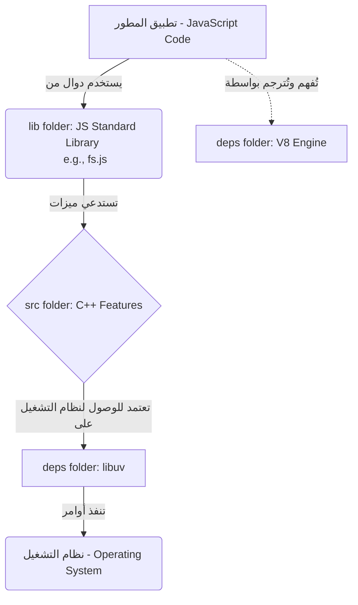

## ما هو Node.js؟ وكيف يعمل من الداخل؟

### 1. التعريف الشامل لتقنية Node.js

**التعريف (Definition):** تقنية **Node.js** هي بيئة تشغيل جافاسكريبت مفتوحة المصدر ومتعددة المنصات (**Open source, cross-platform JavaScript runtime environment**).

**الفكرة الأساسية وتفصيل المكونات:**
للإحاطة بهذا التعريف، يجب تفكيكه إلى ثلاثة أجزاء رئيسية:

1. **مفتوح المصدر (Open Source):** الكود المصدري (Source code) متاح للعامة، مما يسمح بمشاركته والتعديل عليه.
2. **متعدد المنصات (Cross-platform):** تعمل التقنية بكفاءة على أنظمة تشغيل متعددة وهي: Mac، Windows، و Linux.
3. **بيئة تشغيل جافاسكريبت (JavaScript Runtime Environment):** توفر جميع المكونات (Components) الضرورية لاستخدام وتشغيل أي برنامج مكتوب بلغة جافاسكريبت.

> `‏` **Important Note** **النقطة الجوهرية الأهم:** تتيح تقنية Node.js تشغيل برامج جافاسكريبت **خارج المتصفح (Outside the browser)**. قبل عام 2009 (عام ظهور Node.js)، كان تشغيل أكواد جافاسكريبت مقتصراً حصرياً على العمل داخل المتصفح فقط.

---

### 2. قدرات واستخدامات Node.js (What can you build?)

**لماذا نستخدمها ومتى؟** بفضل القدرة على تشغيل جافاسكريبت خارج المتصفح، فتحت Node.js عالماً جديداً من الاحتمالات لبناء تطبيقات معقدة وقوية (Complex and powerful applications). يمكن استخدامها لبناء:

- المواقع الإلكترونية التقليدية (Traditional websites).
- خدمات الواجهة الخلفية (Back-end services) مثل واجهات برمجة التطبيقات (**APIs** - Application Programming Interfaces).
- تطبيقات الوقت الفعلي (Real-time applications).
- خدمات البث (Streaming services) مثل تطبيق منصة Netflix.
- أدوات واجهة سطر الأوامر (**CLI** tools - Command Line Interface).
- الألعاب متعددة اللاعبين (Multiplayer games).

---

### 3. البنية الداخلية للكود المصدري (Source Code Architecture)

لفهم بيئة تشغيل Node.js، يجب النظر داخل الكود المصدري الخاص بها، والموجود في مستودع منصة **GitHub** على الرابط `github.com/nodejs/node`. يتكون هذا الريبو من ثلاثة مجلدات أساسية تشرح كيفية عمل التقنية:

#### أ. مجلد التبعيات (deps / dependencies folder)

يحتوي هذا المجلد على أكواد خارجية (External code) يعتمد عليها Node.js للعمل. من أهم هذه التبعيات:

1. **محرك V8 (V8 Engine):** هو نفس محرك جافاسكريبت الموجود في متصفح كروم (Chrome browser). **فائدته:** بدونه، لا توجد أي طريقة تجعل Node.js قادراً على فهم أكواد جافاسكريبت التي نكتبها.
2. **مكتبة libuv (uv):** هي مكتبة مفتوحة المصدر (Open source library). **فائدتها:** توفر لـ Node.js القدرة على الوصول إلى ميزات نظام التشغيل الأساسية (Underlying operating system features) مثل التعامل مع نظام الملفات (File system) والشبكات (Networking).

#### ب. مجلد المصدر (src / source folder)

يحتوي على الكود المصدري المكتوب بلغة **C++** الخاص ببيئة تشغيل Node.js.

- **لماذا نستخدم لغة C++ هنا؟** لغة جافاسكريبت لم تُصمم للتعامل مع الوظائف ذات المستوى المنخفض (Low-level functionality) مثل نظام الملفات والشبكات، بينما لغة C++ صُممت خصيصاً لذلك.
- **الخلاصة:** هذا المجلد هو مجموعة من ميزات C++ التي يضيفها Node.js لتعويض النقص في قدرات جافاسكريبت.

#### ج. مجلد المكتبة (lib / library folder)

بما أن Node.js يضيف ميزات C++، كيف يمكن لمطور جافاسكريبت استخدامها دون تعلم C++؟.

- **الحل:** يحتوي هذا المجلد على أكواد مكتوبة بلغة جافاسكريبت تعمل كجسر يتيح لك الوصول بسهولة إلى ميزات C++ الموجودة في مجلد `src`.
- **مثال عملي:** ملف `fs.js` هو ملف يحتوي على كود جافاسكريبت قياسي نستخدمه للوصول إلى نظام الملفات. يحتوي أيضاً هذا المجلد على دوال مساعدة (Utility functions) شائعة الاستخدام.

> `‏` **Important Note** يؤكد المحاضر أن Node.js ليس "صندوقاً أسود كبيراً" (Big black box) لا يمكن فهمه، بل هو ببساطة عبارة عن أكواد مكتوبة بلغتي **C++** و **JavaScript** تعمل معاً.

---

### 4. آلية العمل والتنفيذ (Execution Flow)

بناءً على المجلدات السابقة، إليك خطوات تنفيذ المهام ذات المستوى المنخفض (مثل قراءة ملف) داخل Node.js:

`‏`**Step 1** يكتب المطور كود جافاسكريبت مستخدماً المكتبات القياسية الموجودة في مجلد `lib` (مثل `fs.js`) للتعامل مع نظام الملفات.

`‏`**Step 2** يقوم ملف الجافاسكريبت (`fs.js`) من الداخل باستدعاء ميزة **C++** المقابلة لها والموجودة في مجلد `src`.

`‏`**Step 3** تعتمد ميزة C++ المُستدعاة بدورها على مكتبة **libuv** (الموجودة في مجلد `deps`) للتواصل الفعلي مع نظام التشغيل (Operating system) وتنفيذ العملية المطلوبة.

---

### 5. رسم توضيحي: البنية المعمارية لـ Node.js

---

### 6. المقارنات: بيئة المتصفح مقابل بيئة Node.js

على الرغم من أن كليهما يمثل بيئة تشغيل جافاسكريبت (JavaScript Runtime)، إلا أن هناك اختلافاً جوهرياً وحاسماً بينهما:

|الميزة (Feature)|بيئة المتصفح (Browser Runtime)|بيئة Node.js (Node.js Runtime)|
|:--|:--|:--|
|**مكان التشغيل**|داخل المتصفح (Inside the browser)|خارج المتصفح (Outside the browser)|
|**واجهات برمجة تطبيقات الويب (Web APIs)**|تمتلك حق الوصول إليها (Access to Web APIs)|**لا تمتلك حق الوصول إليها** (Does not have access to Web APIs)|
|**عناصر DOM (`window` و `document`)**|متوفرة ومستخدمة|**غير متوفرة إطلاقاً** (There is no window or document)|
|**القدرات المضافة**|للتعامل مع واجهة المستخدم (UI)|روابط C++ للعمليات المنخفضة المستوى (C++ bindings) للشبكات والملفات|

---

### 7. الخلاصة الشاملة (Summary)

لترسيخ المفهوم، احفظ هذه الحقائق الثلاث عن Node.js:

1. **ليست لغة برمجة (Not a language)**.
2. **ليست إطار عمل (Not a framework)**.
3. **هي بيئة تشغيل (It is a runtime)**.

تقوم هذه البيئة بتنفيذ لغة **ECMAScript** القياسية بالإضافة إلى ميزات جديدة تُتاح من خلال روابط C++ (**C++ bindings**) معتمدة على محرك **V8** لترجمة الأكواد. من منظور برمجي، هي تتكون من ملفات C++ التي تشكل الميزات الأساسية (Core features)، وملفات جافاسكريبت التي تسهل استهلاك واستخدام ميزات C++ المذكورة.