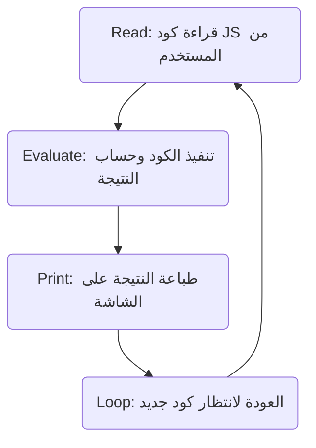

##  إعداد بيئة العمل وأول برنامج (Hello World)

### 1. مقدمة وملاحظة اصطلاحية (Terminology Note)

> `‏` **Important Note** **ملاحظة هامة :** في الأوساط التقنية، غالباً ما يُشار إلى تقنية **Node.js** اختصاراً بكلمة **Node** فقط. سيتم استخدام هذا الاختصار (Node) طوال بقية الدورة للإشارة إلى التقنية، ومن المهم إدراك أنهما يحملان نفس المعنى تماماً.

---

### 2. إعداد بيئة التطوير (Development Environment Setup)

لكتابة وتشغيل أكواد جافاسكريبت خارج المتصفح، يجب أولاً تجهيز بيئة العمل على جهاز الكمبيوتر الخاص بك. تتم هذه العملية عبر خطوات مرتبة:

`‏`**Step 1: تثبيت محرر الأكواد (Code Editor)**

- **الأداة الموصى بها:** برنامج **Visual Studio Code (VS Code)**.
- **طريقة الحصول عليه:** يمكن تحميله مجاناً من الموقع الرسمي `code.visualstudio.com` وتثبيته على جهازك.

`‏`**Step 2: تثبيت بيئة Node.js**

- **الخطوات:**
    1. اذهب إلى الموقع الرسمي `nodejs.org`.
    2. قم بتحميل أحدث إصدار متاح (في وقت تسجيل المحاضرة كان الإصدار هو `19.1.0`).
    3. قم بتثبيت البرنامج مع الاحتفاظ بالإعدادات الافتراضية (Defaults) دون تغيير أي منها.

`‏`**Step 3: فتح المشروع في محرر الأكواد**

- قم بإنشاء مجلد جديد للمشروع (مثلاً باسم `node.js`) وافتحه باستخدام برنامج **VS Code**.

`‏`**Step 4: التحقق من صحة التثبيت (Verification)**

- افتح ال (**Integrated Terminal**) داخل VS Code.
    - **طريقة الفتح:** من القائمة العلوية اختر `View` ثم `Terminal`، أو استخدم اختصار لوحة المفاتيح `Ctrl + Backtick` (وهو الزر الذي يحمل علامة `~` أو ``` أسفل زر Esc).
- في سطر الأوامر، اكتب الأمر التالي واضغط Enter:

    ```javascript
   node -v
    ```
   
- **النتيجة المتوقعة:** يجب أن يظهر لك رقم إصدار Node المُثبت على جهازك (مثال: `v19.1.0`).
- **الأخطاء الشائعة:** إذا لم يظهر رقم الإصدار أو ظهرت رسالة خطأ، فهذا يعني أن عملية التثبيت لم تنجح. يُنصح بإعادة تثبيت البرنامج أو البحث عن رسالة الخطأ في محرك Google.

---

### 3. طرق تنفيذ أكواد جافاسكريبت باستخدام Node

بعد التأكد من تثبيت Node بنجاح، أصبح بإمكانك تشغيل أكواد جافاسكريبت (JavaScript code). يوفر Node طريقتين أساسيتين للقيام بذلك:

#### الطريقة الأولى: استخدام بيئة Node REPL

**التعريف:** مصطلح **REPL** هو اختصار لأربع كلمات تصف دورة حياة هذه البيئة:

-`‏` **R**ead (قراءة)
-`‏` **E**valuate (تقييم/معالجة)
-`‏` **P**rint (طباعة/إخراج)
-`‏` **L**oop (تكرار)

**الفكرة الأساسية وكيف تعمل:** هي عبارة عن  (**Interactive Shell**) تقوم بقراءة الكود الذي يكتبه المستخدم، ثم تقوم بمعالجته وتقييم نتيجته، ثم تطبع النتيجة على الشاشة، وتعود لتكرار العملية منتظرة أمراً جديداً من المستخدم، وتستمر هكذا حتى يقرر المستخدم إنهاء الجلسة.



**طريقة الاستخدام (الخطوات العملية):** **Step 1:** في الـ Terminal، اكتب الأمر `clear` لتنظيف الشاشة من أي نصوص سابقة. **Step 2:** اكتب كلمة `node` واضغط Enter. ستبدأ الآن الجلسة التفاعلية. **Step 3:** اكتب أي تعبير جافاسكريبت (**JavaScript Expression**).

**مثال 1:**

```javascript
console.log("hello world")
```

- **المخرجات:** سيتم طباعة النص `hello world`، وسيظهر تحته كلمة `undefined`.
- **السبب الأكاديمي لظهور undefined:** هذه الكلمة تمثل "القيمة المُرجعة" (**Return value**) من دالة `console.log` نفسها، حيث أن هذه الدالة تقوم بالطباعة ولكنها لا تُرجع أي قيمة.

**مثال 2:**

```javascript
2 + 2
```

- **المخرجات:** سيتم طباعة الرقم `4` مباشرة، لأن البيئة قامت بتقييم العملية الحسابية.

**كيفية الخروج من البيئة:** لإنهاء الجلسة التفاعلية (Quit)، اضغط على اختصار `Ctrl + C` في لوحة المفاتيح.

---

#### الطريقة الثانية: تنفيذ ملفات جافاسكريبت (الممارسة الموصى بها)

**الفكرة الأساسية ولماذا نستخدمها:** على الرغم من أن بيئة REPL بسيطة وسهلة، إلا أنها غير عملية لبناء التطبيقات الحقيقية (Building applications). الطريقة المفضلة والاحترافية هي كتابة الكود داخل ملف وحفظه، ثم جعل Node يقوم بتنفيذ هذا الملف بأكمله.

**الخطوات العملية:** **Step 1: إنشاء الملف** داخل مجلد المشروع في VS Code، قم بإنشاء ملف جديد.

> `‏` **Important Note** **عرف التسمية (Convention):** جرت العادة بين المطورين على تسمية الملف الرئيسي للمشروع بأحد الأسماء التالية: `app.js`، `main.js`، أو `index.js`. (تم اختيار `index.js` في هذه المحاضرة).

`‏`**Step 2: كتابة الكود** داخل ملف `index.js`، اكتب الكود التالي وقم بحفظ الملف:

```javascript
console.log("hello from index.js");
```

`‏`**Step 3: التنفيذ عبر الطرفية (Terminal)** في الـ Terminal، قم بكتابة الأمر `node` متبوعاً باسم الملف:

```javascript
node index.js
```

- **المخرجات:** ستلاحظ طباعة الجملة `hello from index.js` في الTerminal.

> `‏` **Important Note** يمكنك الاستغناء عن كتابة امتداد الملف `.js` عند تشغيله. أي أن كتابة الأمر `node index` ستعطي نفس النتيجة تماماً وسيفهم Node أنك تقصد ملف جافاسكريبت.

---

### 4. جدول مقارنة: طرق تشغيل أكواد جافاسكريبت في Node

|وجه المقارنة (Feature)|بيئة Node REPL|تنفيذ الملفات (File Execution)|
|:--|:--|:--|
|**الاستخدام الأساسي**|تجربة الأكواد السريعة والعمليات الحسابية البسيطة.|بناء وتطوير التطبيقات الحقيقية الكاملة.|
|**طريقة التشغيل**|كتابة الأمر `node` فقط لتفعيل الجلسة.|كتابة الأمر `node` متبوعاً باسم الملف (مثل `node index.js`).|
|**حفظ الكود**|لا يتم حفظ الكود (جلسة مؤقتة).|يتم حفظ الكود للرجوع إليه وتعديله لاحقاً.|
|**توصية المحاضر**|مفيدة للتعلم ولكنها ليست الأساس.|هي الطريقة المُعتمدة (Preferred way) لبقية سلسلة الدروس.|

---

### 5. الإنجاز المحقق (الخلاصة)

باتباع هذه الخطوات، تكون قد نجحت بشكل رسمي في تنفيذ أول كود جافاسكريبت لك **خارج بيئة المتصفح** (Outside the browser)، مستفيداً من القدرات التي توفرها بيئة تشغيل Node.js.