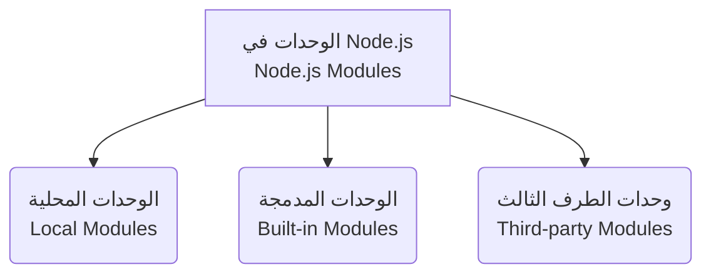

##  مقدمة في الوحدات (Modules) في Node.js

### 1. المفهوم الأساسي: ما هي الوحدة (Module)؟

**التعريف  (Definition):** الوحدة (**Module**) في بيئة Node.js هي عبارة عن كتلة من الكود البرمجي المغلّفة والقابلة لإعادة الاستخدام، والتي تمتلك السياق الخاص بها (An **encapsulated** and **reusable** chunk of code that has its own **context**).

**الشرح العميق وتفكيك المفهوم (كيف تعمل الفكرة؟):** لفهم هذا التعريف  بدقة، يجب تفكيك المصطلحات الثلاثة التي استخدمها المحاضر:

1. **مغلفة (Encapsulated):** تعني أن الكود المكتوب داخل هذه الوحدة معزول ومحمي. المتغيرات والدوال الموجودة بداخلها لا تتسرب إلى باقي أجزاء التطبيق، مما يمنع تداخل الأسماء (Naming collisions) وحدوث أخطاء غير متوقعة.
2. **قابلة لإعادة الاستخدام (Reusable):** بدلاً من كتابة نفس الكود البرمجي مراراً وتكراراً في أماكن مختلفة من التطبيق، يمكنك كتابته مرة واحدة داخل "وحدة" (Module)، ثم استدعاء هذه الوحدة واستخدامها في أي مكان تحتاجها فيه.
3. **ذات سياق خاص (Own Context):** كل وحدة تعمل في بيئتها أو نطاقها المستقل (Scope). ما يحدث داخل الوحدة يبقى داخلها ما لم تقرر أنت كمطور تصديره (Export) صراحةً ليُستخدم في الخارج.

**لماذا نستخدم الوحدات (الفائدة)؟** تُستخدم الوحدات لتقسيم التطبيقات الكبيرة والمعقدة إلى أجزاء صغيرة، منطقية، ويسهل إدارتها وصيانتها.

> `‏` **Important Note** **قاعدة جوهرية في Node.js:**  **"في بيئة Node.js، يُعامل كل ملف (File) على أنه وحدة منفصلة (Separate Module)"**. هذا يعني أن مجرد إنشائك لملف يحمل امتداد `.js`، فإنك قد أنشأت بالفعل وحدة (Module) جديدة لها سياقها الخاص.

---

### 2. أنواع الوحدات في Node.js (Types of Modules)

تنقسم الوحدات في بيئة Node.js إلى ثلاثة أنواع رئيسية. يوضح الرسم البياني التالي هذه الأنواع:

#### تفصيل أنواع الوحدات:

**1. الوحدات المحلية (Local Modules):**

- **التعريف:** هي الوحدات أو الملفات البرمجية التي نقوم نحن (كمطورين) بإنشائها وكتابتها داخل تطبيقنا الخاص.
- **الاستخدام:** تُستخدم لتنظيم المنطق البرمجي (Business logic) الخاص بالتطبيق، مثل إنشاء وحدة خاصة بالتعامل مع قاعدة البيانات، وأخرى خاصة بتسجيل دخول المستخدمين.

**2. الوحدات المدمجة (Built-in Modules):**

- **التعريف:** هي الوحدات التي تأتي جاهزة ومدمجة بشكل افتراضي مع بيئة Node.js بمجرد تثبيتها (Modules that Node ships with out of the box).
- **الميزة:** لا تحتاج إلى تثبيت أي أدوات خارجية لاستخدامها؛ فهي جزء من البيئة الأساسية وتوفر وظائف قوية (مثل وظائف التعامل مع الملفات أو الشبكات التي تم التلميح لقدرات Node عليها سابقاً).

**3. وحدات الطرف الثالث (Third-party Modules):**

- **التعريف:** هي عبارة عن حزم ووحدات برمجية تمت كتابتها وتطويرها بواسطة مطورين آخرين (Other developers) حول العالم.
- **كيف تعمل ولماذا نستخدمها؟:** يتم إتاحة هذه الوحدات للاستخدام العام، ويمكننا جلبها ودمجها في تطبيقنا لحل مشاكل برمجية معينة أو إضافة ميزات جاهزة دون الحاجة لكتابة الكود من الصفر (Don't reinvent the wheel).

---

### 3. جدول مقارنة: أنواع الوحدات

|الميزة / النوع|الوحدات المحلية (Local)|الوحدات المدمجة (Built-in)|وحدات الطرف الثالث (Third-party)|
|:--|:--|:--|:--|
|**المُنشِئ (Creator)**|أنت (مطور التطبيق)|فريق تطوير Node.js الأساسي|مطورون آخرون من المجتمع التقني|
|**مكان التواجد الأساسي**|ملفات مشروعك التي تنشئها|تأتي جاهزة مع تثبيت Node.js|تُجلب من مصادر خارجية لداخل التطبيق|
|**الغرض الرئيسي**|بناء المنطق الخاص بالتطبيق|توفير القدرات الأساسية للبيئة|توفير حلول برمجية جاهزة ومتقدمة|

---

### 4. خارطة طريق هذا القسم (Section Focus)

أوضح المحاضر أن السلسلة التعليمية ستأخذ نظرة فاحصة وعميقة على الأنواع الثلاثة المذكورة أعلاه. ومع ذلك، **فإن التركيز الحصري لهذا القسم التعليمي الحالي سيكون فقط على "الوحدات المحلية" (Local Modules)**.

**الخطوة العملية القادمة (Next Step):** بناءً على هذا التمهيد النظري، سيكون الهدف في المحاضرة القادمة هو التخلص من أي غموض متبقٍ حول المفهوم من خلال التطبيق العملي لإنشاء واستخدام أول وحدة محلية (Local Module) فعلية في بيئة Node.js.