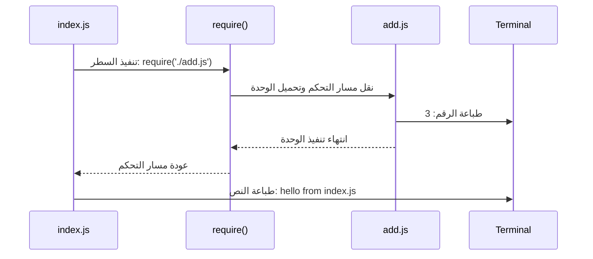

##  الوحدات المحلية في Node.js (Local Modules)

### 1. المفهوم الأساسي: الوحدات المحلية (Local Modules)

**التعريف:** الوحدات المحلية (**Local Modules**) هي عبارة عن ملفات جافاسكريبت (Modules) نقوم نحن كمطورين بإنشائها وكتابتها، ثم نستخدمها داخل تطبيقنا الخاص لتقسيم العمليات المنطقية.

**الفكرة الأساسية ولماذا نستخدمها؟** مع نمو حجم التطبيق (Application grows)، يصبح من الصعب جداً، بل ومن غير العملي، كتابة جميع الأكواد في ملف واحد رئيسي (مثل `index.js`). لذلك، نلجأ إلى تقسيم البرنامج إلى عدة وحدات منفصلة (Separate modules).

- **الفائدة:** هذا التقسيم يسمح لنا بإدارة الكود بسهولة (Easily manage the code)، وتنظيمه، وإعادة استخدامه عند الحاجة ببساطة عن طريق استدعائه (Import).

---

### 2. حالة عملية وتجربة (تقسيم الكود)

لفهم أهمية الوحدات، استعرض المحاضر مثالاً عملياً لبرنامج بسيط يقوم بجمع رقمين.

**الحالة الأولى: كل الكود في ملف واحد (`index.js`)**

```javascript
// ملف index.js
const add = (a, b) => {
    return a + b;
};

const sum = add(1, 2);
console.log(sum);
console.log("hello from index.js");
```

_شرح الكود:_

- قمنا بإنشاء دالة سهمية (Arrow function) تُسمى `add` تستقبل وسيطين `a` و `b` وتُرجع حاصل جمعهما.
- قمنا باستدعاء الدالة وتمرير الرقمين `1` و `2`.
- قمنا بتخزين النتيجة في المتغير `sum` وطباعته على الشاشة.
- **النتيجة عند تشغيل `node index.js`:** ستتم طباعة الرقم `3` يليه النص `hello from index.js`.

**الحالة الثانية: فصل الكود إلى وحدة محلية (`add.js`)**

الآن، سنقوم بفصل دالة الجمع لتكون في وحدة (Module) مستقلة.

- تم إنشاء ملف جديد باسم `add.js`.
- تم نقل دالة `add`، وعملية الاستدعاء، وأمر الطباعة إلى هذا الملف الجديد.

```javascript
// ملف add.js
const add = (a, b) => {
    return a + b;
};
const sum = add(1, 2);
console.log(sum);
```

```javascript
// ملف index.js
console.log("hello from index.js");
```

**التجربة:** إذا قمت الآن بتشغيل أمر `node index.js` في ال (Terminal)، ستلاحظ أن النتيجة المطبوعة هي فقط `hello from index.js` ولن يتم طباعة الرقم `3` الخاص بملف `add.js`.

> `‏` **Important Note** **القاعدة الذهبية (Isolation by Default):** في بيئة Node.js، يُعتبر كل ملف بمثابة "وحدة" (Module) بحد ذاته، ولكنه **معزول افتراضياً (Isolated by default)**. هذا يعني أن الأكواد المكتوبة في ملف ما لا تؤثر ولا ترتبط بالملفات الأخرى تلقائياً. حتى لو قمت بكتابة كود جافاسكريبت خاطئ تماماً داخل ملف `add.js`، فإن ملف `index.js` سيظل يعمل بنجاح دون أي مشاكل لأنه معزول عنه.

---

### 3. معيار CommonJS

**التعريف:** هو معيار قياسي (Standard) يحدد القواعد التي توضح كيف يجب بناء وهيكلة الوحدة (Module)، وكيف يمكن مشاركتها واستدعاؤها بين الملفات.

**لماذا نتحدث عنه؟** تبنت بيئة Node.js معيار **CommonJS** منذ نشأتها الأولى، وهو المعيار الذي ستراه مستخدماً بكثرة في قواعد الأكواد (Code bases) القديمة والحالية في بيئة عمل Node.

---

### 4. دالة الاستدعاء (The `require` function)

**التعريف:** لحل مشكلة العزلة الافتراضية للملفات وربطها ببعضها (كما في تجربتنا السابقة)، توفر لنا Node.js دالة مدمجة ومتاحة دائماً تُسمى **`require`**.

**كيف تعمل وكيف نستخدمها؟** تُستخدم هذه الدالة لتحميل (Load) وحدة خارجية ودمجها داخل الملف الحالي. لتشغيلها، نقوم بتمرير مسار الملف (Path) كـ "نص" (String) سواء باستخدام علامات تنصيص فردية أو مزدوجة.

**تطبيقها على مثالنا السابق في `index.js`:**

```javascript
// ملف index.js
require('./add.js');
console.log("hello from index.js");
```

_شرح الكود:_

-`‏` `require`: هي الدالة التي تأمر Node بتحميل الملف.
- `'/.'`: تعني أن الملف الذي نبحث عنه موجود في "نفس المجلد" (Same folder) الذي يتواجد فيه ملف `index.js`.
-`‏` `add.js`: هو اسم الوحدة (الملف) الذي نريد تنفيذه.

**النتيجة عند تشغيل `node index.js` الآن:** سيتم طباعة `3`، تليها `hello from index.js`.

---

### 5. خطوات تدفق التنفيذ (Execution Flow)

كيف يفهم محرك **V8** هذا الارتباط؟ إليك ما يحدث خلف الكواليس خطوة بخطوة عند تشغيل `node index.js`:

-`‏` **Step 1:** تبدأ Node بتنفيذ ملف `index.js` وتقرأ السطر الأول.
-`‏` **Step 2:** تصطدم بدالة `require('./add.js')`.
-`‏` **Step 3:** يتوقف التنفيذ في `index.js` مؤقتاً، وينتقل مسار التحكم (Control flow) فوراً إلى ملف `add.js`.
-`‏` **Step 4:** يقوم محرك **V8** بتنفيذ جميع الأكواد الموجودة داخل ملف `add.js` (فيطبع النتيجة `3` على الشاشة).
-`‏` **Step 5:** بمجرد انتهاء تنفيذ كامل كود `add.js`، يعود مسار التحكم مرة أخرى إلى ملف `index.js`.
-`‏` **Step 6:** يتم تنفيذ الأكواد المتبقية في `index.js` (فيطبع النص `hello from index.js`).

(لتأكيد هذه الخطوات، نستخدم  وضع التصحيح (Debug Mode) في محرر VS Code، حيث وضع نقطة توقف (Breakpoint) واستخدم أزرار "Step into" للدخول إلى ملف `add.js` ثم "Step over" للعودة إلى `index.js`).

#### رسم توضيحي لتدفق التحكم (Control Flow Diagram)



---

### 6. مسألة امتداد الملفات (File Extensions)

> `‏` **Important Note** **حيلة احترافية وتنبيه:** عند استخدام دالة `require` لاستدعاء ملفات جافاسكريبت، **لا يشترط عليك كتابة الامتداد `.js`** في نهاية مسار الملف.

إذا كتبت الكود هكذا:

```javascript
require('./add'); // بدون .js
```

فإن Node.js ذكية بما يكفي لتدرك أنك تقصد ملف جافاسكريبت، وستقوم تلقائياً بإلحاق الامتداد `.js` بالمسار وتستمر في تحميل الوحدة بنجاح. أشار المحاضر إلى أن تجاهل كتابة الامتداد `.js` هو أمر شائع جداً بين المطورين (Pretty common)، وأنه سيتبع هذا الأسلوب طوال بقية الدورة.

---

### 7. التمهيد للدرس القادم (الخطوة التالية)

الآن أصبحنا قادرين على استدعاء وتشغيل وحدة بالكامل داخل وحدة أخرى، ولكن في التطبيقات الحقيقية، لا نريد تنفيذ الوحدة بالكامل وطباعة نتيجتها مباشرة. **الهدف القادم:** نحن نحتاج إلى إخفاء (Private) بعض تفاصيل الوحدة، و "تصدير" (Export) وظائف محددة فقط (مثل الدالة نفسها وليس استدعاءها) لكي نستخدمها بحرية في الملفات الأخرى، وهو ما سيتم شرحه في الدرس القادم.