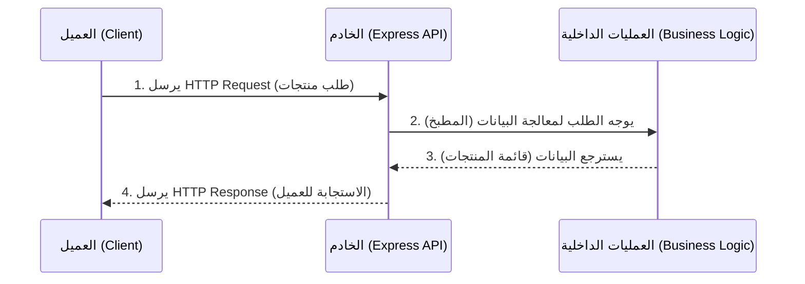

## مقدمة وإعداد إطار العمل Express.js

### المفاهيم الأساسية (Core Concepts)

#### 1. إطار العمل Express.js

**التعريف:** هو إطار عمل (Framework) لتطبيقات الخادم (Server-sided) مبني على بيئة **Node.js**، ويُعد الأكثر شيوعاً وشعبية في نظامه البيئي.

**لماذا نستخدم Express.js؟**

- **سهولة التعلم والاستخدام:** يتيح للمطورين إعداد واجهة برمجة تطبيقات (API) كاملة في أقل من 30 ثانية.
- **غير مقيد (Unopinionated):** لا يفرض عليك هيكلية صارمة أو إعدادات معقدة (Overhead) قبل البدء في استخدامه. لا توجد "إجابة صحيحة أو خاطئة" مطلقة عند بناء التطبيقات باستخدامه، بل يمنحك الحرية الكاملة في تنظيم كودك.
- **الانتشار الواسع:** يُستخدم في أكثر من 20 مليون مشروع على منصة GitHub، ويحمل أكثر من 27 مليون مرة أسبوعياً عبر منصة **npm**، وتعتمد عليه شركات تتراوح من الشركات الناشئة (Startups) إلى شركات Fortune 500.

#### 2. بروتوكول HTTP

**التعريف:** اختصار لـ **Hyper Text Transfer Protocol** (بروتوكول نقل النص التشعبي). **الفكرة الأساسية:** هو بروتوكول يحدد طريقة تبادل البيانات بين العميل (Client) والخادم (Server)، ويمكن تبسيط فكرته بجملة: "هذه هي الطريقة التي أريد أن أتبادل بها البيانات معك".

---

### هندسة العميل والخادم (Client-Server Architecture)

لتوضيح كيف تتفاعل تطبيقات (Web APIs) مع التطبيقات الأخرى :

- **العميل (Client):** هم المستخدمون العاديون الذين يستخدمون تطبيقك عبر أجهزة مختلفة (هاتف محمول، جهاز لوحي، متصفح ويب على جهاز كمبيوتر، أو تطبيق سطح مكتب).
- **الخادم (Server):** هو المكان الذي يعيش فيه تطبيق **Express.js**، ووظيفته استقبال طلبات العميل، معالجتها، وإرجاع البيانات المطلوبة.

#### حالة عملية (Case Study): تطبيق تجارة إلكترونية (E-commerce App)

عندما تقوم بزيارة الصفحة الرئيسية لموقع تجارة إلكترونية لعرض قائمة المنتجات، لا تظهر المنتجات من العدم، ولا يمتلك العميل هذه البيانات مسبقاً.

1. **الطلب (HTTP Request):** يقوم كود العميل بإرسال طلب HTTP إلى الخادم (Express API).
2. **المعالجة (Business Logic):** يستقبل الserver الطلب. الserver لا يهتم بكيفية استخدام العميل للبيانات، بل تقتصر مسؤوليته على تنفيذ "منطق العمل" (Business logic) لجلب المنتجات.
3. **الاستجابة (HTTP Response):** يقوم الserver بإنتاج مخرجات (Output)، وهي قائمة المنتجات، ويرسلها للعميل، وكل هذا يحدث دون أن يرى العميل العمليات الداخلية التي حدثت في الخلفية.

#### التشبيه التوضيحي (The Restaurant Analogy)

لتبسيط الفكرة، سنشبه هذه العملية بزيارة مطعم:

|         العنصر البرمجي          | العنصر في المطعم  |                                  الشرح                                   |
| :-----------------------------: | :---------------: | :----------------------------------------------------------------------: |
|       **العميل (Client)**       | الزبون (Customer) |                   أنت جالس على الطاولة وتطلب ما تريده.                   |
|       **الخادم (Server)**       |  النادل (Waiter)  |                   النادل يأخذ طلبك ويوصله إلى المطبخ.                    |
| **منطق العمل (Business Logic)** | المطبخ (Kitchen)  |     المطبخ يحضر الطعام. أنت لا ترى كيف يُطبخ، بل تنتظر النتيجة فقط.      |
|    **الاستجابة (Response)**     |   الطعام (Food)   | يعود النادل ليقدم لك الطعام الذي طلبته (قائمة المنتجات في حالة التطبيق). |

**رسم توضيحي للعملية:**



---

### إعداد بيئة العمل (Environment Setup)

شرح المحاضر خطوات تهيئة المشروع من الصفر.

#### الخطوة 1: تهيئة المشروع

1. افتح ترمينال الأوامر (مثل Windows PowerShell).
2. أنشئ مجلداً جديداً للمشروع: ==`mkdir expressjs-tutorial`== ثم ادخل إليه عبر ==`cd expressjs-tutoria==l`.
3. قم بتهيئة ريبو **npm** بإنشاء ملف `package.json`:

    ```bash
   npm init -y
    ```

    ملاحظة: حرف `y` للموافقة التلقائية على جميع الإعدادات الافتراضية.

> `‏` **Important Note**  المحاضر  استخدم إصدار **Node.js v20.4.0** أثناء التسجيل، ولكنه يؤكد أنه لم تحدث تغييرات جذرية (Breaking changes) في Express.js بين إصدارات Node.js المختلفة، لذا لن تواجه أي مشاكل إذا استخدمت إصداراً أقدم أو أحدث.

#### الخطوة 2: تثبيت الحزم (Packages Installation)

- **تثبيت Express:**

    ```shell
  npm i express
    ```

    (حرف `i` هو اختصار لكلمة `install`).

- **تثبيت Nodemon:**

    ```shell
   npm i -D nodemon
    ```

    (حرف `D-` يعني تثبيت الأداة كـ Dev Dependency أي مخصصة لبيئة التطوير فقط). **لماذا نستخدم Nodemon؟** هي أداة تقوم بتشغيل التطبيق في وضع المراقبة (Watch Mode). بمجرد حفظ أي تغييرات في الsource code، ستقوم الأداة بإعادة تشغيل الخادم (Server) تلقائياً، مما يوفر عليك عناء إغلاق العملية وإعادة تشغيلها يدوياً.


#### الخطوة 3: إعداد ملف package.json

يجب تعديل ملف `package.json` لتسهيل بيئة التطوير واستخدام أحدث معايير JavaScript:

**أولاً: إعدادات السكربت (Scripts):** نقوم بإنشاء أمرين لتشغيل الخادم:

| اسم السكربت |     الأمر (Command)     |                                 الاستخدام (When to use)                                 |
| :---------: | :---------------------: | :-------------------------------------------------------------------------------------: |
| `start:dev` | `nodemon src/index.mjs` |           لبيئة التطوير (Development). يستخدم Nodemon لتحديث الخادم تلقائياً.           |
|   `start`   |  `node src/index.mjs`   | لبيئة الإنتاج (Production). يستخدم Node.js العادي لتشغيل الكود الأساسي عند رفع التطبيق. |
Instead of calling `nodemon` directly, prefix the command with `npx`. This tells Node to look inside your local `node_modules` folder and execute the package directly

**ثانياً: نوع الوحدات (Module System):** بشكل افتراضي، يستخدم Node.js نظام `CommonJS` (الذي يعتمد على `require`). لكي نتمكن من استخدام المعايير الحديثة (ESM - ES Modules) التي تتيح استخدام كلمات `import` و `export`، يجب إضافة  في ملف package.json الخاصية التالية: `"type": "module"`

بسبب استخدام `esm`، يُفضل تغيير امتداد ملف الجافاسكريبت الرئيسي إلى `mjs.` لكي يعمل بشكل صحيح.

---

### كتابة الكود الأساسي (Writing the Code)

نقوم بإنشاء مجلد باسم `src` وداخله ملف باسم `index.mjs` والذي يعتبر نقطة الدخول (Entry Point) للتطبيق.

#### الكود البرمجي مع الشرح:

```javascript
// Step 1: استيراد إطار العمل Express
import express from 'express';

// Step 2: تهيئة التطبيق
const app = express();

// Step 3: تحديد المنفذ (Port) بطريقة احترافية
const PORT = process.env.PORT || 3000;

// Step 4: تشغيل الخادم للاستماع للطلبات
app.listen(PORT, () => {
    console.log(`Running on Port ${PORT}`);
});
```

#### شرح أسطر الكود بالتفصيل:

1. **الاستيراد `import express from 'express'`**: نقوم باستيراد مكتبة Express. القيمة المستوردة عبارة عن دالة في المستوى الأعلى (Top-level function).

2. **التهيئة `()const app = express`**: نقوم باستدعاء الدالة لإنشاء تطبيق Express وحفظه في المتغير `app`. من خلال هذا المتغير، يمكننا الوصول إلى عدد كبير من الخصائص والدوال (Methods) للتحكم بالserver.

3. **المنفذ `process.env.PORT || 3000`**: بدلاً من كتابة رقم البورت بشكل صريح (Hardcoded number)، نقوم باستخدام المتغير البيئي `process.env.PORT`. إذا لم يكن المتغير البيئي معرفاً (Undefined)، فسيقوم المشغل المنطقي (Logical OR `||`) بإسناد القيمة `3000` كقيمة احتياطية.
  
> `‏` **Important Note** يُعتبر تعيين البورت كمتغير بدلاً من كتابته كرقم ثابت من **أفضل الممارسات (Best Practices)** في بيئة العمل الحقيقية.

3. **الاستماع `(...)app.listen`**: هذه الدالة تستخدم لتشغيل سيرفر Express على بورت محدد لكي يبدأ في استقبال طلبات HTTP الواردة.

    - **البرامتر الأول:** هو المنفذ (Port).
    - **البرامتر الثاني (Callback Function):** دالة اختيارية يتم تنفيذها فور تشغيل السيرفر. استخدمناها هنا لطباعة رسالة توضح أن السيرفر يعمل، ولكن يمكن استخدامها لتشغيل عمليات إضافية مثل (إرسال حدث لنظام تسجيل مركزي Centralized Logging System لإخبارهم بأن السيرفر قد بدأ العمل). 

---

### تشغيل واختبار التطبيق (Running the Application)

1. لتشغيل التطبيق، نكتب الأمر التالي في موجه الأوامر:

    ```shell
   npm run start:dev
    ```

    سيقوم Nodemon بتشغيل التطبيق وستظهر الرسالة: `Running on Port 3000`.

1. **اختبار الخادم في المتصفح:** افتح متصفح الويب واذهب إلى الرابط: `localhost:3000` (لأن الخادم يستمع للمنفذ 3000).


#### النتيجة المتوقعة والخطأ الشائع

عند فتح الرابط، ستظهر لك رسالة خطأ في المتصفح تقول: `/ Cannot GET `

**التفسير:** هذا لا يعني أن التطبيق معطل! بل يظهر هذا الخطأ لأننا **لم نقم بتسجيل أي مسار (Route)** حتى الآن. الserver يعمل ويستقبل الطلب، ولكنه لا يمتلك أي تعليمات تخبره بما يجب أن يرسله كاستجابة (Response) عندما يطلب العميل المسار الرئيسي `/`. تسجيل المسارات سيكون الخطوة التالية في رحلة بناء واجهة برمجة التطبيقات.