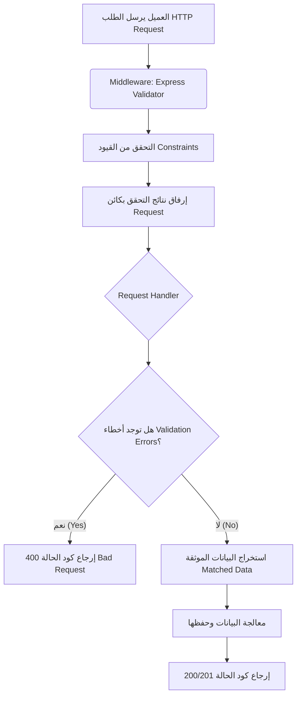

## التحقق من صحة البيانات (Data Validation) باستخدام Express Validator

### المفاهيم الأساسية (Core Concepts)

#### 1. التحقق من صحة البيانات (Data Validation)
**التعريف:** 
هي عملية فحص وتدقيق البيانات الواردة إلى الخادم (Server) من قبل العميل (Client) للتأكد من مطابقتها للشروط والمعايير المحددة مسبقاً قبل معالجتها أو حفظها.

**الفكرة الأساسية ولماذا نستخدمها؟**
البيانات التي تتوقعها كـمطور (Expected Data) ليست بالضرورة هي البيانات التي ستستقبلها فعلياً (Received Data). 
على سبيل المثال: إذا كان لديك  (Endpoint) لإنشاء مستخدم جديد تقبل طلبات الإنشاء (POST Requests)، وتتوقع أن يكون طول اسم المستخدم (Username) أقل من 32 حرفاً، فلا يمكنك الاعتماد على حسن نية العميل لالتزام هذا الشرط. يجب بناء جدار حماية يتأكد من صحة البيانات لحماية قاعدة البيانات وتجنب الأخطاء البرمجية.

> `‏` **Important Note**
> **حتمية التحقق من جهة الخادم (Server-side Validation):**
> الخادم الخاص بك لا يعرف من أين تأتي البيانات. يمكن لأي شخص فتح تطبيق الويب الخاص بك، والذهاب إلى تبويب الشبكة (Network Tab) في أدوات المتصفح، ومعرفة الرابط (URL) الذي تُرسل إليه البيانات. ثم يمكنه أخذ هذا الرابط واستخدام أدوات خارجية مثل Postman أو Thunder Client لإرسال بيانات وهمية أو خبيثة تتجاوز أي حماية وضعتها في الواجهة الأمامية.

**جدول مقارنة: التحقق من جهة العميل مقابل الخادم**

|   وجه المقارنة    |      التحقق من جهة العميل (Client-side Validation)       |               التحقق من جهة الخادم (Server-side Validation)               |
| :---------------: | :------------------------------------------------------: | :-----------------------------------------------------------------------: |
| **مكان التنفيذ**  |       المتصفح (عبر أطر عمل مثل React أو Angular).        |                 خادم واجهة برمجة التطبيقات (Express API).                 |
| **الهدف الأساسي** | تحسين تجربة المستخدم (UX) وإعطاء تنبيهات فورية للمستخدم. | حماية النظام، معالجة البيانات بأمان، وحفظها في قاعدة البيانات (Database). |
| **مستوى الأمان**  |     ضعيف (يمكن تجاوزه بسهولة عبر أدوات API Clients).     |                  عالي جداً (خط الدفاع الأخير والأساسي).                   |
|   **الأهمية  **   |                  مهم، ولكنه ليس كافياً.                  |     **الأكثر أهمية (Most Important) ويجب القيام به دائماً مهما حدث.**     |

#### 2. مكتبة Express Validator
**التعريف:** هي حزمة (Package) مبنية لتسهيل عملية التحقق من صحة البيانات في تطبيقات Express.js.
**كيف تعمل؟** توفر مجموعة من الدوال التي يتم استخدامها كبرمجيات وسيطة (Middlewares) وتُمرر داخل دوال المسارات (Routes) مثل `app.get` أو `app.post`.

---

### هندسة دورة حياة التحقق من البيانات (Validation Lifecycle Architecture)

الرسم التالي يوضح مسار الطلب عند مرور البيانات عبر سلسلة التحقق (Validation Chain):



---

### التطبيق العملي: التحقق خطوة بخطوة (Step-by-Step Implementation)

#### `‏` Step 1: التثبيت (Installation)
يجب تثبيت الحزمة عبر موجه الأوامر (Terminal):
```bash
npm i express-validator
```

#### `‏` Step 2: التحقق من متغيرات الاستعلام (Query Parameters)
للتحقق من متغيرات الاستعلام (التي تأتي في الرابط)، نستورد دالة `query` من الحزمة.

```javascript
import { query, validationResult } from 'express-validator';

// تمرير دالة query كـ Middleware قبل معالج الطلب النهائي
app.get('/api/users', 
    query('filter').isString().notEmpty(), 
    (request, response) => {
        // سيتم الشرح هنا في الخطوة 3
    }
);
```
**مفهوم سلسلة التحقق (Validation Chain):**
عندما تستدعي `query('filter')` فإنها ==تُرجع كائناً يُدعى "سلسلة التحقق"==. هذا يتيح لك استدعاء دوال أخرى بشكل متسلسل (Chaining) مثل `()isString` (يجب أن يكون نصاً) و `()notEmpty` (يجب ألا يكون فارغاً) لفرض قيود متعددة على نفس الحقل.

> `‏` **Important Note**
> في Express.js، يتم دائماً تحليل (Parsing) متغيرات الاستعلام (Query Parameters) كنصوص (Strings)، حتى لو قمت بتمرير قيمة رقمية في الرابط، فسيقرأها الخادم كنص.

#### `‏` Step 3: معالجة أخطاء التحقق (Handling Validation Errors)
**الخطأ الشائع:** دوال التحقق في Express Validator **لا تقوم برمي خطأ (Throw an error)** أو إيقاف الطلب تلقائياً إذا فشل التحقق. هي فقط ==تقوم بتسجيل الأخطاء وإرفاقها بكائن== `request`. كمطور، تقع على عاتقك مسؤولية استخراج هذه الأخطاء ومعالجتها يدوياً .

نستخدم دالة `validationResult` للقيام بذلك:

```javascript
app.get('/api/users', query('filter').isString().notEmpty(), (request, response) => {
    
    // استخراج نتيجة التحقق من كائن الطلب
    const result = validationResult(request);
    
    // التحقق مما إذا كانت النتيجة تحتوي على أخطاء أم لا
    if (!result.isEmpty()) {
        // إذا لم تكن فارغة (أي توجد أخطاء)، نُرجع كود 400 مع تفاصيل الأخطاء
        return response.status(400).send({ errors: result.array() });
    }
    
    // إكمال منطق التطبيق في حال نجاح التحقق...
});
```
*شرح الدوال:*
- `‏`  `()result.isEmpty`: تُرجع `true` إذا كانت البيانات صالحة ولا توجد أخطاء، و `false` إذا وجدت أخطاء.
- `‏` `()result.array`: تحول كائن الأخطاء إلى مصفوفة (Array) ليسهل إرسالها وقراءتها من قبل العميل.

#### `‏` Step 4: تخصيص رسائل الخطأ (Custom Error Messages)
افتراضياً، تُرجع المكتبة رسائل خطأ عامة مثل "Invalid value". لتخصيص الرسالة، نستخدم دالة `()withMessage`.
*ملاحظة هامة:* دالة `withMessage` تُطبق رسالة الخطأ على المُدقق (Validator) الذي يسبقها مباشرة.

```javascript
query('filter')
    .isLength({ min: 3, max: 10 }).withMessage('Must be at least 3 to 10 characters')
    .notEmpty().withMessage('Must not be empty')
```

#### `‏` Step 5: التحقق من بيانات جسم الطلب (Request Body Validation)
تُستخدم دالة `body` للتحقق من البيانات المُرسلة في طلبات `POST`, `PUT`, `PATCH` .

إذا كان لدينا أكثر من حقل، يمكننا تمرير دوال التحقق داخل مصفوفة (Array) لتنظيم الكود كالتالي :

```javascript
import { body } from 'express-validator';

app.post('/api/users', 
    [
        body('username')
            .notEmpty().withMessage('Username cannot be empty')
            .isLength({ min: 5, max: 32 }).withMessage('Username must be 5 to 32 characters')
            .isString().withMessage('Username must be a string'),
            
        body('displayName')
            .notEmpty().withMessage('Display name cannot be empty')
    ], 
    (request, response) => {
        // معالجة النتيجة هنا...
    }
);
```

#### `‏` Step 6: استخراج البيانات المُطابقة/الموثقة (Matched Data)
**المشكلة:** كائن `request.body` قد يحتوي على بيانات إضافية (أو خبيثة) لم تقم أنت بإدراجها في قواعد التحقق الخاصة بك.
**الحل الموصى به:** بدلاً من استخدام `request.body` مباشرة، توفر المكتبة دالة `matchedData` التي تستخرج فقط الحقول التي تم التحقق من صحتها وتتجاهل أي حقول أخرى .

```javascript
import { matchedData } from 'express-validator';

// داخل معالج الطلب (بعد التأكد من عدم وجود أخطاء):
const data = matchedData(request);

// الآن استخدم الكائن `data` لحفظ البيانات في قاعدة البيانات بدلاً من `request.body`
const newUser = { id: generateId(), ...data };
```

---

### المفهوم المتقدم: مخططات التحقق (Validation Schemas)

**الفكرة ولماذا نستخدمها؟**
كما لاحظت، استخدام طريقة (Chaining) لربط الدوال يجعل كود المسارات (Routes) مزدحماً ومليئاً بالأسطر البرمجية (Cluttered) خاصة إذا كان لديك العديد من الحقول (Fields). 
**الحل:** استخدام دالة `checkSchema` لتعريف قواعد التحقق داخل كائن (Object) مفصول، مما يجعل الكود نظيفاً (Cleaner) وأسهل للقراءة.

#### خطوات إنشاء واستخدام Schema:

**Step 1: إنشاء ملف منفصل للمخططات**
أفضل ممارسة هي إنشاء مجلد `utils` وداخله ملف `validationSchemas.mjs`.

**Step 2: تعريف مخطط التحقق (Defining the Schema)**
نقوم ببناء كائن، حيث تكون المفاتيح (Keys) هي أسماء الحقول، والقيم (Values) هي كائنات تحتوي على قواعد التحقق.

```javascript
// file: utils/validationSchemas.mjs
export const createUserValidationSchema = {
    username: {
        isLength: {
            options: { min: 5, max: 32 },
            errorMessage: 'Username must be at least 5 characters with a max of 32 characters'
        },
        notEmpty: {
            errorMessage: 'Username cannot be empty' // رسالة مخصصة
        },
        isString: {
            errorMessage: 'Username must be a string'
        }
    },
    displayName: {
        notEmpty: true // استخدم true إذا لم تكن بحاجة لرسالة أو خيارات مخصصة
    }
};
```

**Step 3: حقن المخطط في المسار (Injecting Schema to Route)**
نستورد المخطط ودالة `checkSchema`، ونقوم بتمريرها كـ Middleware.

```javascript
// file: index.mjs
import { checkSchema, validationResult, matchedData } from 'express-validator';
import { createUserValidationSchema } from './utils/validationSchemas.mjs';

app.post('/api/users', 
    checkSchema(createUserValidationSchema), 
    (request, response) => {
        const result = validationResult(request);
        if (!result.isEmpty()) return response.status(400).send({ errors: result.array() });
        
        const data = matchedData(request);
        // ... إكمال إنشاء المستخدم
    }
);
```

> `‏` **Important Note**
> **خطأ استيراد الملفات (Import Error):**
> عند استيراد المخطط من ملف خارجي في بيئة (ES Modules)، تأكد من إضافة الامتداد `.mjs` (أو `.js`) في نهاية مسار الاستيراد (`'utils/validationSchemas.mjs/.'`). تجاهل ذلك سيؤدي إلى تعطل التطبيق (Crash) ورمي خطأ استيراد.