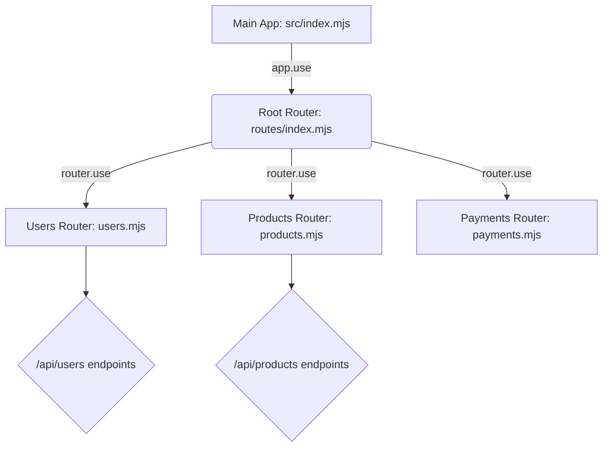

## تنظيم المسارات وإعادة الهيكلة باستخدام (Express Routers)

### المفاهيم الأساسية (Core Concepts)

#### 1. النطاق أو المجال (Domain)
**التعريف:** 
هو مصطلح هندسي يشير إلى تجميع وتصنيف ال (API Endpoints) بناءً على الوظيفة الأساسية أو الكيان الذي تتعامل معه.

**الفكرة الأساسية وكيف تعمل؟**
يتم تقسيم التطبيق إلى مجموعة من ال (Domains)، بحيث يحتوي كل Domain على جميع العمليات (GET, POST, PUT, DELETE) المتعلقة بكيان واحد فقط.
**أمثلة:**
* `‏`  **User Domain (دومين المستخدم):** يضم كل ما يخص المستخدمين (إنشاء مستخدم، جلب المستخدمين، تحديث بيانات مستخدم).
*  `‏` **Products Domain (دومين المنتجات):** يضم كل ما يتعلق بالمنتجات (إضافة منتج، حذف منتج).
* `‏`  **Payments Domain (دومين المدفوعات):** إذا كان تطبيقك يتواصل مع واجهة خارجية مثل (Stripe API) لمعالجة الدفع، فإن جميع هذه المسارات توضع في دومين الدفع.

#### 2. المُوجّه (Express Router)
**التعريف:** 
هو عبارة عن كائن (Object) يعمل كـ "تطبيق مصغر" (Mini-application) داخل تطبيق Express الرئيسي الخاص بك.

**لماذا نستخدمه؟ (المشكلة والحل):**
*   **المشكلة:** مع نمو التطبيق، قد يصبح لديك 50 أو 100 (Route). إذا تم وضعها جميعاً في ملف واحد (`index.mjs`)، سيصبح الملف ضخماً، فوضوياً، وصعب الصيانة.
*   **الحل:** استخدام (Express Router) لفصل route كل  (Domain) في ملف مستقل، ثم دمج هذه الملفات في التطبيق الرئيسي.

**مميزاته:**
*   يحتوي على نفس خصائص ودوال تطبيق Express الرئيسي تقريباً (يملك دوال `get`, `post`, `delete` ...إلخ) .
*   يجعل الكود منظماً (Organized) وسهل القراءة.

---

### تجهيز بيئة العمل لإعادة الهيكلة (Refactoring Prerequisites)

قبل نقل الRoutes إلى ملفات جديدة، سنواجه مشكلة جوهرية: **مشاركة البيانات والدوال بين الملفات**. 
بما أننا سنقسم التطبيق إلى عدة ملفات، فإن المتغيرات المحلية (مثل مصفوفة `mockUsers`) والmiddlware  (مثل `resolveIndexByUserId`) لن تكون مرئية للملفات الجديدة .

#### الخطوات التحضيرية:
1. **استخراج الثوابت (Constants):** إنشاء مجلد `utils` وبداخله ملف `constants.mjs`. تم نقل مصفوفة `mockUsers` إليه وتصديرها (`export`) ليتم استيرادها في أي ملف يحتاجها .
2. **استخراج البرمجيات الوسيطة (Middlewares):** داخل نفس المجلد `utils`، تم إنشاء ملف `middlewares.mjs` لنقل الدالة الوسيطة `resolveIndexByUserId` وتصديرها .

---

### التطبيق العملي: إنشاء واستخدام (Express Router)

#### `‏` Step 1: إنشاء ملف الموجه (Creating the Router File)
نقوم بإنشاء مجلد جديد باسم `routes`، وداخله ننشئ ملفاً لمجال المستخدمين `users.mjs`.

```javascript
// ملف: src/routes/users.mjs

// 1. استيراد الدالة Router من مكتبة express
import { Router } from 'express'; 

// استيراد البيانات والبرمجيات الوسيطة والمكتبات التي كانت مستخدمة في الملف الرئيسي
import { mockUsers } from '../utils/constants.mjs';
import { resolveIndexByUserId } from '../utils/middlewares.mjs';
import { validationResult, checkSchema, matchedData } from 'express-validator';
// ... استيراد باقي المخططات مثل createUserValidationSchema

// 2. تهيئة الموجه: استدعاء الدالة Router() وحفظها في متغير
// لاحظ أن R كبيرة للاستيراد، و r صغيرة للمتغير
const router = Router(); 

// 3. تعريف المسارات باستخدام الكائن router بدلاً من app
router.get('/api/users', (request, response) => {
    // منطق جلب المستخدمين...
});

router.post('/api/users', checkSchema(createUserValidationSchema), (request, response) => {
    // منطق إنشاء المستخدمين...
});

// يتم تكرار نفس الأمر مع put, patch, delete...

// 4. تصدير الراوتر كـ Default Export ليتم استخدامه في الملف الرئيسي
export default router; 
```

#### `‏` Step 2: تسجيل الRouter في التطبيق الرئيسي (Registering the Router)
لا يكفي إنشاء الRouter، بل يجب "تسجيله" (Register) في ملف التطبيق الأساسي لكي يتم تفعيله.

```javascript
// ملف: src/index.mjs
import express from 'express';
// استيراد الموجه الذي قمنا بإنشائه
import usersRouter from './routes/users.mjs'; 

const app = express();

// تسجيل الراوتر باستخدام دالة app.use()
app.use(usersRouter); 
```

> `‏` **Important Note**
> **الخطأ الشائع (404 Not Found):**
> إذا قمت بتعريف المسارات داخل ملف الـ Router، ولكنك نسيت استدعاء `app.use(usersRouter)` في الملف الرئيسي، فإن العميل سيحصل على خطأ `404 Not Found` عند محاولة زيارة المسار، لأن التطبيق الرئيسي لا يعلم بوجود هذه المسارات .

---

### هندسة التجميع المتقدمة: (The Barrel File / Root Router)

بعد إنشاء راوتر للمستخدمين (`users.mjs`) وراوتر آخر للمنتجات (`products.mjs`)، أشار المحاضر إلى تقنية احترافية لتنظيم الكود تُعرف باسم **(Barrel File)** لتجنب استيراد عشرات الRouters في الملف الرئيسي `index.mjs` .

**الفكرة الأساسية:** إنشاء مُوجّه رئيسي (Root Router) وظيفته الوحيدة هي تجميع كل الRouters الفرعية الأخرى داخله، ثم تصدير نفسه كpackage واحدة للملف الرئيسي.

#### الخطوات البرمجية لهندسة التجميع:

**1. إنشاء ملف التجميع:** 
نقوم بإنشاء ملف `index.mjs` داخل مجلد الـ `routes`.

```javascript
// ملف: src/routes/index.mjs (The Barrel File)

import { Router } from 'express';
import usersRouter from './users.mjs';
import productsRouter from './products.mjs';

const router = Router();

// تسجيل الموجهات الفرعية داخل الموجه الرئيسي
router.use(usersRouter);
router.use(productsRouter);

// تصدير الموجه الرئيسي
export default router;
```

**2. تنظيف الملف الرئيسي للتطبيق:**
الآن، في ملف التطبيق الجذري، لا نحتاج سوى لاستيراد ملف تجميع واحد فقط!

```javascript
// ملف: src/index.mjs

import express from 'express';
// استيراد الراوت الرئيسي من مجلد routes
import routes from './routes/index.mjs'; 

const app = express();
app.use(express.json());

// تسجيل كل مسارات التطبيق بسطر واحد فقط!
app.use(routes); 
```

**رسم توضيحي لهندسة التجميع (Architecture Diagram):**


---

### ملاحظات وخصائص متقدمة (Advanced Notes & Features)

#### 1. البرمجيات الوسيطة على مستوى الموجه (Router-level Middleware)
هناك ميزة قوية جداً للRouterات: يمكنك استخدام دالة `()router.use` داخل ملف الـ Router الخاص بك لتسجيل برمجيات وسيطة (Middlewares).
**الفائدة:** الMiddleware المسجلة بهذه الطريقة سيتم تطبيقها **فقط** على الroutes الموجودة داخل هذا الRouter المحدد، ولن تؤثر على الroutes الأخرى. (مثال: برمجية للتحقق من الصلاحيات تُطبق على مسارات المستخدمين فقط، ولا علاقة لها بمسارات المنتجات) .

#### 2. بادئة المسارات (Route Prefixing)
هناك ميزة إضافية للمستقبل: بدلاً من كتابة البادئة `/api/users` يدوياً في كل مسار داخل ملف `users.mjs` (مثل `router.get('/api/users')`)، يمكنك تمرير البادئة أثناء عملية التسجيل في دالة الاستخدام هكذا:
`app.use('/api/users', usersRouter)`
هذا سيجعل الكود أكثر نظافة ويسمح لك بكتابة المسار كـ `/` فقط داخل ملف الroute.