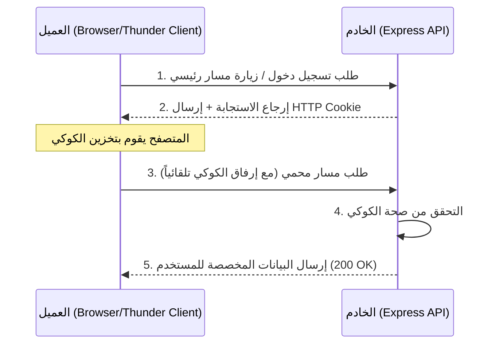

## ملفات تعريف الارتباط (HTTP Cookies) في Express.js

### المفاهيم الأساسية (Core Concepts)

#### 1. بروتوكول HTTP عديم الحالة (HTTP is Stateless)
قبل فهم ملفات تعريف الارتباط، يجب فهم طبيعة بروتوكول HTTP.
*   **التعريف:** يُقال عن بروتوكول HTTP بأنه "عديم الحالة" (Stateless)، مما يعني أن الخادم (Server) يعامل كل طلب (Request) كعملية منفصلة تماماً ومستقلة عن أي طلب سابق .
*   **المشكلة:** عندما يقوم العميل بإرسال طلب إلى الخادم، فإن الخادم لا يعرف من أين أتى هذا الطلب، ولا يمتلك أي ذاكرة أو سياق لمعرفة هوية المستخدم. 

**حالة عملية للتوضيح (Case Study - نظام سلة المشتريات):**
تخيل بناء موقع تجارة إلكترونية (E-commerce). قام مستخدم بإضافة منتجات إلى "سلة المشتريات" (Cart)، ثم أغلق الموقع وعاد لاحقاً. بسبب طبيعة HTTP "عديمة الحالة"، لن يعرف الخادم أن هذا هو نفس المستخدم، ولن يتمكن من إرجاع العناصر التي اختارها مسبقاً . الحل هنا يكمن في استخدام ملفات تعريف الارتباط.

#### 2. ملفات تعريف الارتباط (HTTP Cookies)
*   **التعريف:** هي عبارة عن أجزاء صغيرة من البيانات (==Small pieces of data==) يقوم خادم الويب (Web Server) بإرسالها إلى متصفح العميل (Client's Browser) لكي يقوم بحفظها.
*   **الفكرة الأساسية وكيف تعمل؟** 
    1. يرسل الخادم ملف ارتباط (يحتوي على قيمة فريدة Unique Value) إلى المتصفح.
    2. يقوم المتصفح بتخزين هذا الملف.
    3. في أي طلب مستقبلي (Future Request) يرسله المتصفح إلى هذا الخادم، سيقوم المتصفح تلقائياً بإرفاق ملف الارتباط مع الطلب .
*   **لماذا نستخدمها؟** لتجاوز عقبة "انعدام الحالة" (Statelessness). تُمكّن الكوكيز الخادم من تمييز المستخدمين والتعرف عليهم، وبالتالي إرسال بيانات ديناميكية (Dynamic Data) مخصصة لكل مستخدم (مثل إرجاع محتويات سلة التسوق الخاصة به) .
*   **متى نستخدمها؟** في عمليات المصادقة (Authentication)، تتبع جلسات المستخدمين (Sessions)، وتخزين التفضيلات.

> `‏` **Important Note**
> **طريقة فحص ملفات الارتباط في المتصفح:**
> يمكنك رؤية ملفات الارتباط المخزنة بفتح "أدوات المطور" (Dev Tools) في المتصفح، ثم الانتقال إلى تبويب **التطبيق (Application)**، والبحث في قسم **Cookies**. ستجد هناك النطاق (Domain) واسم الكوكي وقيمته.

---

### هندسة دورة حياة ملفات تعريف الارتباط (Cookies Lifecycle Architecture)

الرسم التوضيحي التالي يشرح مسار الاتصال عند استخدام الكوكيز للتعرف على المستخدم:



---

### التطبيق العملي الجزء الأول: إرسال (Setting) ملفات الارتباط

لإرسال كوكي من الخادم إلى العميل، نستخدم دالة `cookie()` المدمجة داخل كائن الاستجابة `response`.

#### الخطوات البرمجية مع الشرح

```javascript
app.get('/', (request, response) => {
    
    // استخدام دالة cookie لإرفاق ملف ارتباط بالاستجابة
    // البرامتر الأول: اسم الكوكي (Name) -> 'hello'
    // البرامتر الثاني: قيمة الكوكي (Value) -> 'world'
    // المعامل الثالث (اختياري): إعدادات إضافية (Options)
    response.cookie('hello', 'world', {
        
        // تحديد مدة صلاحية الكوكي (Max Age)
        // القيمة يجب أن تكون بالمللي ثانية (Milliseconds)
        maxAge: 60000 // 60,000 مللي ثانية = دقيقة واحدة
    });

    response.send('Cookie has been set!');
});
```

> `‏` **Important Note**
> **حساب وقت انتهاء الصلاحية (Expiration Time):**
> خاصية `maxAge` أو `expires` تُحسب بالمللي ثانية. 
> - دقيقة واحدة = `60,000` مللي ثانية.
> - ساعة واحدة = `60 * 60 * 1000` مللي ثانية.
> - 10 ثوانٍ = `10000` مللي ثانية. بمجرد انتهاء الوقت، سيقوم المتصفح بحذف الكوكي تلقائياً .

---

### التطبيق العملي الجزء الثاني: قراءة وتحليل (Parsing) الكوكيز

بمجرد أن يحفظ المتصفح الكوكي، سيقوم بإرساله في ترويسات الطلب (Headers) لكل الطلبات القادمة. ولكن، هنا تكمن مشكلة برمجية.

*   **المشكلة:** الخادم يستقبل الكوكيز كنص خام (Raw String) داخل `request.headers.cookies`. التعامل مع النصوص الخام لاستخراج قيم محددة يُعد أمراً معقداً .
*   **الحل :** استخدام أداة تحليل (Parser). في بيئة Node.js، نستخدم حزمة خارجية شهيرة تُسمى **Cookie Parser**.
#### الخطوات (Steps)

`‏` **Step 1: تثبيت الحزمة (Installation)**
```bash
npm install cookie-parser
```

`‏` **Step 2: تسجيل البرمجية الوسيطة (Registering the Middleware)**
تعمل هذه الباكدج ك (Middleware). تقوم بقراءة الترويسات وتحويل النص الخام إلى كائن جافاسكريبت (JavaScript Object) يسهل التعامل معه.

```javascript
import cookieParser from 'cookie-parser';

// تهيئة تطبيق Express
const app = express();

// تسجيل محلل الكوكيز كـ Middleware عام
app.use(cookieParser());
```

> `‏` **Important Note**
> **الترتيب الزمني للتسجيل (Order Matters):**
> كما هو الحال مع أي (Global Middleware)، يجب استدعاء `app.use(cookieParser())` **قبل** تسجيل أي مسارات (Routes). إذا قمت بتسجيله بعد المسارات، فلن يتمكن الخادم من تحليل الكوكيز لتلك المسارات، وستظل قيمة `request.cookies` غير معرفة (undefined).

---

### التطبيق العملي الجزء الثالث: بناء مسار مصادقة بسيط (Authentication Flow)

بعد التحليل، يتم تخزين القيم داخل الكائن `request.cookies`. يمكننا استخدام هذا الكائن للتحقق من امتلاك المستخدم للصلاحية قبل منحه البيانات .

```javascript
//  (Protected Route) لجلب المنتجات
app.get('/api/products', (request, response) => {
    
    // التحقق مما إذا كان الكوكي 'hello' موجوداً، وهل قيمته 'world'
    if (request.cookies.hello && request.cookies.hello === 'world') {
        
        // إذا كان صالحاً، أرسل البيانات (200 OK)
        return response.send([{ id: 1, name: 'Product A' }]);
    }
    
    // إذا لم يكن يمتلك الكوكي أو قيمته خاطئة، نرفض الطلب
    // نرسل كود الحالة 403 (ممنوع - Forbidden) أو 401 (غير مصرح - Unauthorized)
    return response.status(403).send({ message: "Sorry, you need the correct cookie" });
});
```
شرح السلوك (Behavior): عند تجربة هذا المسار في أداة (Thunder Client) أو المتصفح، ستحصل على رسالة الرفض. يجب عليك أولاً زيارة المسار الأساسي `/` للحصول على الكوكي، ثم زيارة `/api/products` مجدداً لكي تتمكن من الوصول للبيانات .

---

### المفهوم المتقدم: الكوكيز الموقّعة (Signed Cookies)

في بعض الأحيان، تحتوي ملفات تعريف الارتباط على بيانات حساسة. قد يقوم المستخدم بفتح "أدوات المطور" (Dev Tools) في متصفحه وتعديل قيمة الكوكي يدوياً لاختراق النظام (Tampering). لمنع ذلك، نستخدم الكوكيز الموقّعة .

*   **التعريف:** هو كوكي عادي يتم إرفاق "توقيع مشفر" (Cryptographic Signature) به بناءً على مفتاح سري (Secret Key). 
*   **الفكرة الأساسية:** الخادم هو الوحيد الذي يعرف المفتاح السري. إذا حاول العميل تعديل قيمة الكوكي، فإن التوقيع لن يتطابق مع القيمة المعدلة، وسيدرك الخادم أن الكوكي قد تم التلاعب به وسيرفضه.

#### جدول مقارنة: الكوكي العادي مقابل الكوكي الموقّع

|             السمة             | الكوكي العادي (Unsigned Cookie) |        الكوكي الموقّع (Signed Cookie)         |
| :---------------------------: | :-----------------------------: | :-------------------------------------------: |
|     **التشفير / التوقيع**     |      نص عادي (Plain Text).      |             توقيع مضاف إلى النص.              |
|       **خاصية الإنشاء**       |    لا يتطلب إعدادات إضافية.     |      تفعيل `signed: true` في الإعدادات.       |
|  **المفتاح السري (Secret)**   |       لا يحتاج إلى مفتاح.       | **يجب** تمرير مفتاح سري لدالة `cookieParser`. |
| **طريقة الاستخراج (Parsing)** |  يُستخرج من `request.cookies`.  |      يُستخرج من `request.signedCookies`.      |

#### كيفية إعداد واستخدام الكوكيز الموقعة (Implementation Steps)

`‏`**Step 1: تمرير المفتاح السري لمُحلل الكوكيز**
```javascript
// نمرر أي سلسلة نصية عشوائية كمفتاح سري (Secret)
// في بيئة العمل الحقيقية، يجب تخزين هذا المفتاح في المتغيرات البيئية (Env Variables)
app.use(cookieParser('MySecretKey123')); 
```

`‏` **Step 2: إرسال الكوكي الموقّع للعميل**
```javascript
app.get('/', (request, response) => {
    response.cookie('hello', 'world', {
        maxAge: 30000, 
        signed: true // تفعيل ميزة التوقيع
    });
    response.send('Signed Cookie Set');
});
```

`‏` **Step 3: قراءة الكوكي الموقّع واستخدامه في المصادقة**
> `‏`  **Important Note**
> **الخطأ الشائع:** بمجرد أن تجعل الكوكي موقّعاً، فإنه سيختفي تماماً من الكائن `request.cookies` وسينتقل إلى الكائن `request.signedCookies`. إذا حاولت البحث عنه في الكائن القديم، سيظهر كأنه غير موجود (Undefined) وسيفشل منطق التطبيق الخاص بك [22، 23].

```javascript
app.get('/api/products', (request, response) => {
    
    // بدلاً من request.cookies نستخدم request.signedCookies
    if (request.signedCookies.hello && request.signedCookies.hello === 'world') {
        return response.send([{ id: 1, name: 'Product A' }]);
    }
    
    return response.status(403).send({ message: "Sorry, valid signed cookie required" });
});
```